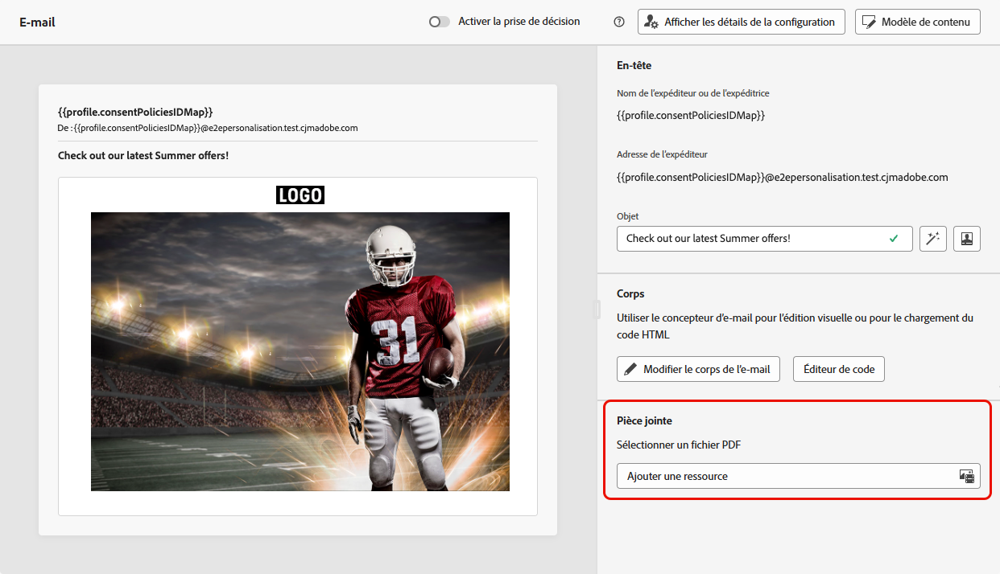
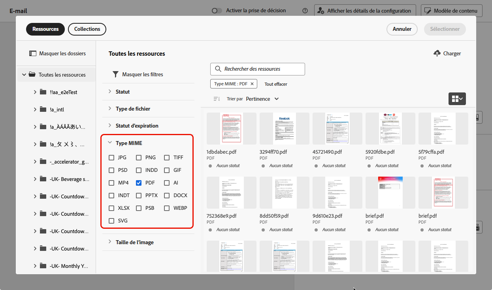
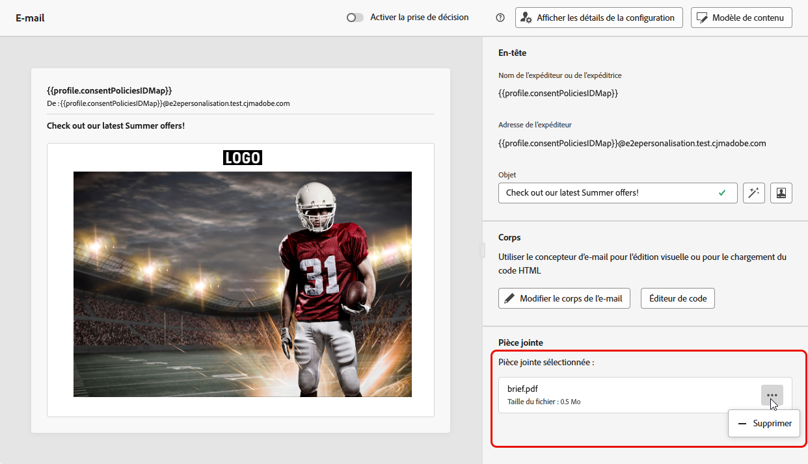

# Joindre un fichier PDF à un e-mail {#pdf-attachments}

>[!CONTEXTUALHELP]
>id="ajo_pdf_attachments"
>title="Ajouter une pièce jointe PDF"
>abstract="Recherchez un fichier PDF à joindre à votre e-mail. Vous pouvez envoyer jusqu&#39;à 6 messages avec une pièce jointe PDF par profil et par an. La taille maximale autorisée pour chaque fichier joint est de 5 Mo. Pour toute taille ou volume supplémentaire, vous pouvez acheter un module complémentaire de pack de pièces jointes. Pour plus d’informations, contactez votre représentant ou représentante Adobe."

>[!AVAILABILITY]
>
>Cette fonctionnalité est en disponibilité limitée. Contactez votre représentant ou représentante Adobe pour obtenir l’accès.

Vous pouvez joindre un fichier PDF statique aux e-mails que vous envoyez avec [!DNL Journey Optimizer].

>[!IMPORTANT]
>
>* Vous pouvez envoyer jusqu’à 6 messages avec une pièce jointe PDF par profil et par an.
>
>* La taille maximale autorisée pour chaque fichier joint est de 5 Mo.
>
>Pour augmenter la taille ou le volume, vous pouvez acheter un module complémentaire de pack de pièces jointes. Pour plus d’informations, contactez votre représentant ou représentante Adobe.

Pour joindre un fichier PDF à un e-mail, procédez comme suit.

1. Création d’un email dans un parcours ou une campagne. [En savoir plus](create-email.md)

1. Dans l’onglet parcours ou campagne **[!UICONTROL Contenu]**, sélectionnez **[!UICONTROL Ajouter une ressource]** dans la section **[!UICONTROL Pièce jointe]**.

   

1. Le référentiel Assets Essentials s’affiche.

   >[!NOTE]
   >
   >Lors de la conception de messages, vous accédez au référentiel Assets Essentials directement depuis l’interface de Journey Optimizer. Pour en savoir plus sur l&#39;interface utilisateur [!DNL Assets Essentials] intégrée, consultez la documentation de [Experience Manager Assets Essentials](https://experienceleague.adobe.com/docs/experience-manager-assets-essentials/help/introduction.html?lang=fr){target="_blank"}.

1. Utilisez le filtre **[!UICONTROL PDF]** de la section **[!UICONTROL Type MIME]** pour limiter la sélection au format de fichier approprié.

   

   >[!NOTE]
   >
   >Seul le format PDF est autorisé pour les pièces jointes.

1. Sélectionnez le fichier de votre choix.

   * Vous ne pouvez sélectionner qu’un seul fichier à la fois.
   * La taille maximale autorisée pour chaque fichier joint est de 5 Mo.

1. Une fois cette opération terminée, le nom et la taille du fichier sélectionné s’affichent dans la section **[!UICONTROL Pièce jointe]**.

   Vous pouvez supprimer le fichier sélectionné à l’aide de l’icône Autres actions en regard du nom du fichier.

   

>[!NOTE]
>
>Lorsque vous enregistrez votre message en tant que [ modèle de contenu ](../content-management/create-content-templates.md), la pièce jointe PDF n’est pas conservée avec le modèle. Si vous créez un e-mail à partir du modèle de contenu enregistré, vous devez joindre à nouveau le fichier.
