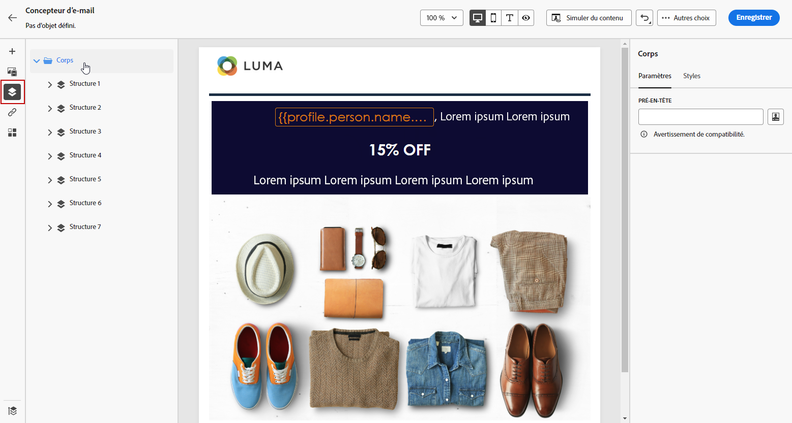
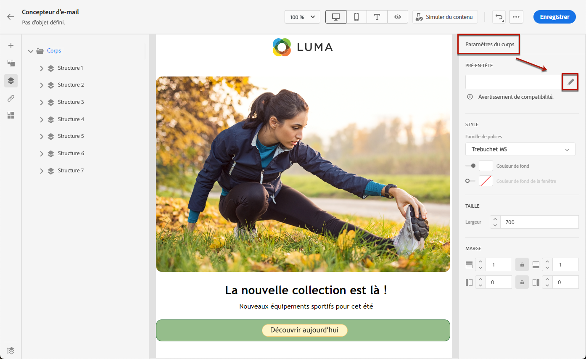
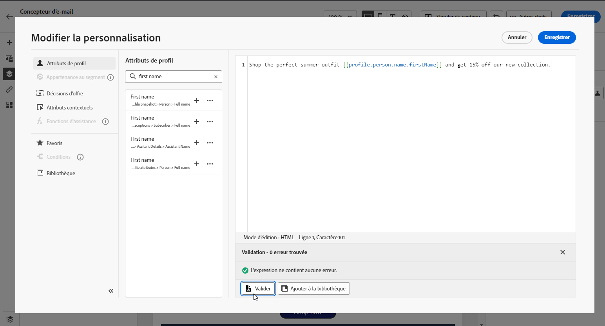

# Ajout d’un pré-titre {#preheader}

>[!CONTEXTUALHELP]
>id="ac_edition_preheader"
>title="Ajouter un pré-en-tête"
>abstract="Un pré-en-tête est un bref résumé qui suit l’objet d’un e-mail lorsque vous le visualisez depuis votre client de messagerie. Dans de nombreux cas, il fournit un bref résumé de l’e-mail, généralement en une seule phrase."

Un pré-en-tête est un bref résumé qui suit l’objet d’un e-mail lorsque vous le visualisez depuis votre client de messagerie.

Dans de nombreux cas, il fournit un bref résumé de l’e-mail, généralement en une seule phrase.

>[!NOTE]
>
>Les pré-titres ne sont pas pris en charge par tous les clients de messagerie. S’il n’est pas pris en charge, le pré-titre ne s’affiche pas.

Pour définir le pré-titre d’un e-mail, procédez comme suit :

1. Depuis le concepteur d’e-mail, ajoutez au moins un **[!UICONTROL composant de structure]** pour commencer à concevoir votre e-mail.

1. Cliquez sur l’icône **[!UICONTROL Arborescence de navigation]** dans le volet de gauche, puis sélectionnez **[!UICONTROL Corps]**.

   

1. Dans l’onglet **[!UICONTROL Paramètres]**, cliquez sur l’icône de personnalisation à côté du champ **[!UICONTROL Pré-titre]** pour ajouter du contenu.

   

1. Dans la fenêtre **[!UICONTROL Modifier la personnalisation]**, vous pouvez ajouter **[!UICONTROL Bloc de contenu]**, **[!UICONTROL Contenu dynamique]** ou **[!UICONTROL Champs de personnalisation]**.

1. Cliquez sur **[!UICONTROL Valider]** pour vérifier la syntaxe de votre personnalisation.

   

1. Cliquez sur **[!UICONTROL Enregistrer]**.

Votre pré-titre est maintenant configuré pour votre e-mail.
