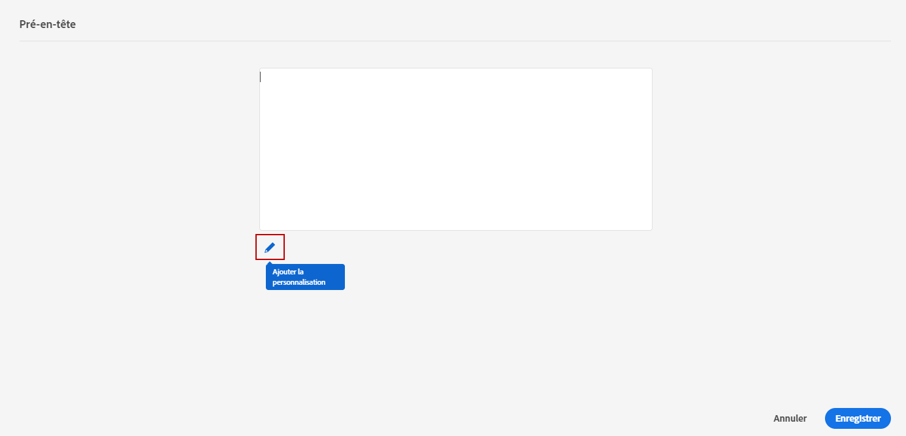

# Ajout d’un pré-titre {#preheader}

>[!CONTEXTUALHELP]
>id="ac_edition_preheader"
>title="Ajouter un pré-titre"
>abstract="Un pré-titre est un texte de résumé court qui suit l’objet d’un message lorsque vous le visualisez à partir de votre client de messagerie. Dans de nombreux cas, il fournit un bref résumé de l’email et il s’agit généralement d’une seule phrase."

Un pré-titre est un texte de résumé court qui suit l’objet d’un message lorsque vous le visualisez à partir de votre client de messagerie.

Dans de nombreux cas, il fournit un bref résumé de l’email et il s’agit généralement d’une seule phrase.

>[!NOTE]
>
>Les en-têtes prédéfinis ne sont pas pris en charge par tous les clients de messagerie. Lorsqu’il n’est pas pris en charge, le pré-titre ne s’affiche pas.

Pour définir le pré-titre de l&#39;email, procédez comme suit :

1. Dans le Concepteur d&#39;email, ajoutez au moins un **[!UICONTROL Structure components]** pour commencer à concevoir votre email.

1. Cliquez sur le bouton **[!UICONTROL Navigation tree]** dans le volet de gauche, puis sélectionnez **[!UICONTROL Body]**.

   

1. Dans la **[!UICONTROL Body settings]** dans le volet de droite, cliquez sur l’icône de modification en regard de l’option **[!UICONTROL Preheader]** pour ajouter du contenu.

   

1. Ajoutez votre pré-titre. Vous pouvez la personnaliser davantage en cliquant sur le bouton **[!UICONTROL Add personalization]** icône .

   

1. Dans la **[!UICONTROL Edit Personalization]** fenêtre, vous pouvez ajouter **[!UICONTROL Content block]**, **[!UICONTROL Dynamic content]** ou **[!UICONTROL Personalization fields]**.

1. Cliquez sur **[!UICONTROL Validate]** pour vérifier votre syntaxe de personnalisation.

   

1. Cliquez sur **[!UICONTROL Save]**.

Votre pré-titre est maintenant configuré pour votre email.
