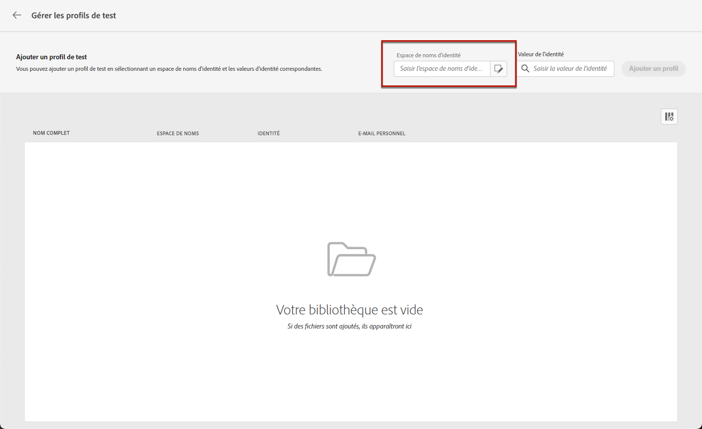
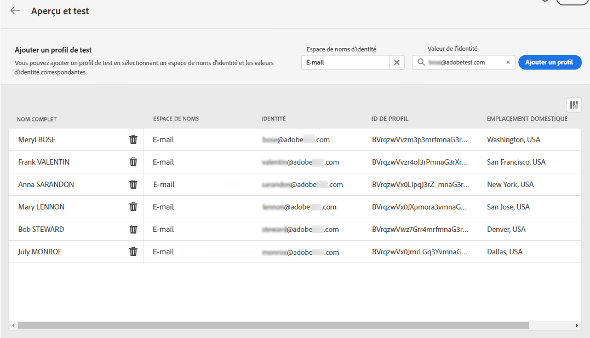
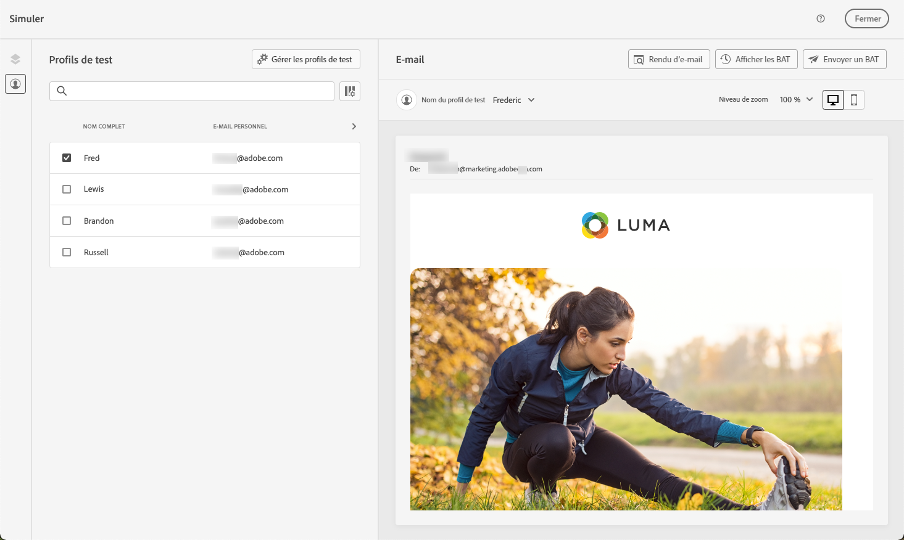
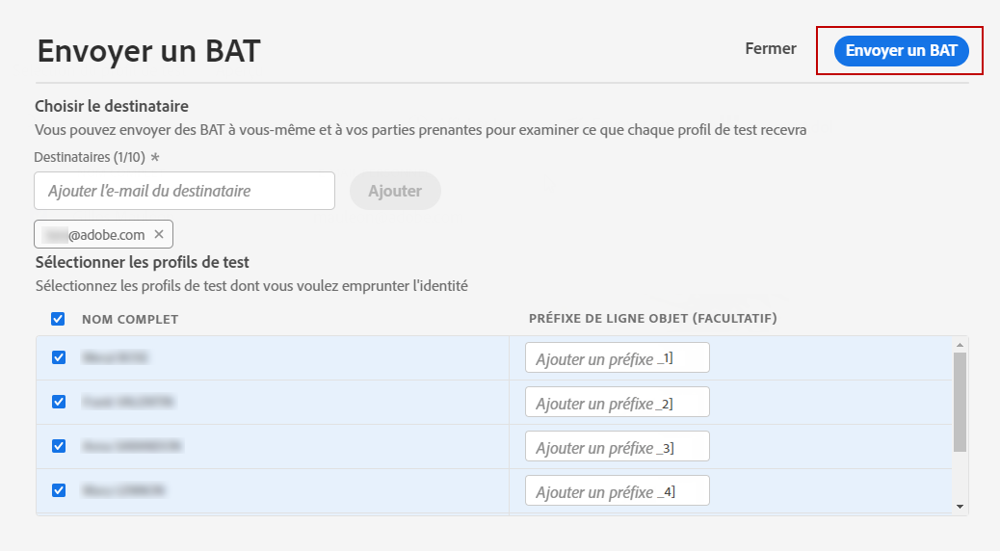
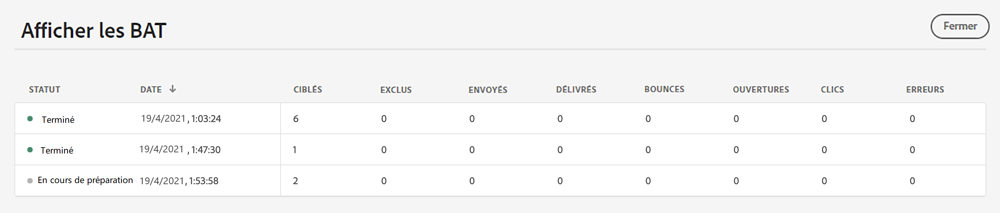
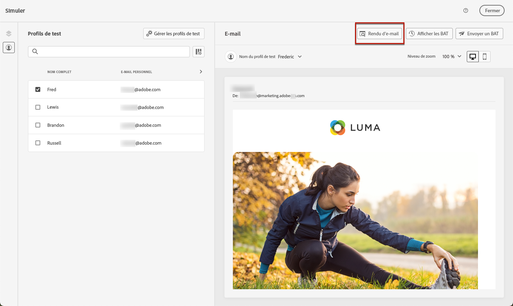

# Prévisualiser et tester vos messages {#preview-and-proof}

Une fois le contenu de votre email défini, vous pouvez utiliser des profils de test pour le prévisualiser et le tester. Si vous avez inséré [contenu personnalisé](../personalization/personalize.md), vous pouvez vérifier l’affichage de ce contenu dans le message à l’aide des données de profil de test.

Pour détecter d&#39;éventuelles erreurs dans le contenu d&#39;un email ou les paramètres de personnalisation, envoyez des bons à tirer aux profils de test. Un bon à tirer doit être envoyé chaque fois qu’une modification est apportée pour valider le contenu le plus récent.

>[!CAUTION]
>
>Vous devez disposer de profils de test pour pouvoir prévisualiser vos messages et envoyer des bons à tirer.
>
>Découvrez comment créer des profils de test dans [cette page](../segment/creating-test-profiles.md).

Pour tester le contenu de votre email, vous devez :

* [Sélection de profils de test](#select-test-profiles)
* [Vérifier l&#39;aperçu du message](#preview-your-messages)

Vous pourrez alors [envoyer un bon à tirer](#send-proofs) à vos profils de test.

En outre, utilisez vos **Litmus** compte dans [!DNL Journey Optimizer] pour prévisualiser instantanément votre **rendu des emails** dans les clients de messagerie les plus courants. Vous pouvez ensuite vous assurer que le contenu de votre email s’affiche correctement et fonctionne correctement dans chaque boîte de réception. Découvrez comment déverrouiller les aperçus d’email Litmus dans [cette section](#email-rendering).

>[!CAUTION]
>
>Lors de la prévisualisation d&#39;un message ou de l&#39;envoi de BAT, seules les données de personnalisation de profil s&#39;affichent. La personnalisation basée sur les données contextuelles, telles que les informations d’événement, ne peut être testée que dans le contexte d’un parcours. Découvrez comment tester la personnalisation dans [ce cas pratique ;](../personalization/personalization-use-case.md).

➡️ [Découvrez comment prévisualiser et tester votre email dans cette vidéo](#video-preview)

## Sélection de profils de test {#select-test-profiles}

>[!CONTEXTUALHELP]
>id="ac_preview_testprofiles"
>title="Prévisualiser et tester vos messages"
>abstract="Une fois le contenu de votre message défini, vous pouvez utiliser des profils de test pour le prévisualiser et le tester."
>additional-url="https://experienceleague.adobe.com/docs/journey-optimizer/using/email/preview.html?lang=en#email-rendering" text="Rendu des emails"
>additional-url="https://experienceleague.adobe.com/docs/journey-optimizer/using/email/preview.html?lang=en#preview-email" text="Aperçu"

Utilisation [Profils de test](../segment/creating-test-profiles.md) pour cibler des destinataires supplémentaires qui ne correspondent pas aux critères de ciblage définis.

Pour sélectionner des profils de test, procédez comme suit :

1. Dans le [Modifier le contenu](create-email.md#define-email-content) ou, dans le Concepteur d&#39;email, cliquez sur le bouton **[!UICONTROL Simulate content]** pour accéder à la sélection du profil de test.

   

1. Sélectionner **[!UICONTROL Manage test profiles]**.

   

1. Sélectionnez l’espace de noms à utiliser pour identifier les profils de test en cliquant sur le bouton **[!UICONTROL Identity namespace]** icône de sélection.

   

   En savoir plus sur les espaces de noms d’identité Adobe Experience Platform [dans cette section](../segment/get-started-identity.md).

   Dans l’exemple ci-dessous, nous utiliserons la variable **Email** espace de noms.

1. Utilisez le champ de recherche pour trouver l’espace de noms, sélectionnez-le et cliquez sur **[!UICONTROL Select]**

   

1. Dans le **[!UICONTROL Identity value]** , saisissez la valeur (ici l’adresse email) permettant d’identifier le profil de test et cliquez sur **[!UICONTROL Add profile]**.

   <!---->

1. Si vous avez ajouté la personnalisation à votre message, ajoutez d&#39;autres profils afin que vous puissiez tester différentes variantes du message en fonction des données de profil. Une fois ajoutés, les profils sont répertoriés sous les champs sélectionnés.

   

   En fonction des éléments de personnalisation du message, cette liste affiche les données de chaque profil de test dans les colonnes correspondantes.

### Email preview {#preview-email}

Une fois [profils de test](#select-test-profiles) sont sélectionnées, vous pouvez prévisualiser le contenu de votre email. Suivez les étapes ci-dessous :

1. Dans le [Modifier le contenu](create-email.md#define-email-content) ou, dans le Concepteur d&#39;email, cliquez sur le bouton **[!UICONTROL Simulate content]** bouton .

1. Sélectionnez un profil de test. Vous pouvez vérifier les valeurs disponibles dans les colonnes. Utilisez les flèches droite/gauche pour parcourir les données.

   

   >[!NOTE]
   >
   >Pour ajouter d’autres profils de test, sélectionnez **[!UICONTROL Manage test profiles]**. [En savoir plus](#select-test-profiles)

1. Cliquez sur le bouton **[!UICONTROL Select data]** au-dessus de la liste pour ajouter ou supprimer des colonnes.

   

   Vous pouvez voir les champs de personnalisation spécifiques au message en cours à la fin de la liste. Dans cet exemple, la ville du profil, le prénom et le nom. Sélectionnez ces champs et assurez-vous que ces valeurs sont renseignées dans vos profils de test.

1. Dans l&#39;aperçu du message, les éléments personnalisés sont remplacés par les données de profil de test sélectionnées.

   Par exemple, pour ce message, le contenu de l&#39;email et l&#39;objet de l&#39;email sont personnalisés :

   

1. Sélectionnez d&#39;autres profils de test pour prévisualiser le rendu des emails pour chaque variante de votre message.

## Envoyer un bon à tirer {#send-proofs}

Un BAT est un message spécifique qui vous permet de tester un message avant de l’envoyer à l’audience principale. Les destinataires du BAT sont chargés de la validation du message : rendu, contenu, paramètres de personnalisation, configuration.

Une fois [profils de test](#select-test-profiles) sont sélectionnés, vous pouvez envoyer des bons à tirer.

1. Dans le **[!UICONTROL Simulate]** , cliquez sur l’écran **[!UICONTROL Send proof]** bouton .

   

1. Dans la **[!UICONTROL Send proof]** , saisissez l’email de votre destinataire et cliquez sur **[!UICONTROL Add]** pour envoyer le BAT à vous-même ou aux membres de vos organisations.

   Notez que vous pouvez ajouter jusqu’à dix destinataires pour votre diffusion BAT.

   

1. Sélectionnez ensuite le **Profils de test** qui sera utilisé pour personnaliser le contenu du message.

   Chaque destinataire du BAT recevra autant de messages que le nombre de profils de test sélectionnés. Par exemple, si vous avez ajouté cinq emails de destinataires et sélectionné dix profils de test, vous enverrez alors cinquante messages de BAT et chaque destinataire en recevra dix.

1. Si nécessaire, vous pouvez ajouter un préfixe à l’objet du BAT. Seuls les caractères alphanumériques et les caractères spéciaux tels que . - _ ( ) [ ] sont autorisés comme préfixe à la ligne d’objet.

1. Cliquez sur **[!UICONTROL Send proof]**.

   

1. De retour dans le  **[!UICONTROL Simulate]** , cliquez sur l’écran  **[!UICONTROL View proofs]** pour vérifier l’état.

   

Il est recommandé d&#39;envoyer des bons à tirer après chaque modification du contenu du message.

>[!NOTE]
>
>Dans le BAT envoyé, le lien vers la page miroir n&#39;est pas actif. Elle n’est activée que dans les messages finaux.

## Utiliser le rendu des emails {#email-rendering}

Vous pouvez tirer parti de vos **Litmus** compte dans [!DNL Journey Optimizer] pour prévisualiser instantanément votre **rendu des emails** dans les clients de messagerie les plus courants.

Pour accéder aux fonctionnalités de rendu des emails, vous devez :

* Posséder un compte Litmus
* [Sélection de profils de test](#select-test-profiles)

Suivez ensuite les étapes ci-dessous :

1. Dans le [Modifier le contenu](create-email.md#define-email-content) ou, dans le Concepteur d&#39;email, cliquez sur le bouton **[!UICONTROL Simulate content]** bouton .

1. Sélectionnez la **[!UICONTROL Render email]** bouton .

   

1. Cliquez sur **Connexion à votre compte Litmus** dans la section supérieure droite.

   

1. Saisissez vos informations d’identification et connectez-vous.

   

1. Cliquez sur le bouton **Exécuter le test** pour générer des aperçus d’email.

1. Vérifiez le contenu de vos emails dans les clients populaires de bureau, de mobile et web.

   

>[!CAUTION]
>
>Lors de la connexion de votre **Litmus** compte avec [!DNL Journey Optimizer], vous acceptez que les messages de test soient envoyés à Litmus : une fois envoyés, ces emails ne sont plus gérés par Adobe. Par conséquent, la politique de conservation des données de Litmus s’applique à ces emails, y compris les données de personnalisation qui peuvent être incluses dans ces messages de test.

## Vidéo pratique {#video-preview}

Découvrez comment tester le rendu des emails dans les boîtes de réception, comment prévisualiser vos emails personnalisés par rapport aux profils de test et envoyer des bons à tirer.

>[!VIDEO](https://video.tv.adobe.com/v/334239?quality=12)
