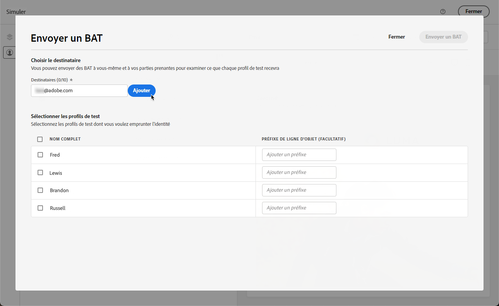
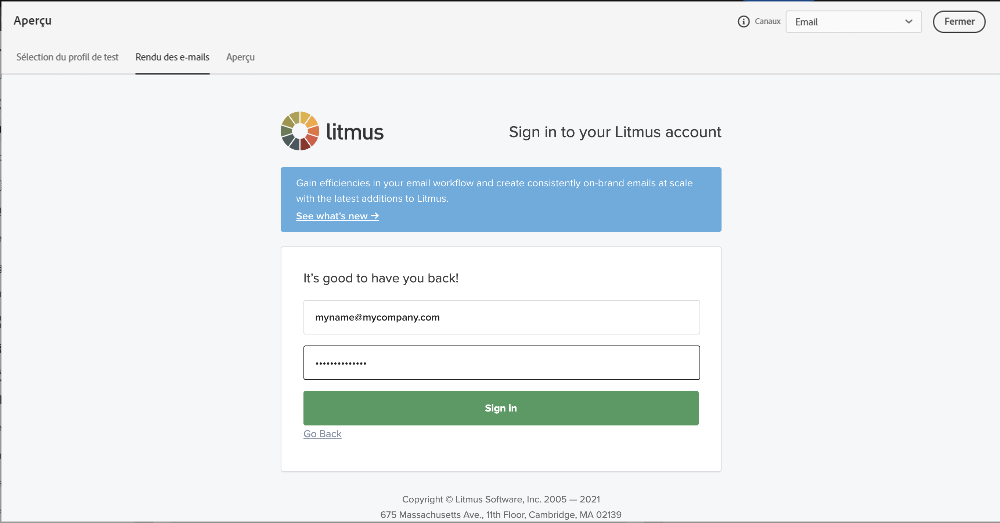

# Prévisualiser et tester votre e-mail {#preview-and-proof}

>[!CONTEXTUALHELP]
>id="ac_preview_testprofiles"
>title="Prévisualiser et tester vos messages"
>abstract="Une fois le contenu de votre message défini, vous pouvez utiliser des profils de test pour le prévisualiser et le tester."

Une fois le contenu votre d’e-mail défini, vous pouvez utiliser des profils de test pour le prévisualiser et le tester. Si vous avez inséré du [contenu personnalisé](../personalization/personalize.md), vous pouvez vérifier l’affichage de celui-ci dans le message à l’aide des données de profil de test.

Pour détecter d&#39;éventuelles erreurs dans le contenu des e-mails ou les paramètres de personnalisation, envoyez des BAT aux profils de test. Un BAT doit être envoyé chaque fois qu’une modification est apportée, afin de valider le contenu le plus récent.

>[!CAUTION]
>
>Vous devez disposer de profils de test pour pouvoir prévisualiser vos messages et envoyer des BAT.
>
>Découvrez comment créer des profils de test dans [cette page](../audience/creating-test-profiles.md).

Pour tester le contenu de votre e-mail, vous devez :

* [Sélectionner des profils de test,](#select-test-profiles)
* [vérifier l’aperçu du message](#preview-your-messages)

Vous pourrez ensuite [envoyer des BAT](#send-proofs) à vos profils de test.

De plus, exploitez votre compte **Litmus** dans [!DNL Journey Optimizer] pour prévisualiser instantanément votre **rendu d&#39;e-mail** dans les clients de messagerie populaires. Vous pouvez ensuite vous assurer que le contenu de votre e-mail s&#39;affiche correctement et fonctionne correctement dans chaque boîte de réception. Découvrez comment déverrouiller les Prévisualisations d’e-mail Litmus dans [cette section](#email-rendering).

>[!CAUTION]
>
>Lors de la prévisualisation d&#39;un message ou de l&#39;envoi de BAT, seules les données de personnalisation de profil s&#39;affichent. La personnalisation basée sur les données contextuelles, telles que les informations d&#39;événement, ne peut être testée que dans le contexte d&#39;un parcours. Découvrez comment tester la personnalisation dans [ce cas d&#39;utilisation](../personalization/personalization-use-case.md).

➡️ [Découvrez comment prévisualiser et tester votre e-mail dans cette vidéo](#video-preview)

## Sélectionner des profils de test {#select-test-profiles}

Utilisez des [profils de test](../audience/creating-test-profiles.md) pour cibler des destinataires supplémentaires, qui ne correspondent pas aux critères de ciblage définis.

Pour sélectionner des profils de test, procédez comme suit :

1. Dans l’écran [Modifier le contenu](create-email.md#define-email-content) ou dans le concepteur d’e-mail, cliquez sur le bouton **[!UICONTROL Simuler un contenu]** pour accéder à la sélection du profil de test.

   

1. Sélectionnez **[!UICONTROL Gérer les profils de test]**.

   

1. Sélectionnez l&#39;espace de noms à utiliser pour identifier les profils de test en cliquant sur l&#39;icône de sélection **[!UICONTROL Espace de noms d&#39;identité]**.

   

   Apprenez-en davantage sur les espaces de noms d&#39;identité d&#39;Adobe Experience Platform [dans cette section](../audience/get-started-identity.md).

   Dans l&#39;exemple ci-dessous, nous utiliserons l&#39;espace de noms **E-mail**.

1. Utilisez le champ de recherche pour trouver l&#39;espace de noms, sélectionnez-le et cliquez sur **[!UICONTROL Sélectionner]**.

   

1. Dans le champ **[!UICONTROL Valeur d’identité]**, saisissez la valeur (l’adresse e-mail ici) permettant d’identifier le profil de test et cliquez sur **[!UICONTROL Ajouter un profil]**.

   <!---->

1. Si vous avez ajouté une personnalisation à votre message, ajoutez d’autres profils afin de pouvoir tester différentes variantes du message en fonction des données du profil. Une fois ajoutés, les profils sont répertoriés sous les champs sélectionnés.

   

   En fonction des éléments de personnalisation du message, cette liste affiche les données de chaque profil de test dans les colonnes associées.

### Prévisualisation des e-mails {#preview-email}

Une fois les [profils de test](#select-test-profiles) sélectionnés, vous pouvez prévisualiser le contenu de votre e-mail. Suivez les étapes ci-dessous :

1. Dans l’écran [Modifier le contenu](create-email.md#define-email-content) ou dans le concepteur d’e-mail, cliquez sur le bouton **[!UICONTROL Simuler un contenu]**.

1. Sélectionnez un profil de test. Vous pouvez vérifier les valeurs disponibles dans les colonnes. Utilisez les flèches droite/gauche pour parcourir les données.

   

   >[!NOTE]
   >
   >Pour ajouter d’autres profils de test, sélectionnez **[!UICONTROL Gérer les profils de test]**. [En savoir plus](#select-test-profiles)

1. Cliquez sur l&#39;icône **[!UICONTROL Sélectionner les données]** au-dessus de la liste pour ajouter ou supprimer des colonnes.

   

   Vous pouvez voir les champs de personnalisation spécifiques au message actuel à la fin de la liste. Dans cet exemple, la ville, le prénom et le nom de famille du profil. Sélectionnez ces champs et assurez-vous que ces valeurs sont renseignées dans vos profils de test.

1. Dans la prévisualisation du message, les éléments personnalisés sont remplacés par les données de profil de test sélectionnées.

   Par exemple, pour ce message, le contenu de l&#39;e-mail et l&#39;objet de l&#39;e-mail sont personnalisés :

   

1. Sélectionnez d&#39;autres profils de test pour prévisualiser le rendu des e-mails pour chaque variante de votre message.

## Envoyer des BAT {#send-proofs}

Un BAT est un message spécifique qui permet de tester un message avant son envoi à l&#39;audience principale. Les destinataires du BAT sont chargés d&#39;approuver le message : rendu, contenu, paramètres de personnalisation, configuration.

Une fois les [profils de test](#select-test-profiles) sélectionnés, vous pouvez envoyer des BAT.

1. Dans l’écran **[!UICONTROL Stimuler]**, cliquez sur le bouton **[!UICONTROL Envoyer le BAT]**.

   

1. Dans la fenêtre **[!UICONTROL Envoyer un BAT]**, saisissez l’e-mail du destinataire et cliquez sur **[!UICONTROL Ajouter]** pour envoyer le BAT à vous-même ou aux membres de votre organisation.

   Vous pouvez ajouter jusqu’à dix destinataires pour la diffusion de votre BAT.

   

1. Sélectionnez ensuite les **Profils de test** qui seront utilisés pour personnaliser le contenu du message.

   Chaque destinataire du BAT recevra autant de messages que le nombre de profils de test sélectionnés. Par exemple, si vous avez ajouté cinq e-mails de destinataires et sélectionné dix profils de test, vous enverrez alors cinquante messages de BAT et chaque destinataire en recevra dix.

1. Si nécessaire, vous pouvez ajouter un préfixe à l&#39;objet du BAT. Seuls les caractères alphanumériques et les caractères spéciaux, comme . - _ ( ) [ Les ] sont autorisées comme préfixe à l’objet.

1. Cliquez sur **[!UICONTROL Envoyer un BAT]**.

   

1. De retour dans l’écran **[!UICONTROL Simuler]**, cliquez sur le bouton **[!UICONTROL Afficher les BAT]** pour vérifier le statut.

   

Il est recommandé d’envoyer des BAT après chaque modification du contenu du message.

>[!NOTE]
>
>Dans le BAT envoyé, le lien vers la page miroir n’est pas actif. Il n’est activé que dans les messages finaux.

## Utiliser le rendu des e-mails {#email-rendering}

Vous pouvez exploiter votre compte **Litmus** dans [!DNL Journey Optimizer] pour prévisualiser instantanément votre **rendu d&#39;e-mail** dans les clients de messagerie populaires.

Pour accéder aux fonctionnalités de rendu des e-mails, vous devez :

* Posséder un compte Litmus
* [Sélectionner des profils de test](#select-test-profiles)

Suivez ensuite les étapes ci-dessous :

1. Dans l’écran [Modifier le contenu](create-email.md#define-email-content) ou, dans le Concepteur d’e-mail, cliquez sur le bouton **[!UICONTROL Simuler du contenu]**.

1. Sélectionnez le bouton **[!UICONTROL Rendu d’e-mail]**.

   

1. Cliquez sur **Connecter votre compte Litmus** dans la section supérieure droite.

   

1. Saisissez vos informations d&#39;identification et connectez-vous.

   

1. Cliquez sur le bouton **Exécuter le test** pour générer des prévisualisations d&#39;e-mail.

1. Vérifiez le contenu de vos e-mails sur les clients courants de bureau, mobiles et Web.

   

>[!CAUTION]
>
>Lorsque vous connectez votre compte **Litmus** à [!DNL Journey Optimizer], vous acceptez que les messages de test soient envoyés à Litmus : une fois envoyés, ces e-mail ne sont plus gérés par Adobe. En conséquence, la politique e-mail de rétention des données de Litmus s&#39;applique à ces e-mails, y compris les données de personnalisation qui peuvent être incluses dans ces messages de test.

## Vidéo pratique {#video-preview}

Découvrez comment tester le rendu des e-mails dans les boîtes de réception, prévisualiser vos e-mails personnalisés par rapport aux profils de test et envoyer des bons à tirer.

>[!VIDEO](https://video.tv.adobe.com/v/334239?quality=12)
