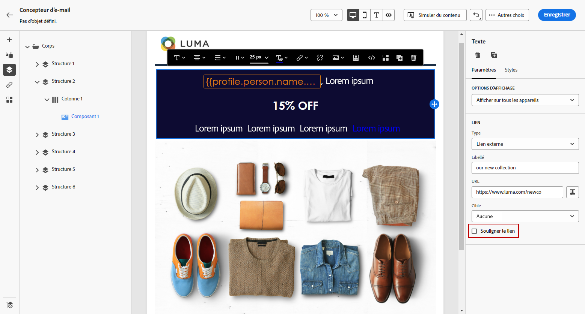

# Définition d’un style pour les liens {#styling-links}

Vous pouvez souligner un lien et sélectionner sa couleur et sa cible dans le Concepteur d&#39;email.

1. Dans un texte **[!UICONTROL Content component]** lorsqu&#39;un lien est inséré, sélectionnez-le.

1. Dans le **[!UICONTROL Component settings]** menu, vérifier **[!UICONTROL Underline link]** pour souligner le texte du libellé de votre lien.

   

1. Choisissez la manière dont votre audience sera redirigée avec la variable **[!UICONTROL Target]** menu déroulant :

   * **[!UICONTROL None]**: ouvre le lien dans le même cadre que celui sur lequel l’utilisateur a cliqué (par défaut).
   * **[!UICONTROL Blank]**: ouvre le lien dans une nouvelle fenêtre ou un nouvel onglet.
   * **[!UICONTROL Self]**: ouvre le lien dans le même cadre que celui sur lequel l’utilisateur a cliqué.
   * **[!UICONTROL Parent]**: ouvre le lien dans le cadre parent.
   * **[!UICONTROL Top]**: ouvre le lien dans le corps complet de la fenêtre.

   

1. Pour modifier la couleur de votre lien, cliquez sur **[!UICONTROL Link color]**.

   

1. Choisissez la couleur dont vous avez besoin.

1. Enregistrez vos modifications.
