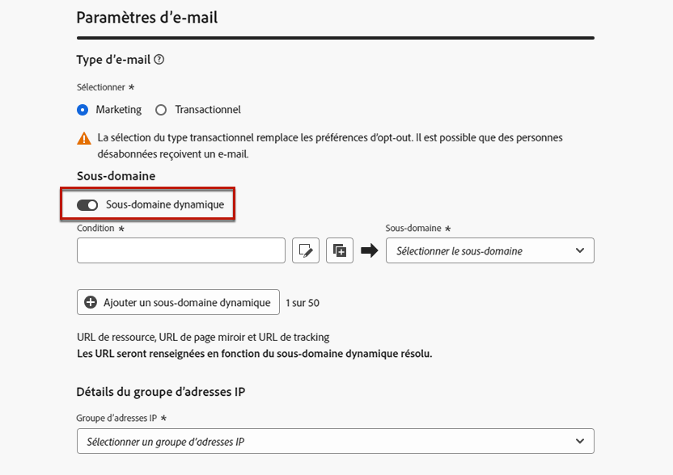
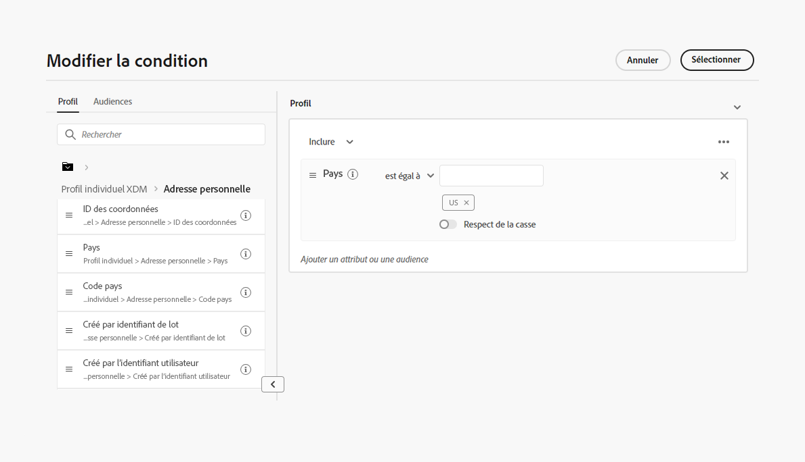
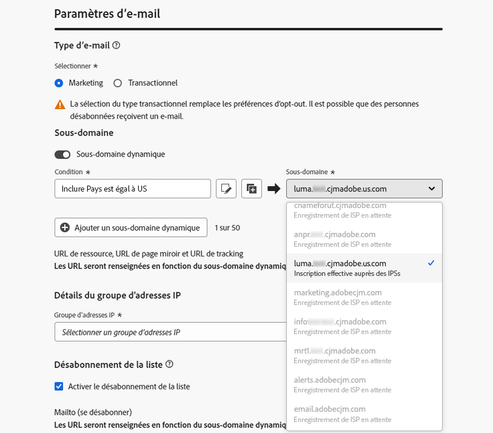
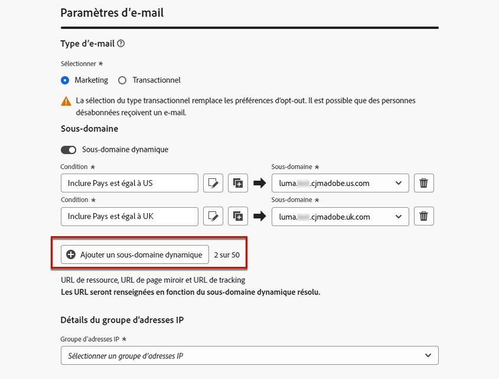
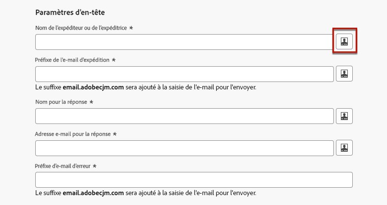
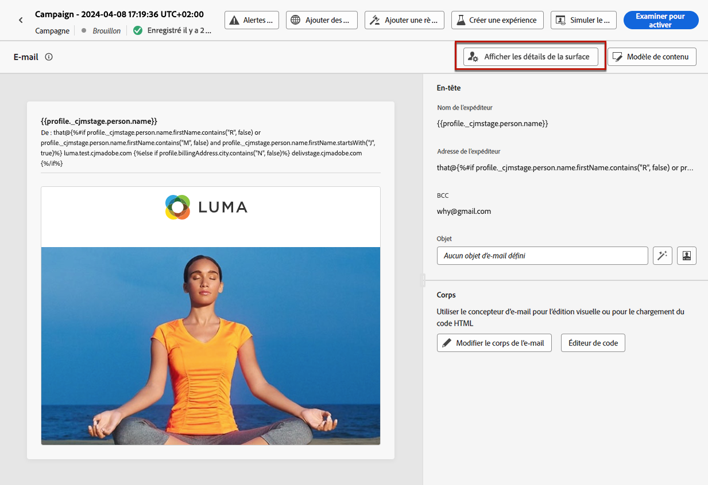
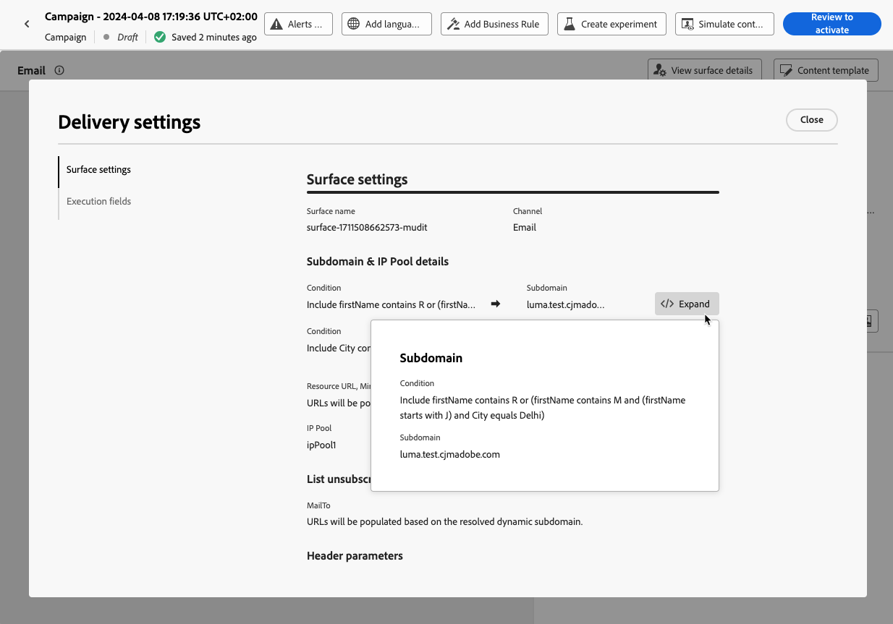
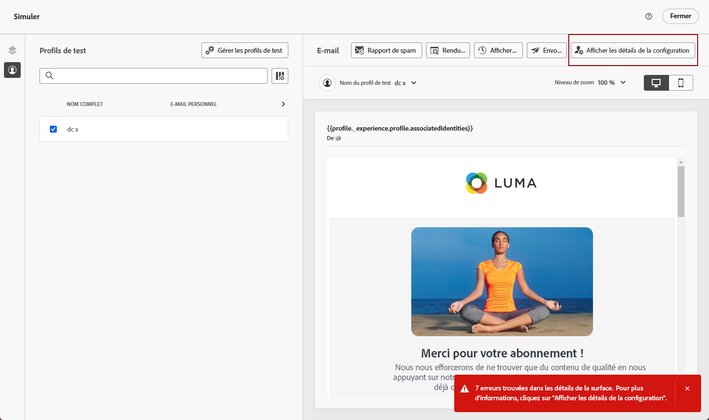
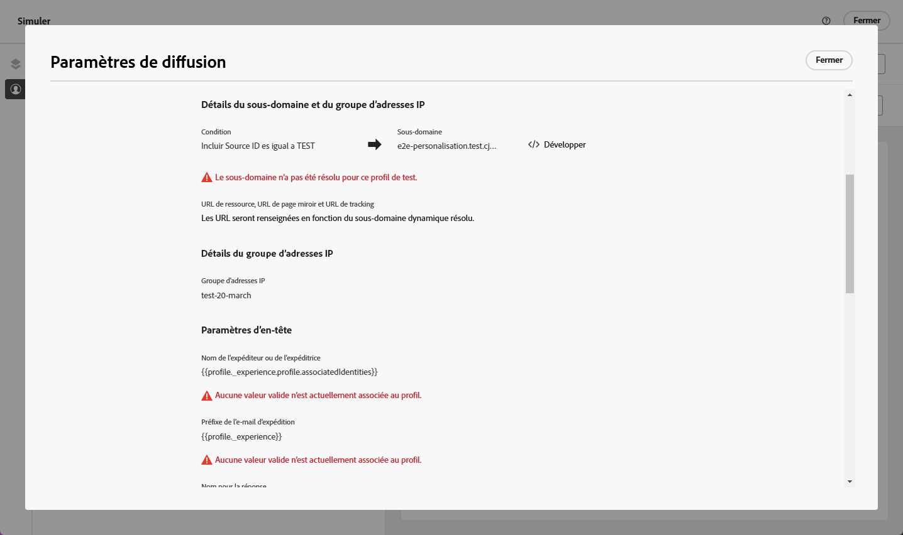

# Personnaliser les paramètres de configuration du canal e-mail {#surface-personalization}

Pour plus de flexibilité et de contrôle sur vos paramètres de canal e-mail, [!DNL Journey Optimizer] permet de définir des valeurs personnalisées pour les sous-domaines et les en-têtes<!--and URL tracking parameters--> lors de la création de configurations de canal e-mail.

## Ajouter des sous-domaines dynamiques {#dynamic-subdomains}

>[!CONTEXTUALHELP]
>id="ajo_surface_perso_not_available"
>title="Personnalisation non disponible."
>abstract="Cette configuration a été créée sans aucun attribut de personnalisation. Consultez la documentation pour connaître les étapes à suivre si une personnalisation est nécessaire."

>[!CONTEXTUALHELP]
>id="ajo_surface_dynamic_subdomain"
>title="Activer des sous-domaines dynamiques"
>abstract="Lors de la création d’une configuration du canal e-mail, vous pouvez paramétrer des sous-domaines dynamiques en fonction de conditions définies à l’aide de l’éditeur de personnalisation. Vous pouvez ajouter jusqu’à 50 sous-domaines dynamiques."

Lors de la création d’une configuration du canal e-mail, vous pouvez paramétrer des sous-domaines dynamiques en fonction de conditions spécifiques.

Par exemple, si vous avez des contraintes juridiques nécessitant l’envoi des messages à partir d’une adresse e-mail dédiée pour chaque pays, vous pouvez utiliser des sous-domaines dynamiques. Vous pouvez ainsi créer une configuration unique avec plusieurs sous-domaines d’envoi correspondant à différents pays, au lieu de créer plusieurs configurations pour chaque pays. Vous pouvez ensuite cibler des clientes et des clients qui se trouvent dans différents pays consolidés dans une seule campagne.

Pour définir des sous-domaines dynamiques dans une configuration de canal e-mail, procédez comme suit.

1. Avant de créer une configuration, paramétrez les sous-domaines que vous souhaitez utiliser pour envoyer des e-mails en fonction de votre cas d’utilisation. [Voici comment procéder](../configuration/about-subdomain-delegation.md)

   Par exemple, supposons que vous souhaitiez utiliser différents sous-domaines pour différents pays : configurer un sous-domaine spécifique aux États-Unis, un autre spécifique au Royaume-Uni, etc.

1. Créer une configuration de canal. [Voici comment procéder](../configuration/channel-surfaces.md)

1. Sélectionnez le canal **[!UICONTROL e-mail]**.

1. Dans la section **sous-domaine**, activez l’option **[!UICONTROL Sous-domaine dynamique]**.

   

1. Cliquez sur l’icône Modifier à côté du premier champ **[!UICONTROL Condition]**.

1. L’[éditeur de personnalisation](../personalization/personalization-build-expressions.md) s’ouvre. Dans cet exemple, définissez une condition telle que `Country` est égal à `US`.

   

1. Sélectionnez le sous-domaine que vous souhaitez associer à cette condition. [En savoir plus sur les sous-domaines](../configuration/about-subdomain-delegation.md)

   >[!NOTE]
   >
   >Certains sous-domaines ne peuvent actuellement pas être sélectionnés en raison d’un enregistrement de [boucle de rétroaction](../reports/deliverability.md#feedback-loops) en attente. Ce processus peut prendre jusqu’à 10 jours ouvrables. Une fois l’opération terminée, vous pouvez choisir parmi tous les sous-domaines disponibles. <!--where FL registration happens? is it when delegating a subdomain and you're awaiting from subdomain validation? or is it on ISP side only?-->

   

   Toutes les personnes destinataires qui se trouvent aux Etats-Unis reçoivent les messages qui utilisent le sous-domaine sélectionné pour ce pays, ce qui signifie que toutes les URL impliquées (comme la page miroir, l’URL de suivi ou le lien de désabonnement) sont renseignées en fonction de ce sous-domaine.

1. Définissez d’autres sous-domaines dynamiques si besoin. Vous pouvez ajouter jusqu’à 50 éléments.

   

   <!--Select the [IP pool](../configuration/ip-pools.md) to associate with the configuration. [Learn more](email-settings.md#subdomains-and-ip-pools)-->

1. Définissez tous les autres [paramètres d’e-mail](email-settings.md) et [envoyez](../configuration/channel-surfaces.md#create-channel-surface) votre configuration.

Une fois que vous avez ajouté un ou plusieurs sous-domaines dynamiques à une configuration, les éléments suivants sont renseignés en fonction du sous-domaine dynamique résolu pour cette configuration :

* Toutes les URL (URL de ressource, URL de page miroir et URL de suivi)

* L’[URL de désabonnement](email-settings.md#list-unsubscribe)

* Les suffixes de l’**E-mail d’expéditeur** et de l’**E-mail d’erreur**

>[!NOTE]
>
>Si vous définissez des sous-domaines dynamiques, et que vous désactivez l’option **[!UICONTROL Sous-domaine dynamique]**, toutes les valeurs dynamiques sont supprimées. Sélectionnez un sous-domaine et envoyez la configuration pour que les modifications soient prises en compte.

## Personnaliser votre en-tête {#personalize-header}

Vous pouvez également personnaliser tous les paramètres d’en-tête définis dans une configuration.

Par exemple, si vous possédez plusieurs marques, vous pouvez créer une configuration unique et utiliser des valeurs personnalisées pour vos en-têtes d’e-mail. Vous pouvez ainsi vous assurer que tous les e-mails envoyés à partir de vos différentes marques sont adressés à chacun de vos clientes et clients avec les bons noms d’expéditeur et d’expéditrice (**De**) et les bonnes adresses e-mail. De la même manière, lorsque vos destinataires appuient sur le bouton **Répondre** dans leur logiciel client de messagerie, vous souhaitez que les noms dans **Répondre à** et que les e-mails correspondent à la bonne marque pour le bon utilisateur ou la bonne utilisatrice.

Pour utiliser des variables personnalisées pour vos paramètres d’en-tête de configuration, procédez comme suit.

>[!NOTE]
>
>Vous pouvez personnaliser tous les champs de **[!UICONTROL Paramètres d’en-tête]**, à l’exception du champ **[!UICONTROL Préfixe d’e-mail d’erreur]**.

1. Définissez les paramètres d’en-tête comme vous en avez l’habitude. [Voici comment procéder](email-settings.md#email-header)

1. Pour chaque champ, sélectionnez l’icône Modifier.

   

1. L’[éditeur de personnalisation](../personalization/personalization-build-expressions.md) s’ouvre. Définissez la condition à votre convenance et enregistrez vos modifications.

   <!--For example, set a condition such as each recipient receives an email from their own brand representative.-->

   >[!NOTE]
   >
   >Vous pouvez uniquement sélectionner **[!UICONTROL Attributs de profil]** et **[!UICONTROL Fonctions d’assistance]**.

   Supposons que vous souhaitiez gérer dynamiquement les e-mails envoyés pour le compte d’une personne assistante de vente, et que celle-ci est récupérée à partir des paramètres contextuels d’un événement ou d’une campagne. Par exemple :

   * Dans un [parcours](../building-journeys/journey-gs.md), lorsqu’un événement d’achat est lié à la personne assistante de vente d’une boutique spécifique, l’en-tête de l’email (nom de l’expéditeur, adresse de l’expéditeur, adresse de réponse) peut être personnalisé avec les paramètres de la personne assistante de vente, issus des attributs de l’événement.

   * Dans une [campagne déclenchée par une API](../campaigns/api-triggered-campaigns.md), démarrée de manière externe par une personne assistante de vente, l’e-mail déclenché peut être envoyé pour le compte de la personne assistante de vente et les valeurs de personnalisation de l’en-tête peuvent être issues des paramètres contextuels de la campagne.

1. Répétez les étapes ci-dessus pour chaque paramètre auquel vous souhaitez ajouter une personnalisation.

>[!NOTE]
>
>Si vous avez ajouté un ou plusieurs sous-domaines dynamiques à votre configuration, les suffixes de l’**E-mail de l’expéditeur ou de l’expéditrice** et de l’**E-mail d’erreur** seront renseignés en fonction du [sous-domaine dynamique](#dynamic-subdomains) résolu.

<!--
## Use personalized URL tracking {#personalize-url-tracking}

To use personalized URL tracking prameters, follow the steps below.

1. Select the profile attribute of your choice from the personalization editor.

1. Repeat the steps above for each tracking parameter you want to personalize.

Now when the email is sent out, this parameter will be automatically appended to the end of the URL. You can then capture this parameter in web analytics tools or in performance reports.
-->

## Afficher les détails de configuration {#view-surface-details}

Lorsque vous utilisez une configuration avec des paramètres personnalisés dans une campagne ou un parcours, vous pouvez afficher les détails de la configuration directement dans la campagne ou le parcours. Suivez les étapes ci-dessous.

1. Créez une [campagne](../campaigns/create-campaign.md) e-mail ou un [parcours](../building-journeys/journey-gs.md) e-mail.

1. Sélectionnez le bouton **[!UICONTROL Modifier le contenu]**.

1. Cliquez sur le bouton **[!UICONTROL Afficher les détails de la configuration]**.

   

1. La fenêtre **[!UICONTROL Paramètres de diffusion]** apparaît. Vous pouvez afficher tous les paramètres de configuration, y compris les sous-domaines dynamiques et les paramètres d’en-tête personnalisés.

   >[!NOTE]
   >
   >Toutes les informations affichées sur cet écran sont en lecture seule.

1. Sélectionnez **[!UICONTROL Développer]** pour afficher les détails des sous-domaines dynamiques.

   

## Vérification de votre configuration {#check-configuration}

Lors de l’utilisation d’une configuration personnalisée dans une campagne ou un parcours, vous pouvez prévisualiser le contenu de votre e-mail afin de rechercher les erreurs potentielles avec les paramètres dynamiques que vous avez définis. Suivez les étapes ci-dessous.

1. Dans l’écran Modifier le contenu de votre message, ou dans le Concepteur d’e-mail, cliquez sur le bouton **[!UICONTROL Simuler du contenu]**. [En savoir plus](../content-management/preview.md)

1. Sélectionnez un [profil de test](../content-management/test-profiles.md).

1. Si une erreur s&#39;affiche, cliquez sur le bouton **[!UICONTROL Afficher les détails de la configuration]**.

   

1. Consultez les détails de l’erreur sur l’écran **[!UICONTROL Paramètres de diffusion]**.

   

Les erreurs possibles peuvent être les suivantes :

* Le **sous-domaine** n’a pas été résolu pour le profil de test sélectionné. Par exemple, votre configuration utilise plusieurs sous-domaines d’envoi correspondant à différents pays, mais le profil sélectionné n’a pas de valeur définie pour l’attribut `Country` ou l’attribut est défini sur `France`, mais cette valeur n’est associée à aucun sous-domaine de cette configuration.

* Le profil sélectionné n’a aucune valeur associée pour un ou plusieurs **paramètres d’en-tête**.

Si l’une de ces erreurs se produit, l’e-mail n’est pas envoyé au profil de test sélectionné.

Pour éviter ce type d’erreur, assurez-vous que les paramètres d’en-tête que vous définissez utilisent des attributs personnalisés avec des valeurs pour la plupart de vos profils. Des valeurs manquantes peuvent avoir un impact sur la délivrabilité de vos e-mails.

>[!NOTE]
>
>En savoir plus sur la délivrabilité dans [cette section](../reports/deliverability.md).
