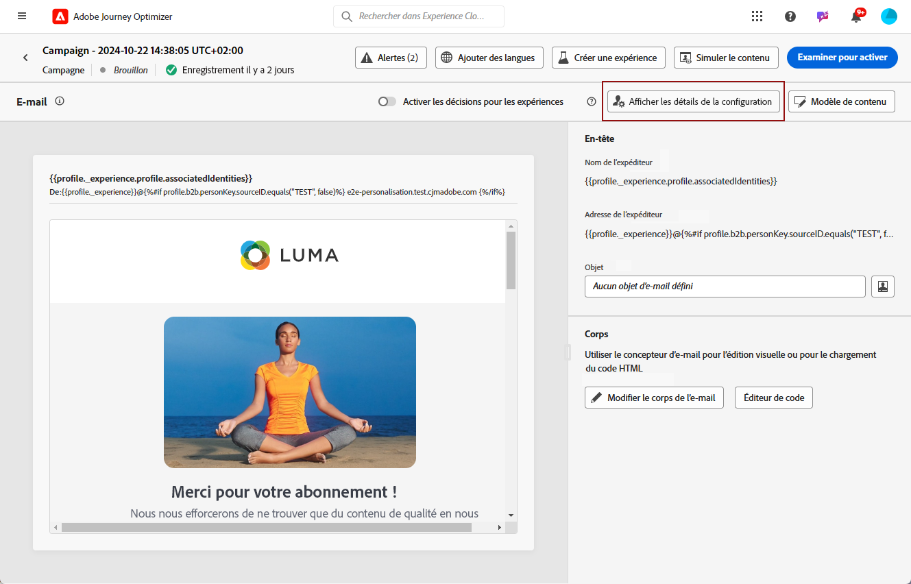

# Personnaliser les paramètres de surface d’e-mail {#surface-personalization}

Pour une flexibilité et un contrôle accrus de vos paramètres d’e-mail, [!DNL Journey Optimizer] permet de définir des valeurs personnalisées pour les sous-domaines et les en-têtes<!--and URL tracking parameters--> lors de la création de surfaces d’e-mail.

>[!AVAILABILITY]
>
>Cette fonctionnalité est actuellement disponible en version bêta pour certains utilisateurs uniquement. <!--To join the beta program, contact Adobe Customer Care.-->

## Ajout de sous-domaines dynamiques {#dynamic-subdomains}

>[!CONTEXTUALHELP]
>id="ajo_surface_perso_not_available"
>title="Personnalisation non disponible"
>abstract="Cette surface a été créée sans aucun attribut de personnalisation. Reportez-vous à la documentation pour connaître les étapes à résoudre si une personnalisation est requise."

>[!CONTEXTUALHELP]
>id="ajo_surface_dynamic_subdomain"
>title="Activer les sous-domaines dynamiques"
>abstract="Lors de la création d’une surface d’e-mail, vous pouvez configurer des sous-domaines dynamiques en fonction des conditions que vous définissez à l’aide de l’éditeur d’expression. Vous pouvez ajouter jusqu’à 50 sous-domaines dynamiques."

>[!CONTEXTUALHELP]
>id="ajo_surface_dynamic_subdomain_list"
>title="Certains sous-domaines peuvent être indisponibles"
>abstract="Certains sous-domaines ne sont actuellement pas sélectionnables en raison de l’enregistrement en attente de la feedback loop. Ce processus peut prendre jusqu’à 10 jours ouvrables. Une fois l’opération terminée, vous pouvez choisir parmi tous les sous-domaines disponibles."

Lors de la création d’une surface d’e-mail, vous pouvez configurer des sous-domaines dynamiques selon des conditions spécifiques.

Par exemple, si vous avez des contraintes légales pour envoyer des messages à partir d’une adresse e-mail dédiée par pays, vous pouvez utiliser des sous-domaines dynamiques. Vous pouvez ainsi créer une seule surface avec plusieurs sous-domaines d’envoi correspondant à différents pays, au lieu de créer plusieurs surfaces pour chaque pays. Vous pouvez ensuite cibler les clients de différents pays en une seule campagne.

Pour définir des sous-domaines dynamiques dans une surface de canal e-mail, procédez comme suit.

1. Avant de créer une surface, configurez les sous-domaines à utiliser pour envoyer des e-mails en fonction de votre cas d’utilisation. [Voici comment procéder](../configuration/about-subdomain-delegation.md)

   Supposons, par exemple, que vous souhaitiez utiliser différents sous-domaines pour différents pays : configurer un sous-domaine spécifique aux États-Unis, un autre spécifique au Royaume-Uni, etc.

1. Créer une surface de canal. [Voici comment procéder](../configuration/channel-surfaces.md)

1. Sélectionner le **[!UICONTROL E-mail]** canal.

1. Dans le **Sous-domaine** , activez la **[!UICONTROL Sous-domaine dynamique]** option.

   

1. Sélectionnez l’icône Modifier en regard du premier **[!UICONTROL Condition]** champ .

1. Le [Éditeur d’expression](../personalization/personalization-build-expressions.md) s’ouvre. Dans cet exemple, définissez une condition telle que `Country` est égal à `US`.

   

1. Sélectionnez le sous-domaine à associer à cette condition. [En savoir plus sur les sous-domaines](../configuration/about-subdomain-delegation.md)

   >[!NOTE]
   >
   >Certains sous-domaines ne sont actuellement pas disponibles pour sélection en raison d’un en attente [feedback loop](../reports/deliverability.md#feedback-loops) enregistrement. Ce processus peut prendre jusqu’à 10 jours ouvrables. Une fois l’opération terminée, vous pouvez choisir parmi tous les sous-domaines disponibles. <!--where FL registration happens? is it when delegating a subdomain and you're awaiting from subdomain validation? or is it on ISP side only?-->

   

   Tous les destinataires basés aux États-Unis recevront des messages à l’aide du sous-domaine sélectionné pour ce pays, ce qui signifie que toutes les URL impliquées (telles que la page miroir, l’URL de suivi ou le lien de désabonnement) seront renseignées en fonction de ce sous-domaine.

1. Définissez d’autres sous-domaines dynamiques selon vos besoins. Vous pouvez ajouter jusqu’à 50 éléments.

   

   <!--Select the [IP pool](../configuration/ip-pools.md) to associate with the surface. [Learn more](email-settings.md#subdomains-and-ip-pools)-->

1. Définir tous les autres [paramètres d’e-mail](email-settings.md) et [envoyer](../configuration/channel-surfaces.md#create-channel-surface) votre surface.

Une fois que vous avez ajouté un ou plusieurs sous-domaines dynamiques à une surface, les éléments suivants seront renseignés en fonction du sous-domaine dynamique résolu pour cette surface :

* Toutes les URL (URL de ressource, URL de page miroir et URL de tracking)

* Le [URL de désabonnement](email-settings.md#list-unsubscribe)

* Le **E-mail de l’expéditeur** et **Message d’erreur** suffixes

>[!NOTE]
>
>Si vous configurez des sous-domaines dynamiques, désactivez le **[!UICONTROL Sous-domaine dynamique]** , toutes les valeurs dynamiques sont supprimées. Sélectionnez un sous-domaine et soumettez la surface pour que les modifications soient prises en compte.

## Personnaliser l’en-tête {#personalize-header}

Vous pouvez également utiliser la personnalisation pour tous les paramètres d’en-tête définis dans une surface.

Par exemple, si vous disposez de plusieurs marques, vous pouvez créer une seule surface et utiliser des valeurs personnalisées pour vos en-têtes d’e-mail. Vous pouvez ainsi vous assurer que tous les e-mails envoyés depuis vos différentes marques sont adressés à chacun de vos clients avec la bonne **De** noms et adresses électroniques. De même, lorsque vos destinataires atteignent le **Reply** dans leur logiciel de messagerie, vous souhaitez que le **Répondre à** les noms et les e-mails correspondent à la marque appropriée pour l’utilisateur approprié.

Pour utiliser des variables personnalisées pour vos paramètres d’en-tête de surface, procédez comme suit.

>[!NOTE]
>
>Vous pouvez personnaliser tout **[!UICONTROL Paramètres d’en-tête]** champs, à l’exception des champs **[!UICONTROL Préfixe de l’e-mail d’erreur]** champ .

1. Définissez vos paramètres d’en-tête comme vous le feriez normalement. [Voici comment procéder](email-settings.md#email-header)

1. Pour chaque champ, sélectionnez l’icône Modifier .

   

1. Le [Éditeur d’expression](../personalization/personalization-build-expressions.md) s’ouvre. Définissez votre condition selon vos besoins et enregistrez vos modifications.

   Par exemple, définissez une condition telle que chaque destinataire reçoive un e-mail de son propre représentant de marque.

   >[!NOTE]
   >
   >Vous pouvez uniquement sélectionner **[!UICONTROL Attributs de profil]** et **[!UICONTROL Fonctions d&#39;assistance]**.

1. Répétez les étapes ci-dessus pour chaque paramètre auquel vous souhaitez ajouter une personnalisation.

>[!NOTE]
>
>Si vous avez ajouté un ou plusieurs sous-domaines dynamiques à votre surface, le **E-mail de l’expéditeur** et **Message d’erreur** les suffixes seront renseignés en fonction du résolu [sous-domaine dynamique](#dynamic-subdomains).

<!--
## Use personalized URL tracking {#personalize-url-tracking}

To use personalized URL tracking prameters, follow the steps below.

1. Select the profile attribute of your choice from the expression editor.

1. Repeat the steps above for each tracking parameter you want to personalize.

Now when the email is sent out, this parameter will be automatically appended to the end of the URL. You can then capture this parameter in web analytics tools or in performance reports.
-->

## Affichage des détails de la surface {#view-surface-details}

Lors de l’utilisation d’une surface avec des paramètres personnalisés dans une campagne ou une surface, vous pouvez afficher les détails de la surface directement dans la campagne ou la surface. Suivez les étapes ci-dessous.

1. Créer un e-mail [campagne](../campaigns/create-campaign.md) ou [parcours](../building-journeys/journey-gs.md).

1. Sélectionner le **[!UICONTROL Modifier le contenu]** Bouton.

1. Cliquez sur le lien **[!UICONTROL Affichage des détails de la surface]** Bouton.

   

1. Le **[!UICONTROL Paramètres de diffusion]** La fenêtre s’affiche. Vous pouvez afficher tous les paramètres de surface, y compris les sous-domaines dynamiques et les paramètres d’en-tête personnalisés.

   >[!NOTE]
   >
   >Toutes les informations affichées sur cet écran sont en lecture seule.

1. Sélectionner **[!UICONTROL Développer]** pour afficher les détails des sous-domaines dynamiques.

   
