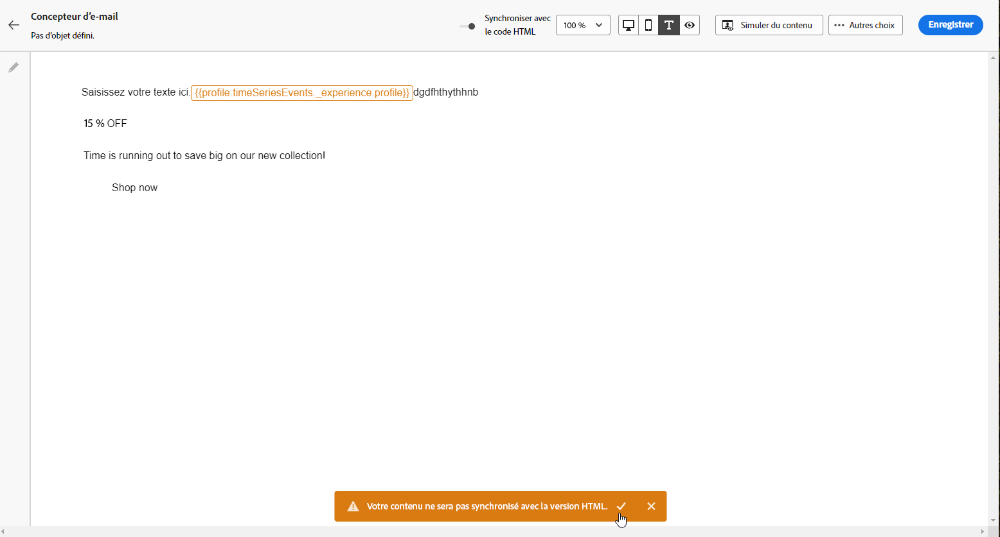

# Gestion de la version texte d’un e-mail {#text-version-email}

Il est recommandé de créer une version texte du corps de votre email, qui est utilisée lorsque le contenu HTML ne peut pas être affiché.

Du point de vue de la sécurité, il est important d’offrir une version en texte brut, car les e-mails d’HTML peuvent comporter des risques tels que des scripts malveillants, le suivi des pixels ou des tentatives d’hameçonnage qui reposent sur une mise en forme et des liens riches. Le texte brut réduit la surface d’attaque et est souvent privilégié par les destinataires soucieux de la sécurité ou les systèmes de messagerie d’entreprise qui limitent ou suppriment HTML. En fournissant les deux versions, les destinataires peuvent choisir le format qui correspond à leurs exigences en matière de sécurité et de confidentialité.

## Accéder à la version texte par défaut {#plain-text-default}

Par défaut, le concepteur d’e-mail crée une version en **[!UICONTROL texte brut]** de votre email, y compris des champs de personnalisation. Cette version est automatiquement générée et synchronisée avec la version HTML de votre contenu.

Pour accéder à la version texte par défaut, sélectionnez l’icône **[!UICONTROL Texte brut]** dans le contenu de l’e-mail.


## Utiliser une version texte personnalisée {#plain-text-default-custom}

Si vous préférez utiliser un contenu différent pour la version en texte brut, procédez comme suit :

1. Dans votre e-mail, sélectionnez l’icône **[!UICONTROL Texte brut]**.

1. Utilisez le bouton (bascule) **[!UICONTROL Synchroniser avec HTML]** pour désactiver la synchronisation. Cliquez sur la coche pour confirmer votre choix.

   

1. Vous pouvez ensuite modifier la version en texte brut personnalisée selon vos besoins.

>[!CAUTION]
>
> * Lorsque la synchronisation est désactivée, les modifications apportées dans la vue **[!UICONTROL Texte brut]** ne sont pas répercutées dans la vue HTML.
>
> * Si vous réactivez l’option **[!UICONTROL Synchroniser avec le code HTML]** après la mise à jour de votre contenu en texte brut, vos modifications seront perdues et remplacées par du contenu texte généré à partir de la version HTML.

## Quand utiliser des versions en texte brut personnalisées {#when-to-use}

Comprendre quand créer une version en texte brut personnalisée plutôt qu’utiliser la synchronisation automatique permet d’assurer une diffusion et une lisibilité optimales des e-mails.

### Utilisez du texte brut personnalisé (désactiver la synchronisation) lorsque :

* **Dispositions HTML complexes** - Votre e-mail HTML comprend des dispositions à plusieurs colonnes, des tableaux ou des CSS complexes qui ne sont pas bien traduits en texte brut.
* **Contenu lourd en termes visuels** - Votre e-mail repose principalement sur les images et vous souhaitez proposer des alternatives textuelles descriptives aux clients dont les images sont désactivées.
* **Structure de message différente** - Vous souhaitez fournir une structure de message simplifiée ou réorganisée optimisée pour les lecteurs de texte brut.
* **Exigences en matière d’accessibilité** - Vous avez besoin d’une mise en forme de texte brut spécifique pour répondre aux normes d’accessibilité.
* **Clients de messagerie hérités** - Votre audience comprend des utilisateurs utilisant des clients de messagerie plus anciens (par exemple, Outlook 2003, clients mobiles texte uniquement) qui ont besoin de contenu spécialement formaté.
* **Mise en forme ASCII** - Vous souhaitez inclure une mise en forme de texte brut spécifique telle que des illustrations ASCII, des tableaux ou des sauts de ligne spécifiques.

### Utilisez la synchronisation automatique (par défaut) lorsque :

* **Conception simple d’HTML** - Votre e-mail HTML présente une structure simple et linéaire qui se traduit bien en texte brut.
* **Contenu cohérent** - Vous souhaitez maintenir une cohérence exacte entre HTML et les versions en texte brut.
* **Mises à jour fréquentes** - Vous mettez régulièrement à jour le contenu des e-mails et souhaitez éviter la duplication manuelle.
* **Personalization fonctionne correctement** - Vos champs de personnalisation fonctionnent correctement dans les deux formats.
* **Contraintes de temps** - Vous devez lancer rapidement des e-mails sans personnalisation supplémentaire du texte brut.

## Exemples pratiques {#practical-examples}

Les exemples suivants illustrent des scénarios réels pour vous aider à décider d’utiliser du texte brut personnalisé ou une synchronisation automatique. Chaque exemple explique le contexte, l’approche recommandée et la justification de la décision.

+++Exemple 1 : newsletter marketing avec disposition complexe

**Scénario :** newsletter à plusieurs colonnes avec des images, des boutons stylisés et des sections avec code couleur.


**Recommandation :** utiliser du texte brut personnalisé (désactiver la synchronisation).

**Pourquoi utiliser du texte brut personnalisé** : la version d’HTML utilise une disposition en grille à trois colonnes avec des images de bannière, des boutons stylisés et des sections avec code couleur. Ces éléments visuels ne sont pas bien traduits en texte brut par le biais de la synchronisation automatique, ce qui entraîne un contenu encombré et difficile à lire. Une version en texte brut personnalisée vous permet de restructurer le contenu dans un format linéaire et facile à analyser, avec des en-têtes de section clairs et des liens correctement formatés.

**Exemple de texte brut personnalisé :**

```
================================================
YOUR BRAND - MONTHLY NEWSLETTER
December 2025
================================================

🌟 FEATURED ARTICLE
"10 Ways to Optimize Your Customer Journeys"
Read more: https://example.com/articles/optimize-journeys

📢 UPCOMING WEBINAR
"Mastering Email Personalization"
December 15, 2025 at 2:00 PM EST
Register: https://example.com/webinar/register

📦 NEW PRODUCTS
- Winter Collection: https://example.com/winter
- Holiday Gift Guide: https://example.com/gifts

================================================
Website: https://example.com
Unsubscribe: https://example.com/unsubscribe
================================================
```

+++

+++Exemple 2 : confirmation de commande transactionnelle

**Scénario :** confirmation de commande avec des données structurées (numéro de commande, articles, prix, détails d’expédition).


**Recommandation :** utilisez la synchronisation automatique.

**Fonctionnement de la synchronisation automatique :** les confirmations de commande ont une structure simple et linéaire qui se traduit naturellement par du texte brut dans HTML. Les informations circulent logiquement (détails de la commande → articles → totaux → expédition) et les champs de personnalisation tels que les numéros de commande et les noms de client fonctionnent de manière identique dans les deux formats. Les données tabulaires structurées convertissent proprement sans nécessiter d’ajustements manuels, ce qui permet de gagner du temps tout en préservant la clarté.

+++

+++Exemple 3 : invitation à un événement avec des médias riches

**Scénario :** invitation à un événement avec des images d’arrière-plan, des vidéos incorporées et des éléments interactifs.


**Recommandation :** utiliser du texte brut personnalisé (désactiver la synchronisation).

**Pourquoi utiliser du texte brut personnalisé** : la version d’HTML repose sur l’impact visuel (images d’arrière-plan, incorporations de vidéos et boutons RSVP interactifs). La synchronisation automatique supprimerait ces éléments, laissant une version de texte déroutante avec des références rompues. Une version en texte brut personnalisée vous permet de fournir des détails clairs sur l’événement, des informations sur l’intervenant et des liens d’enregistrement direct dans un format bien organisé qui fonctionne sans éléments visuels.

**Exemple de texte brut personnalisé :**

```
YOU'RE INVITED!
Annual Customer Summit 2025

📅 When: March 15-17, 2025
📍 Where: San Francisco Convention Center
         123 Market Street, San Francisco, CA

KEYNOTE SPEAKERS
- Jane Smith, CEO TechCorp: "The Future of Digital Marketing"
- John Doe, Chief Innovation Officer: "AI and Customer Experience"

REGISTER NOW: https://example.com/summit/register
Early bird discount ends February 1st

Full agenda: https://example.com/summit/agenda
Questions: events@example.com | 1-800-555-0123
```

+++

## Cas d’utilisation courants {#common-use-cases}

Les cas d’utilisation suivants présentent des situations dans lesquelles la création d’une version en texte brut personnalisée (désactivation de la synchronisation) est bénéfique. Chaque exemple illustre le défi posé par la version d’HTML et la manière dont une solution de texte brut personnalisée le résout.

+++Cas d’utilisation 1 : e-mails de catalogue de produits

**Défi :** HTML affiche une grille de produits avec des images, des prix et des boutons d’achat

**Solution de texte brut :** créez une liste structurée avec des noms de produits, des prix et des liens directs clairs

```
FEATURED PRODUCTS
=================

1. Premium Leather Wallet
   Price: $89.99
   View product: https://example.com/product/wallet
   
2. Designer Sunglasses
   Price: $129.99
   View product: https://example.com/product/sunglasses
```

+++

+++Cas d’utilisation 2 : série d’emails de bienvenue

**Défi :** e-mail de bienvenue de marque avec logo de l’entreprise et mise en forme stylisée

**Solution de texte brut :** utilisez la mise en forme ASCII ou texte pour créer une hiérarchie visuelle

```
***************************************************
*                                                 *
*     WELCOME TO [BRAND NAME]                    *
*     We're thrilled to have you!                *
*                                                 *
***************************************************
```

+++

+++Cas d’utilisation 3 : enquête ou demande de retour d’informations

**Défi :** HTML comprend des boutons stylisés et des éléments de formulaire

**Solution de texte brut :** fournissez des liens de texte clair avec des instructions

```
We'd love your feedback!
------------------------

Please take 2 minutes to complete our survey:
https://example.com/survey/customer-feedback

Your input helps us improve our service.
```

+++

## Questions fréquentes {#faq}

**Mes champs de personnalisation fonctionneront-ils en texte brut ?**\
Oui, les champs de personnalisation tels que `{{profile.firstName}}` fonctionnent de manière identique dans les versions HTML et en texte brut.

**Comment tester ma version en texte brut ?**
* Activez la vue **[!UICONTROL Texte brut]** dans le Designer d’e-mail. [Voici comment procéder](#text-version-email)
* Envoyez des e-mails de test aux clients de messagerie texte uniquement, comme les anciennes versions de Pine ou les applications de messagerie mobiles de base.

**Que se passe-t-il si j’oublie de créer une version en texte brut ?**\
Le système génère automatiquement une version en texte brut à partir de votre HTML, qui peut ne pas être formatée de manière optimale, mais qui assurera la diffusion aux clients en texte seul.

**Puis-je utiliser une personnalisation différente dans HTML et dans le texte brut ?**\
Oui, une fois la synchronisation désactivée, vous pouvez personnaliser chaque version indépendamment, y compris en utilisant différents champs de personnalisation ou contenu.

**Quels clients de messagerie ne prennent en charge que le texte brut ?**\
Très peu de clients modernes utilisent uniquement du texte, mais certaines politiques de messagerie d’entreprise, les outils d’accessibilité et les appareils mobiles plus anciens peuvent afficher du texte brut. Il s’agit également d’une solution de secours en cas d’échec du rendu HTML.

**À quelle fréquence dois-je mettre à jour ma version en texte brut ?**\
Mettez-le à jour chaque fois que vous apportez des modifications importantes à votre contenu HTML. Les ajustements mineurs d’HTML peuvent ne pas nécessiter de mises à jour de texte brut si le message principal reste le même.

**Puis-je inclure des liens dans les e-mails en texte brut ?**\
Oui ! Incluez des URL complètes (par exemple, https://example.com/page). La plupart des clients de messagerie les rendront automatiquement cliquables.

**Dois-je inclure des images en texte brut ?**\
Non, le texte brut ne prend pas en charge les images. Au lieu de cela, décrivez ce que l’image montre ou fournissez un lien pour la voir en ligne.
