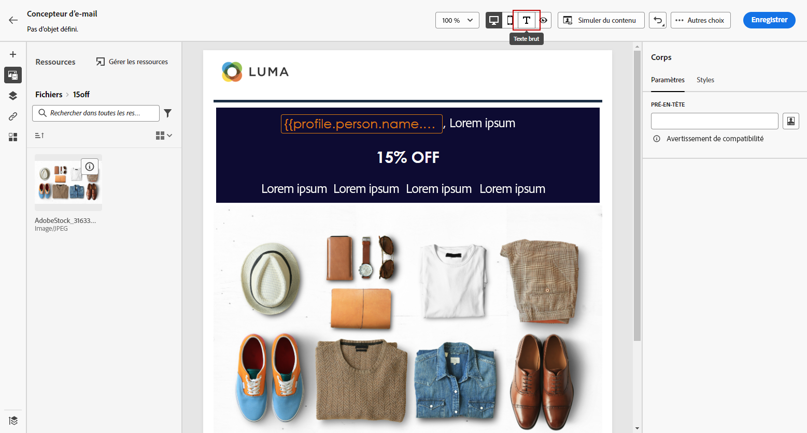

# Création de la version texte d&#39;un email {#text-version-email}

Il est recommandé de créer une version texte du corps de votre email, qui est utilisée lorsque le contenu HTML ne peut pas être affiché.

Par défaut, le concepteur d’e-mail crée une version en **[!UICONTROL texte brut]** de votre email, y compris des champs de personnalisation. Cette version est automatiquement générée et synchronisée avec la version HTML de votre contenu.

Si vous préférez utiliser un contenu différent pour la version en texte brut, procédez comme suit :

1. Dans votre e-mail, sélectionnez l’icône **[!UICONTROL Texte brut]**.

   

1. Utilisez le bouton bascule **[!UICONTROL Synchroniser avec le code HTML]** pour désactiver la synchronisation.

   

1. Cliquez sur la coche pour confirmer votre choix.

   

1. Vous pouvez ensuite modifier la version en texte brut comme vous le souhaitez.

>[!CAUTION]
>
>* Les modifications effectuées dans la vue **[!UICONTROL Texte brut]** ne sont pas reflétées dans la vue HTML.
>
>* Si vous réactivez l’option **[!UICONTROL Synchroniser avec le code HTML]** après la mise à jour de votre contenu en texte brut, vos modifications seront perdues et remplacées par du contenu texte généré à partir de la version HTML.
