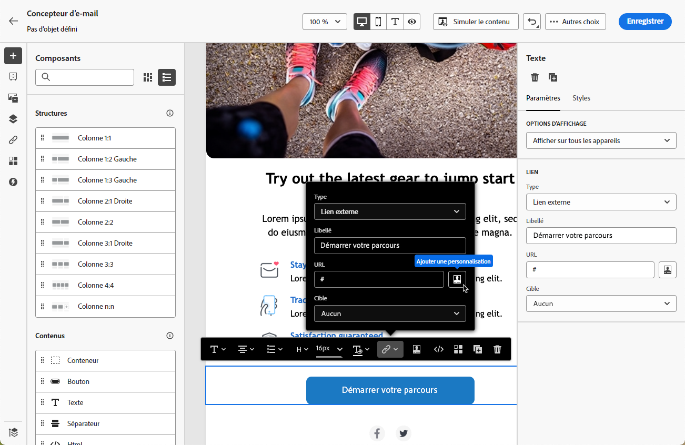
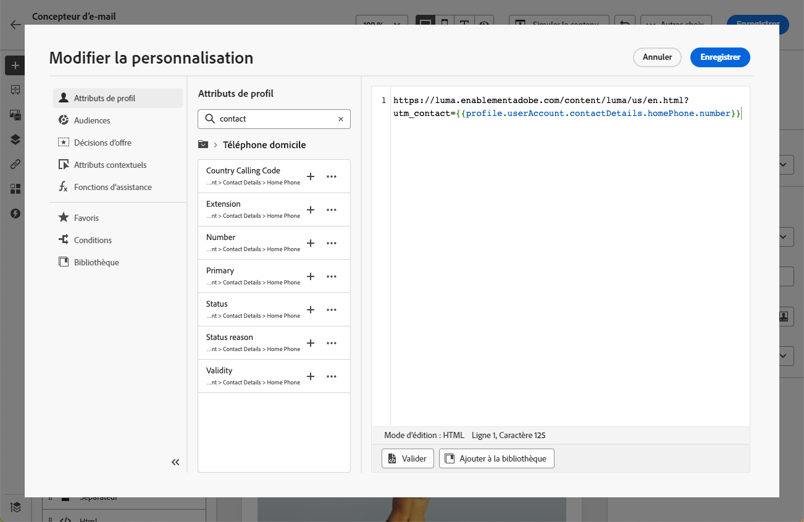

# Personnaliser les URL dans les e-mails {#url-personalization}

Les URL personnalisées vous permettent de diffuser des expériences contextuelles par le biais de vos e-mails [!DNL Journey Optimizer], comme la génération de liens spécifiques aux destinataires ou l’ajout de paramètres dynamiques.

Ils orientent les destinataires vers des pages spécifiques d’un site web ou vers un microsite personnalisé, en fonction des attributs du profil.

## Personnaliser une URL {#personalize-url}

Pour personnaliser une URL, procédez comme suit.

1. Dans le Designer Email, sélectionnez un élément dans le contenu et [insérez un lien](message-tracking.md#insert-links) à l&#39;aide de la barre d&#39;outils contextuelle.

   >[!IMPORTANT]
   >
   >Personalization n’est disponible que pour les **[!DNL Opt-Out]** **[!UICONTROL Lien externe]**, **[!UICONTROL Lien de désinscription]** et . Veillez à sélectionner un type de lien approprié.

1. Sélectionnez l’icône de personnalisation.

   

1. Utilisez l’éditeur de personnalisation pour ajouter les attributs de profil avec lesquels vous souhaitez personnaliser l’URL.

1. Enregistrez vos modifications.

Voici quelques exemples d’URL personnalisées :

* `https://www.adobe.com/users/{{profile.person.name.lastName}}`
* `https://www.adobe.com/users?uid={{profile.person.name.firstName}}`
* `https://www.adobe.com/usera?uid={{context.journey.technicalProperties.journeyUID}}`
* `https://www.adobe.com/users?uid={{profile.person.crmid}}&token={{context.token}}`

>[!NOTE]
>
>Lorsque vous modifiez une URL personnalisée dans l’éditeur de personnalisation, les fonctions d’assistance et l’appartenance aux audiences sont désactivées pour des raisons de sécurité.
>
>Les espaces ne sont pas pris en charge dans les jetons de personnalisation utilisés dans les URL.

Pour un rendu et un suivi fiables, suivez les [bonnes pratiques et mécanismes de sécurisation](#best-practices) ci-dessous.

## Personnaliser une URL complète/de base {#personalize-complete-base-url}

Journey Optimizer prend également en charge la personnalisation de l’URL **entière** ou du **domaine de base** d’une URL, par exemple :

```html
<a href="{{profile.social.link}}" />
<a href="{{profile.social.baseUrl}}/profile" />
<a href="https://{{profile.social.baseUrl}}/profile" />
```

>[!IMPORTANT]
>
>Pour activer la personnalisation complète ou de base de l’URL, contactez Adobe et fournissez votre liste de domaines acceptés. Cela est nécessaire pour éviter les redirections non sécurisées.

## Personnaliser les paramètres de tracking d’URL {#personalize-url-tracking-parameters}

Le [tracking des URL](url-tracking.md) est géré au niveau de la configuration des canaux et s&#39;applique à toutes les URL incluses dans le contenu de votre message. Vous pouvez également personnaliser les paramètres de tracking d’URL d’un lien individuel dans le Designer Email. Vous pouvez ainsi ajouter un paramètre spécifique au destinataire à un seul lien (par exemple, pour transmettre un identifiant à vos outils d’analyse web).

Pour ce faire, [insérez un lien](message-tracking.md#insert-links), sélectionnez l’icône de personnalisation, ajoutez le paramètre de tracking des URL et sélectionnez l’attribut de profil de votre choix dans l’[éditeur de personnalisation](../personalization/personalization-build-expressions.md).



Répétez les étapes ci-dessus pour chaque lien auquel vous souhaitez ajouter ce paramètre de tracking.

Désormais, lorsque l’e-mail est envoyé, ce paramètre est automatiquement ajouté à la fin de l’URL. Vous pouvez ensuite capturer ce paramètre dans les outils d’analyse web ou dans les rapports de performances.

>[!NOTE]
>
>Pour vérifier l’URL finale, vous pouvez [envoyer un BAT](../content-management/proofs.md) et cliquer sur le lien dans le contenu de l’e-mail une fois que vous avez reçu le BAT. L’URL doit afficher le paramètre de tracking. Par exemple : <https://luma.enablementadobe.com/content/luma/us/en.html?utm_contact=profile.userAccount.contactDetails.homePhone.number>

<!--
## Best practices and guardrails {#best-practices}

To keep links valid, clickable, and trackable, follow the best practices and guardrails below.

### Braces for dynamic URLs {#use-braces}

When inserting a URL that contains personalization, use three curly braces (`{{{ ... }}}`) for the dynamic portion of the URL. This prevents escaping from altering special characters (for example `/` and `+`) and helps avoid broken URLs, incorrect redirects, or tracking issues.

Here is an example:

```html
<a href="https://example.com/path/{{{profile.person.customSlug}}}?ref={{{context.system.source.id}}}">View details</a>
```

>[!IMPORTANT]
>
>Using raw output (`{{{ ... }}}`) means the value is inserted as-is. Only use it with values you trust and that are intended to be URL-safe (for example, values you generate or validate upstream).

### Correct URL tracking {#enable-url-tracking}

* When using personalization to generate the URL, ensure the resolved value starts with `http`/`https` for every recipient. Otherwise, tracking may not be applied and the link may not behave as expected.

* Do not use dynamic logic such as `let`, `each`, or `if` statements directly in the personalization editor's URL field. These are disabled for security reasons.

* If your scenario involves complex logic to generate personalized URLs, avoid placing that logic directly in the personalization editor's URL field. Instead:
    * Add the necessary logic and statements in the HTML content above or near the URL field.
    * Generate and store personalized attributes separately, then reference them in your email content.

### URL encoding and length {#encoding}

* URI syntax rules ([RFC 3986 standard](https://datatracker.ietf.org/doc/html/rfc3986){target="_blank"}) apply to all URLs in your email content. However, personalized URLs are more likely to surface encoding issues because recipient-specific values can introduce reserved characters (for example in query parameters). Therefore, ensure your dynamic values are URL-encoded (especially spaces, `&`, `#`, `%`, and `+`) and avoid using `+` for query values.

* Very long URLs can be truncated or rejected by browsers, mail clients, or downstream systems. For example, mirror page URLs can grow significantly when runtime personalization is heavy. Keep personalized payloads small and avoid embedding large objects into URLs.

### Recommended validation steps {#validation}

Before activating a journey or campaign, follow the recommendations below:

* Send a [proof](../content-management/proofs.md) and click links to confirm the resolved URL starts with `http`/`https` and keeps the expected structure.
* If tracking parameters are appended, confirm the final URL includes them (either via configuration-level URL tracking or per-link tracking parameters).
-->
