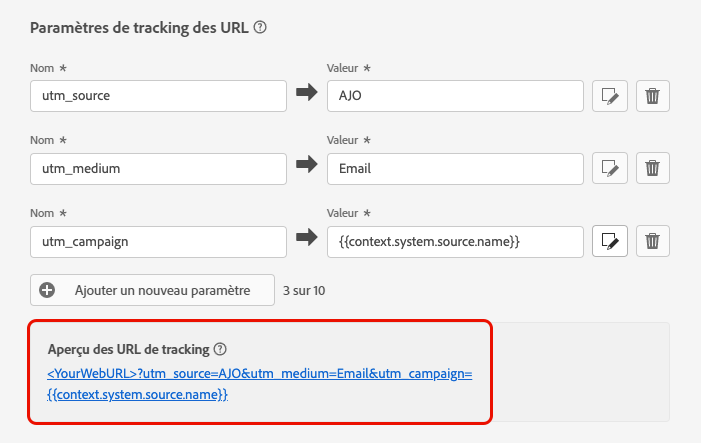

# Tracking d’URL {#url-tracking}

>[!CONTEXTUALHELP]
>id="ajo_admin_preset_utm"
>title="Définir les paramètres de tracking d’URL"
>abstract="Cette section décrit comment ajouter automatiquement des paramètres de tracking aux URL présentes dans votre contenu d’e-mail. Cette fonctionnalité est facultative."

>[!CONTEXTUALHELP]
>id="ajo_admin_preset_url_preview"
>title="Prévisualiser les paramètres de tracking d’URL"
>abstract="Prévisualisez comment les paramètres de tracking seront ajoutés aux adresses URL présentes dans votre contenu d’e-mail."

Lors de la configuration d’une nouvelle [configuration du canal e-mail](email-settings.md), vous pouvez définir des **[!UICONTROL paramètres de tracking d’URL]** pour mesurer l’efficacité de vos efforts marketing sur l’ensemble des canaux. L&#39;activation de cette fonctionnalité est facultative.

Les paramètres définis dans cette section seront ajoutés à la fin des URL incluses dans le contenu de votre e-mail. Vous pouvez ensuite capturer ces paramètres dans des outils d’analyse web tels qu’Adobe Analytics ou Google Analytics, et créer divers rapports de performances.

>[!NOTE]
>
>L’ordre des paramètres de tracking d’URL ajoutés à l’URL est aléatoire et ne peut pas être contrôlé. Si votre système nécessite des paramètres dans un ordre spécifique, vous devez les analyser et les réorganiser de votre côté.

Vous pouvez ajouter jusqu’à 10 paramètres de tracking à l’aide du bouton **[!UICONTROL Ajouter un nouveau paramètre]**.

{width="80%"}

Pour configurer un paramètre de tracking d’URL, vous pouvez saisir directement les valeurs souhaitées dans les champs **[!UICONTROL Nom]** et **[!UICONTROL Valeur]**.

Vous pouvez également modifier chaque champ **[!UICONTROL Valeur]** à l’aide de l’[Éditeur de personnalisation](../personalization/personalization-build-expressions.md). Cliquez sur l’icône d’édition pour ouvrir l’éditeur. De là, vous pouvez sélectionner les attributs contextuels de votre choix et/ou modifier directement le texte.

Les valeurs prédéfinies suivantes sont disponibles dans l’éditeur de personnalisation :

* **Identifiant de profil du message** : il s’agit d’un attribut orienté message qui identifie de manière unique chaque message envoyé à chaque profil ciblé dans une diffusion.

* **ID de l’offre** : ID de l’offre utilisée dans l’e-mail.

* **ID d’action source** : ID de l’action e-mail ajoutée au parcours ou à la campagne.

* **Nom de l’action source** : nom de l’action e-mail ajoutée au parcours ou à la campagne.

* **ID source** : ID du parcours ou de la campagne avec lequel l’e-mail a été envoyé.

* **Nom de la source** : nom du parcours ou de la campagne avec lequel l’e-mail a été envoyé.

* **ID de la version source** : ID du parcours ou de la version de campagne avec lequel l’e-mail a été envoyé.

>[!NOTE]
>
>Vous pouvez combiner la saisie de valeurs de texte et l’utilisation d’attributs contextuels à partir de l’éditeur de personnalisation. Chaque champ **[!UICONTROL Valeur]** peut contenir un certain nombre de caractères jusqu’à une limite de 5 Ko.

<!--You can drag and drop the parameters to reorder them.-->

Vous trouverez ci-dessous des exemples d’URL compatibles avec Adobe Analytics et Google Analytics.

* URL compatible avec Adobe Analytics : `www.YourLandingURL.com?cid=email_AJO_{{context.system.source.id}}_image_{{context.system.source.name}}`

* URL compatible avec Google Analytics : `www.YourLandingURL.com?utm_medium=email&utm_source=AJO&utm_campaign={{context.system.source.id}}&utm_content=image`

Vous pouvez prévisualiser de manière dynamique l’URL de tracking obtenue. Chaque fois que vous ajoutez, modifiez ou supprimez un paramètre, la prévisualisation est automatiquement mise à jour.

>[!NOTE]
>
>Vous pouvez également ajouter des paramètres de tracking personnalisés et dynamiques aux liens présents dans le contenu de votre e-mail. [En savoir plus](surface-personalization.md#personalize-url-tracking)
