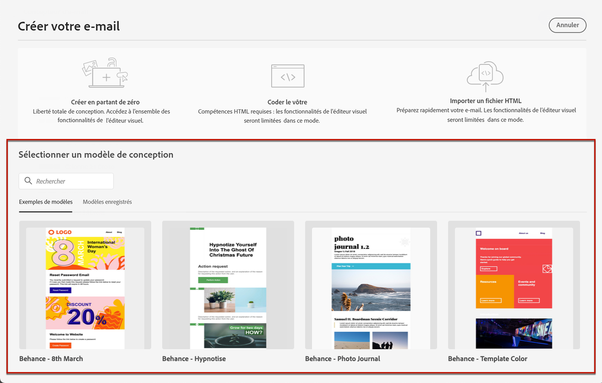
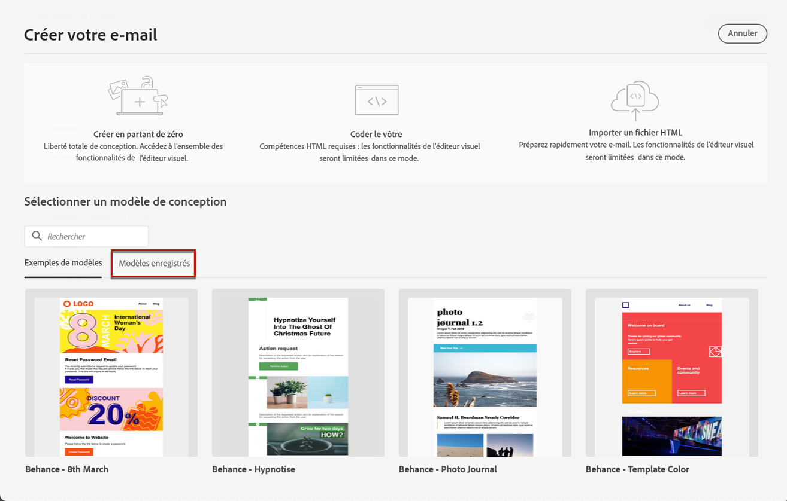
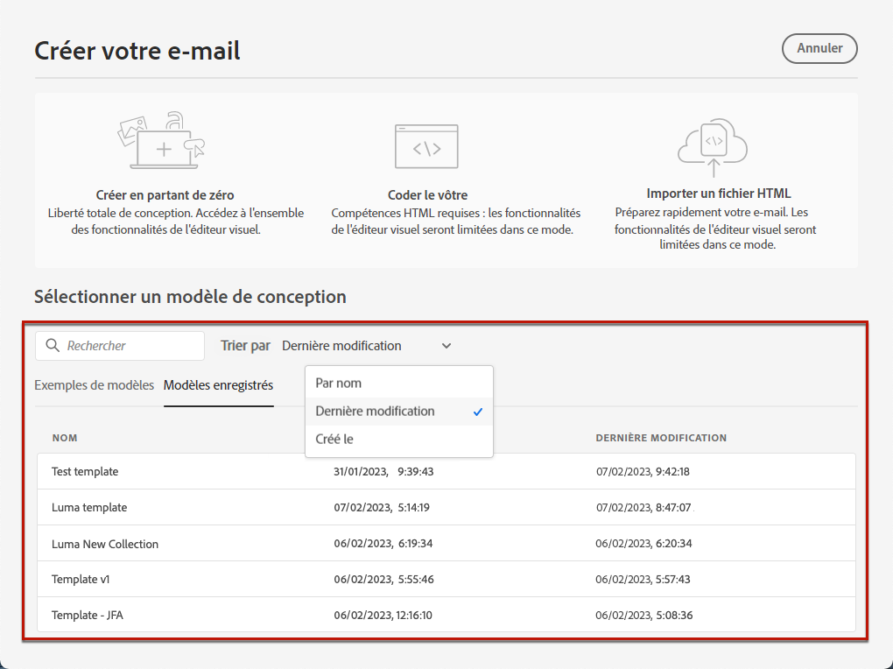
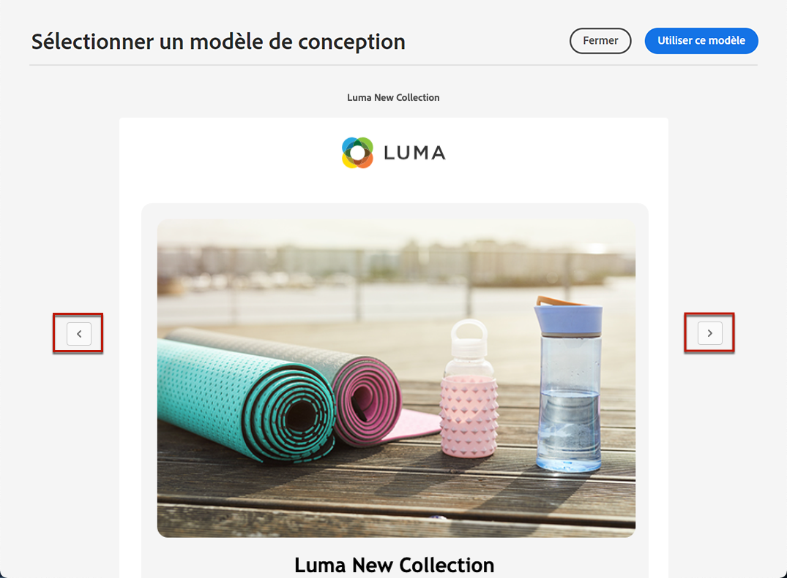

# Utiliser des modèles d’e-mail {#email-templates}

>[!CONTEXTUALHELP]
>id="ajo_use_template"
>title="Créer du contenu à partir d’un modèle"
>abstract="Pour commencer à créer le contenu de votre e-mail, sélectionnez un modèle prêt à l’emploi ou un modèle existant personnalisé (créé à partir de zéro ou enregistré comme modèle à partir d’un précédent e-mail)."

Depuis l’écran **[!UICONTROL Créer votre e-mail]**, utilisez la section **[!UICONTROL Sélectionner un modèle de conception]** pour commencer à créer votre contenu à partir d’un modèle.

Vous pouvez choisir parmi les options suivantes :

* **Exemples de modèles**. L’interface [!DNL Journey Optimizer] propose 20 modèles d’e-mail prêts à l’emploi que vous pouvez choisir.

* **Modèles enregistrés**. Vous pouvez également utiliser un modèle personnalisé que :

   * vous avez créé à l’aide du menu **[!UICONTROL Modèles de contenu]** ; [En savoir plus](../content-management/content-templates.md#content-templates).

   * vous avez enregistré dans un email dans un parcours ou une campagne à l’aide de l’option **[!UICONTROL Enregistrer en tant que modèle de contenu]**. [En savoir plus](../content-management/content-templates.md#video-templates).

Pour commencer à créer votre contenu avec l’un des exemples ou des modèles enregistrés, procédez comme suit.

1. [Accédez au concepteur d’e-mail](get-started-email-design.md) dans l’écran **[!UICONTROL Modifier le contenu]** de l’e-mail.

1. Sur l’écran **[!UICONTROL Créer votre e-mail]**, l’onglet **[!UICONTROL Exemples de modèles]** est sélectionné par défaut.

1. Pour utiliser un modèle personnalisé, accédez à l‘onglet **[!UICONTROL Modèles enregistrés]**.

   

1. La liste de tous les [modèles de contenu](../content-management/content-templates.md#content-templates) créée sur le sandbox actuel s’affiche. Vous pouvez les trier : **[!UICONTROL Par nom]**, **[!UICONTROL Dernière modification]** et **[!UICONTROL Dernière création]**.

   

1. Sélectionnez le modèle de votre choix dans la liste.

1. Une fois sélectionné, vous pouvez naviguer entre tous les modèles d’une catégorie (exemple ou modèle enregistré selon votre sélection) à l’aide des flèches droite et gauche.

   

1. Cliquez sur **[!UICONTROL Utiliser ce modèle]** en haut à droite de l’écran.

1. Modifiez le contenu selon vos besoins à l’aide du concepteur d’e-mail.
