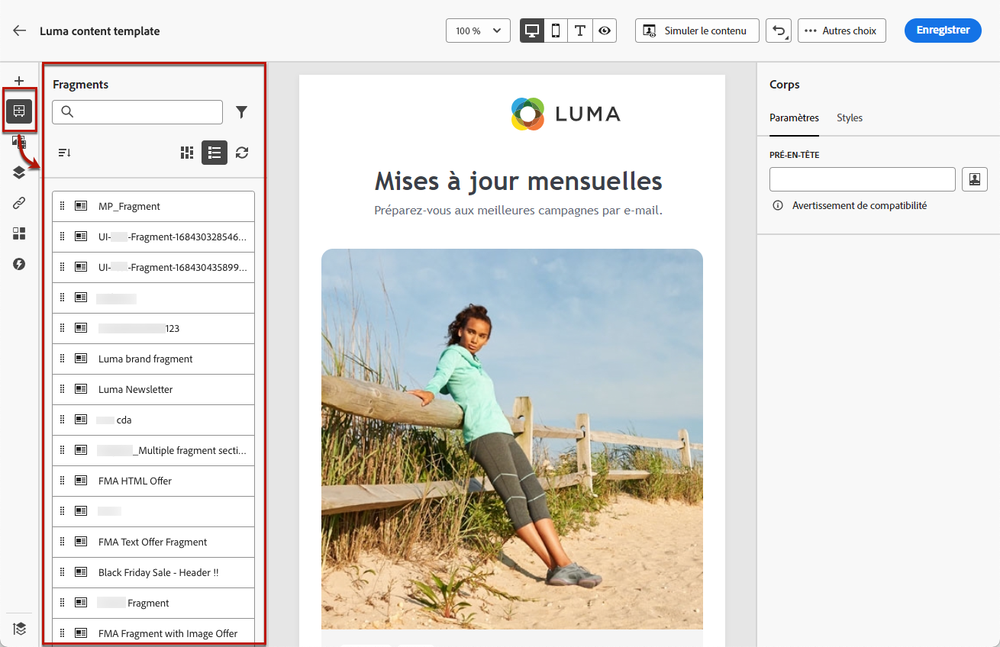
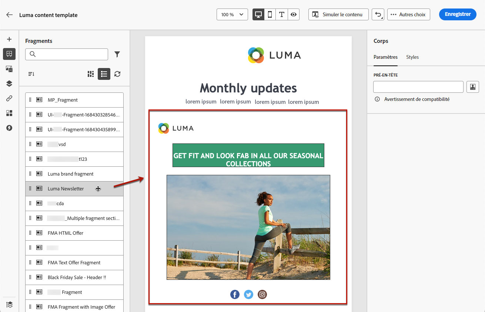
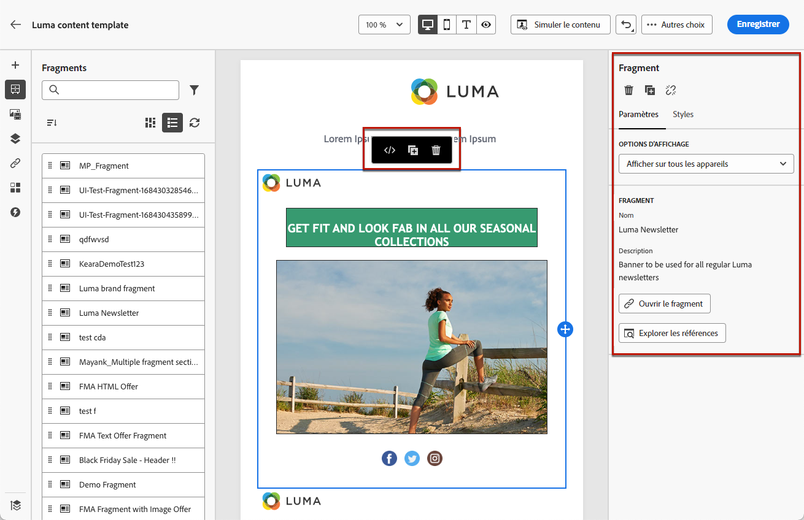
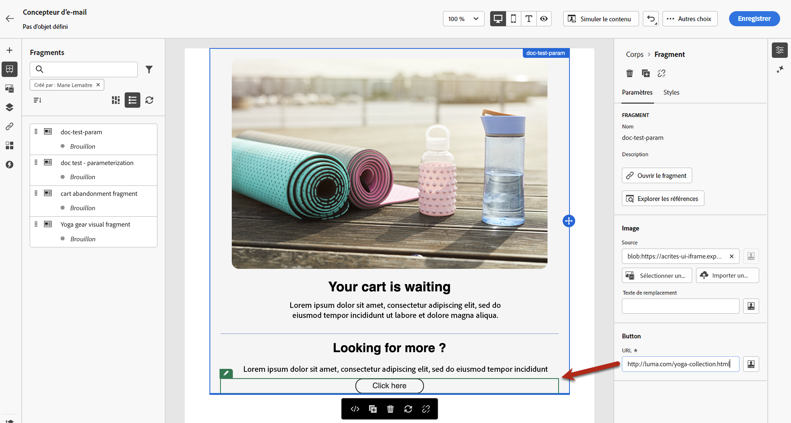
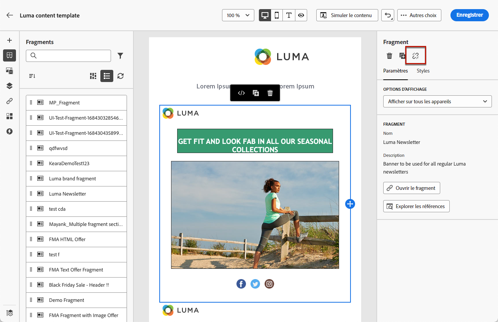

# Ajouter des fragments visuels à vos e-mails {#use-visual-fragments}

Un fragment est un composant réutilisable pouvant être référencé dans un ou plusieurs e-mails dans des campagnes, des parcours ou des modèles de contenu de Journey Optimizer. Cette fonctionnalité permet de préconstruire plusieurs blocs de contenu personnalisés qui peuvent être utilisés par les utilisateurs et utilisatrices marketing pour assembler rapidement les contenus d’e-mail dans un processus de conception amélioré. [Découvrez comment créer et gérer des fragments](../content-management/fragments.md).

➡️ [Découvrez comment gérer, créer et utiliser des fragments dans cette vidéo.](../content-management/fragments.md#video-fragments)

## Utiliser un fragment {#use-fragment}

Pour utiliser un fragment dans un email, procédez comme suit :

>[!NOTE]
>
>Vous pouvez ajouter jusqu’à 30 fragments pour une diffusion donnée. Les fragments ne peuvent être imbriqués que jusqu’à un seul niveau.

1. Ouvrez le contenu d’un e-mail ou d’un modèle à l’aide du [concepteur d’e-mail](get-started-email-design.md).

1. Sélectionnez l’icône **[!UICONTROL Fragments]** dans le rail de gauche.

   

1. La liste de tous les fragments visuels créés dans le sandbox actuel s’affiche. Les fragments sont triés par date de création : les fragments visuels récemment ajoutés sont affichés en premier dans la liste. Vous pouvez :

   * Rechercher un fragment spécifique en commençant à saisir son libellé.
   * Trier les fragments par ordre croissant ou décroissant.
   * Modifier l’affichage des fragments (vue Cartes ou Liste).
   * Actualiser la liste.

   >[!NOTE]
   >
   >Si certains fragments sont modifiés ou ajoutés pendant que vous modifiez votre contenu, la liste se met à jour en tenant compte des dernières modifications.

1. Faites glisser un fragment de la liste et déposez-le dans la zone où vous souhaitez l’insérer.

   

   >[!CAUTION]
   >
   >Vous pouvez ajouter n’importe quel fragment ayant un statut **Brouillon** ou **Actif** à votre contenu. Cependant, vous ne pouvez pas activer votre parcours ou votre campagne si un fragment ayant le statut de brouillon est utilisé dans ce parcours ou cette campagne. Lors de la publication du parcours ou de la campagne, les fragments de brouillon affichent une erreur et vous devez les approuver pour pouvoir les publier.

1. Comme tout autre composant, vous pouvez déplacer le fragment dans votre contenu.

1. Sélectionnez le fragment pour afficher le volet correspondant à droite. De là, vous pouvez supprimer le fragment de votre contenu ou le dupliquer. Vous pouvez également effectuer ces actions directement à partir du menu contextuel qui s’affiche au-dessus du fragment.

   

1. À partir de l’onglet **[!UICONTROL Paramètres]**, vous pouvez :

   * Sélectionner les appareils sur lesquels afficher le fragment.
   * Ouvrir le fragment dans un nouvel onglet pour le modifier, si nécessaire. [En savoir plus](../content-management/fragments.md#fragments).
   * Explorer les références. [En savoir plus](../content-management/fragments.md#visual-expression).

1. Vous pouvez personnaliser davantage votre fragment à l’aide de l’onglet **[!UICONTROL Styles]**.

1. Si nécessaire, vous pouvez rompre l’héritage avec le fragment d’origine. [En savoir plus](#break-inheritance).

1. Ajoutez autant de fragments que vous le souhaitez. Vous pouvez ensuite **[!UICONTROL enregistrer]** vos modifications.

### Limites liées à l’utilisation de contenu dynamique dans les fragments {#fragment-dynamic-content}

>[!CAUTION]
>
>Lorsque vous utilisez des fragments qui contiennent du contenu dynamique (contenu conditionnel), tenez compte des restrictions suivantes :
>
>**L’imbrication de fragments avec du contenu dynamique n’est pas prise en charge.** Vous ne pouvez pas placer un fragment contenant du contenu dynamique dans un fragment déverrouillé qui contient également du contenu dynamique. Cette configuration non prise en charge peut provoquer les problèmes suivants :
>
>* Perte des mappages de contenu conditionnel
>* Avertissements relatifs au mode de compatibilité dans le Designer de messagerie
>* Rendu des emails incohérent
>
>**Approche recommandée :** lors de l’utilisation de plusieurs fragments avec du contenu dynamique dans votre e-mail, ajoutez chaque fragment directement dans son propre bloc de structure au niveau de l’e-mail. Cela permet de garantir un fonctionnement correct et d’éviter les problèmes mentionnés ci-dessus.

## Bonnes pratiques relatives aux fragments avec du contenu dynamique {#fragment-best-practices}

Suivez ces bonnes pratiques lorsque vous utilisez des fragments visuels et du contenu dynamique (contenu conditionnel) :

* **Structurer correctement l’e-mail** : lors de la création d’e-mails avec des fragments contenant du contenu dynamique, ajoutez chaque fragment dans un bloc de structure dédié au niveau de l’e-mail. Évitez d’imbriquer des fragments avec du contenu dynamique dans d’autres fragments déverrouillés contenant également du contenu dynamique.

* **Planifier** : avant d’ajouter des fragments à votre e-mail, identifiez ceux qui contiennent du contenu dynamique et planifiez votre disposition en conséquence. Cela permet d’éviter les problèmes de configuration et d’assurer une structure propre dès le départ.

* **Concevez soigneusement les fragments réutilisables** : lorsque vous créez des fragments qui incluront du contenu dynamique, réfléchissez à la manière dont ils seront utilisés. Si un fragment doit être imbriqué dans d’autres fragments, évitez d’ajouter du contenu dynamique aux fragments parents et enfants.

* **Dépannage** : si vous constatez une perte des mappages de contenu conditionnel ou des avertissements de mode de compatibilité :
   * Vérifiez la structure de votre e-mail pour les fragments imbriqués contenant du contenu dynamique
   * Restructurez en déplaçant chaque fragment avec du contenu dynamique dans son propre bloc de structure au niveau de l’e-mail
   * Enregistrez et vérifiez que les mappages de contenu conditionnel sont correctement restaurés

## Utiliser des variables implicites {#implicit-variables-in-fragments}

Les variables implicites améliorent la fonctionnalité de fragment existante afin d’optimiser l’efficacité pour la réutilisation du contenu et les cas d’utilisation de script. Les fragments peuvent utiliser des variables d’entrée et créer des variables de sortie utilisables dans le contenu des campagnes et des parcours.

Découvrez comment utiliser les variables implicites dans [cette section](../personalization/use-expression-fragments.md#implicit-variables).

## Personnaliser des champs modifiables {#customize-fields}

Si certaines parties du fragment sélectionné ont été rendues modifiables, vous pouvez remplacer leur valeur par défaut après avoir ajouté le fragment dans votre contenu. [Découvrir comment rendre personnalisables vos fragments](../content-management/customizable-fragments.md)

Pour personnaliser les champs modifiables dans un fragment, procédez comme suit :

1. Ajoutez le fragment à votre contenu.

1. Sélectionnez-le pour ouvrir le volet Propriétés sur le côté droit.

   Tous les champs modifiables du fragment sont affichés dans l’onglet **Paramètres** sous la section **Fragment**.

1. Lorsque vous sélectionnez un champ modifiable dans le volet de droite, il est mis en surbrillance en vert dans le volet de prévisualisation central, ce qui facilite l’identification de son emplacement dans votre contenu.

   Dans l’exemple ci-dessous, l’image **source** et le **texte alternatif** peuvent être modifiés, ainsi que l’**URL** du bouton « Cliquez ici ».

   

## Rompre l’héritage {#break-inheritance}

Lorsque vous modifiez un fragment visuel, les modifications sont synchronisées. Elles sont automatiquement propagées à tous les parcours/campagnes et modèles de contenu, brouillons ou actifs, qui contiennent ce fragment.

Lorsqu’ils sont ajoutés à un e-mail ou à un modèle de contenu, les fragments sont synchronisés par défaut. Vous pouvez toutefois rompre l’héritage du fragment d’origine. Dans ce cas, le contenu du fragment est copié dans la conception actuelle et les modifications ne sont plus synchronisées.

Pour rompre l’héritage, procédez comme suit :

1. Sélectionnez le fragment.

1. Cliquez sur l’icône Déverrouiller dans la barre d’outils contextuelle.

   

1. Ce fragment devient alors un élément autonome qui n’est plus lié au fragment d’origine. Modifiez-le comme tout autre composant de votre contenu. [En savoir plus](content-components.md).
