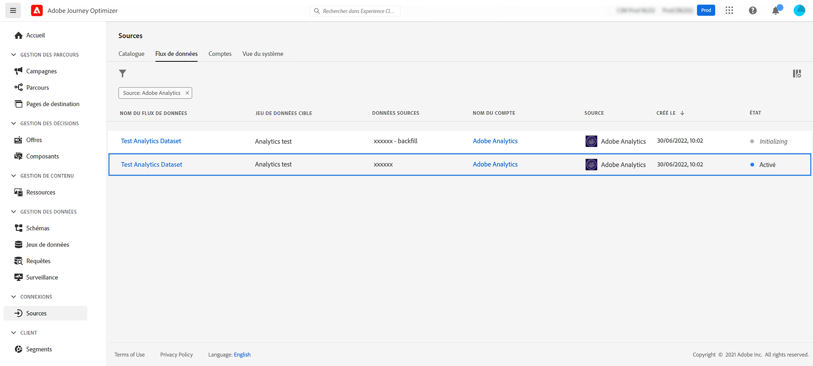

# Exploitation des données Adobe Analytics{#analytics-data}

Vous pouvez exploiter toutes les données d’événement comportemental Adobe Analytics que vous capturez déjà et diffusez en continu dans Adobe Experience Platform afin de déclencher des parcours et d’automatiser les expériences de vos clients.

>[!NOTE]
>
>Cette section s&#39;applique uniquement aux événements basés sur des règles et aux clients qui doivent utiliser des données Adobe Analytics.

Pour que cela fonctionne, vous devez activer, dans Adobe Experience Platform, la suite de rapports que vous souhaitez utiliser. Pour ce faire, procédez comme suit :

1. Connectez-vous à Adobe Experience Platform et accédez à **[!UICONTROL Sources]**.
1. Dans la section Adobe Analytics , sélectionnez **[!UICONTROL Ajouter des données]**: la liste des suites de rapports Adobe Analytics disponibles s’affiche.

1. Sélectionnez la suite de rapports à activer, puis cliquez sur **[!UICONTROL Suivant]** et **[!UICONTROL Terminer]**.

1. Partagez l’ID de données source avec votre point de contact de programme en version bêta.

Cela active le connecteur source Analytics pour cette suite de rapports. Chaque fois que des données entrent, elles sont transformées en événement d’expérience et envoyées dans Adobe Experience Platform.

Pour en savoir plus sur le connecteur source Adobe Analytics, consultez la [documentation](https://experienceleague.adobe.com/docs/experience-platform/sources/connectors/adobe-applications/analytics.html?lang=fr){target=&quot;_blank&quot;} et le [tutoriel Adobe Experience Platform](https://experienceleague.adobe.com/docs/experience-platform/sources/ui-tutorials/create/adobe-applications/analytics.html?lang=fr){target=&quot;_blank&quot;}.
