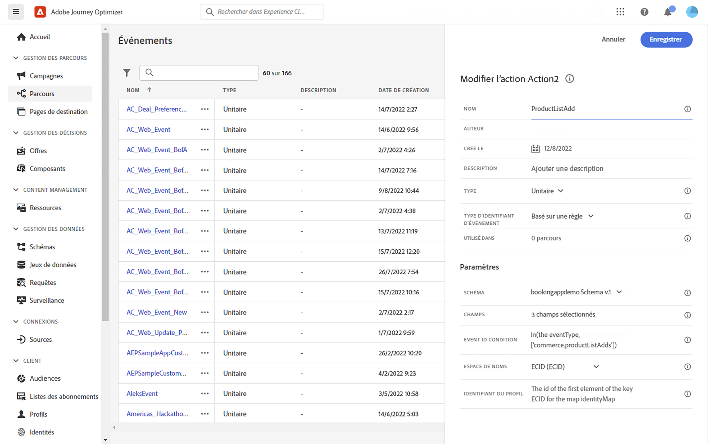
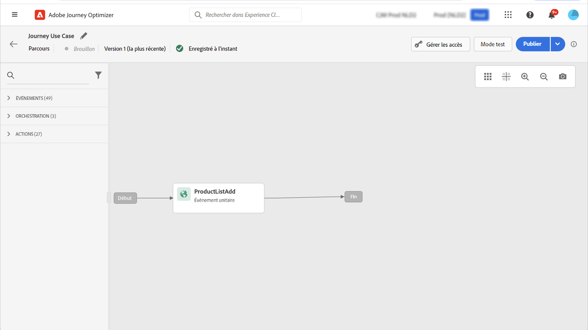
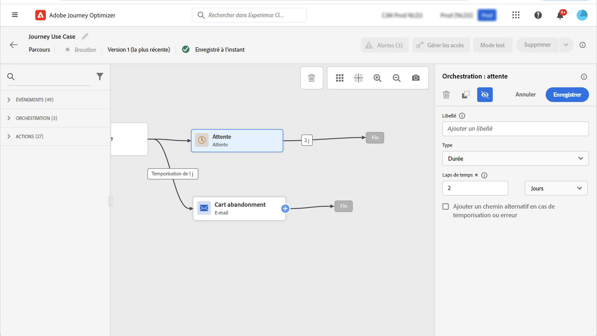
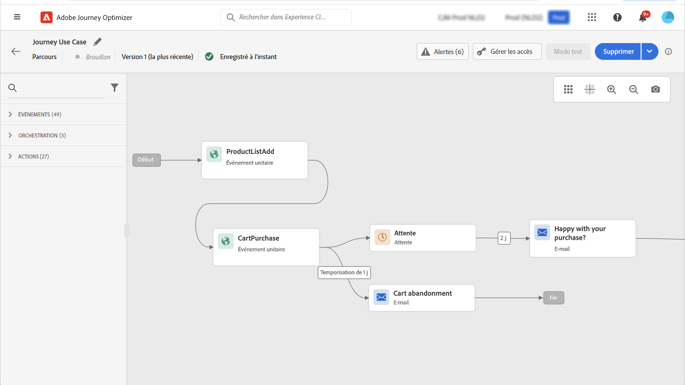

# Utiliser des données Adobe Analytics {#analytics-data}

Vous pouvez utiliser toutes les données d’événement comportementaux web que vous capturez déjà via Adobe Analytics ou le SDK web et que vous diffusez en continu dans Adobe Experience Platform, afin de déclencher des parcours et d’automatiser les expériences de votre clientèle.

Pour que cela fonctionne avec Adobe Analytics, vous devez :

1. activer la suite de rapports à utiliser ; [En savoir plus](#leverage-analytics-data).
1. activer Journey Optimizer pour utiliser votre source de données Adobe Analytics ; [En savoir plus](#activate-analytics-data).
1. ajouter un événement spécifique à votre parcours. [En savoir plus](#event-analytic).

>[!NOTE]
>
>Cette section s’applique uniquement aux événements basés sur des règles et aux clientes et clients qui doivent utiliser des données d’Adobe Analytics ou du SDK web.
> 
>Si vous utilisez Adobe Customer Journey Analytics, reportez-vous à [cette page](../reports/cja-ajo.md).
>

## Configurer les données d’Adobe Analytics ou du SDK web {#leverage-analytics-data}

Les données provenant d’Adobe Analytics ou du SDK web d’Adobe Experience Platform doivent être activées pour être utilisées dans vos parcours.

Pour ce faire, procédez comme suit :

1. Accédez au menu **[!UICONTROL Sources]**.

1. Dans la section Adobe Analytics, sélectionnez **[!UICONTROL Ajouter des données]**.

   

1. Dans la liste des suites de rapports Adobe Analytics disponibles, sélectionnez **[!UICONTROL Suite de rapports]** pour l’activer. Cliquez ensuite sur **[!UICONTROL Suivant]**.

   

1. Choisissez si vous souhaitez utiliser un schéma par défaut ou personnalisé.

1. Dans l’écran **[!UICONTROL Détails du flux de données]**, choisissez un **[!UICONTROL nom de flux de données]**.

1. Une fois la configuration terminée, cliquez sur **[!UICONTROL Terminer]**.

   

Cela active le connecteur source Analytics pour cette suite de rapports. Chaque fois que des données entrent, elles sont transformées en événement d’expérience et envoyées dans Adobe Experience Platform.

Pour en savoir plus sur le connecteur source Adobe Analytics, consultez la [documentation](https://experienceleague.adobe.com/docs/experience-platform/sources/connectors/adobe-applications/analytics.html?lang=fr){target="_blank"} et le [tutoriel Adobe Experience Platform](https://experienceleague.adobe.com/docs/experience-platform/sources/ui-tutorials/create/adobe-applications/analytics.html?lang=fr){target="_blank"}.

## Activer cette configuration {#activate-analytics-data}

Une fois cette configuration terminée, contactez Adobe pour permettre à votre environnement Journey Optimizer d’utiliser cette source de données. Cette étape n’est nécessaire que pour les sources de données d’Adobe Analytics. Pour ce faire, procédez comme suit :

1. Obtenez l’identifiant de la source de données. Cette information est disponible dans l’interface utilisateur : accédez à la source de données que vous avez créée à partir de l’onglet **Flux de données** du menu **Sources**. Le moyen le plus simple de l trouver est de filtrer selon les sources Adobe Analytics.
1. Contactez l’assistance clientèle d’Adobe avec les détails suivants :

   * Objet : Activer des événements Adobe Analytics pour les parcours

   * Contenu : Merci d’activer mon environnement pour utiliser les événements AA.

      * ID d’organisation : « XXX@AdobeOrg »

      * ID de la source de données : « ID : xxxxx »

1. Une fois que vous avez reçu la confirmation que votre environnement est prêt, vous pouvez utiliser les données d’Adobe Analytics dans vos parcours.

## Créer un parcours avec un événement utilisant des données d’Adobe Analytics ou du SDK Web {#event-analytics}

Vous pouvez désormais créer un événement basé sur les données du SDK web d’Adobe Experience Platform ou d’Adobe Analytics à utiliser dans un parcours.

Dans l’exemple ci-dessous, découvrez comment cibler les utilisateurs et utilisatrices qui ont ajouté un produit à leurs paniers :

* Si la commande est terminée, les utilisateurs et utilisatrices recevront un e-mail de suivi deux jours plus tard les invitant à fournir des commentaires.
* Si la commande n’est pas terminée, les utilisateurs et utilisatrices recevront un e-mail leur rappelant de terminer leur commande.

1. À partir d’Adobe Journey Optimizer, accédez au menu **[!UICONTROL Configuration]**.

1. Sélectionnez ensuite **[!UICONTROL Gérer]** dans la carte **[!UICONTROL Événements]**.

   

1. Cliquez sur **[!UICONTROL Créer un événement]**. Le volet de configuration d’événement s’ouvre dans la partie droite de l’écran.

1. Renseignez les paramètres de l’**[!UICONTROL événement]** :

   * **[!UICONTROL Nom]** : personnalisez le nom de votre **[!UICONTROL événement]**.
   * **[!UICONTROL Type]** : choisissez le type **[!UICONTROL Unitaire]**. [En savoir plus](../event/about-events.md).
   * **[!UICONTROL Type d’identifiant d’événement]** : choisissez le type d’identifiant d’événement **[!UICONTROL basé sur une règle]**. [En savoir plus](../event/about-events.md#event-id-type).
   * **[!UICONTROL Schéma]** : sélectionnez le schéma Analytics ou WebSDK [créé auparavant](#leverage-analytics-data).
   * **[!UICONTROL Champs]** : sélectionnez les champs Payload. [En savoir plus](../event/about-creating.md#define-the-payload-fields).
   * **[!UICONTROL Condition d’identifiant d’événement]** : définissez la condition pour identifier les événements qui déclencheront votre parcours.

     Ici, l’événement est déclenché lorsque les clientes et clients ajoutent un élément à leur panier.
   * **[!UICONTROL Identifiant du profil]** : effectuez votre choix parmi vos champs de payload ou définissez une formule pour identifier la personne associée à l’événement.

   

1. Lorsque vous avez terminé, sélectionnez **[!UICONTROL Enregistrer]**.

Maintenant que l’événement est prêt, créez un parcours pour l’utiliser.

1. Dans le menu **[!UICONTROL Parcours]**, ouvrez ou créez un parcours. Voir à ce propos [cette section](../building-journeys/journey-gs.md).

1. Ajoutez à votre parcours les événements Analytics configurés précédemment.

   

1. Ajoutez un événement qui sera déclenché si une commande est terminée.

1. À partir du **[!UICONTROL menu Événement]**, sélectionnez les options **[!UICONTROL Définir le délai d’expiration de l’événement]** et **[!UICONTROL Définir un chemin d’accès au délai d’expiration]**.

   

1. À partir du chemin d’accès au délai d’expiration, ajoutez une action **[!UICONTROL E-mail]**. Ce chemin sera utilisé pour envoyer un e-mail aux client(e)s qui n’ont pas passé de commande afin de leur rappeler que leurs paniers sont toujours disponibles.

1. Ajoutez une activité **[!UICONTROL En attente]** après votre chemin principal et définissez-la sur la durée nécessaire.

   

1. Ajoutez ensuite une **[!UICONTROL action E-mail]**. Dans cet e-mail, les client(e)s seront invité(e)s à envoyer leurs commentaires sur la commande passée.

Vous pouvez maintenant publier votre parcours. [En savoir plus](../building-journeys/publish-journey.md).

