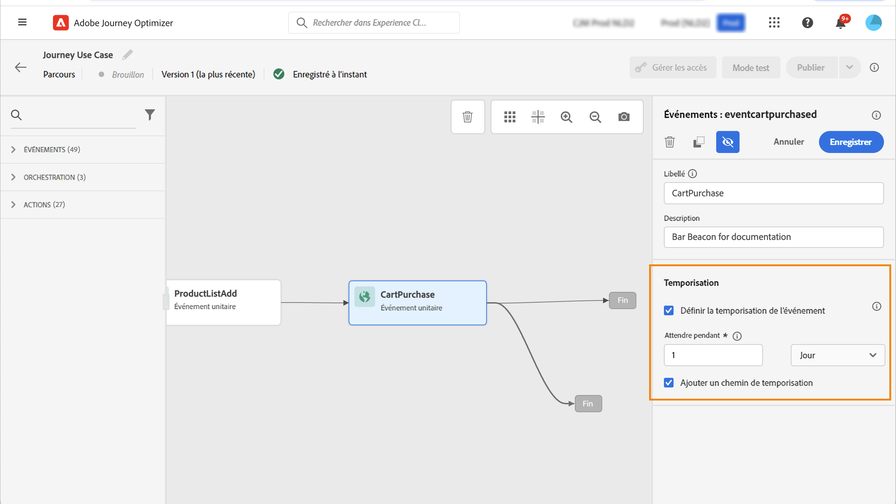

# Intégration d’Adobe Analytics {#analytics-data}

## Exploitation des données Adobe Analytics ou du SDK Web {#leverage-analytics-data}

Vous pouvez exploiter toutes les données d’événement comportemental web (via Adobe Analytics ou le SDK web) que vous capturez déjà et diffusez en continu dans Adobe Experience Platform afin de déclencher des parcours et d’automatiser les expériences de vos clients.

>[!NOTE]
>
>Cette section s’applique uniquement aux événements basés sur des règles et aux clients qui doivent utiliser des données Adobe Analytics ou WebSDK.

Pour que cela fonctionne avec Adobe Analytics, vous devez activer, dans Adobe Experience Platform, la suite de rapports que vous souhaitez utiliser. Pour ce faire, procédez comme suit :

1. Connectez-vous à Adobe Experience Platform et accédez à **[!UICONTROL Sources]**.

1. Dans la section Adobe Analytics , sélectionnez **[!UICONTROL Ajouter des données]**

   

1. Dans la liste des suites de rapports Adobe Analytics disponibles, sélectionnez la variable **[!UICONTROL Suite de rapports]** pour l’activer. Cliquez ensuite sur **[!UICONTROL Suivant]**.

   

1. Choisissez si vous souhaitez utiliser un schéma par défaut ou personnalisé.

1. Dans la **[!UICONTROL Détails du flux de données]** , choisissez une **[!UICONTROL Nom du flux de données]**.

1. Une fois la configuration terminée, cliquez sur **[!UICONTROL Terminer]**.

   

Cela active le connecteur source Analytics pour cette suite de rapports. Chaque fois que des données entrent, elles sont transformées en événement d’expérience et envoyées dans Adobe Experience Platform.

Pour en savoir plus sur le connecteur source Adobe Analytics, consultez la [documentation](https://experienceleague.adobe.com/docs/experience-platform/sources/connectors/adobe-applications/analytics.html?lang=fr){target=&quot;_blank&quot;} et le [tutoriel Adobe Experience Platform](https://experienceleague.adobe.com/docs/experience-platform/sources/ui-tutorials/create/adobe-applications/analytics.html?lang=fr){target=&quot;_blank&quot;}.

## Création d’un parcours avec un événement à l’aide des données Adobe Analytics ou du SDK Web {#event-analytics}

Après avoir mis en oeuvre votre intégration avec Adobe Analytics avec la variable [Sources Adobe Analytics](#leverage-analytics-data) ou avec la fonction [SDK Web Adobe Experience Platform](https://experienceleague.adobe.com/docs/experience-platform/edge/home.html?lang=fr), vous pouvez créer un événement qui pourra être utilisé ultérieurement dans un parcours.

Dans cet exemple, nous allons cibler les utilisateurs qui ont ajouté un produit à leur panier :

* Si la commande est terminée, ils recevront un courrier électronique de relance deux jours plus tard pour demander des commentaires.
* Si la commande n’est pas terminée, ils recevront un e-mail leur rappelant de terminer la commande.

1. À partir de Adobe Journey Optimizer, accédez au **[!UICONTROL Configuration]** .

1. Sélectionnez ensuite **[!UICONTROL Gérer]** de la **[!UICONTROL Événements]** carte.

   

1. Cliquez sur **[!UICONTROL Créer un événement]**. Le volet de configuration d&#39;événement s&#39;ouvre dans la partie droite de l&#39;écran.

1. Renseignez les **[!UICONTROL Événement]** parameters:

   * **[!UICONTROL Nom]**: Personnalisez le nom de votre **[!UICONTROL Événement]**.
   * **[!UICONTROL Type]**: Choisissez la **[!UICONTROL Unitaire]** Saisissez . [En savoir plus](../event/about-events.md)
   * **[!UICONTROL Type d’identifiant d’événement]**: Choisissez la **[!UICONTROL Règle basée]** Type d’identifiant d’événement. [En savoir plus](../event/about-events.md#event-id-type)
   * **[!UICONTROL Schéma]**: Sélectionnez le schéma Analytics ou WebSDK créé dans la section ci-dessus.
   * **[!UICONTROL Champs]**: Sélectionnez les champs Payload . [En savoir plus](../event/about-creating.md#define-the-payload-fields)
   * **[!UICONTROL Condition d’identifiant d’événement]**: Définissez la condition qui sera utilisée par le système pour identifier les événements qui déclencheront votre parcours.

      Ici, l’événement est déclenché lorsque les clients ajoutent un élément à leur panier.
   * **[!UICONTROL Identifiant de profil]**: Sélectionnez un champ dans vos champs de payload ou définissez une formule pour identifier la personne associée à l’événement.

   

1. Lorsque cette option est configurée, sélectionnez **[!UICONTROL Enregistrer]**. Votre événement est maintenant prêt à être utilisé dans un parcours.

1. Dans la **[!UICONTROL Parcours]**, vous pouvez maintenant commencer à créer votre parcours. Voir à ce propos [cette section](../building-journeys/journey-gs.md).

1. Ajoutez les événements Analytics configurés précédemment à votre parcours.

   

1. Ajoutez un événement qui sera déclenché si une commande est terminée.

1. À partir de **[!UICONTROL Menu Événement]**, sélectionnez la variable **[!UICONTROL Définition du délai d’expiration de l’événement]** et **[!UICONTROL Définition d’un chemin d’accès au délai d’expiration]** options.

   

1. À partir du chemin d’accès au délai d’expiration, ajoutez une **[!UICONTROL Email]** action. Ce chemin sera utilisé pour envoyer un email aux clients qui n&#39;ont pas passé de commande afin de leur rappeler que leurs paniers sont toujours disponibles.

1. Ajouter un **[!UICONTROL Attente]** activité après votre chemin principal et définissez-le sur la durée nécessaire.

   

1. Ajoutez ensuite une **[!UICONTROL Action Courrier électronique]**. Dans cet email, les clients seront invités à donner leurs commentaires sur la commande passée.

Vous pouvez maintenant publier votre parcours après avoir testé sa validité. [En savoir plus](../building-journeys/publishing-the-journey.md)

