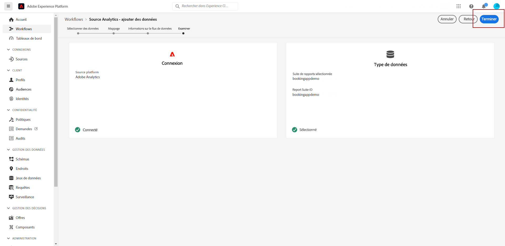

# Intégration d’Adobe Analytics {#analytics-data}

## Exploiter les données d’Adobe Analytics ou du SDK Web {#leverage-analytics-data}

Vous pouvez exploiter toutes les données Web comportementales d’événement (à partir d’Adobe Analytics ou du SDK Web) que vous capturez et diffusez déjà en continu dans Adobe Experience Platform afin de déclencher des parcours et d’automatiser les expériences de vos client(e)s.

>[!NOTE]
>
>Cette section s’applique uniquement aux événements basés sur des règles et aux client(e)s qui doivent utiliser des données d’Adobe Analytics ou du SDK Web.

Pour que cela fonctionne avec Adobe Analytics, vous devez activer, dans Adobe Experience Platform, la suite de rapports que vous souhaitez utiliser. Pour ce faire, procédez comme suit :

1. Connectez-vous à Adobe Experience Platform et accédez à **[!UICONTROL Sources]**.

1. Dans la section Adobe Analytics, sélectionnez **[!UICONTROL Ajouter des données]**.

   

1. Dans la liste des suites de rapports Adobe Analytics disponibles, sélectionnez **[!UICONTROL Suite de rapports]** pour l’activer. Cliquez ensuite sur **[!UICONTROL Suivant]**.

   

1. Choisissez si vous souhaitez utiliser un schéma par défaut ou personnalisé.

1. Dans l’écran **[!UICONTROL Détails du flux de données]**, choisissez un **[!UICONTROL nom de flux de données]**.

1. Une fois la configuration terminée, cliquez sur **[!UICONTROL Terminer]**.

   

Cela active le connecteur source Analytics pour cette suite de rapports. Chaque fois que des données entrent, elles sont transformées en événement d’expérience et envoyées dans Adobe Experience Platform.

Pour en savoir plus sur le connecteur source Adobe Analytics, consultez la [documentation](https://experienceleague.adobe.com/docs/experience-platform/sources/connectors/adobe-applications/analytics.html?lang=fr){target=&quot;_blank&quot;} et le [tutoriel Adobe Experience Platform](https://experienceleague.adobe.com/docs/experience-platform/sources/ui-tutorials/create/adobe-applications/analytics.html?lang=fr){target=&quot;_blank&quot;}.

## Créer un parcours avec un événement à l’aide des données d’Adobe Analytics ou du SDK Web {#event-analytics}

Après avoir implémenté votre intégration avec Adobe Analytics avec les [sources Adobe Analytics](#leverage-analytics-data) ou avec le [SDK Web d’Adobe Experience Platform](https://experienceleague.adobe.com/docs/experience-platform/edge/home.html?lang=fr), vous pouvez créer un événement qui pourra être utilisé ultérieurement dans un parcours.

Dans cet exemple, nous allons cibler les utilisateurs et utilisatrices qui ont ajouté un produit à leur panier :

* Si la commande est terminée, ils recevront un e-mail de relance deux jours plus tard pour demander des commentaires.
* Si la commande n’est pas terminée, ils recevront un e-mail leur rappelant de terminer la commande.

1. À partir d’Adobe Journey Optimizer, accédez au menu **[!UICONTROL Configuration]**.

1. Sélectionnez ensuite **[!UICONTROL Gérer]** dans la carte **[!UICONTROL Événements]**.

   

1. Cliquez sur **[!UICONTROL Créer un événement]**. Le volet de configuration d’événement s’ouvre dans la partie droite de l’écran.

1. Renseignez les paramètres de l’**[!UICONTROL événement]** :

   * **[!UICONTROL Nom]** : personnalisez le nom de votre **[!UICONTROL événement]**.
   * **[!UICONTROL Type]** : choisissez le type **[!UICONTROL Unitaire]**. [En savoir plus](../event/about-events.md).
   * **[!UICONTROL Type d’identifiant d’événement]** : choisissez le type d’identifiant d’événement **[!UICONTROL basé sur une règle]**. [En savoir plus](../event/about-events.md#event-id-type).
   * **[!UICONTROL Schéma]** : sélectionnez le schéma Analytics ou WebSDK créé dans la section ci-dessus.
   * **[!UICONTROL Champs]** : sélectionnez les champs Payload. [En savoir plus](../event/about-creating.md#define-the-payload-fields).
   * **[!UICONTROL Condition de l’identifiant d’événement]** : définissez la condition qui sera utilisée par le système pour identifier les événements qui déclencheront votre parcours.

      Ici, l’événement est déclenché lorsque les client(e)s ajoutent un élément à leur panier.
   * **[!UICONTROL Identifiant du profil]** : effectuez votre choix parmi vos champs de payload ou définissez une formule pour identifier la personne associée à l’événement.

   

1. Lorsque vous avez terminé, sélectionnez **[!UICONTROL Enregistrer]**. Votre événement est maintenant prêt à être utilisé dans un parcours.

1. Dans les **[!UICONTROL Parcours]**, vous pouvez maintenant commencer à créer votre parcours. Voir à ce propos [cette section](../building-journeys/journey-gs.md).

1. Ajoutez les événements Analytics configurés précédemment à votre parcours.

   

1. Ajoutez un événement qui sera déclenché si une commande est terminée.

1. À partir du **[!UICONTROL menu Événement]**, sélectionnez les options **[!UICONTROL Définir le délai d’expiration de l’événement]** et **[!UICONTROL Définir un chemin d’accès au délai d’expiration]**.

   

1. À partir du chemin d’accès au délai d’expiration, ajoutez une action **[!UICONTROL E-mail]**. Ce chemin sera utilisé pour envoyer un e-mail aux client(e)s qui n’ont pas passé de commande afin de leur rappeler que leurs paniers sont toujours disponibles.

1. Ajoutez une activité **[!UICONTROL En attente]** après votre chemin principal et définissez-la sur la durée nécessaire.

   

1. Ajoutez ensuite une **[!UICONTROL action E-mail]**. Dans cet e-mail, les client(e)s seront invité(e)s à envoyer leurs commentaires sur la commande passée.

Vous pouvez maintenant publier votre parcours après avoir testé sa validité. [En savoir plus](../building-journeys/publishing-the-journey.md).

