# Configurer un événement métier {#configure-a-business-event}

Contrairement aux événements unitaires, les événements métier ne sont pas liés à un profil spécifique. Le type d’ID d’événement est toujours basé sur des règles. Pour en savoir plus sur les événements métier, reportez-vous à [cette section](../event/about-events.md).

Les parcours basés sur la lecture de segment peuvent être déclenchés en une seule fois, par un planificateur sur une base régulière ou par un événement métier, lorsque l’événement se produit.

Les événements métier peuvent être « un produit est de nouveau en stock », « le cours des actions d’une société a atteint une certaine valeur », etc.

## Remarques importantes

* Le schéma d’événement doit contenir une identité principale.
* Les événements métier ne peuvent être placés que comme première étape d’un parcours.
* Lorsqu’un événement métier est placé comme première étape d’un parcours, le type de planificateur du parcours est « événement métier ».
* Seule une activité de lecture de segment peut être placée après un événement métier. Elle est automatiquement ajoutée comme étape suivante.
* Les événements métier ne peuvent pas être déclenchés plus fréquemment que toutes les heures.
* Une fois qu’un événement métier est déclenché, l’exportation du segment est retardée de 15 minutes à jusqu’à une heure.
* Lors du test d’un événement métier, vous devez transmettre les paramètres d’événement et l’identifiant du profil de test qui va rejoindre le parcours au moment du test. En outre, lorsque vous testez un parcours basé sur un événement métier, vous ne pouvez déclencher qu’une seule entrée de profil. Consultez [cette section](../building-journeys/testing-the-journey.md#test-business). En mode test, aucun mode « Affichage du code » n’est disponible.
* Qu’advient-il des personnes qui se trouvent actuellement dans le parcours si un nouvel événement métier se produit ? La même chose que lorsque des personnes se trouvent encore dans un parcours récurrent lorsqu’une nouvelle récurrence se produit. Leur chemin est terminé. En conséquence, les spécialistes du marketing doivent veiller à ne pas créer de parcours trop longs s’ils s’attendent à des événements métier fréquents.

## Prise en main des événements métier

Les premières étapes pour configurer un événement métier sont les suivantes :

1. Dans la section ADMINISTRATION, accédez à **[!UICONTROL Configurations]**, puis cliquez sur **[!UICONTROL Événements]**. La liste des événements s’affiche.

   

1. Cliquez sur **[!UICONTROL Ajouter]** pour créer un événement. Le volet de configuration d’événement s’ouvre dans la partie droite de l’écran.

   

1. Saisissez le nom de votre événement. Vous pouvez également ajouter une description.

   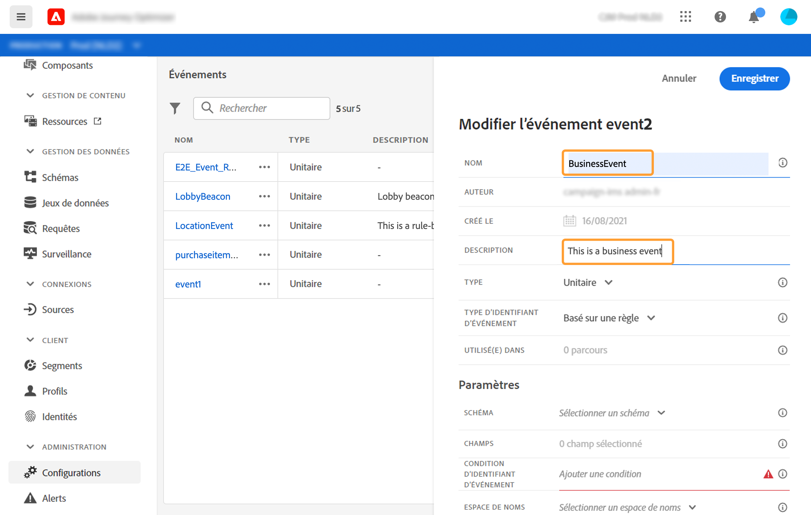

   >[!NOTE]
   >
   >N’utilisez ni espaces ni caractères spéciaux. Utilisez 30 caractères au maximum.

1. Dans le champ **[!UICONTROL Type]**, choisissez **Métier**.

   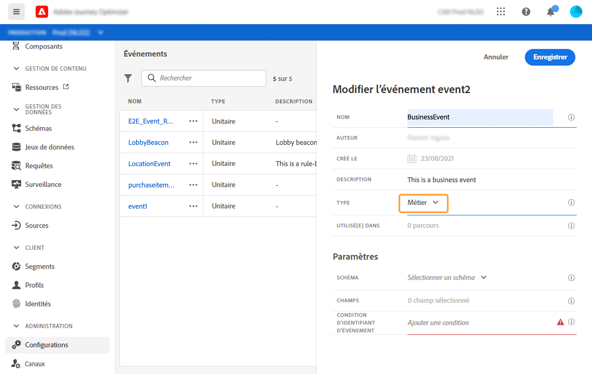

1. Le nombre de parcours qui font appel à cet événement apparaît dans le champ **[!UICONTROL Utilisé(e) dans]**. Vous pouvez cliquer sur l’icône **[!UICONTROL Afficher les parcours]** pour faire apparaître la liste des parcours utilisant cet événement.

1. Définissez les champs de payload et de schéma : c’est dans ces champs que vous sélectionnez les informations d’événement (désignées généralement sous le nom de payload) que le parcours s’attend à recevoir. Vous pourrez alors utiliser ces informations dans votre parcours. Consultez [cette section](../event/about-creating-business.md#define-the-payload-fields).

   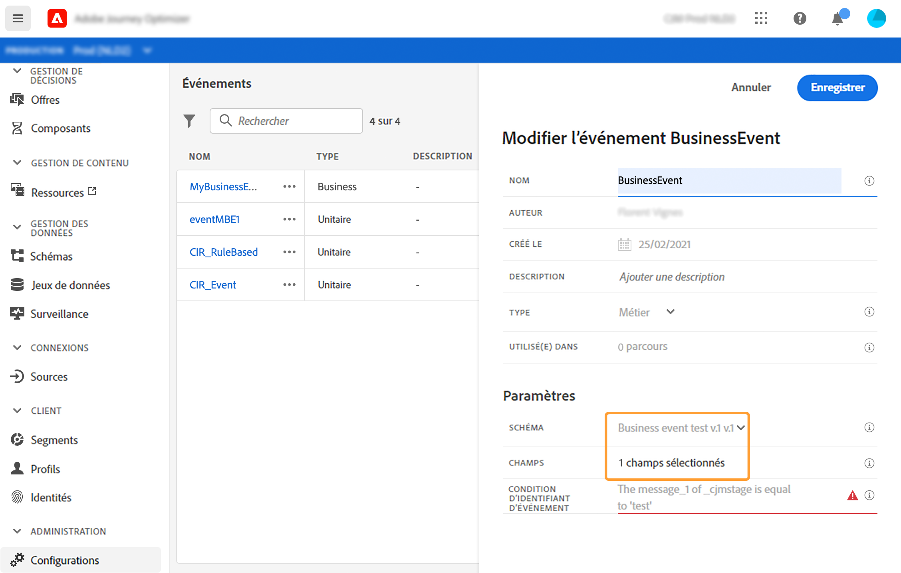

   Seuls les schémas de série temporelle sont disponibles. Les schémas d’événements d’expérience, d’événements de décision et d’événements d’étape de parcours ne sont pas disponibles. Le schéma d’événement doit contenir une identité principale.

   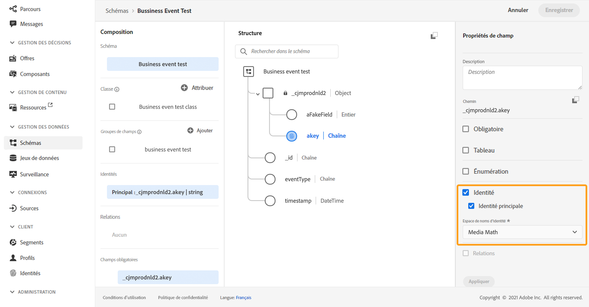

1. Cliquez à l’intérieur du champ **[!UICONTROL Condition de l’identifiant d’événement]**. À l’aide de l’éditeur d’expression simple, définissez la condition qui sera utilisée par le système pour identifier les événements qui déclencheront votre parcours.
   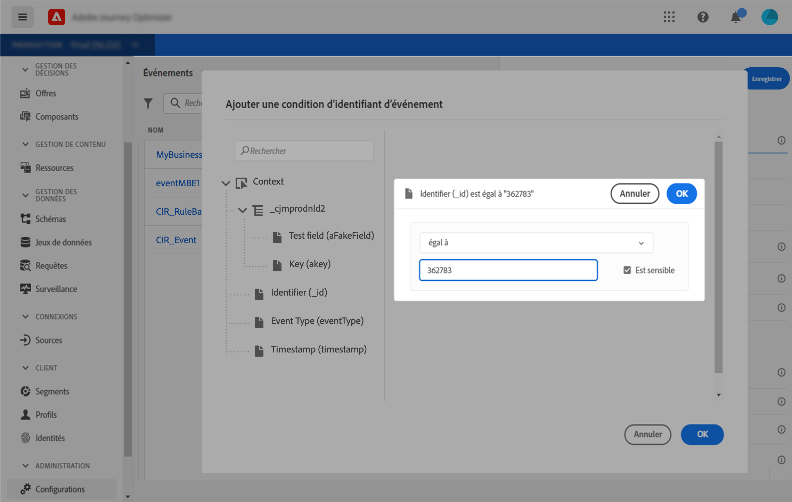

   Dans notre exemple, nous avons écrit une condition basée sur l’ID du produit. Cela signifie que chaque fois que le système reçoit un événement correspondant à cette condition, il le transmet aux parcours.

1. Cliquez sur **[!UICONTROL Enregistrer]**.

   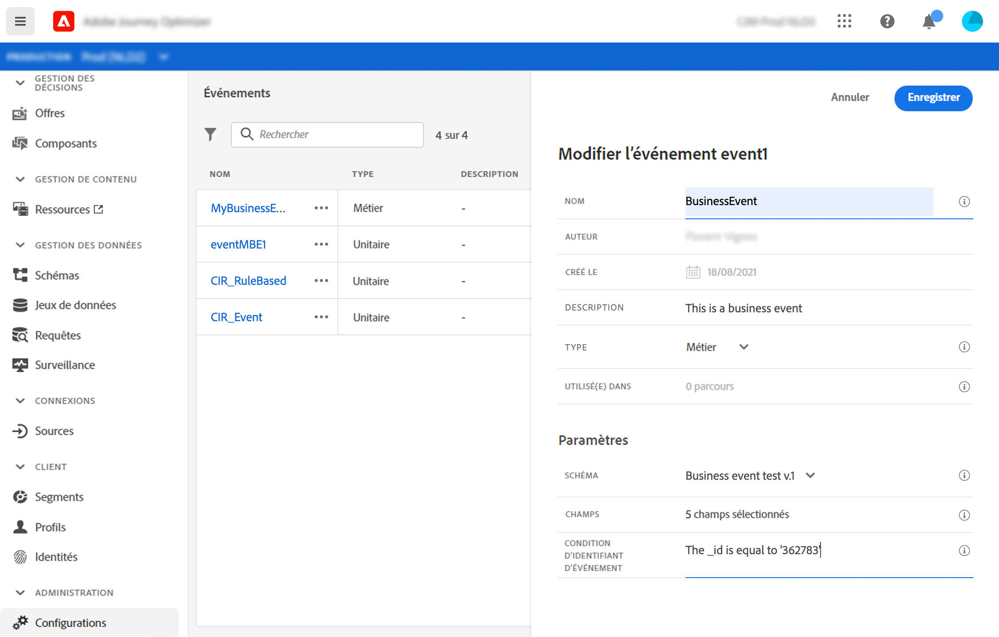

   L’événement est maintenant configuré et prêt à être déposé dans un parcours. Des étapes de configuration supplémentaires sont requises pour la réception d’événements. Voir [cette page](../event/additional-steps-to-send-events-to-journey-orchestration.md).

## Définition des champs de payload {#define-the-payload-fields}

La définition de la payload vous permet de choisir les informations que le système s’attend à recevoir de l’événement dans votre parcours, ainsi que la clé permettant d’identifier la personne associée à l’événement. La payload est basée sur la définition de champ XDM d’Experience Cloud. Pour plus d’informations sur XDM, consultez [cette page](https://experienceleague.adobe.com/docs/experience-platform/xdm/home.html?lang=fr).

1. Sélectionnez un schéma XDM dans la liste et cliquez ensuite sur le champ **[!UICONTROL Payload]** ou sur l’icône **[!UICONTROL Modifier]**.

   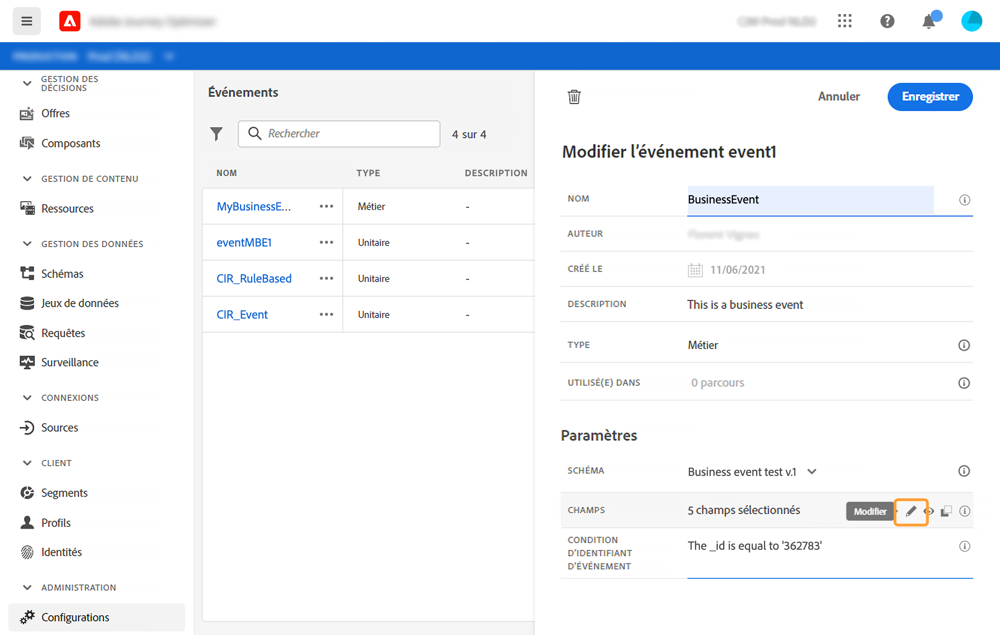

   Tous les champs définis dans le schéma sont affichés. La liste des champs varie d’un schéma à l’autre. Vous pouvez rechercher un champ spécifique, ou utiliser les filtres pour afficher l’ensemble des nœuds et des champs ou uniquement les champs sélectionnés. En fonction de la définition du schéma, certains champs peuvent être obligatoires et présélectionnés. Vous ne pouvez pas les désélectionner. Tous les champs obligatoires pour que les parcours reçoivent correctement l’événement sont sélectionnés par défaut.

   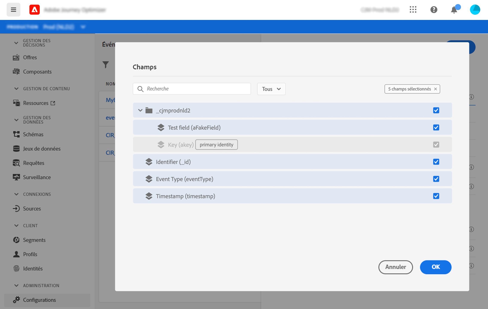

1. Sélectionnez les champs que vous prévoyez de recevoir de l’événement. Il s’agit des champs que l’utilisateur chargé de la conception de parcours exploitera dans le parcours.

   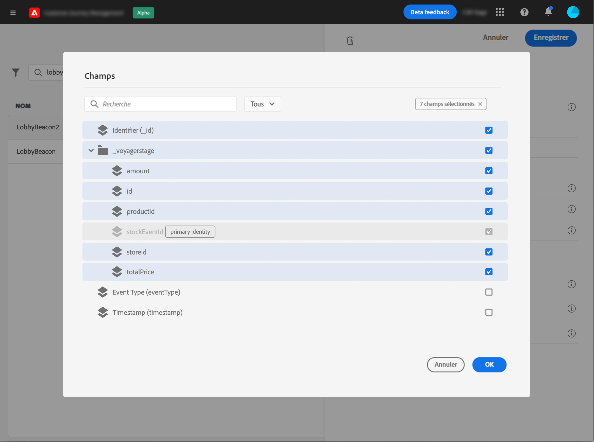

1. Une fois la sélection des champs nécessaires terminée, cliquez sur **[!UICONTROL Enregistrer]** ou appuyez sur la touche **[!UICONTROL Entrée]**.

   Le nombre de champs sélectionnés s’affiche dans le champ **[!UICONTROL Payload]**.

   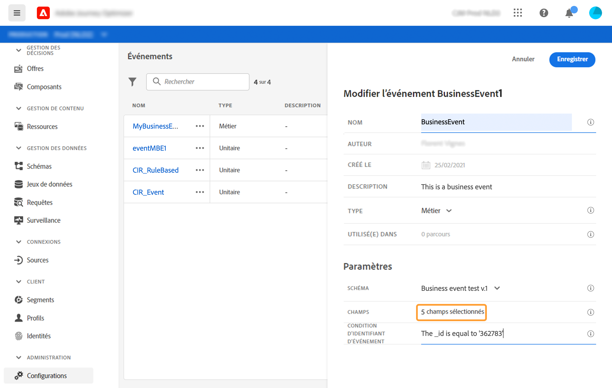

## Prévisualiser la payload {#preview-the-payload}

Cet aperçu vous permet de valider la définition de la payload.

1. Cliquez sur l’icône **[!UICONTROL Afficher la payload]** pour prévisualiser la payload attendue par le système.

   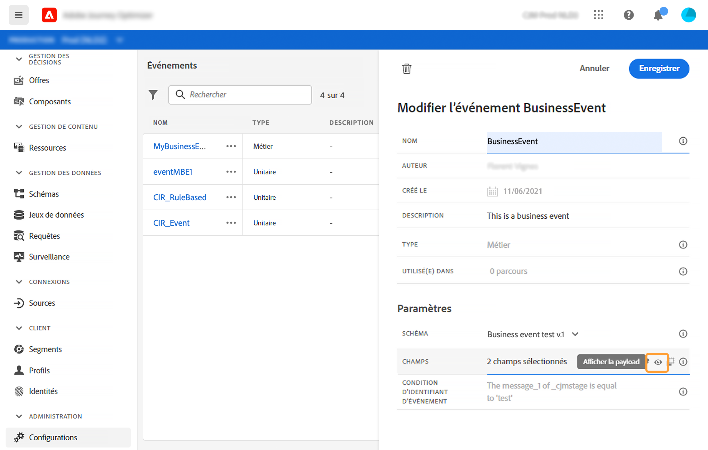

   Vous remarquerez que les champs sélectionnés sont affichés.

   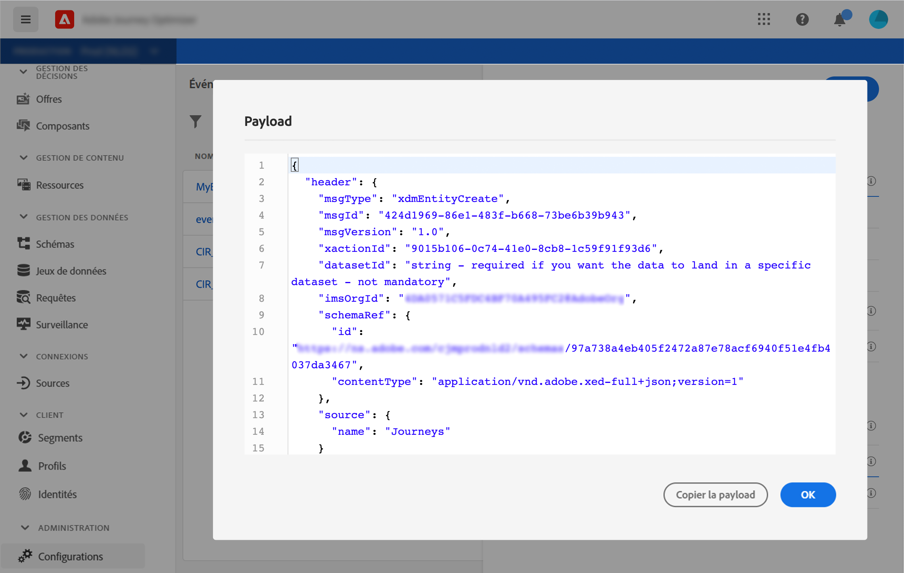

1. Vérifiez l’aperçu pour valider la définition de la payload.

1. Vous pouvez ensuite partager l’aperçu de la payload avec la personne responsable de l’envoi de l’événement. Cette payload peut l’aider à concevoir la configuration d’un envoi d’événement vers [!DNL Journey Optimizer]. Voir [cette page](../event/additional-steps-to-send-events-to-journey-orchestration.md).
