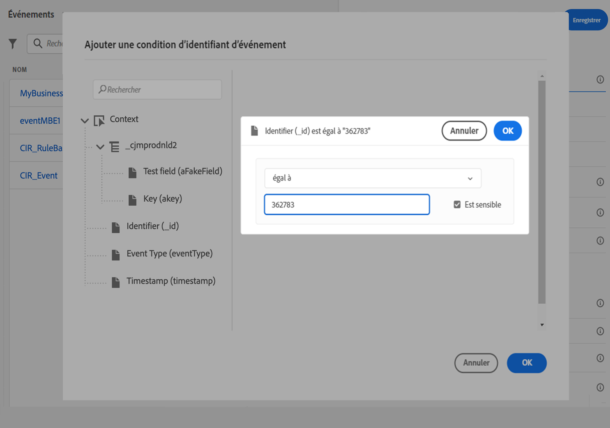

# Configuration d’un événement commercial {#configure-a-business-event}

>[!CONTEXTUALHELP]
>id="ajo_journey_event_business"
>title="Événements d’entreprise"
>abstract="La configuration d’événement vous permet de définir les informations que Journey Optimizer recevra en tant qu’événements. Vous pouvez utiliser plusieurs événements (à différentes étapes d’un parcours) et plusieurs parcours peuvent utiliser le même événement. Contrairement aux événements unitaires, les événements d’entreprise ne sont pas liés à un profil spécifique. Le type d’ID d’événement est toujours basé sur des règles."

Contrairement aux événements unitaires, les événements d’entreprise ne sont pas liés à un profil spécifique. Le type d’ID d’événement est toujours basé sur des règles. En savoir plus sur les événements professionnels dans [cette section](../event/about-events.md).

Les parcours basés sur les segments de lecture peuvent être déclenchés en une seule fois, régulièrement par un planificateur ou par un événement d’entreprise, lorsque l’événement se produit.

Les événements professionnels peuvent être &quot;un produit est de retour en stock&quot;, &quot;le prix de l&#39;action d&#39;une société atteint une certaine valeur&quot;, etc.

>[!NOTE]
>
>Vous pouvez également consulter le cas d’utilisation des événements professionnels. [tutoriel](https://experienceleague.adobe.com/docs/journey-optimizer-learn/tutorials/create-journeys/use-case-business-event.html). Notez que le schéma n’a pas besoin d’être activé pour profile.

## Remarques importantes {#important-notes}

* Seuls les schémas de série temporelle sont disponibles. Les schémas Événements d’expérience, Événements de décision et Événements d’étape du parcours ne sont pas disponibles.
* Le schéma d’événement doit contenir une identité principale non basée sur les personnes. Les champs suivants doivent être sélectionnés lors de la définition de l&#39;événement : `_id` et `timestamp`
* Les événements professionnels ne peuvent être ignorés que comme première étape d’un parcours.
* Lors de la suppression d’un événement d’entreprise comme première étape d’un parcours, le type de planificateur du parcours est &quot;événement d’entreprise&quot;.
* Seule une activité de segment de lecture peut être supprimée après un événement d’entreprise. Il est automatiquement ajouté comme étape suivante.
* Pour autoriser plusieurs exécutions d’événements commerciaux, activez l’option correspondante dans la **[!UICONTROL Execution]** section des propriétés du parcours.
* Une fois qu’un événement d’entreprise est déclenché, l’exportation du segment de 15 minutes à une heure sera retardée.
* Lors du test d’un événement d’entreprise, vous devez transmettre les paramètres d’événement et l’identifiant du profil de test qui va entrer dans le parcours en cours de test. En outre, lors du test d’un parcours basé sur un événement d’entreprise, vous ne pouvez déclencher qu’une seule entrée de profil. Voir [cette section](../building-journeys/testing-the-journey.md#test-business). En mode test, aucun mode &quot;Affichage du code&quot; n’est disponible.
* Qu’advient-il des individus actuellement engagés dans le parcours si un nouvel événement commercial arrive ? Il se comporte de la même manière que lorsque des individus se trouvent toujours dans un parcours récurrent lorsqu’une nouvelle périodicité se produit. Leur chemin est terminé. Par conséquent, les marketeurs doivent faire attention à ne pas créer de parcours trop longs s’ils s’attendent à des événements professionnels fréquents.
* Les événements professionnels ne peuvent pas être utilisés conjointement avec des événements unitaires ou des activités de qualification de segment.

## Plusieurs événements professionnels {#multiple-business-events}

Voici quelques remarques importantes qui s’appliquent lorsque plusieurs événements professionnels sont reçus d’une même ligne.

**Quel est le comportement lors de la réception d’un événement d’entreprise pendant le traitement du parcours ?**

Les événements professionnels suivent les règles de rentrée de la même manière que pour les événements unitaires. Si un parcours permet une rentrée, l’événement d’entreprise suivant est traité.

**Quelles sont les barrières de sécurité pour éviter la surcharge des segments matérialisés ?**

Dans le cas d’événements d’entreprise sur site, pour un parcours donné, les données transmises par la première tâche d’événement sont réutilisées pendant une période d’une heure. Pour les parcours planifiés, il n’y a pas de garde-fous. En savoir plus sur les segments dans la section [Documentation d’Adobe Experience Platform Segmentation Service](https://experienceleague.adobe.com/docs/experience-platform/segmentation/home.html).

## Prise en main des événements professionnels {#gs-business-events}

Voici les premières étapes pour configurer un événement professionnel :

1. Dans la section du menu ADMINISTRATION, sélectionnez **[!UICONTROL Configurations]**. Dans le  **[!UICONTROL Events]** , cliquez sur **[!UICONTROL Manage]**. La liste des événements s’affiche.

   

1. Cliquez sur **[!UICONTROL Create Event]** pour créer un événement. Le volet de configuration des événements s’ouvre sur le côté droit de l’écran.

   

1. Saisissez le nom de votre événement. Vous pouvez également ajouter une description.

   

   >[!NOTE]
   >
   >N’utilisez ni espaces ni caractères spéciaux. N’utilisez pas plus de 30 caractères.

1. Dans le **[!UICONTROL Type]** champ, choisissez **Entreprises**.

   

1. Le nombre de parcours qui utilisent cet événement s’affiche dans la variable **[!UICONTROL Used in]** champ . Vous pouvez cliquer sur le bouton **[!UICONTROL View journeys]** pour afficher la liste des parcours utilisant cet événement.

1. Définissez les champs de payload et de schéma : c’est là que vous sélectionnez les informations d’événement (ou charge utile) que les parcours s’attendent à recevoir. Vous utiliserez ces informations ultérieurement dans votre parcours. Voir [cette section](../event/about-creating-business.md#define-the-payload-fields).

   

   Seuls les schémas de série temporelle sont disponibles. `Experience Events`, `Decision Events` et `Journey Step Events` les schémas ne sont pas disponibles. Le schéma d’événement doit contenir une identité principale non basée sur les personnes. Les champs suivants doivent être sélectionnés lors de la définition de l&#39;événement : `_id` et `timestamp`

   

1. Cliquez dans le **[!UICONTROL Event ID condition]** champ . Utilisez l’éditeur d’expression simple pour définir la condition utilisée par le système pour identifier les événements qui déclenchent votre parcours.

   

   Dans notre exemple, nous avons écrit une condition basée sur l’identifiant du produit. Cela signifie que chaque fois que le système reçoit un événement correspondant à cette condition, il le transmet aux parcours.

   >[!NOTE]
   >
   >Dans l&#39;éditeur d&#39;expression simple, tous les opérateurs ne sont pas disponibles, ils dépendent du type de données. Par exemple, pour un type chaîne de champ, vous pouvez utiliser &quot;contient&quot; ou &quot;égal à&quot;.

1. Cliquez sur **[!UICONTROL Save]**.

   

   L’événement est maintenant configuré et prêt à être déposé dans un parcours. D’autres étapes de configuration sont requises pour recevoir des événements. En savoir plus dans [cette page](../event/additional-steps-to-send-events-to-journey.md).

## Définition des champs de payload {#define-the-payload-fields}

La définition de la payload vous permet de choisir les informations que le système s’attend à recevoir de l’événement dans votre parcours, ainsi que la clé permettant d’identifier la personne associée à l’événement. La payload est basée sur la définition de champ XDM Experience Cloud. Pour plus d’informations sur XDM, reportez-vous à la section [Documentation d’Adobe Experience Platform](https://experienceleague.adobe.com/docs/experience-platform/xdm/home.html){target=&quot;_blank&quot;}.

1. Sélectionnez un schéma XDM dans la liste, puis cliquez sur l’icône **[!UICONTROL Fields]** ou sur le **[!UICONTROL Edit]** icône .

   

   Tous les champs définis dans le schéma sont affichés. La liste des champs varie d’un schéma à l’autre. Vous pouvez rechercher un champ spécifique ou utiliser les filtres pour afficher tous les noeuds et champs ou uniquement les champs sélectionnés. Selon la définition du schéma, certains champs peuvent être obligatoires et présélectionnés. Vous ne pouvez pas les désélectionner. Tous les champs obligatoires pour que les parcours reçoivent correctement l’événement sont sélectionnés par défaut.

   

   >[!NOTE]
   >
   > Assurez-vous que les champs suivants sont sélectionnés : `_id` et `timestamp`

1. Sélectionnez les champs que vous prévoyez de recevoir de l’événement. Il s’agit des champs que l’utilisateur chargé de la conception de parcours exploitera dans le parcours.

1. Lorsque vous avez terminé de sélectionner les champs nécessaires, cliquez sur **[!UICONTROL Save]** ou appuyez sur **[!UICONTROL Enter]**.

   Le nombre de champs sélectionnés apparaît dans la section **[!UICONTROL Fields]**.

   

## Aperçu de la payload {#preview-the-payload}

Utilisez l’aperçu de la payload pour valider la définition de la payload.

1. Cliquez sur le bouton **[!UICONTROL View Payload]** pour prévisualiser la payload attendue par le système.

   

   Vous pouvez constater que les champs sélectionnés sont affichés.

   

1. Vérifiez l’aperçu pour valider la définition de la payload.

1. Vous pouvez ensuite partager l’aperçu de la payload avec la personne responsable de l’envoi de l’événement. Cette payload peut les aider à concevoir la configuration d’un envoi d’événement vers [!DNL Journey Optimizer]. Voir [cette page](../event/additional-steps-to-send-events-to-journey.md).
