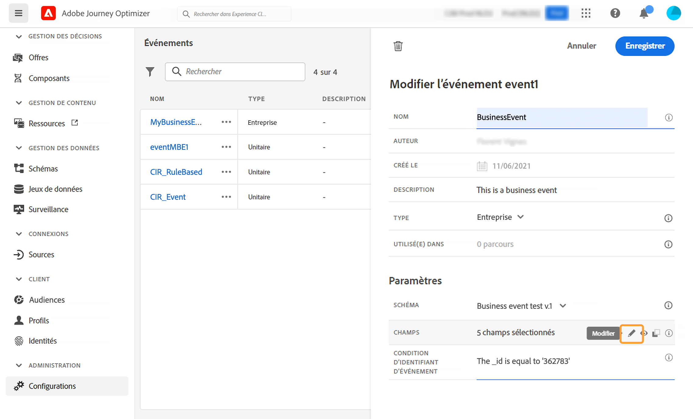

# Configuration d’un événement métier {#configure-a-business-event}

>[!CONTEXTUALHELP]
>id="ajo_journey_event_business"
>title="Événements métier"
>abstract="La configuration de l’événement vous permet de définir les informations que Journey Optimizer recevra en tant qu’événements. Vous pouvez utiliser plusieurs événements (à différentes étapes d’un parcours) et plusieurs parcours peuvent utiliser un même événement. Contrairement aux événements unitaires, les événements métier ne sont pas liés à un profil spécifique. Le type d&#39;ID d&#39;événement est toujours basé sur des règles."

Contrairement aux événements unitaires, les événements métier ne sont pas liés à un profil spécifique. Le type d&#39;ID d&#39;événement est toujours basé sur des règles. Pour en savoir plus sur les événements métier, reportez-vous à [cette section](../event/about-events.md).

Les parcours basés sur la lecture d’audience peuvent être déclenchés en une seule fois, par un planificateur sur une base régulière ou par un événement métier, lorsque l’événement se produit.

Les événements métier peuvent être « un produit est de nouveau en stock », « le cours des actions d’une société a atteint une certaine valeur », etc.

>[!NOTE]
>
>Vous pouvez également visionner le [tutoriel](https://experienceleague.adobe.com/fr/docs/journey-optimizer-learn/tutorials/journeys/use-case-business-event){target="_blank"} sur le cas d’utilisation d’un événement métier. Notez que le schéma n&#39;a pas besoin d&#39;être activé pour le profile.

## Remarques importantes {#important-notes}

* Seuls les schémas de série temporelle sont disponibles. Les schémas d&#39;événements d&#39;expérience, d&#39;événements de décision et d&#39;événements d&#39;étape de parcours ne sont pas disponibles.
* Le schéma d&#39;événement doit contenir une identité principale non basée sur une personne. Les champs suivants doivent être sélectionnés lors de la définition de l&#39;événement : `_id` et `timestamp`
* Les événements métier ne peuvent être placés que comme première étape d&#39;un parcours.
* Lorsqu&#39;un événement métier est placé comme première étape d&#39;un parcours, le type de planificateur du parcours est « événement métier ».
* Seule une activité de lecture d’audience peut être placée après un événement métier. Elle est automatiquement ajoutée comme étape suivante.
* Pour autoriser plusieurs exécutions d&#39;événements métier, activez l&#39;option correspondante dans la section **[!UICONTROL Exécution]** des propriétés du parcours.
* Une fois qu’un événement métier est déclenché, l’exportation de l’audience est retardée de 15 minutes à une heure maximum.
* Lors du test d&#39;un événement métier, vous devez transmettre les paramètres d&#39;événement et l&#39;identifiant du profil de test qui va rejoindre le parcours au moment du test. En outre, lorsque vous testez un parcours basé sur un événement métier, vous ne pouvez déclencher qu&#39;une seule entrée de profil. Consultez [cette section](../building-journeys/testing-the-journey.md#test-business). En mode test, aucun mode « Affichage du code » n&#39;est disponible.
* Qu&#39;advient-il des personnes qui se trouvent actuellement dans le parcours si un nouvel événement métier se produit ? La même chose que lorsque des personnes se trouvent encore dans un parcours récurrent lorsqu’une nouvelle récurrence se produit. Leur chemin est terminé. En conséquence, les spécialistes du marketing doivent veiller à ne pas créer de parcours trop longs s&#39;ils s&#39;attendent à des événements métier fréquents.
* Les événements métier ne peuvent pas être utilisés conjointement avec des événements unitaires ou des activités de qualification d’audience.

## Plusieurs événements métier {#multiple-business-events}

Voici quelques remarques importantes qui s’appliquent lorsque plusieurs événements métier sont reçus simultanément.

**Quel est le comportement lors de la réception d’un événement métier pendant le traitement du parcours ?**

Les événements métier suivent les règles de rentrée de la même manière que les événements unitaires. Si un parcours permet une rentrée, l’événement métier suivant est traité.

**Quelles sont les mécanismes de sécurisation permettant d’éviter la surcharge des audiences matérialisées ?**

Dans le cas d’événements métier uniques, pour un parcours donné, les données transmises par la première tâche d’événement sont réutilisées pendant une période d’une heure. Pour les parcours planifiés, il n’y a pas de mécanisme de sécurisation. Pour en savoir plus sur les audiences, consultez la [documentation du service de segmentation d’Adobe Experience Platform](https://experienceleague.adobe.com/docs/experience-platform/segmentation/home.html?lang=fr){target="_blank"}.

## Prise en main des événements métier {#gs-business-events}

Les premières étapes pour configurer un événement métier sont les suivantes :

1. Dans la section du menu ADMINISTRATION, sélectionnez **[!UICONTROL Configurations]**. Dans la section **[!UICONTROL Événements]**, cliquez sur **[!UICONTROL Gérer]**. La liste des événements s&#39;affiche.

   

1. Cliquez sur **[!UICONTROL Créer un événement]** pour créer un événement. Le volet de configuration d&#39;événement s&#39;ouvre dans la partie droite de l&#39;écran.

   

1. Saisissez le nom de votre événement. Vous pouvez également ajouter une description.

   

   >[!NOTE]
   >
   >Seuls les caractères alphanumériques et les traits de soulignement sont autorisés. La longueur maximale est de 30 caractères.

1. Dans le champ **[!UICONTROL Type]**, choisissez **Métier**.

   

1. Le nombre de parcours qui font appel à cet événement apparaît dans le champ **[!UICONTROL Utilisé(e) dans]**. Vous pouvez cliquer sur l&#39;icône **[!UICONTROL Afficher les parcours]** pour faire apparaître la liste des parcours utilisant cet événement.

1. Définissez les champs de payload et de schéma : c’est dans ces champs que vous sélectionnez les informations d’événement (ou payload) que le parcours s’attend à recevoir. Vous utiliserez ces informations plus tard dans votre parcours. Consultez [cette section](../event/about-creating-business.md#define-the-payload-fields).

   

   Seuls les schémas de série temporelle sont disponibles. Les schémas `Experience Events`, `Decision Events` et `Journey Step Events` ne sont pas disponibles. Le schéma d&#39;événement doit contenir une identité principale non basée sur une personne. Les champs suivants doivent être sélectionnés lors de la définition de l&#39;événement : `_id` et `timestamp`

   

1. Cliquez à l&#39;intérieur du champ **[!UICONTROL Condition de l&#39;identifiant d&#39;événement]**. Utilisez l’éditeur d’expression simple pour définir la condition qui sera utilisée par le système pour identifier les événements qui déclenchent votre parcours.

   Dans notre exemple, nous avons écrit une condition basée sur l&#39;ID du produit. Cela signifie que chaque fois que le système reçoit un événement correspondant à cette condition, il le transmet aux parcours.

   >[!NOTE]
   >
   >Dans l&#39;éditeur d&#39;expression simple, tous les opérateurs ne sont pas disponibles ; ils dépendent du type de données. Par exemple, pour un type de chaîne de champ, vous pouvez utiliser « contient » ou « égal à ».

1. Cliquez sur **[!UICONTROL Enregistrer]**.

   

   L&#39;événement est maintenant configuré et prêt à être déposé dans un parcours. Des étapes de configuration supplémentaires sont requises pour la réception d&#39;événements. En savoir plus sur [cette page](../event/additional-steps-to-send-events-to-journey.md).

## Définition des champs de payload {#define-the-payload-fields}

La définition de la payload vous permet de choisir les informations que le système s&#39;attend à recevoir de l&#39;événement dans votre parcours, ainsi que la clé permettant d&#39;identifier la personne associée à l&#39;événement. La payload est basée sur la définition de champ XDM d&#39;Experience Cloud. Pour plus d’informations sur XDM, consultez la [documentation d’Adobe Experience Platform](https://experienceleague.adobe.com/docs/experience-platform/xdm/home.html?lang=fr){target="_blank"}.

1. Sélectionnez un schéma XDM dans la liste et cliquez ensuite sur le champ **[!UICONTROL Champs]** ou sur l&#39;icône **[!UICONTROL Modifier]**.

   

   Tous les champs définis dans le schéma sont affichés. La liste des champs varie d&#39;un schéma à l&#39;autre. Vous pouvez rechercher un champ spécifique, ou utiliser les filtres pour afficher l&#39;ensemble des nœuds et des champs ou uniquement les champs sélectionnés. En fonction de la définition du schéma, certains champs peuvent être obligatoires et présélectionnés. Vous ne pouvez pas les désélectionner. Tous les champs obligatoires pour que les parcours reçoivent correctement l&#39;événement sont sélectionnés par défaut.

   

   >[!NOTE]
   >
   > Assurez-vous que les champs suivants sont sélectionnés : `_id` et `timestamp`

1. Sélectionnez les champs que vous prévoyez de recevoir de l&#39;événement. Il s&#39;agit des champs que l&#39;utilisateur chargé de la conception de parcours exploitera dans le parcours.

1. Une fois que vous avez terminé de sélectionner les champs nécessaires, cliquez sur **[!UICONTROL Enregistrer]** ou appuyez sur **[!UICONTROL Entrée]**.

   Le nombre de champs sélectionnés s’affiche dans **[!UICONTROL Champs]**.

   

## Prévisualisation de la payload {#preview-the-payload}

Utilisez l’aperçu de payload pour valider la définition de la payload.

1. Cliquez sur l&#39;icône **[!UICONTROL Afficher la payload]** pour prévisualiser la payload attendue par le système.

   

   Vous remarquerez que les champs sélectionnés sont affichés.

   

1. Vérifiez l&#39;aperçu pour valider la définition de la payload.

1. Vous pouvez ensuite partager l&#39;aperçu de la payload avec la personne responsable de l&#39;envoi de l&#39;événement. Cette payload peut l’aider à concevoir la configuration d’un envoi d’événement vers [!DNL Journey Optimizer]. Consultez [cette page](../event/additional-steps-to-send-events-to-journey.md).
