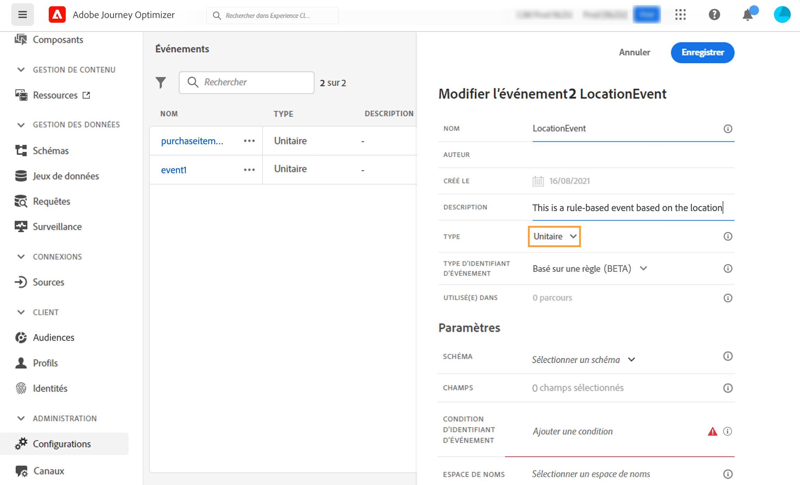
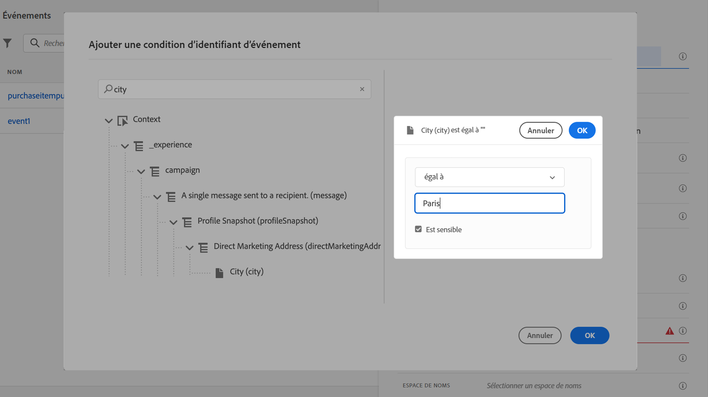
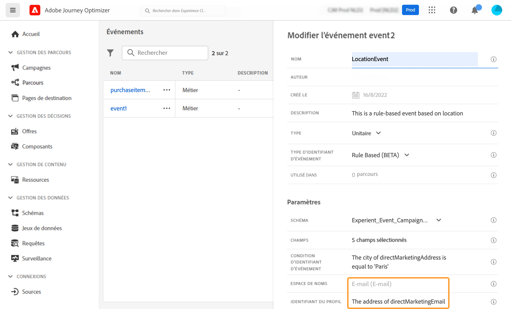

# Configuration d’un événement unitaire {#configure-an-event}

>[!CONTEXTUALHELP]
>id="ajo_journey_event_unitary"
>title="Événements unitaires"
>abstract="La configuration d’événement vous permet de définir les informations que Journey Optimizer recevra en tant qu’événements. Vous pouvez utiliser plusieurs événements (à différentes étapes d’un parcours) et plusieurs parcours peuvent utiliser le même événement. Les événements unitaires sont liés à un profil spécifique. Ils peuvent être basés sur des règles ou générés par le système."

Les événements unitaires sont liés à un profil spécifique. Ils peuvent être basés sur des règles ou générés par le système.  En savoir plus sur l’événement unitaire [cette section](../event/about-events.md).

Voici les premières étapes pour configurer un nouvel événement :

1. Dans la section du menu ADMINISTRATION, sélectionnez **[!UICONTROL Configurations]**. Dans le  **[!UICONTROL Events]** , cliquez sur **[!UICONTROL Manage]**. La liste des événements s’affiche.

   

1. Cliquez sur **[!UICONTROL Create Event]** pour créer un événement. Le volet de configuration des événements s’ouvre sur le côté droit de l’écran.

   

1. Saisissez le nom de votre événement. Vous pouvez également ajouter une description.

   

   >[!NOTE]
   >
   >N’utilisez ni espaces ni caractères spéciaux. N’utilisez pas plus de 30 caractères.

1. Dans le **[!UICONTROL Type]** champ, choisissez **Unitaire**.

   

1. Dans le **[!UICONTROL Event ID type]** , sélectionnez le type d’ID d’événement à utiliser : **Basé sur des règles** ou **Généré par le système**. En savoir plus sur les types d’ID d’événement dans [cette section](../event/about-events.md#event-id-type).

   

1. Le nombre de parcours qui utilisent cet événement s’affiche dans la variable **[!UICONTROL Used in]** champ . Vous pouvez cliquer sur le bouton **[!UICONTROL View journeys]** pour afficher la liste des parcours utilisant cet événement.

1. Définissez les champs de payload et de schéma : c’est là que vous sélectionnez les informations d’événement (généralement appelées une charge utile) que les parcours s’attendent à recevoir. Vous pourrez ensuite utiliser ces informations dans votre parcours. Voir [cette section](../event/about-creating.md#define-the-payload-fields).

   

   >[!NOTE]
   >
   >Lorsque vous sélectionnez la variable **[!UICONTROL System Generated]** type, seuls les schémas dont le champ de type eventID est disponible sont disponibles. Lorsque vous sélectionnez la variable **[!UICONTROL Rule Based]** , tous les schémas d’événement d’expérience sont disponibles.

1. Pour les événements basés sur des règles, cliquez dans le **[!UICONTROL Event ID condition]** champ . À l’aide de l’éditeur d’expression simple, définissez la condition qui sera utilisée par le système pour identifier les événements qui déclencheront votre parcours.
   

   Dans notre exemple, nous avons écrit une condition basée sur la ville du profil. Cela signifie que chaque fois que le système reçoit un événement correspondant à cette condition (**[!UICONTROL City]** champ et **[!UICONTROL Paris]** ), elle la transmettra aux parcours.

   >[!NOTE]
   >
   >L’éditeur d’expression avancé n’est pas disponible lors de la définition de la variable **[!UICONTROL Event ID condition]**. Dans l&#39;éditeur d&#39;expression simple, tous les opérateurs ne sont pas disponibles, ils dépendent du type de données. Par exemple, pour un type chaîne de champ, vous pouvez utiliser &quot;contient&quot; ou &quot;égal à&quot;.

1. Ajoutez un espace de noms. Cette étape est facultative, mais recommandée. En effet, l’ajout d’un espace de noms vous permet d’exploiter les informations stockées dans le service de profil client en temps réel. Il définit le type de clé dont dispose l’événement. Voir [cette section](../event/about-creating.md#select-the-namespace).
1. Définissez l&#39;identifiant du profil : choisissez un champ dans vos champs de payload ou définissez une formule pour identifier la personne associée à l’événement. Cette clé est configurée automatiquement (mais peut toujours être modifiée) si vous sélectionnez un espace de noms. En effet, les parcours sélectionnent la clé qui doit correspondre à l’espace de noms (par exemple, si vous sélectionnez un espace de noms d’email, la clé d’email est sélectionnée). Voir [cette section](../event/about-creating.md#define-the-event-key).

   

1. Cliquez sur **[!UICONTROL Save]**.

   L’événement est maintenant configuré et prêt à être déposé dans un parcours. D’autres étapes de configuration sont requises pour recevoir des événements. Voir [cette page](../event/additional-steps-to-send-events-to-journey.md).

## Définition des champs de payload {#define-the-payload-fields}

La définition de la payload vous permet de choisir les informations que le système s’attend à recevoir de l’événement dans votre parcours, ainsi que la clé permettant d’identifier la personne associée à l’événement. La payload est basée sur la définition de champ XDM Experience Cloud. Pour plus d’informations sur XDM, reportez-vous à la section [Documentation d’Adobe Experience Platform](https://experienceleague.adobe.com/docs/experience-platform/xdm/home.html){target=&quot;_blank&quot;}.

1. Sélectionnez un schéma XDM dans la liste, puis cliquez sur l’icône **[!UICONTROL Fields]** ou sur le **[!UICONTROL Edit]** icône .

   

   Tous les champs définis dans le schéma sont affichés. La liste des champs varie d’un schéma à l’autre. Vous pouvez rechercher un champ spécifique ou utiliser les filtres pour afficher tous les noeuds et champs ou uniquement les champs sélectionnés. Selon la définition du schéma, certains champs peuvent être obligatoires et présélectionnés. Vous ne pouvez pas les désélectionner. Tous les champs obligatoires pour que les parcours reçoivent correctement l’événement sont sélectionnés par défaut.

   >[!NOTE]
   >
   >Pour les événements générés par le système, veillez à ajouter le groupe de champs &quot;orchestration&quot; au schéma XDM. Vous aurez ainsi la garantie que votre schéma contient toutes les informations requises pour fonctionner avec . [!DNL Journey Optimizer].

   

1. Sélectionnez les champs que vous prévoyez de recevoir de l’événement. Il s’agit des champs que l’utilisateur chargé de la conception de parcours exploitera dans le parcours. Ils doivent également inclure la clé qui sera utilisée pour identifier la personne associée à l’événement (voir [cette section](../event/about-creating.md#define-the-event-key)).

   >[!NOTE]
   >
   >Pour les événements générés par le système, la variable **[!UICONTROL eventID]** est automatiquement ajouté dans la liste des champs sélectionnés afin que [!DNL Journey Optimizer] peut identifier l’événement. Le système qui appuie sur l’événement ne doit pas générer d’identifiant, mais utiliser celui disponible dans l’aperçu de la payload. Voir [cette section](../event/about-creating.md#preview-the-payload).

1. Lorsque vous avez terminé de sélectionner les champs nécessaires, cliquez sur **[!UICONTROL Ok]** ou appuyez sur **[!UICONTROL Enter]**.

   Le nombre de champs sélectionnés apparaît dans la variable **[!UICONTROL Fields]** champ .

   

## Sélectionnez l’espace de noms {#select-the-namespace}

>[!CONTEXTUALHELP]
>id="ajo_journey_namespace"
>title="Espace de noms d’identité"
>abstract="TBC"

L’espace de noms vous permet de définir le type de clé utilisé pour identifier la personne associée à l’événement. Sa configuration est facultative. Elle est requise si vous souhaitez récupérer, dans vos parcours, des informations supplémentaires provenant de la variable [Real-time Customer Profile](https://experienceleague.adobe.com/docs/experience-platform/profile/home.html){target=&quot;_blank&quot;}. La définition d’espace de noms n’est pas nécessaire si vous utilisez uniquement des données provenant d’un système tiers via une source de données personnalisée.

Vous pouvez utiliser l’un des espaces de noms prédéfinis ou en créer un nouveau à l’aide du service Identity Namespace . Voir [Documentation d’Adobe Experience Platform](https://experienceleague.adobe.com/docs/experience-platform/identity/home.html){target=&quot;_blank&quot;}.

Si vous sélectionnez un schéma possédant une identité principale, la variable **[!UICONTROL Profiler identifier]** et **[!UICONTROL Namespace]** Les champs sont préremplis. Si aucune identité n’est définie, nous sélectionnons _identityMap > id_ comme clé primaire. Ensuite, vous devez sélectionner un espace de noms et la clé sera préremplie (sous la balise **[!UICONTROL Namespace]** (champ) à l’aide de _identityMap > id_.

Lors de la sélection de champs, les champs d’identité principaux sont balisés.

Sélectionnez un espace de noms dans la liste déroulante.

Un seul espace de noms est autorisé par parcours. Si vous utilisez plusieurs événements dans le même parcours, ils doivent utiliser le même espace de noms. Voir [cette page](../building-journeys/journey.md).

## Définition de l’identifiant de profil {#define-the-event-key}

La clé correspond au champ, ou combinaison de champs, qui fait partie des données de payload de l’événement et qui permet au système d’identifier la personne associée à l’événement. La clé peut être, par exemple, l’Experience Cloud ID, un ID CRM ou une adresse électronique.

Pour utiliser les données stockées dans la base de données de profil client en temps réel d’Adobe, la clé d’événement doit correspondre aux informations que vous avez définies en tant qu’identité d’un profil dans la variable [Service de profil client en temps réel](https://experienceleague.adobe.com/docs/experience-platform/profile/home.html){target=&quot;_blank&quot;}.

L’identifiant du profil permet au système d’effectuer la réconciliation entre l’événement et le profil de l’individu. Si vous sélectionnez un schéma possédant une identité principale, la variable **[!UICONTROL Profile identifier]** et **[!UICONTROL Namespace]** Les champs sont préremplis. Si aucune identité n’est définie, la variable _identityMap > id_ est la clé primaire. Vous devez ensuite sélectionner un espace de noms et la clé est automatiquement préremplie à l’aide de la fonction _identityMap > id_.

Lors de la sélection de champs, les champs d’identité principaux sont balisés.

Si vous devez utiliser une autre clé, telle qu’un identifiant CRM ou une adresse email, vous devez l’ajouter manuellement, comme expliqué ci-dessous :

1. Cliquez dans le **[!UICONTROL Profile identifier]** ou sur l’icône en forme de crayon.

   

1. Sélectionnez le champ choisi comme clé dans la liste des champs de payload. Vous pouvez également passer à l’éditeur d’expression avancé pour créer des clés plus complexes (par exemple, une concaténation de deux champs des événements).

   

Lorsque l’événement est reçu, la valeur de la clé permet au système d’identifier la personne associée à l’événement. Associé à un espace de noms (voir [cette section](../event/about-creating.md#select-the-namespace)), la clé peut être utilisée pour exécuter des requêtes sur Adobe Experience Platform. Voir [cette page](../building-journeys/about-journey-activities.md#orchestration-activities).
La clé est également utilisée pour vérifier qu’une personne est dans un parcours. En effet, une personne ne peut pas se trouver à deux endroits différents dans le même parcours. Par conséquent, le système ne permet pas que la même clé, par exemple la clé CRMID=3224, se trouve à des endroits différents dans le même parcours.

Vous avez également accès aux fonctions d’expression avancées (**[!UICONTROL Advanced mode]**) si vous souhaitez effectuer des manipulations supplémentaires. Ces fonctions permettent de manipuler les valeurs utilisées pour exécuter des requêtes spécifiques, telles que la modification de formats, l&#39;exécution de concaténations de champs, la prise en compte d&#39;une partie seulement d&#39;un champ (par exemple les 10 premiers caractères). Voir [page](../building-journeys/expression/expressionadvanced.md).

## Aperçu de la payload {#preview-the-payload}

L’aperçu de la payload vous permet de valider la définition de la payload.

>[!NOTE]
>
>Pour les événements générés par le système, lorsque vous créez un événement, enregistrez-le et rouvrez-le avant d’afficher l’aperçu de la payload. Cette étape est nécessaire pour générer un ID d’événement dans la payload.

1. Cliquez sur le bouton **[!UICONTROL View Payload]** pour prévisualiser la payload attendue par le système.

   

   Vous pouvez constater que les champs sélectionnés sont affichés.

   

1. Vérifiez l’aperçu pour valider la définition de la payload.

1. Vous pouvez ensuite partager l’aperçu de la payload avec la personne responsable de l’envoi de l’événement. Cette payload peut les aider à concevoir la configuration d’un envoi d’événement vers [!DNL Journey Optimizer]. Voir [cette page](../event/additional-steps-to-send-events-to-journey.md).
