# Configuration d&#39;un événement unitaire {#configure-an-event}

Les événements unitaires sont liés à un profil spécifique. Ils peuvent être basés sur des règles ou générés par le système.  En savoir plus sur les événements unitaires dans [cette section](../event/about-events.md).

Les premières étapes nécessaires pour configurer un nouvel événement sont les suivantes :

1. Dans la section ADMINISTRATION, accédez à **[!UICONTROL Configurations]**, puis cliquez sur **[!UICONTROL Événements]**. La liste des événements s’affiche.

   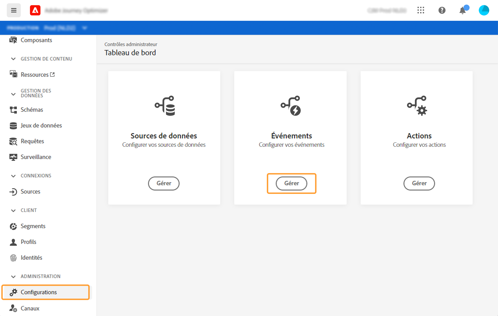

1. Cliquez sur **[!UICONTROL Ajouter]** pour créer un événement. Le volet de configuration d’événement s’ouvre dans la partie droite de l’écran.

   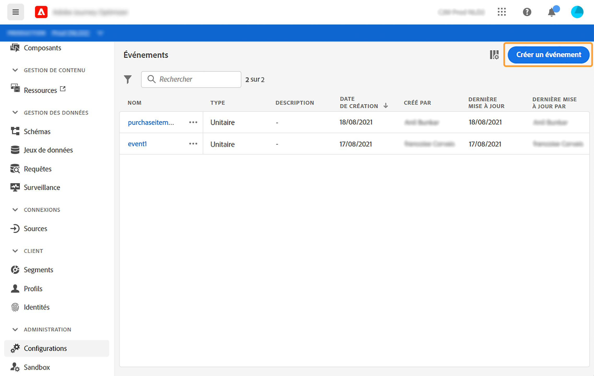

1. Saisissez le nom de votre événement. Vous pouvez également ajouter une description.

   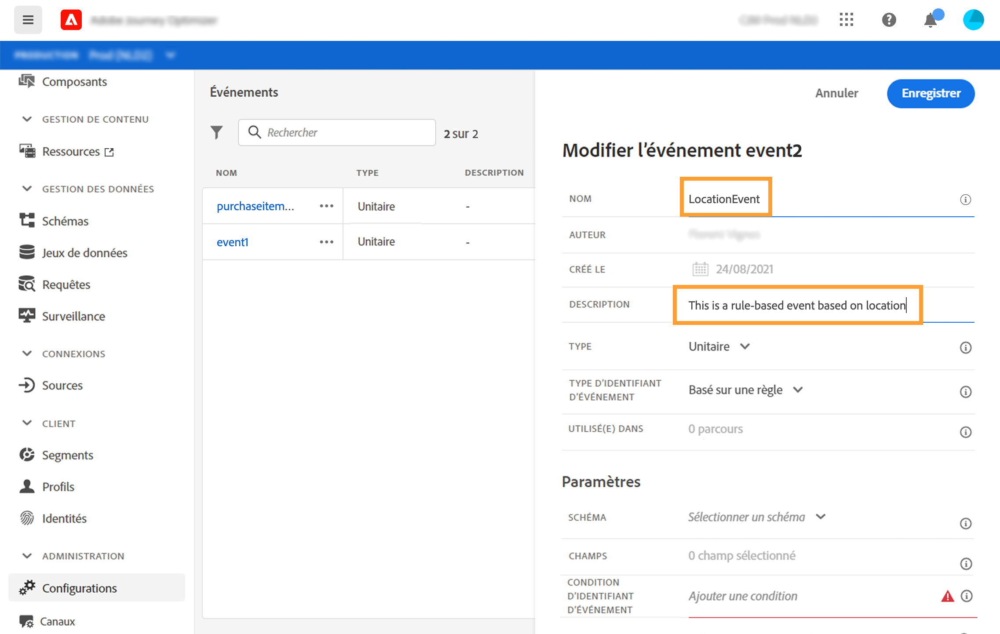

   >[!NOTE]
   >
   >N’utilisez ni espaces ni caractères spéciaux. Utilisez 30 caractères au maximum.

1. Dans le champ **[!UICONTROL Type]**, choisissez **Événements unitaires**.

   

1. Dans le champ **[!UICONTROL Type d’identifiant d’événement]**, sélectionnez le type d&#39;identifiant d’événement à utiliser : **Basé sur une règle** ou **Généré par le système** Pour en savoir plus sur les types d&#39;identifiant d’événements, reportez-vous à [cette section](../event/about-events.md#event-id-type).

   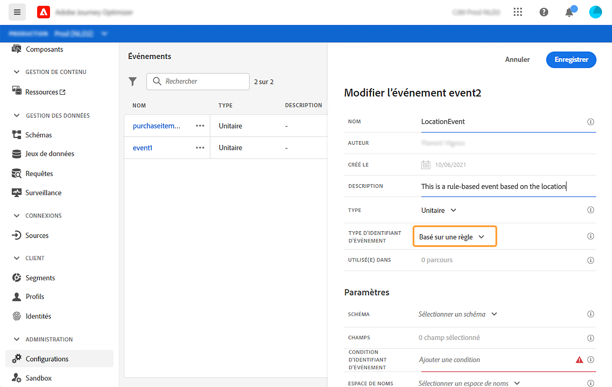

1. Le nombre de parcours qui font appel à cet événement apparaît dans le champ **[!UICONTROL Utilisé(e) dans]**. Vous pouvez cliquer sur l’icône **[!UICONTROL Afficher les parcours]** pour faire apparaître la liste des parcours utilisant cet événement.

1. Définissez les champs de payload et de schéma : c’est dans ces champs que vous sélectionnez les informations d’événement (désignées généralement sous le nom de payload) que le parcours s’attend à recevoir. Vous pourrez alors utiliser ces informations dans votre parcours. Consultez [cette section](../event/about-creating.md#define-the-payload-fields).

   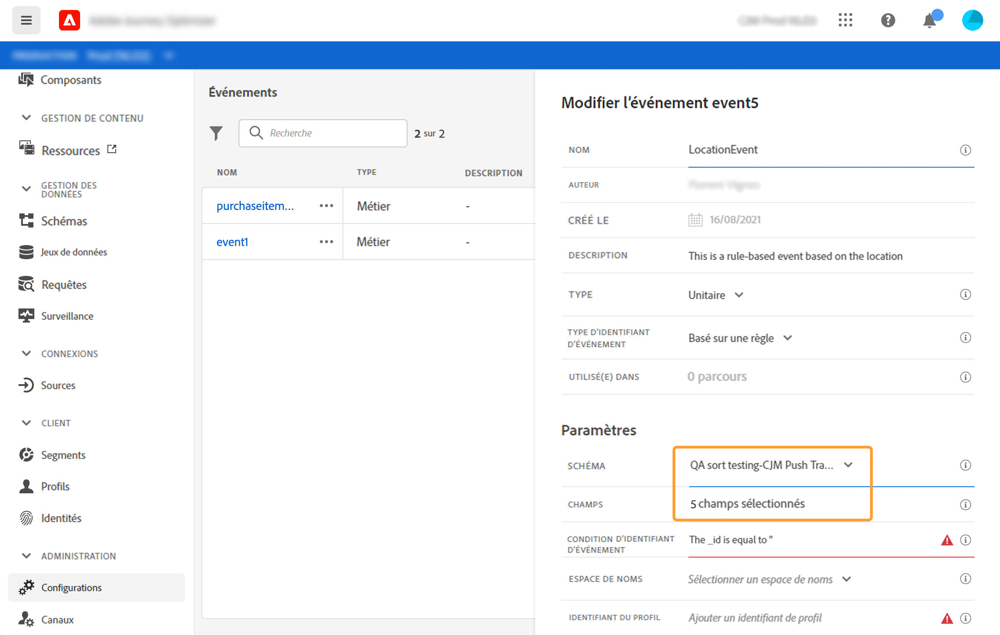

   >[!NOTE]
   >
   >Lorsque vous sélectionnez le type **[!UICONTROL Généré par le système]**, seuls les schémas dont le mixin est de type eventID sont disponibles. Lorsque vous sélectionnez le type **[!UICONTROL Basé sur des règles]**, tous les schémas Événement d’expérience sont disponibles.

1. Pour les événements basés sur des règles, cliquez dans le champ **[!UICONTROL condition d’identifiant d’événement]**. À l’aide de l’éditeur d’expression simple, définissez la condition qui sera utilisée par le système pour identifier les événements qui déclencheront votre parcours.
   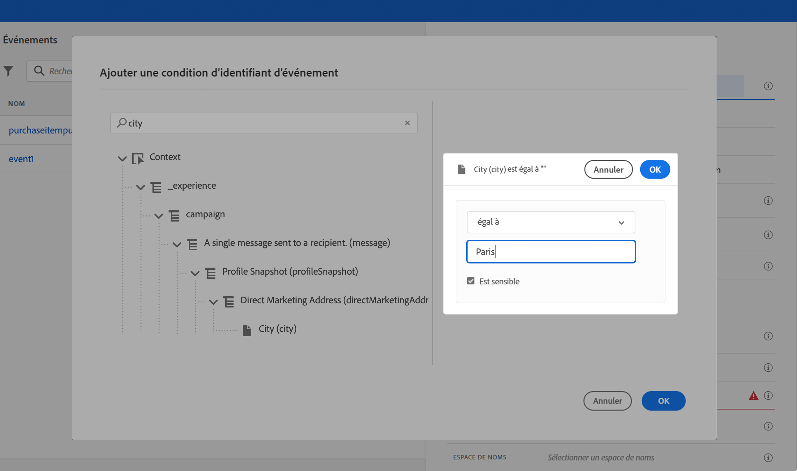

   Dans notre exemple, nous avons écrit une condition basée sur la ville du profil. Cela signifie que chaque fois que le système reçoit un événement qui correspond à cette condition (champ **[!UICONTROL Ville]** et valeur **[!UICONTROL Paris]**), il le transmet aux parcours.

1. Ajoutez un espace de noms. Cette étape est facultative, mais recommandée. En effet, l’ajout d’un espace de noms permet d’exploiter les informations stockées dans le service de profil client en temps réel. Il définit le type de clé dont dispose l’événement. Consultez [cette section](../event/about-creating.md#select-the-namespace).
1. Définissez la clé : effectuez votre choix parmi vos champs de payload ou définissez une formule pour identifier la personne associée à l’événement. Cette clé est configurée automatiquement (mais peut toujours être modifiée) si vous sélectionnez un espace de noms. En effet, le parcours sélectionne la clé qui doit correspondre à l’espace de noms ; par exemple, si vous sélectionnez un espace de noms d’email, la clé d’email est sélectionnée. Consultez [cette section](../event/about-creating.md#define-the-event-key).

   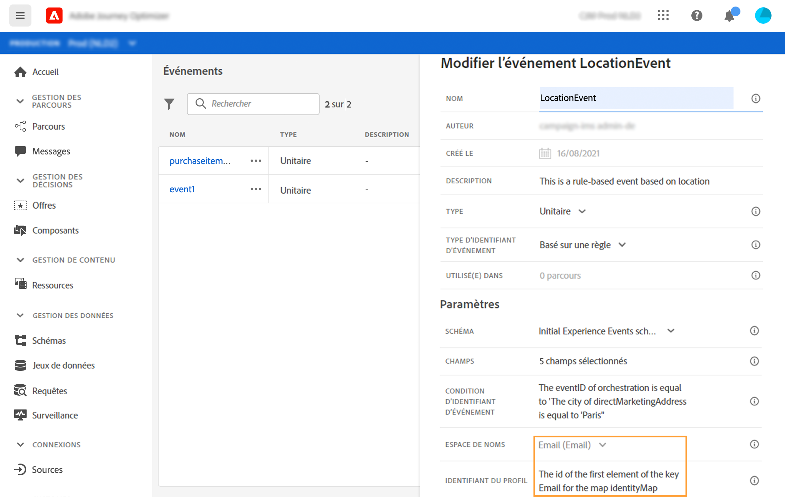

1. Pour les événements générés par le système, vous pouvez ajouter une condition. Cette étape est facultative. Elle permet au système de traiter uniquement les événements qui répondent à la condition. Cette condition ne peut être basée que sur les informations contenues dans l’événement. Consultez [cette section](../event/about-creating.md#add-a-condition).
1. Cliquez sur **[!UICONTROL Enregistrer]**.

   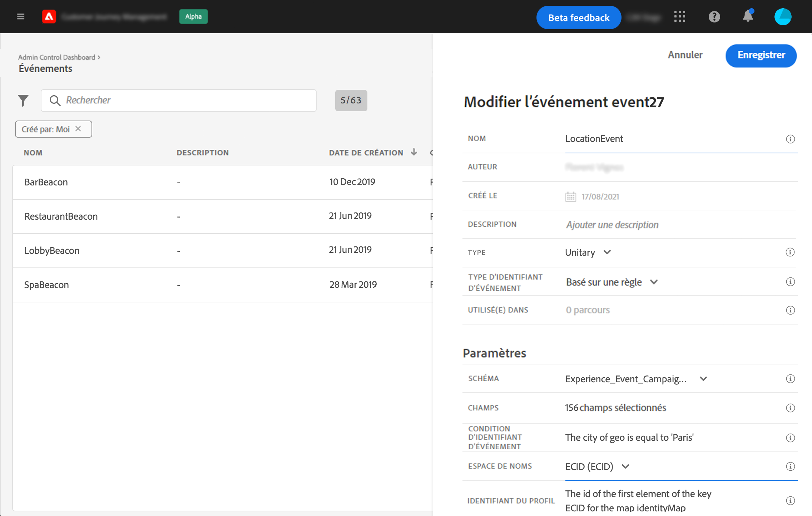

   L’événement est maintenant configuré et prêt à être déposé dans un parcours. Des étapes de configuration supplémentaires sont requises pour la réception d’événements. Voir [cette page](../event/additional-steps-to-send-events-to-journey-orchestration.md).

## Définition des champs de payload {#define-the-payload-fields}

La définition de la payload vous permet de choisir les informations que le système s’attend à recevoir de l’événement dans votre parcours, ainsi que la clé permettant d’identifier la personne associée à l’événement. La payload est basée sur la définition de champ XDM d’Experience Cloud. Pour plus d’informations sur XDM, consultez [cette page](https://experienceleague.adobe.com/docs/experience-platform/xdm/home.html?lang=fr).

1. Sélectionnez un schéma XDM dans la liste et cliquez ensuite sur le champ **[!UICONTROL Payload]** ou sur l’icône **[!UICONTROL Modifier]**.

   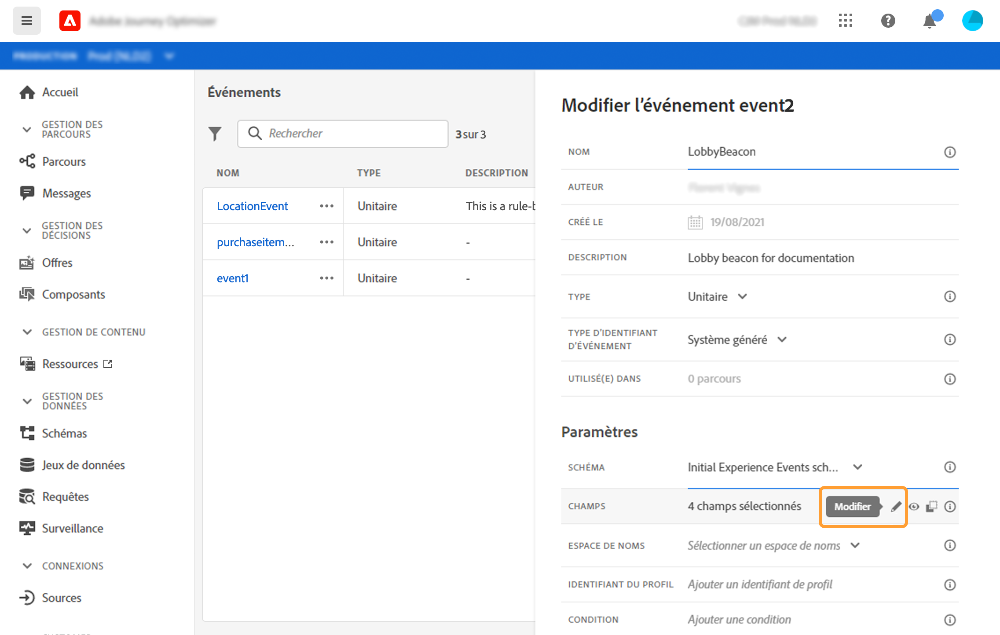

   Tous les champs définis dans le schéma sont affichés. La liste des champs varie d’un schéma à l’autre. Vous pouvez rechercher un champ spécifique, ou utiliser les filtres pour afficher l’ensemble des nœuds et des champs ou uniquement les champs sélectionnés. En fonction de la définition du schéma, certains champs peuvent être obligatoires et présélectionnés. Vous ne pouvez pas les désélectionner. Tous les champs obligatoires pour que les parcours reçoivent correctement l’événement sont sélectionnés par défaut.

   >[!NOTE]
   >
   >Vérifiez que vous avez bien ajouté le mixin « orchestration » au schéma XDM. Vous aurez ainsi la garantie que votre schéma contient toutes les informations requises pour fonctionner avec [!DNL Journey Optimizer].

   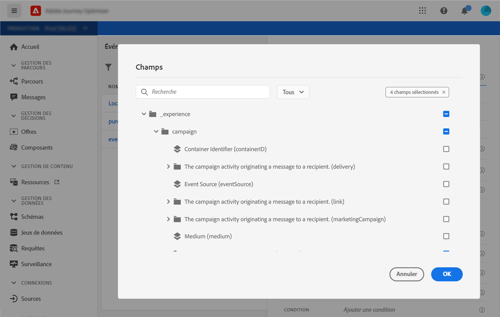

1. Sélectionnez les champs que vous prévoyez de recevoir de l’événement. Il s’agit des champs que l’utilisateur chargé de la conception de parcours exploitera dans le parcours. Ils doivent également inclure la clé qui sera utilisée pour identifier la personne associée à l’événement (voir [cette section](../event/about-creating.md#define-the-event-key)).

   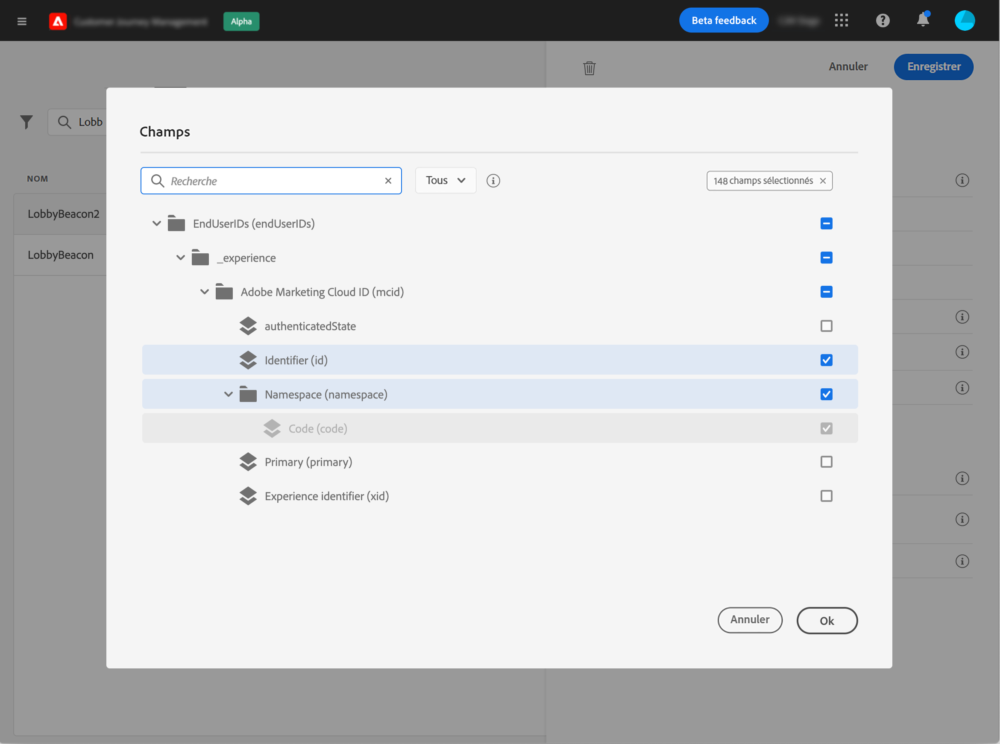

   >[!NOTE]
   >
   >Pour les événements générés par le système, le champ **[!UICONTROL eventID]** est automatiquement ajouté à la liste des champs sélectionnés afin que [!DNL Journey Optimizer] puisse identifier l’événement. Le système à l’origine de l’envoi de l’événement ne doit pas générer d’identifiant, mais plutôt utiliser celui indiqué dans l’aperçu de la payload. Consultez [cette section](../event/about-creating.md#preview-the-payload).

1. Une fois la sélection des champs nécessaires terminée, cliquez sur **[!UICONTROL Enregistrer]** ou appuyez sur la touche **[!UICONTROL Entrée]**.

   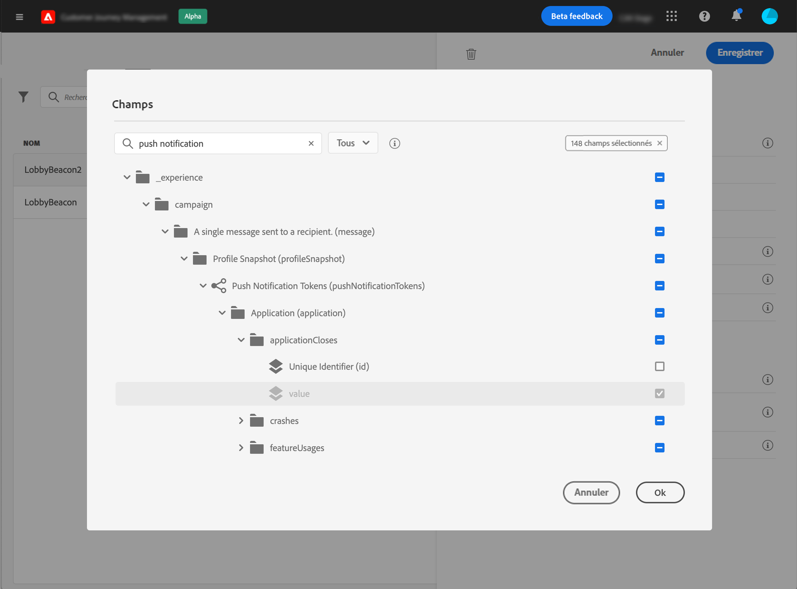

   Le nombre de champs sélectionnés s’affiche dans le champ **[!UICONTROL Payload]**.

   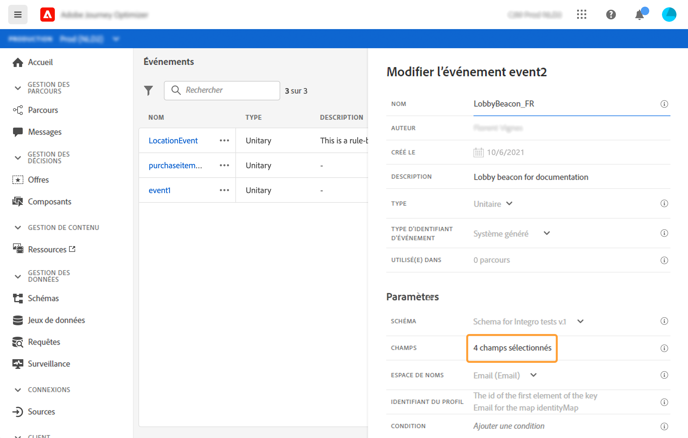

## Sélectionnez l’espace de noms {#select-the-namespace}

Un espace de noms vous permet de définir le type de clé utilisé pour identifier la personne associée à l’événement. Sa configuration est facultative. Elle est obligatoire si vous souhaitez récupérer, dans vos parcours, des informations supplémentaires provenant de [profil client en temps réel](https://experienceleague.adobe.com/docs/experience-platform/profile/home.html?lang=fr). Il n’est pas nécessaire de définir l’espace de noms si vous utilisez uniquement des données provenant d’un système tiers via une source de données personnalisée.

Vous pouvez utiliser l’un des espaces de noms prédéfinis ou en créer un à l’aide du service Espace de noms d’identité. Voir cette [page](https://experienceleague.adobe.com/docs/experience-platform/identity/home.html?lang=fr).

Si vous sélectionnez un schéma doté d’une identité principale, les champs **[!UICONTROL Clé]** et **[!UICONTROL Espace de noms]** sont déjà renseignés. Si aucune identité n’est définie, _identityMap > id_ est sélectionné comme clé principale. Vous devez ensuite sélectionner un espace de noms et la clé sera préremplie (sous le champ **[!UICONTROL Espace de noms]**) à l’aide de _identityMap > id_.

Lors de la sélection de champs, les champs d’identité principale sont balisés.

Sélectionnez un espace de noms dans la liste déroulante.

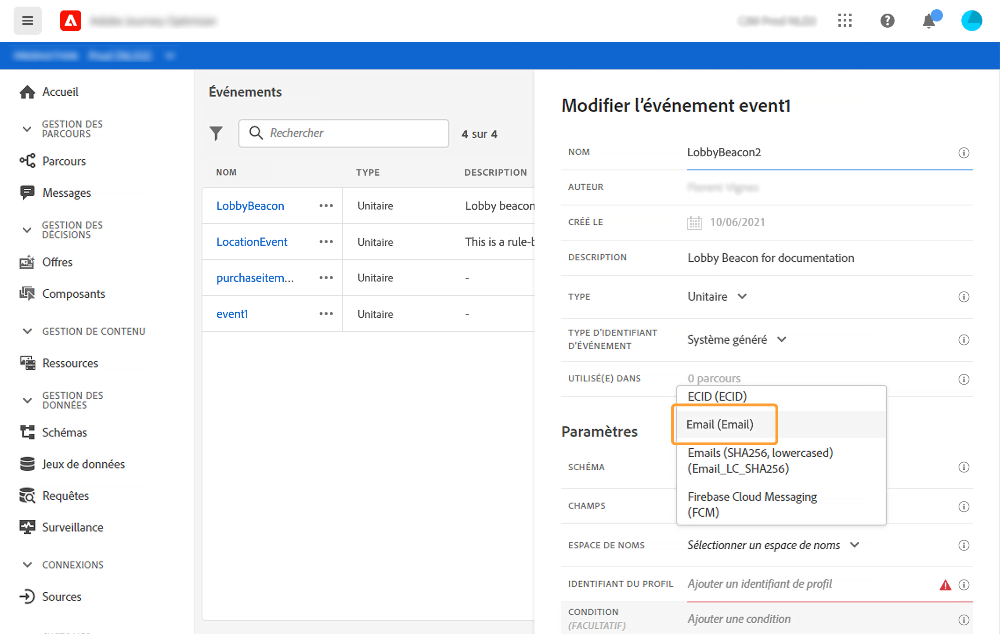

Un seul espace de noms est autorisé par parcours. Si vous utilisez plusieurs événements dans le même parcours, tous doivent utiliser le même espace de noms. Voir [cette page](../building-journeys/journey.md).

## Définition de la clé d’événement {#define-the-event-key}

La clé correspond au champ ou à la combinaison de champs faisant partie des données de payload de l’événement et permettant au système d’identifier la personne associée à l’événement. Il peut s’agir de l’Experience Cloud ID, d’un ID CRM ou encore d’une adresse e-mail.

Si vous prévoyez d’exploiter les données stockées dans la base de données de profils clients en temps réel, vous devez sélectionner, comme clé d’événement, les informations que vous avez définies en tant qu’identité d’un profil dans le [service de profil client en temps réel](https://experienceleague.adobe.com/docs/experience-platform/profile/home.html).

Le système pourra ainsi effectuer la réconciliation entre l’événement et le profil de l’individu. Si vous sélectionnez un schéma doté d’une identité principale, les champs **[!UICONTROL Clé]** et **[!UICONTROL Espace de noms]** sont déjà renseignés. Si aucune identité n’est définie, _identityMap > id_ est sélectionné comme clé principale. Vous devez ensuite sélectionner un espace de noms et la clé sera préremplie (sous le champ **[!UICONTROL Espace de noms]**) à l’aide de _identityMap > id_.

Lors de la sélection de champs, les champs d’identité principale sont marqués.

Si vous devez utiliser une autre clé, telle qu’un ID CRM ou une adresse e-mail, vous devez l’ajouter manuellement :

1. Cliquez dans le champ **[!UICONTROL Clé]** ou sur l’icône représentant un crayon.

   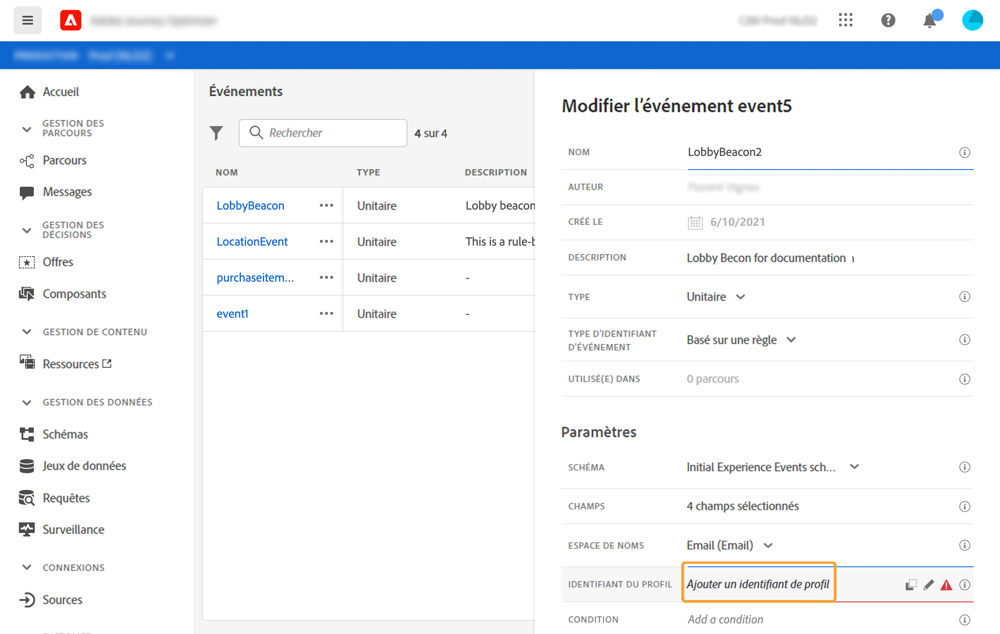

1. Sélectionnez le champ choisi comme clé dans la liste des champs de payload. Vous pouvez également basculer vers l’éditeur d’expression avancé pour créer des clés plus complexes (une concaténation de deux champs des événements, par exemple). Voir ci-dessous.

   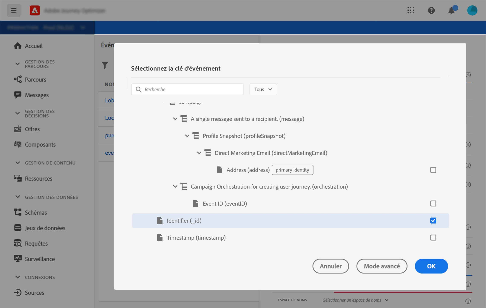

Lorsque l’événement est reçu, la valeur de la clé permet au système d’identifier la personne qui y est associée. Associée à un espace de noms (voir [cette section](../event/about-creating.md#select-the-namespace)), la clé peut être utilisée pour exécuter des requêtes sur Adobe Experience Platform. Voir [cette page](../building-journeys/about-journey-activities.md#orchestration-activities).
La clé sert également à vérifier qu’une personne se trouve dans un parcours. En effet, une personne ne peut pas se trouver à deux endroits différents dans le même parcours. Par conséquent, le système n’autorise pas qu’une même clé (CRMID=3224, par exemple) se trouve à des endroits différents dans un même parcours.

Vous avez également accès aux fonctions d’expression avancées (**[!UICONTROL Mode avancé]**) si vous souhaitez effectuer des manipulations supplémentaires. Ces fonctions vous permettent de manipuler les valeurs utilisées pour exécuter des requêtes spécifiques, comme modifier des formats, exécuter des concaténations de champs, prendre uniquement en compte une partie d’un champ (les 10 premiers caractères, par exemple), etc. Voir [cette page](https://experienceleague.adobe.com/docs/journeys/using/building-advanced-conditions-journeys/expressionadvanced.html?lang=fr).

## Ajoutez une condition {#add-a-condition}

La condition n’est disponible que pour les événements générés par le système. Vous pouvez définir une condition d’événement qui permet au système de filtrer le traitement des événements. Si la condition est vraie, l’événement est traité. Dans le cas contraire, il est ignoré.

La condition relative aux événements ne peut être basée que sur les données transmises dans la payload d’événement. La condition définie au niveau de l’événement ne peut pas être modifiée par un marketeur dans la zone de travail. L’objectif est de rendre cette condition plus stricte lorsque cet événement est utilisé. Par exemple, si vous ne souhaitez pas que les marketeurs utilisent des événements d’abandon de panier si la valeur du panier est trop faible, vous pouvez créer une condition sur le champ d’événement « valeur du panier » et imposer une valeur supérieure à 100 euros.

Vous pouvez utiliser l’éditeur d’expression simple ou avancé pour configurer des conditions sur les événements. Voir [cette page](https://experienceleague.adobe.com/docs/journeys/using/building-advanced-conditions-journeys/expressionadvanced.html).

Vous pouvez, par exemple, définir une condition pour ne traiter que les événements d’un type spécifique et ignorer les autres. Si votre événement est un abandon de panier et que la payload comprend le champ de valeur de panier, vous pouvez définir une condition d’événement afin de ne traiter les événements que si la valeur du panier est supérieure à 100 euros.

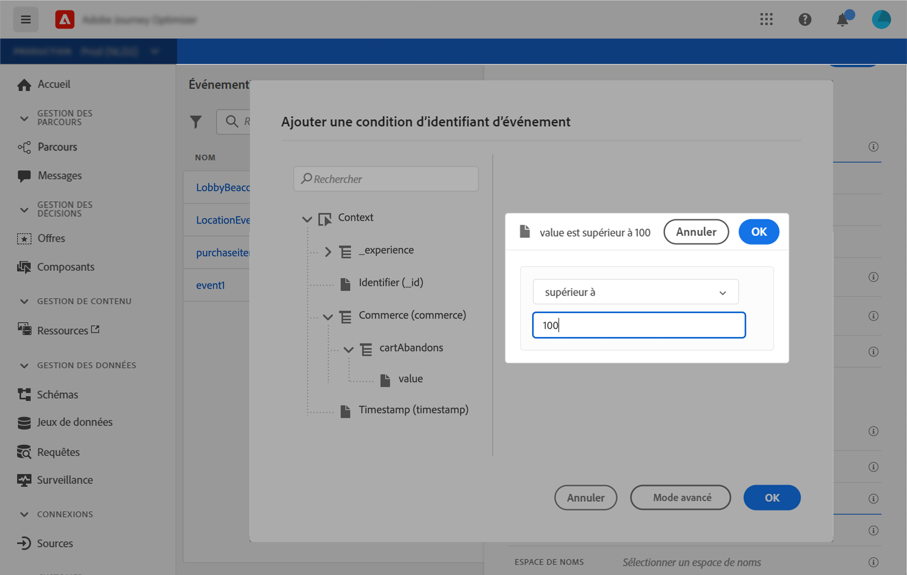

## Prévisualisation de la payload {#preview-the-payload}

Cet aperçu vous permet de valider la définition de la payload.

>[!NOTE]
>
>Pour les événements générés par le système, lorsque vous créez un événement, enregistrez-le et rouvrez-le avant d’afficher la prévisualisation de la payload. Cette étape est nécessaire pour générer un identifiant d’événement dans la payload.

1. Cliquez sur l’icône **[!UICONTROL Afficher la payload]** pour prévisualiser la payload attendue par le système.

   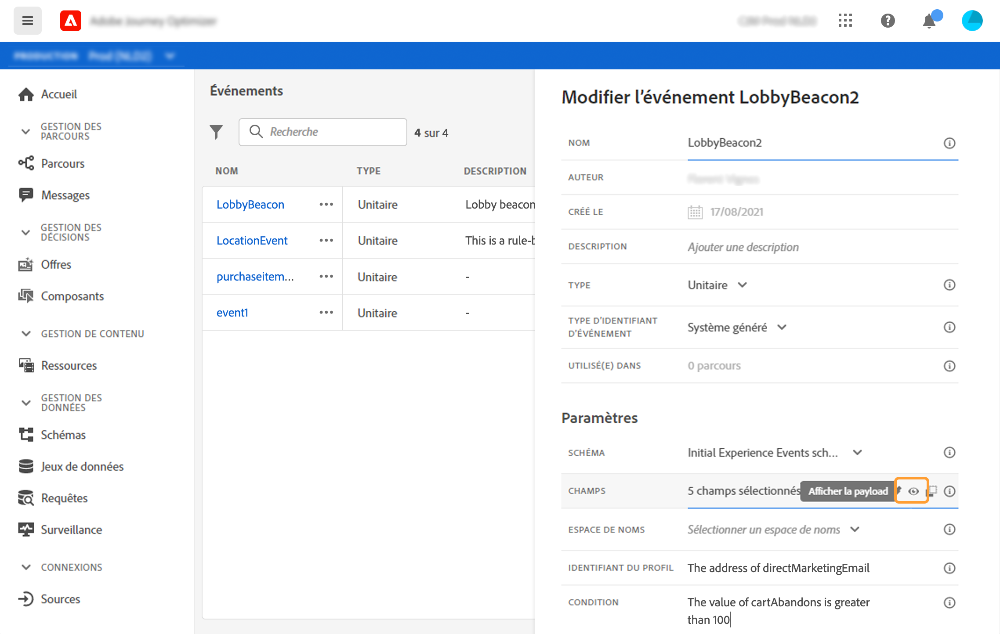

   Vous remarquerez que les champs sélectionnés sont affichés.

   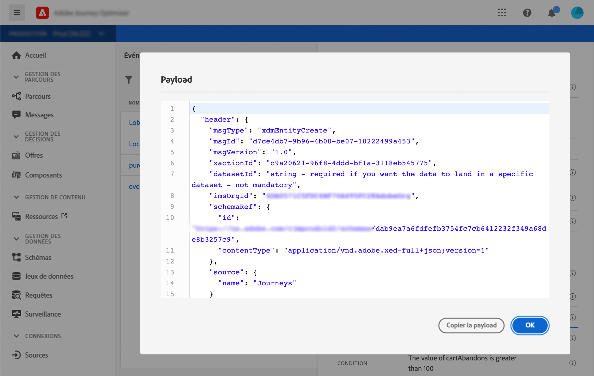

1. Vérifiez l’aperçu pour valider la définition de la payload.

1. Vous pouvez ensuite partager l’aperçu de la payload avec la personne responsable de l’envoi de l’événement. Cette payload peut l’aider à concevoir la configuration d’un envoi d’événement vers [!DNL Journey Optimizer]. Voir [cette page](../event/additional-steps-to-send-events-to-journey-orchestration.md).
