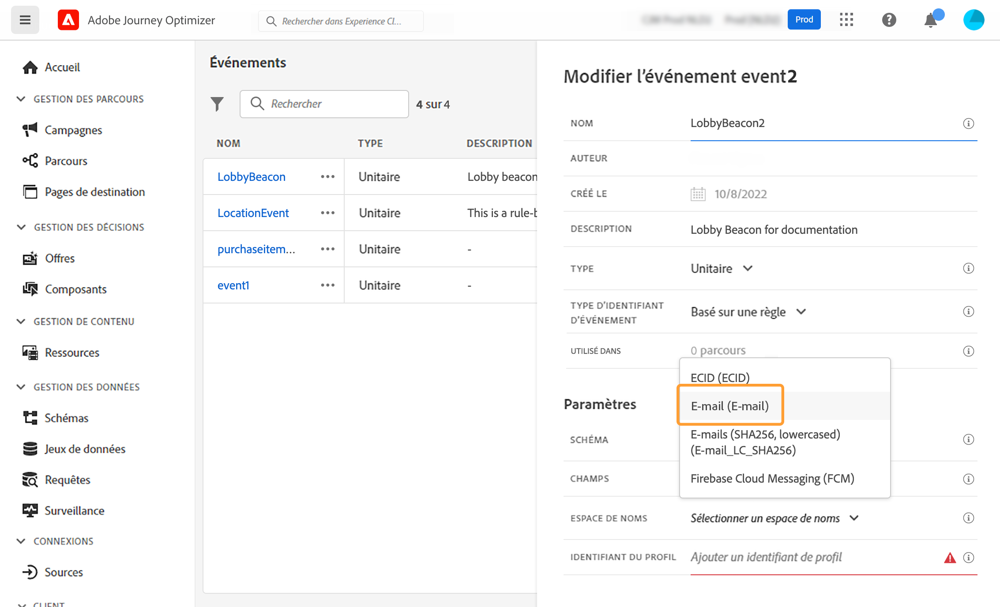
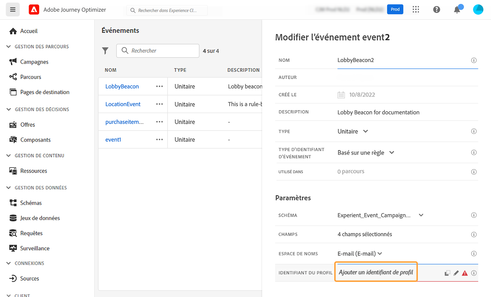

# Configuration d&#39;un événement unitaire {#configure-an-event}

>[!CONTEXTUALHELP]
>id="ajo_journey_event_unitary"
>title="Événements unitaires"
>abstract="La configuration de l&#39;événement vous permet de définir les informations que Journey Optimizer recevra en tant qu&#39;événements. Vous pouvez utiliser plusieurs événements (à différentes étapes d&#39;un parcours) et plusieurs parcours peuvent utiliser un même événement. Les événements unitaires sont liés à un profil spécifique. Ils peuvent être basés sur des règles ou générés par le système."

Les événements unitaires sont liés à un profil spécifique. Ils peuvent être basés sur des règles ou générés par le système.  En savoir plus sur les événements unitaires dans [cette section](../event/about-events.md).

Les premières étapes nécessaires pour configurer un nouvel événement sont les suivantes :

1. Dans la section du menu ADMINISTRATION, sélectionnez **[!UICONTROL Configurations]**. Dans la section **[!UICONTROL Événements]**, cliquez sur **[!UICONTROL Gérer]**. La liste des événements s&#39;affiche.

   

1. Cliquez sur **[!UICONTROL Créer un événement]** pour créer un événement. Le volet de configuration d&#39;événement s&#39;ouvre dans la partie droite de l&#39;écran.

   

1. Saisissez le nom de votre événement. Vous pouvez également ajouter une description.

   

   >[!NOTE]
   >
   >Seuls les caractères alphanumériques et les traits de soulignement sont autorisés. La longueur maximale est de 30 caractères.

1. Dans le champ **[!UICONTROL Type]**, choisissez **Unitaire**.

   

1. Dans le champ **[!UICONTROL Type d&#39;identifiant d&#39;événement]**, sélectionnez le type d&#39;identifiant d&#39;événement à utiliser : **Basé sur une règle** ou **Généré par le système**. Pour en savoir plus sur les types d&#39;identifiant d&#39;événements, reportez-vous à [cette section](../event/about-events.md#event-id-type).

   

1. Le nombre de parcours qui font appel à cet événement apparaît dans le champ **[!UICONTROL Utilisé(e) dans]**. Vous pouvez cliquer sur l&#39;icône **[!UICONTROL Afficher les parcours]** pour faire apparaître la liste des parcours utilisant cet événement.

1. Définissez les champs de payload et de schéma : c&#39;est dans ces champs que vous sélectionnez les informations d&#39;événement (désignées généralement sous le nom de payload) que le parcours s&#39;attend à recevoir. Vous pourrez alors utiliser ces informations dans votre parcours. Consultez [cette section](../event/about-creating.md#define-the-payload-fields).

   

   >[!NOTE]
   >
   >Lorsque vous sélectionnez le type **[!UICONTROL Généré par le système]**, seuls les schémas dont le champ est de type eventID sont disponibles. Lorsque vous sélectionnez le type **[!UICONTROL Basé sur des règles]**, tous les schémas Événement d&#39;expérience sont disponibles.

1. Pour les événements basés sur des règles, cliquez dans le champ **[!UICONTROL condition d&#39;identifiant d&#39;événement]**. À l’aide de l’éditeur d’expression simple ou avancé, définissez la condition qui sera utilisée par le système pour identifier les événements qui déclencheront votre parcours.

Dans notre exemple, nous avons écrit une condition basée sur la ville du profil. Cela signifie que chaque fois que le système reçoit un événement qui correspond à cette condition (champ **[!UICONTROL Ville]** et valeur **[!UICONTROL Paris]**), il le transmet aux parcours.

>[!NOTE]
>
>Dans l&#39;éditeur d&#39;expression simple, tous les opérateurs ne sont pas disponibles ; ils dépendent du type de données. Par exemple, pour un type de chaîne de champ, vous pouvez utiliser « contient » ou « égal à ».
>
>Si vous modifiez votre schéma avec de nouvelles valeurs d’énumération après avoir créé l’événement, vous devez suivre les étapes suivantes pour appliquer les modifications à l’événement existant : désélectionnez le champ d’énumération des champs de l’événement, confirmez la sélection, puis sélectionnez à nouveau le champ d’énumération. La nouvelle valeur d’énumération s’affiche maintenant.

1. Ajoutez un espace de noms. Cette étape est facultative, mais recommandée. En effet, l&#39;ajout d&#39;un espace de noms permet d&#39;exploiter les informations stockées dans le service de profil client en temps réel. Il définit le type de clé dont dispose l&#39;événement. Consultez [cette section](../event/about-creating.md#select-the-namespace).

1. Définissez l&#39;identifiant du profil : effectuez votre choix parmi vos champs de payload ou définissez une formule pour identifier la personne associée à l&#39;événement. Cette clé est configurée automatiquement (mais peut toujours être modifiée) si vous sélectionnez un espace de noms. En effet, le parcours sélectionne la clé qui doit correspondre à l&#39;espace de noms ; par exemple, si vous sélectionnez un espace de noms d&#39;email, la clé d&#39;email est sélectionnée. Consultez [cette section](../event/about-creating.md#define-the-event-key).

   

1. Cliquez sur **[!UICONTROL Enregistrer]**.

   L&#39;événement est maintenant configuré et prêt à être déposé dans un parcours. Des étapes de configuration supplémentaires sont requises pour la réception d&#39;événements. Voir [cette page](../event/additional-steps-to-send-events-to-journey.md).

## Définition des champs de payload {#define-the-payload-fields}

La définition de la payload vous permet de choisir les informations que le système s&#39;attend à recevoir de l&#39;événement dans votre parcours, ainsi que la clé permettant d&#39;identifier la personne associée à l&#39;événement. La payload est basée sur la définition de champ XDM d&#39;Experience Cloud. Pour plus d’informations sur XDM, consultez la [documentation Adobe Experience Platform](https://experienceleague.adobe.com/docs/experience-platform/xdm/home.html?lang=fr){target="_blank"}.

1. Sélectionnez un schéma XDM dans la liste et cliquez ensuite sur le champ **[!UICONTROL Champs]** ou sur l&#39;icône **[!UICONTROL Modifier]**.

   

   Tous les champs définis dans le schéma sont affichés. La liste des champs varie d&#39;un schéma à l&#39;autre. Vous pouvez rechercher un champ spécifique, ou utiliser les filtres pour afficher l&#39;ensemble des nœuds et des champs ou uniquement les champs sélectionnés. En fonction de la définition du schéma, certains champs peuvent être obligatoires et présélectionnés. Vous ne pouvez pas les désélectionner. Tous les champs obligatoires pour que les parcours reçoivent correctement l&#39;événement sont sélectionnés par défaut.

   >[!NOTE]
   >
   >Pour les événements générés par le système, veillez à ajouter le groupe de champs &quot;orchestration&quot; au schéma XDM. Vous aurez ainsi la garantie que votre schéma contient toutes les informations requises pour fonctionner avec [!DNL Journey Optimizer].

   

1. Sélectionnez les champs que vous prévoyez de recevoir de l&#39;événement. Il s&#39;agit des champs que l&#39;utilisateur chargé de la conception de parcours exploitera dans le parcours. Ils doivent également inclure la clé qui sera utilisée pour identifier la personne associée à l&#39;événement (voir [cette section](../event/about-creating.md#define-the-event-key)).

   >[!NOTE]
   >
   >Pour les événements générés par le système, le champ **[!UICONTROL eventID]** est automatiquement ajouté à la liste des champs sélectionnés afin que [!DNL Journey Optimizer] puisse identifier l&#39;événement. Le système à l&#39;origine de l&#39;envoi de l&#39;événement ne doit pas générer d&#39;identifiant, mais plutôt utiliser celui indiqué dans l&#39;aperçu de la payload. Consultez [cette section](../event/about-creating.md#preview-the-payload).

1. Une fois la sélection des champs nécessaires terminée, cliquez sur **[!UICONTROL OK]** ou appuyez sur la touche **[!UICONTROL Entrée]**.

   Le nombre de champs sélectionnés s&#39;affiche dans le champ **[!UICONTROL Champs]**.

   

## Sélectionnez l&#39;espace de noms {#select-the-namespace}

>[!CONTEXTUALHELP]
>id="ajo_journey_namespace"
>title="Espace de noms d’identité"
>abstract="Sélectionnez la clé pour identifier le profil client associé à l’événement."

Un espace de noms vous permet de définir le type de clé utilisé pour identifier la personne associée à l&#39;événement. Sa configuration est facultative. Elle est obligatoire si vous souhaitez récupérer, dans vos parcours, des informations supplémentaires provenant du [profil client en temps réel](https://experienceleague.adobe.com/docs/experience-platform/profile/home.html?lang=fr){target="_blank"}. Il n&#39;est pas nécessaire de définir l&#39;espace de noms si vous utilisez uniquement des données provenant d&#39;un système tiers via une source de données personnalisée.

Vous pouvez utiliser l&#39;un des espaces de noms prédéfinis ou en créer un à l&#39;aide du service Espace de noms d&#39;identité. Consultez la [documentation d’Adobe Experience Platform](https://experienceleague.adobe.com/docs/experience-platform/identity/home.html?lang=fr){target="_blank"}.

Si vous sélectionnez un schéma doté d&#39;une identité principale, les champs **[!UICONTROL Identifiant du profil]** et **[!UICONTROL Espace de noms]** sont déjà renseignés. Si aucune identité n&#39;est définie, _identityMap > id_ est sélectionné comme clé principale. Vous devez ensuite sélectionner un espace de noms et la clé sera préremplie (sous le champ **[!UICONTROL Espace de noms]**) à l&#39;aide de _identityMap > id_.

Lors de la sélection de champs, les champs d&#39;identité principale sont balisés.

Sélectionnez un espace de noms dans la liste déroulante.

Un seul espace de noms est autorisé par parcours. Si vous utilisez plusieurs événements dans le même parcours, ils doivent utiliser le même espace de noms. Voir [cette page](../building-journeys/journey.md).

>[!NOTE]
>
>Vous pouvez uniquement sélectionner un espace de noms d’identité basé sur les personnes. Si vous avez défini un espace de noms pour une table de correspondance (par exemple : espace de noms ProductID pour une recherche de produit), il ne sera pas disponible dans la liste déroulante **Espace de noms**.

## Définir l’identifiant du profil {#define-the-event-key}

La clé correspond au champ ou à la combinaison de champs faisant partie des données de payload de l&#39;événement et permettant au système d&#39;identifier la personne associée à l&#39;événement. Il peut s&#39;agir de l&#39;ID Experience Cloud, d&#39;un ID CRM ou encore d&#39;une adresse e-mail.

Pour utiliser les données stockées dans la base de données de profil client en temps réel d’Adobe, la clé d’événement doit correspondre aux informations que vous avez définies en tant qu’identité d’un profil dans [Service de profil client en temps réel](https://experienceleague.adobe.com/docs/experience-platform/profile/home.html?lang=fr){target="_blank"}.

Le système peut ainsi effectuer la réconciliation entre l’événement et le profil de l’iindividu. Si vous sélectionnez un schéma doté d&#39;une identité principale, les champs **[!UICONTROL Identifiant du profil]** et **[!UICONTROL Espace de noms]** sont déjà renseignés. Si aucune identité n&#39;est définie, _identityMap > id_ est la clé principale. Vous devez ensuite sélectionner un espace de noms et la clé est automatiquement préremplie à l’aide de la fonction _identityMap > id_.

Lors de la sélection de champs, les champs d&#39;identité principale sont balisés.

Si vous devez utiliser une autre clé, telle qu&#39;un ID CRM ou une adresse e-mail, vous devez l&#39;ajouter manuellement, comme expliqué ci-dessous :

1. Cliquez dans le champ **[!UICONTROL Identifiant du profil]** ou sur l&#39;icône représentant un crayon.

   

1. Sélectionnez le champ choisi comme clé dans la liste des champs de payload.

Lorsque l&#39;événement est reçu, la valeur de la clé permet au système d&#39;identifier la personne qui y est associée. Associée à un espace de noms (voir [cette section](../event/about-creating.md#select-the-namespace)), la clé peut être utilisée pour exécuter des requêtes sur Adobe Experience Platform. Voir [cette page](../building-journeys/about-journey-activities.md#orchestration-activities).
La clé sert également à vérifier qu&#39;une personne se trouve dans un parcours. En effet, une personne ne peut se trouver à deux endroits différents dans le même parcours. Par conséquent, le système n&#39;autorise pas qu&#39;une même clé (CRMID=3224, par exemple) se trouve à des endroits différents dans un même parcours.

### Éditeur d’expression avancé {#adv-exp-editor}

Lors de la définition de l’identifiant du profil, vous pouvez basculer vers l’éditeur d’expression avancé pour créer des clés plus complexes (une concaténation de deux champs des événements, par exemple).

Vous avez accès aux fonctions d’expression avancées du bouton **[!UICONTROL Mode avancé]** si vous souhaitez effectuer des manipulations supplémentaires. Ces fonctions vous permettent de manipuler les valeurs utilisées pour exécuter des requêtes spécifiques, comme modifier des formats, exécuter des concaténations de champs, prendre uniquement en compte une partie d&#39;un champ (les 10 premiers caractères, par exemple), etc. Consultez cette [page](../building-journeys/expression/expressionadvanced.md).

>[!AVAILABILITY]
>
>Seul un nombre limité d’organisations peut accéder à l’éditeur d’expression avancé (disponibilité limitée, LA).

## Prévisualisation de la payload {#preview-the-payload}

Cet aperçu vous permet de valider la définition de la payload.

>[!NOTE]
>
>Pour les événements générés par le système, lorsque vous créez un événement, enregistrez-le et rouvrez-le avant d&#39;afficher la prévisualisation de la payload. Cette étape est nécessaire pour générer un identifiant d&#39;événement dans la payload.

1. Cliquez sur l&#39;icône **[!UICONTROL Afficher la payload]** pour prévisualiser la payload attendue par le système.

   

   Vous remarquerez que les champs sélectionnés sont affichés.

   

1. Vérifiez l&#39;aperçu pour valider la définition de la payload.

1. Vous pouvez ensuite partager l&#39;aperçu de la payload avec la personne responsable de l&#39;envoi de l&#39;événement. Cette payload peut l’aider à concevoir la configuration d’un envoi d’événement vers [!DNL Journey Optimizer]. Consultez [cette page](../event/additional-steps-to-send-events-to-journey.md).
