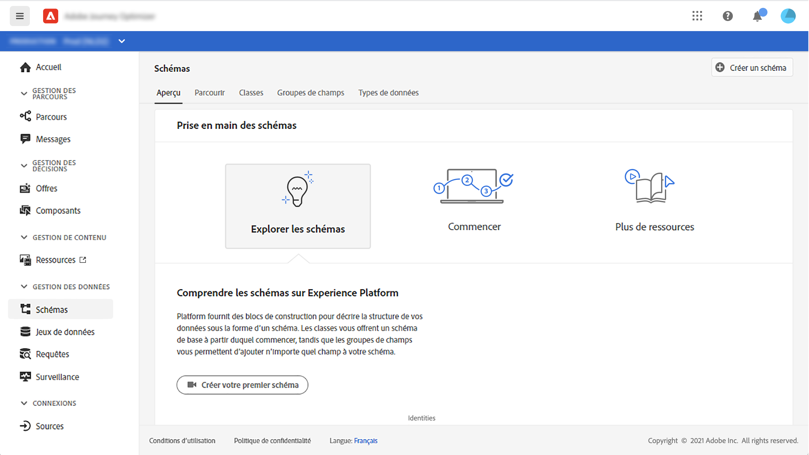
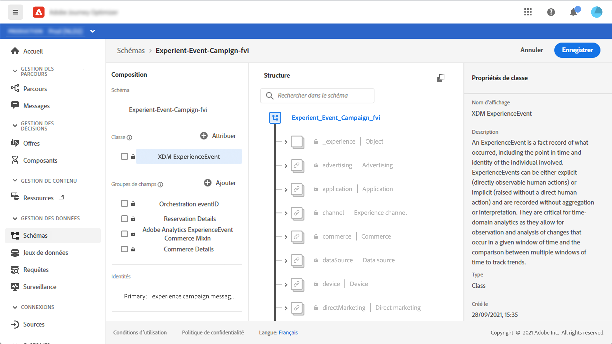
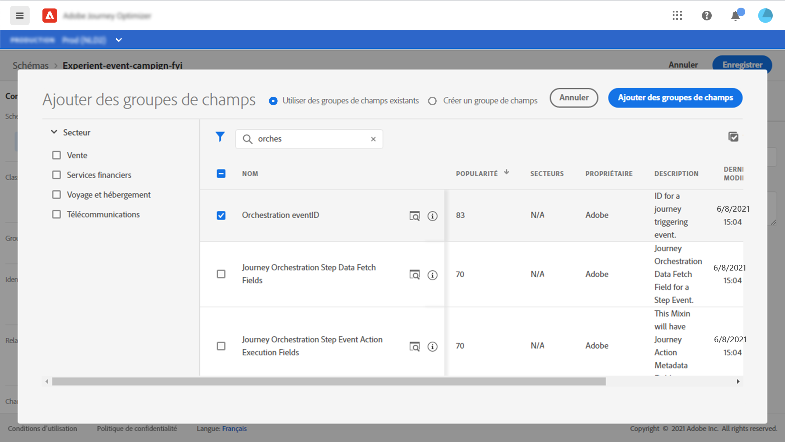
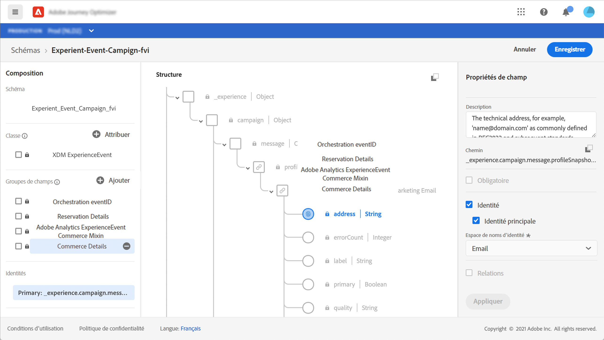
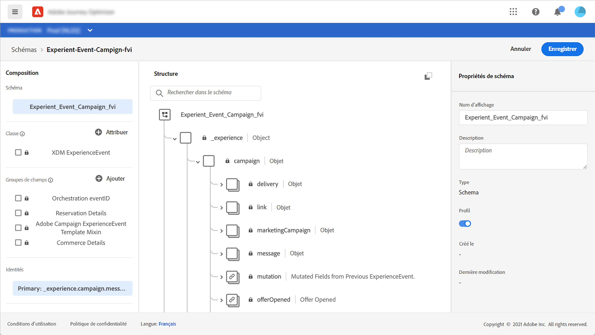
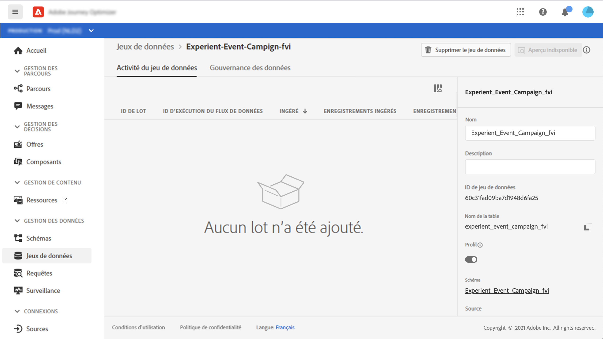
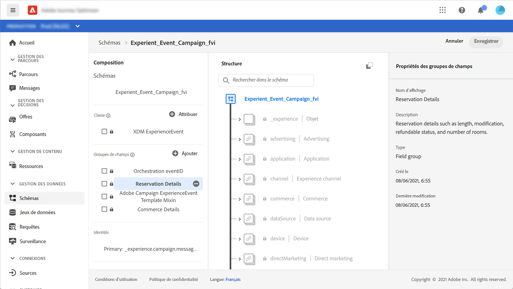
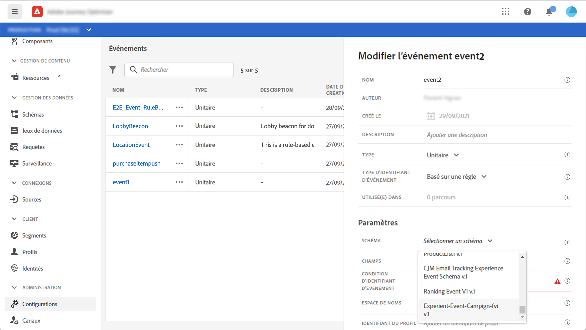

# À propos des schémas ExperienceEvent pour les événements [!DNL Journey Optimizer]

[!DNL Journey Optimizer] Les événements sont des Événements d’expérience XDM qui sont envoyés à Adobe Experience Platform par le biais d’une gestion en flux continu.

Par conséquent, une condition préalable importante pour configurer des événements pour [!DNL Journey Optimizer] est que vous connaissez le modèle de données d’expérience (ou XDM) de Adobe Experience Platform et que vous savez comment composer des schémas de Événement d’expérience XDM, ainsi que comment diffuser des données au format XDM vers Adobe Experience Platform.

## Schéma requis pour les événements [!DNL Journey Optimizer]

La première étape de la configuration d&#39;un événement pour [!DNL Journey Optimizer] consiste à s&#39;assurer qu&#39;un schéma XDM est défini pour représenter le événement et qu&#39;un jeu de données est créé pour enregistrer les instances du événement sur Adobe Experience Platform. Il n’est pas absolument nécessaire de disposer d’un jeu de données pour vos événements, mais envoyer les événements à un jeu de données spécifique permettra de conserver l’historique des événements des utilisateurs pour une consultation et une analyse ultérieures, ce qui est judicieux. Si vous n&#39;avez pas déjà un schéma et un jeu de données appropriés pour votre événement, ces deux tâches peuvent être faites dans l&#39;interface Web de Adobe Experience Platform.

Un schéma XDM destiné aux événements [!DNL Journey Optimizer] doit répondre aux exigences suivantes :

* Le schéma doit appartenir à la classe XDM ExperienceEvent.

   

* Pour les événements générés par le système, le schéma doit inclure le mixin eventID Orchestration. [!DNL Journey Optimizer] emploie ce champ pour identifier les événements utilisés dans les parcours.

   

* Vous devez déclarer un champ d’identité pour identifier le sujet de l’événement. Si aucune identité n’est spécifiée, un mapping d’identité peut être utilisée. Cela n’est pas recommandé.

   

* Si vous souhaitez que ces données soient disponibles pour une recherche ultérieure dans un parcours, marquez le schéma et le jeu de données pour le profil.

   

   

* N’hésitez pas à inclure des champs de données pour recueillir toutes les autres données contextuelles que vous souhaitez incorporer à l’événement, telles que des informations relatives à l’utilisateur, l’appareil à partir duquel l’événement a été généré, l’emplacement ou toute autre circonstance significative liée à l’événement.

   

   
