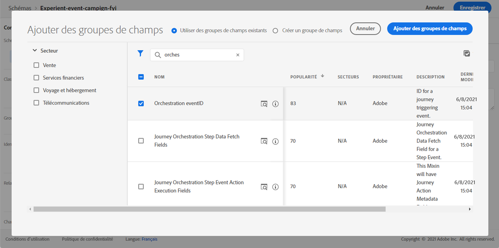
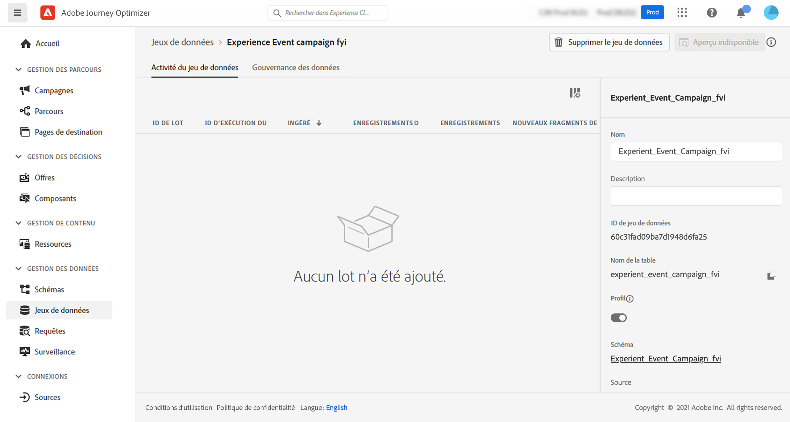

# À propos des schémas ExperienceEvent pour [!DNL Journey Optimizer] Événements {#about-experienceevent-schemas}

[!DNL Journey Optimizer] Les événements sont des événements d’expérience XDM envoyés à Adobe Experience Platform par l’intermédiaire de l’ingestion en flux continu.

Par conséquent, il s’agit d’un prérequis important pour la configuration des événements pour [!DNL Journey Optimizer] est que vous connaissez le modèle de données d’expérience (ou XDM) d’Adobe Experience Platform et que vous savez composer des schémas d’événement d’expérience XDM et diffuser des données au format XDM vers Adobe Experience Platform.

## Schéma requis pour [!DNL Journey Optimizer] Événements  {#schema-requirements}

Première étape de la configuration d’un événement pour [!DNL Journey Optimizer] est de vous assurer qu’un schéma XDM est défini pour représenter l’événement et qu’un jeu de données est créé pour enregistrer les instances de l’événement sur Adobe Experience Platform. Il n’est pas strictement nécessaire de disposer d’un jeu de données pour vos événements, mais envoyer les événements à un jeu de données spécifique vous permettra de conserver l’historique des événements des utilisateurs pour une référence et une analyse futures. C’est donc toujours une bonne idée. Si vous ne disposez pas déjà d’un schéma et d’un jeu de données appropriés pour votre événement, ces deux tâches peuvent être effectuées dans l’interface web d’Adobe Experience Platform.

Tout schéma XDM qui sera utilisé pour [!DNL Journey Optimizer] Les événements doivent répondre aux exigences suivantes :

* Le schéma doit appartenir à la classe XDM ExperienceEvent.

   

* Pour les événements générés par le système, le schéma doit inclure le groupe de champs eventID Orchestration. [!DNL Journey Optimizer] utilise ce champ pour identifier les événements utilisés dans les parcours.

   

* Déclarez un champ d’identité pour identifier le sujet de l’événement. Si aucune identité n’est spécifiée, une carte d’identité peut être utilisée. Ceci n’est pas recommandé.

   

* Si vous souhaitez que ces données soient disponibles pour une recherche ultérieure dans un parcours, marquez le schéma et le jeu de données du profil.

   

   

* N’hésitez pas à inclure des champs de données pour capturer toutes les autres données contextuelles que vous souhaitez inclure à l’événement, telles que des informations sur l’utilisateur, l’appareil à partir duquel l’événement a été généré, l’emplacement ou toute autre circonstance significative liée à l’événement.

   

   

## Utilisation des relations de schéma{#leverage_schema_relationships}

Adobe Experience Platform vous permet de définir des relations entre les schémas afin d’utiliser un jeu de données comme table de recherche pour un autre.

Supposons que votre modèle de données de marque comporte un schéma qui capture les achats. Vous disposez également d’un schéma pour le catalogue de produits. Vous pouvez capturer l’ID de produit dans le schéma d’achat et utiliser une relation pour rechercher des détails de produit plus complets dans le catalogue de produits. Cela vous permet de créer un segment pour tous les clients qui ont acheté un ordinateur portable, par exemple, sans avoir à répertorier explicitement tous les ID d’ordinateur portable ou à capturer tous les détails de produit dans les systèmes transactionnels.

Pour définir une relation, vous devez disposer d’un champ dédié dans le schéma source, dans ce cas le champ d’identifiant de produit dans le schéma d’achat. Ce champ doit référencer le champ ID du produit dans le schéma de destination. Les tables source et de destination doivent être activées pour les profils et le champ commun du schéma de destination doit être défini comme identité principale.

Voici le schéma de catalogue de produits activé pour le profil avec l’ID de produit défini comme identité principale.

Voici le schéma d’achat avec la relation définie dans le champ ID du produit.

>[!NOTE]
>
>En savoir plus sur les relations de schéma dans la section [Documentation d’Experience Platform](https://experienceleague.adobe.com/docs/platform-learn/tutorials/schemas/configure-relationships-between-schemas.html?lang=en).

Dans Journey Optimizer, vous pouvez ensuite exploiter tous les champs des tables liées :

* lors de la configuration d’un événement d’entreprise ou unitaire, [En savoir plus](../event/experience-event-schema.md#unitary_event_configuration)
* lors de l’utilisation de conditions dans un parcours, [En savoir plus](../event/experience-event-schema.md#journey_conditions_using_event_context)
* dans la personnalisation des messages, [En savoir plus](../event/experience-event-schema.md#message_personalization)
* dans la personnalisation d’action personnalisée, [En savoir plus](../event/experience-event-schema.md#custom_action_personalization_with_journey_event_context)

### Configuration des événements{#unitary_event_configuration}

Les champs de schéma associés sont disponibles dans la configuration unitaire et des événements métier :

* lorsque vous parcourez les champs de schéma d’événement dans l’écran de configuration d’événement.
* lors de la définition d’une condition pour les événements générés par le système.

Les champs liés ne sont pas disponibles :

* dans la formule de clé d’événement
* dans la condition d’identifiant d’événement (événements basés sur des règles)

Pour savoir comment configurer un événement unitaire, reportez-vous à cette section [page](../event/about-creating.md).

### Conditions de parcours à l’aide du contexte d’événement{#journey_conditions_using_event_context}

Vous pouvez utiliser les données d’une table de recherche liée à un événement utilisé dans un parcours pour la création de conditions (éditeur d’expression).

Ajoutez une condition dans un parcours, éditez l’expression et développez le noeud d’événement dans l’éditeur d’expression.

Pour savoir comment définir des conditions de parcours, reportez-vous à cette section [page](../building-journeys/condition-activity.md).

### Personnalisation des messages{#message_personalization}

Les champs liés sont disponibles lors de la personnalisation d&#39;un message. Les champs associés sont affichés dans le contexte transmis du parcours au message.

Pour savoir comment personnaliser un message avec des informations contextuelles sur le parcours, reportez-vous à cette section [page](../personalization/personalization-use-case.md).

### Personnalisation d’action personnalisée avec un contexte d’événement de parcours{#custom_action_personalization_with_journey_event_context}

Les champs liés sont disponibles lors de la configuration des paramètres d’action d’une activité d’action personnalisée de parcours.

Pour savoir comment utiliser des actions personnalisées, reportez-vous à cette section [page](../building-journeys/using-custom-actions.md).
