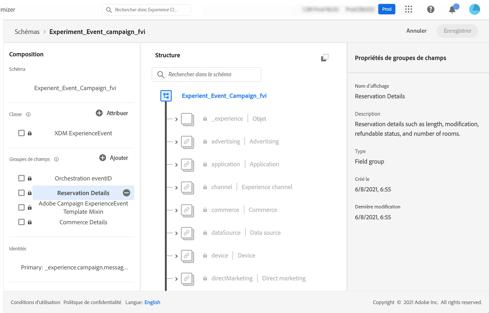

# À propos des schémas ExperienceEvent pour les événements [!DNL Journey Optimizer] {#about-experienceevent-schemas}

Les événements [!DNL Journey Optimizer] sont des événements d’expérience XDM envoyés à Adobe Experience Platform par l’intermédiaire de l’ingestion en flux continu.

À ce titre, il est important pour la configuration des événements dans [!DNL Journey Optimizer] de maîtriser le modèle de données d’expérience (ou XDM) d’Adobe Experience Platform et de savoir composer des schémas d’événements d’expérience XDM et diffuser des données au format XDM vers Adobe Experience Platform.

>[!CAUTION]
>
>Les recherches d’événements d’expérience dans les conditions de parcours ne sont plus prises en charge. Consultez d’autres bonnes pratiques ici. Si vous êtes face à un cas d’utilisation de parcours déclenché par un événement qui nécessite encore une recherche d’événements d’expérience et ne peut pas être pris en charge par une des autres options répertoriées, contactez votre représentant ou représentante Adobe afin que nous vous aidions à atteindre votre objectif.
>
>L’accès au contexte à partir de l’événement de démarrage d’un parcours n’est pas affecté.

## Schéma requis pour les événements [!DNL Journey Optimizer]  {#schema-requirements}

La première étape de la configuration d’un événement pour [!DNL Journey Optimizer] consiste à définir un schéma XDM pour représenter l’événement et à créer un jeu de données pour enregistrer les instances de l’événement dans Adobe Experience Platform. Il n’est pas absolument nécessaire de disposer d’un jeu de données pour vos événements. Cela dit, le fait d’envoyer les événements à un jeu de données spécifique permet de conserver l’historique des événements des personnes pour une consultation et une analyse ultérieures, ce qui est judicieux. Si vous ne disposez pas déjà d’un schéma et d’un jeu de données appropriés pour votre événement, il est possible de réaliser ces deux tâches dans l’interface web d’Adobe Experience Platform.

Tout schéma XDM utilisé pour les événements [!DNL Journey Optimizer] doit répondre aux exigences suivantes :

* Ce schéma doit être de la classe XDM ExperienceEvent.

  

* Pour les événements générés par le système, le schéma doit inclure le groupe de champs eventID Orchestration. [!DNL Journey Optimizer] emploie ce champ pour identifier les événements utilisés dans les parcours.

  

* Déclarez un champ d’identité pour l’identification des profils individuels dans l’événement. Si aucune identité n’est spécifiée, un mappage d’identités peut être utilisé. Cela n’est pas recommandé.

  

* Si vous souhaitez que ces données soient disponibles pour un profil, marquez le schéma et le jeu de données pour le profil. [En savoir plus](../data/lookup-aep-data.md)

  

  

* N’hésitez pas à inclure des champs de données pour capturer toutes les autres données contextuelles à inclure à l’événement, telles que des informations sur la personne, l’appareil à partir duquel l’événement a été généré, l’emplacement ou toute autre circonstance significative liée à l’événement.

  

  

<!--
## Leverage schema relationships{#leverage_schema_relationships}

Adobe Experience Platform allows you to define relationships between schemas in order to use one dataset as a lookup table for another. 

Let's say your brand data model has a schema capturing purchases. You also have a schema for the product catalog. You can capture the product ID in the purchase schema and use a relationship to look up more complete product details from the product catalog. This allows you to create an audience for all customers who bought a laptop, for example, without having to explicitly list out all laptop IDs or capture every single product details in transactional systems.

To define a relationship, you need to have a dedicated field in the source schema, in this case the product ID field in the purchase schema. This field needs to reference the product ID field in the destination schema. The source and destination tables must be enabled for profiles and the destination schema must have that common field defined as its primary identity. 

Here is the product catalog schema enabled for profile with the product ID defined as the primary identity. 

Here is the purchase schema with the relationship defined on the product ID field.

>[!NOTE]
>
>Learn more about schema relationships in the [Experience Platform documentation](https://experienceleague.adobe.com/docs/platform-learn/tutorials/schemas/configure-relationships-between-schemas.html).

In Journey Optimizer, you can then leverage all the fields from the linked tables:

* when configuring a business or unitary event, [Read more](../event/experience-event-schema.md#unitary_event_configuration) 
* when using conditions in a journey, [Read more](../event/experience-event-schema.md#journey_conditions_using_event_context) 
* in message personalization, [Read more](../event/experience-event-schema.md#message_personalization) 
* in custom action personalization, [Read more](../event/experience-event-schema.md#custom_action_personalization_with_journey_event_context) 

### Arrays{#relationships_limitations}

You can define a schema relationship on an array of strings, for example, a list of product IDs.

You can also define a schema relationship with an attribute inside of an array of objects, for example a list of purchase information (product ID, product name, price, discount). The lookup values will be available in journeys (conditions, custom actions, etc.) and message personalization. 

### Event configuration{#unitary_event_configuration}

The linked schema fields are available in unitary and business event configuration:

* when browsing through the event schema fields in the event configuration screen.
* when defining a condition for system-generated events.

The linked fields are not available:

* in the event key formula
* in event id condition (rule-based events)

To learn how to configure a unitary event, refer to this [page](../event/about-creating.md).

### Journey conditions using event context{#journey_conditions_using_event_context}

You can use data from a lookup table linked to an event used in a journey for condition building (expression editor).

Add a condition in a journey, edit the expression and unfold the event node in the expression editor. 

To learn how to define journey conditions, refer to this [page](../building-journeys/condition-activity.md).

### Message personalization{#message_personalization}

The linked fields are available when personalizing a message. The related fields are displayed in the context passed from the journey to the message.

To learn how to personalize a message with contextual journey information, refer to this [page](../personalization/personalization-use-case.md).

### Custom action personalization with journey event context{#custom_action_personalization_with_journey_event_context}

The linked fields are available when configuring the action parameters of a journey custom action activity. 

To learn how to use custom actions, refer to this [page](../building-journeys/using-custom-actions.md).
-->
