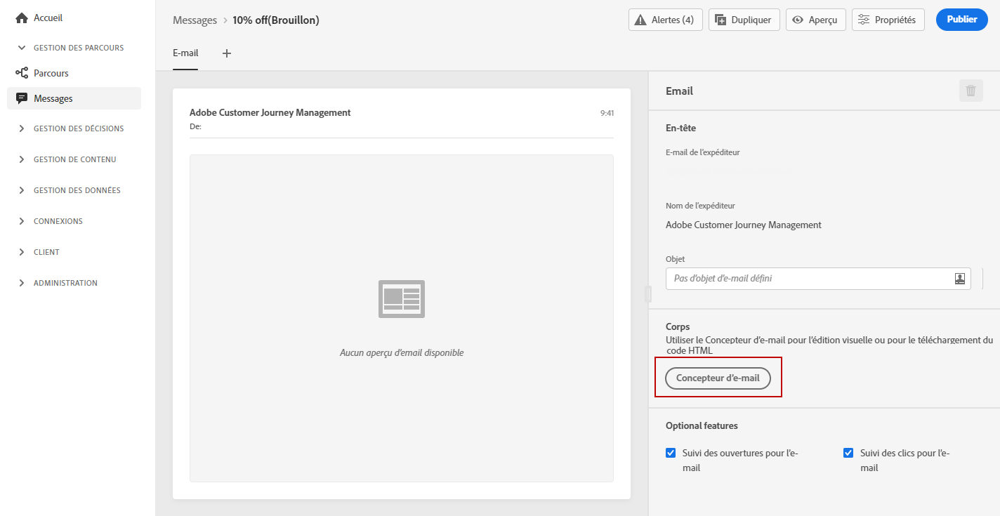
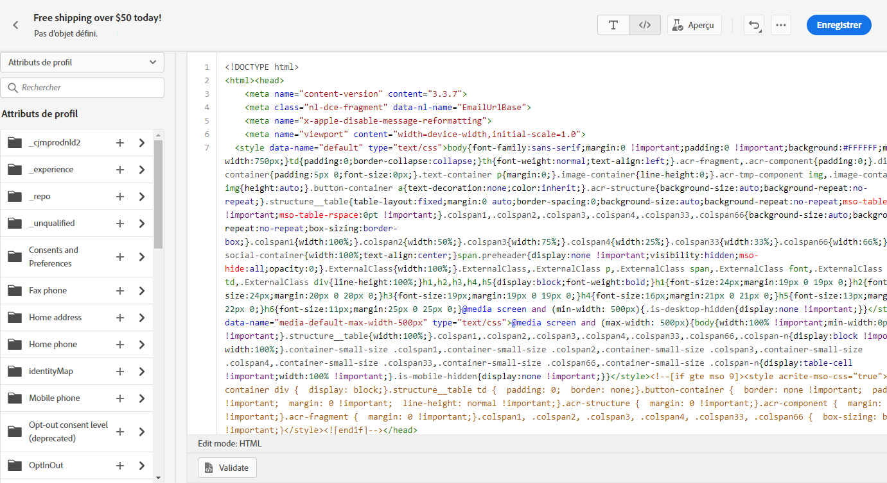
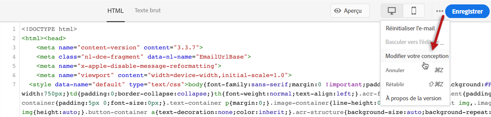
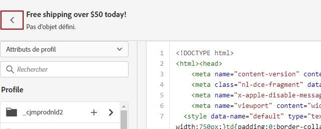
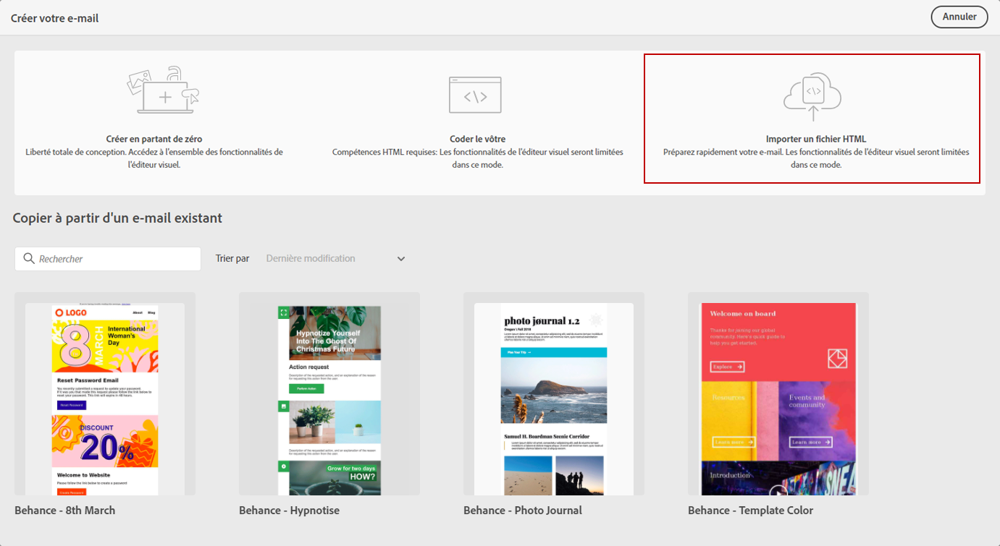
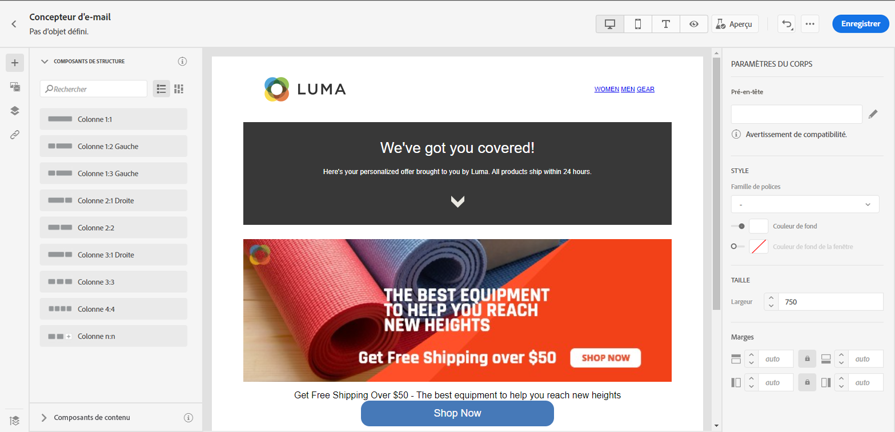

# Importer ou coder votre contenu de courriel {#existing-content}

Journey Optimizer vous permet d’importer du contenu HTML existant pour concevoir vos courriels. Ce contenu peut être du code HTML brut ou du contenu provenant d’un fichier HTML existant ou d’un dossier zip.

Pour coder du contenu HTML ou importer du contenu existant, procédez comme suit :

1. [Créer un message](create-message.md)

1. Ouvrez **[!UICONTROL Concepteur de courriers électroniques]** dans la section **[!UICONTROL Modifier le contenu]**.

   

1. Sélectionnez **[!UICONTROL Code votre propre]** ou **[!UICONTROL Importer HTML]**. Reportez-vous aux sections ci-dessous pour connaître les étapes suivantes.

## Code votre propre {#import-raw-html-code}

Utilisez le mode **[!UICONTROL Code votre propre]** pour importer du code HTML brut et/ou coder votre contenu de courrier électronique. Cette méthode nécessite des compétences HTML.

>[!CAUTION]
>
> Les images de [Adobe Experience Manager Assets Essentials](assets-essentials.md) ne peuvent pas être référencées lors de l’utilisation de cette méthode. Les images référencées dans votre code HTML doivent être stockées dans un emplacement public.

1. Dans la page d&#39;accueil e-mail Designer, sélectionnez **[!UICONTROL Code votre propre]**.

   

1. Entrez ou collez votre code HTML brut.

1. Utilisez le volet de gauche pour tirer parti des fonctionnalités de personnalisation [!DNL Journey Optimizer]. Voir à ce propos [cette section](personalization/personalize.md).

   

1. Si vous souhaitez ouvrir le concepteur de messagerie pour début votre courrier électronique à partir d’une nouvelle conception, sélectionnez **[!UICONTROL Modifier votre conception]** dans le menu d’options.

   

1. Cliquez sur le bouton **[!UICONTROL Prévisualisation]** pour vérifier la conception et la personnalisation des messages à l’aide de profils de test. Voir à ce propos [cette section](preview.md).

   

1. Une fois votre code prêt, cliquez sur **[!UICONTROL Enregistrer]**, puis revenez à l’écran de création du message pour finaliser votre message.

   

## Importer du code HTML {#import-html-content-from-file}

Vous pouvez importer du contenu HTML dans le concepteur de messages électroniques. Ce contenu peut être :

* Un **fichier HTML** avec une feuille de style incorporée,
* Un dossier **.zip** avec le fichier HTML, la feuille de style (.css) et les images.

   >[!NOTE]
   >
   >Il n’existe aucune contrainte sur la structure des fichiers .zip. Cependant, les références doivent être relatives et s’ajuster à l’arborescence du dossier .zip.

Pour importer un fichier contenant du contenu HTML, procédez comme suit :

1. Dans la page d&#39;accueil E-mail Designer, sélectionnez **[!UICONTROL Importer du code HTML]**.

   

1. Faites glisser et déposez le fichier HTML ou .zip contenant votre contenu HTML.

1. Une fois le contenu HTML téléchargé, vous pouvez tirer parti des fonctions de Designer de messagerie pour modifier et prévisualisation votre courrier électronique. [En savoir plus dans cette section](create-email-content.md).

   
