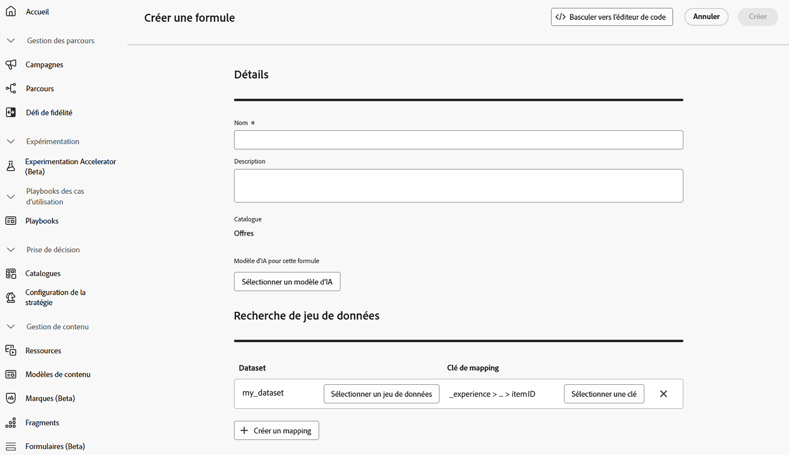

# Utilisation des données Adobe Experience Platform pour la prise de décision{#aep-data}

>[!CONTEXTUALHELP]
>id="ajo_exd_rules_dataset_lookup"
>title="Recherche de jeu de données"
>abstract="L’utilisation des données Adobe Experience Platform dans les règles de décision vous permet de définir des critères d’éligibilité en fonction d’attributs externes dynamiques, en veillant à ce que les éléments de décision ne soient affichés que lorsque cela est pertinent. Créez un mappage pour définir la manière dont le jeu de données Adobe Experience Platform se joint aux données dans [!DNL Journey Optimizer]. Sélectionnez le jeu de données avec les attributs dont vous avez besoin et choisissez une clé de liaison qui existe à la fois dans les attributs d’élément de décision et dans le jeu de données."

>[!CONTEXTUALHELP]
>id="ajo_exd_formula_dataset_lookup"
>title="Recherche de jeu de données"
>abstract="Les formules de classement définissent la priorité des éléments de décision. En utilisant [!DNL Adobe Experience Platform] attributs de jeu de données, vous pouvez ajuster dynamiquement la logique de classement pour refléter des conditions réelles. Créez un mappage pour définir la manière dont le jeu de données Adobe Experience Platform se joint aux données dans [!DNL Journey Optimizer]. Sélectionnez le jeu de données avec les attributs dont vous avez besoin et choisissez une clé de liaison qui existe à la fois dans les attributs d’élément de décision et dans le jeu de données"

>[!AVAILABILITY]
>
>Cette fonctionnalité est actuellement disponible à tous les clients sous la forme d’une version bêta publique. Veuillez contacter votre représentant de compte si vous souhaitez accéder à cette fonctionnalité

[!DNL Journey Optimizer] vous permet d’exploiter les données de [!DNL Adobe Experience Platform] pour la prise de décision. Cela vous permet d’étendre la définition de vos attributs de décision aux données supplémentaires des jeux de données pour les mises à jour en bloc qui changent régulièrement sans avoir à mettre à jour manuellement les attributs un par un. Par exemple, la disponibilité, les temps d’attente, etc.

## Restrictions et directives de la version bêta {#guidelines}

Avant de commencer, prenez note des restrictions et directives suivantes :

* Une politique de décision peut référencer jusqu’à 3 jeux de données au total, pour toutes ses règles de décision et formules de classement combinées. Par exemple, si vos règles utilisent 2 jeux de données, vos formules ne peuvent utiliser qu’un seul jeu de données supplémentaire.
* Une règle de décision peut utiliser 3 jeux de données.
* Une formule de classement peut utiliser 3 jeux de données.
* Lorsqu’une politique de décision est évaluée, le système exécute jusqu’à 1 000 requêtes de jeux de données (recherches) au total. Chaque mappage de jeu de données utilisé par un élément de décision compte comme une requête. Exemple : si un élément de décision utilise 2 jeux de données, l’évaluation de cette offre compte comme 2 requêtes vers la limite de 1 000 requêtes.

## Activer un jeu de données pour la recherche de données {#enable}

Pour utiliser les données d’un jeu de données [!DNL Adobe Experience Platform] pour la prise de décision, vous devez d’abord les activer pour la recherche via un appel API. Pour obtenir des instructions détaillées, consultez cette section : [Utilisation de jeux de données Adobe Experience Platform dans Journey Optimizer](../data/lookup-aep-data.md).

## Utilisation des données Adobe Experience Platform pour la prise de décision

Une fois qu’un jeu de données est activé pour la recherche, vous pouvez utiliser ses attributs pour enrichir votre logique de décision avec des données externes. Cela s’avère particulièrement utile pour les attributs qui changent fréquemment, tels que la disponibilité des produits ou la tarification en temps réel.

Les attributs des jeux de données Adobe Experience Platform peuvent être utilisés dans deux parties de la logique de décision :

* **Règles de décision** : permet de définir si un élément de décision peut être affiché.
* **Formules de classement** : hiérarchisez les éléments de décision en fonction de données externes.

Les sections suivantes expliquent comment utiliser les données Adobe Experience Platform dans les deux contextes.

### Règles de décision {#rules}

L’utilisation des données Adobe Experience Platform dans les règles de décision vous permet de définir des critères d’éligibilité en fonction d’attributs externes dynamiques, en veillant à ce que les éléments de décision ne soient affichés que lorsque cela est pertinent.

Supposons, par exemple, qu’un retailer en ligne souhaite promouvoir des recommandations de produits basées sur les stocks des magasins locaux. Un produit ne devrait pouvoir faire l&#39;objet d&#39;une recommandation que s&#39;il est en stock à l&#39;emplacement le plus proche. Un jeu de données contenant des mises à jour d’inventaire quotidiennes est chargé dans Adobe Experience Platform. La logique de règle vérifie si la `inventory_count` d’un produit donné est supérieure à 0 pour le magasin préféré du client ou de la cliente. Si tel est le cas, l’élément de décision est éligible.

Pour utiliser les données Adobe Experience Platform dans les règles de décision, procédez comme suit :

1. Accédez au menu **[!UICONTROL Configuration de la stratégie]** / **[!UICONTROL Règles de décision]** et sélectionnez **[!UICONTROL Créer une règle avec un jeu de données]**.

   

1. Cliquez sur **[!UICONTROL Créer un mappage]** pour définir comment le jeu de données Adobe Experience Platform se joint aux données dans [!DNL Journey Optimizer].

   * Sélectionnez le jeu de données avec les attributs dont vous avez besoin.
   * Sélectionnez une clé de jointure (par exemple, ID de produit ou ID de magasin) qui existe à la fois dans les attributs d&#39;élément de décision et dans le jeu de données.

   

   >[!NOTE]
   >
   >Vous pouvez créer jusqu’à 3 mappages par règle.

1. Cliquez sur **[!UICONTROL Continuer]**. Vous pouvez désormais accéder aux attributs du jeu de données dans le menu **[!UICONTROL Recherche de jeu de données]** et les utiliser dans vos conditions de règle. [Découvrir comment créer une règle de décision](../experience-decisioning/rules.md#create)

   

### Formules de classement

Les formules de classement définissent la priorité des éléments de décision. En utilisant [!DNL Adobe Experience Platform] attributs de jeu de données, vous pouvez ajuster dynamiquement la logique de classement pour refléter des conditions réelles.

Supposons, par exemple, qu’une compagnie aérienne utilise une formule de classement pour prioriser les offres de surclassement. Si un client ou une cliente a un niveau de fidélité élevé et que la disponibilité actuelle des places est faible (en fonction d’un jeu de données mis à jour toutes les heures), la priorité lui est accordée. Le jeu de données comprend des champs tels que `flight_number`, `available_seats` et `loyalty_score`.

Pour utiliser les données de Adobe Experience Platform dans les formules de classement, procédez comme suit :

1. Créer ou modifier une formule de classement. Dans la section **[!UICONTROL Recherche de jeu de données]**, cliquez sur **[!UICONTROL Créer un mappage]**.

1. Définissez le mappage du jeu de données :

   * Sélectionnez le jeu de données approprié (par exemple, disponibilité des sièges par vol).
   * Sélectionnez une clé de jointure (par exemple, le numéro de vol ou l’ID client) qui existe à la fois dans les attributs d’élément de décision et dans le jeu de données.

   

   >[!NOTE]
   >
   >Vous pouvez créer jusqu’à 3 mappages par formule de classement.

1. Utilisez les champs du jeu de données pour créer votre formule de classement comme d’habitude. [Découvrez comment créer une formule de classement](../experience-decisioning/exd-ranking-formulas.md#create-ranking-formula)

   
