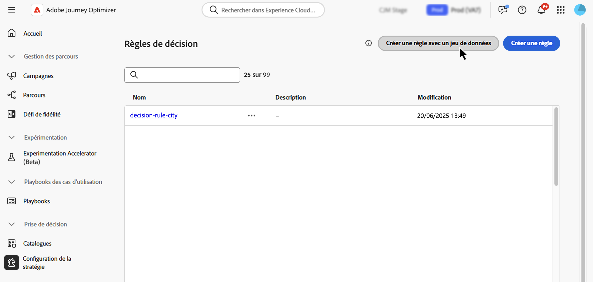

# Utiliser des données Adobe Experience Platform à des fins de prise de décision {#aep-data}

>[!CONTEXTUALHELP]
>id="ajo_exd_rules_dataset_lookup"
>title="Recherche de jeu de données"
>abstract="L’utilisation des données Adobe Experience Platform dans les règles de décision vous permet de définir des critères d’éligibilité en fonction d’attributs externes dynamiques, en veillant à ce que les éléments de décision ne soient affichés que lorsque cela est pertinent. Créez un mappage pour définir la manière dont le jeu de données Adobe Experience Platform se joint aux données dans [!DNL Journey Optimizer]. Sélectionnez le jeu de données avec les attributs dont vous avez besoin et choisissez une clé de jointure qui existe à la fois dans les attributs d’élément de décision et dans le jeu de données."

>[!CONTEXTUALHELP]
>id="ajo_exd_formula_dataset_lookup"
>title="Recherche de jeu de données"
>abstract="Les formules de classement définissent la priorité des éléments de décision. En utilisant des attributs de jeu de données [!DNL Adobe Experience Platform], vous pouvez ajuster dynamiquement la logique de classement pour refléter des conditions réelles. Créez un mappage pour définir la manière dont le jeu de données Adobe Experience Platform se joint aux données dans [!DNL Journey Optimizer]. Sélectionnez le jeu de données avec les attributs dont vous avez besoin et choisissez une clé de jointure qui existe à la fois dans les attributs d’élément de décision et dans le jeu de données."

>[!AVAILABILITY]
>
>Cette fonctionnalité est actuellement disponible pour tous les clients sous la forme d’une version à disponibilité limitée.

[!DNL Journey Optimizer] vous permet d’exploiter les données d’[!DNL Adobe Experience Platform] pour la prise de décision. Vous pouvez ainsi étendre la définition des attributs de décision aux données supplémentaires des jeux de données pour les mises à jour en masse qui changent régulièrement sans avoir à mettre à jour manuellement les attributs un par un. Par exemple, la disponibilité, les temps d’attente, etc.

Avant de commencer, les jeux de données nécessaires à la personnalisation de la recherche doivent d’abord être activés pour la recherche. Vous trouverez des informations détaillées dans cette section : [Utilisation des données Adobe Experience Platform](../data/lookup-aep-data.md).

## Mécanismes de sécurisation et limitations {#guidelines}

Avant de commencer, consultez les restrictions et les directives suivantes :

* Une politique de décision peut référencer jusqu’à 3 jeux de données au total, pour toutes ses règles de décision et formules de classement combinées. Par exemple, si vos règles utilisent 2 jeux de données, vos formules ne peuvent utiliser qu’un seul jeu de données supplémentaire.
* Une règle de décision peut utiliser 3 jeux de données.
* Une formule de classement peut utiliser 3 jeux de données.
* Lorsqu’une politique de décision est évaluée, le système exécute jusqu’à 1 000 requêtes (recherches) de jeux de données au total. Chaque mappage de jeu de données utilisé par un élément de décision compte comme une requête. Exemple : si un élément de décision utilise 2 jeux de données, l’évaluation de cette offre compte comme 2 requêtes dans la limite des 1 000 requêtes.

## Utiliser des données Adobe Experience Platform {#leverage-aep-data}

Une fois qu’un jeu de données est activé pour la recherche, vous pouvez utiliser ses attributs pour enrichir votre logique de décision avec des données externes. Cela s’avère particulièrement utile pour les attributs qui changent fréquemment, tels que la disponibilité des produits ou la tarification en temps réel.

Les attributs des jeux de données Adobe Experience Platform peuvent être utilisés dans deux parties de la logique de décision :

* **Règles de décision** : définissent si un élément de décision peut être affiché.
* **Formules de classement** : définissent la priorité des éléments de décision en fonction de données externes.

Les sections suivantes expliquent comment utiliser des données Adobe Experience Platform dans les deux contextes.

### Règles de décision {#rules}

L’utilisation des données Adobe Experience Platform dans les règles de décision vous permet de définir des critères d’éligibilité en fonction d’attributs externes dynamiques, ce qui garantit que les éléments de décision s’afficheront au moment approprié.

Supposons, par exemple, qu’un détaillant en ligne souhaite mettre en avant des recommandations de produits en fonction des stocks des magasins locaux. Un produit ne doit pouvoir faire l’objet d’une recommandation que s’il est en stock à l’emplacement le plus proche. Un jeu de données contenant des mises à jour de stock quotidiennes est chargé dans Adobe Experience Platform. La logique de règle vérifie si la valeur `inventory_count` d’un produit donné est supérieure à 0 pour le magasin préféré du client ou de la cliente. Si tel est le cas, l’élément de décision est éligible.

Pour utiliser les données Adobe Experience Platform dans des règles de décision, procédez comme suit :

1. Accédez au menu **[!UICONTROL Configuration de la stratégie]**/**[!UICONTROL Règles de décision]** et sélectionnez **[!UICONTROL Créer une règle avec un jeu de données]**.

   

1. Cliquez sur **[!UICONTROL Créer un mappage]** pour définir la manière dont le jeu de données Adobe Experience Platform se joint aux données dans [!DNL Journey Optimizer].

   * Sélectionnez le jeu de données avec les attributs dont vous avez besoin.
   * Sélectionnez une clé de jointure (par exemple, un identifiant de produit ou un identifiant de magasin) qui existe à la fois dans les attributs de l’élément de décision et dans le jeu de données.

   

   >[!NOTE]
   >
   >Vous pouvez créer jusqu’à 3 mappages par règle.

1. Cliquez sur **[!UICONTROL Continuer]**. Vous pouvez désormais accéder aux attributs du jeu de données dans le menu **[!UICONTROL Recherche dans un jeu de données]** et les utiliser dans vos conditions de règle. [Découvrez comment créer une règle de décision.](../experience-decisioning/rules.md#create)

   

### Formules de classement {#ranking-formulas}

Les formules de classement définissent la priorité des éléments de décision. En utilisant des attributs de jeu de données [!DNL Adobe Experience Platform], vous pouvez ajuster dynamiquement la logique de classement pour refléter des conditions réelles.

Supposons, par exemple, qu’une compagnie aérienne utilise une formule de classement pour définir la priorité des offres de surclassement. Si un client ou une cliente dispose d’un niveau de fidélité élevé et que la disponibilité actuelle des sièges est faible (selon un jeu de données mis à jour toutes les heures), une priorité supérieure lui est alors accordée. Le jeu de données comprend des champs tels que `flight_number`, `available_seats` et `loyalty_score`.

Pour utiliser les données d’Adobe Experience Platform dans des formules de classement, procédez comme suit :

1. Créez ou modifiez une formule de classement. Dans la section **[!UICONTROL Recherche dans un jeu de données]**, cliquez sur **[!UICONTROL Créer un mappage]**.

1. Définissez le mappage du jeu de données :

   * Sélectionnez le jeu de données approprié (par exemple, la disponibilité des sièges par vol).
   * Sélectionnez une clé de jointure (par exemple, le numéro de vol ou l’identifiant client) qui existe à la fois dans les attributs de l’élément de décision et dans le jeu de données.

   

   >[!NOTE]
   >
   >Vous pouvez créer jusqu’à 3 mappages par formule de classement.

1. Utilisez les champs du jeu de données pour créer votre formule de classement de la manière habituelle. [Découvrez comment créer une formule de classement.](ranking/ranking-formulas.md#create-ranking-formula)

   
