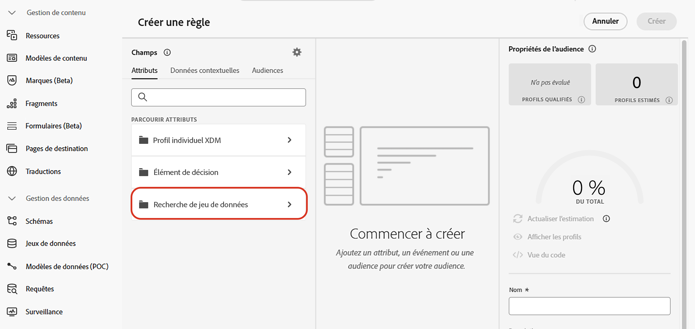

# Utiliser des données Adobe Experience Platform à des fins de prise de décision {#aep-data}

>[!CONTEXTUALHELP]
>id="ajo_exd_catalogs_dataset"
>title="Recherche de jeu de données"
>abstract="Pour utiliser des attributs d’Adobe Experience Platform pour la prise de décision, vous devez créer un mappage pour définir la manière dont le jeu de données Adobe Experience Platform s’associe aux données dans [!DNL Journey Optimizer]."

>[!CONTEXTUALHELP]
>id="ajo_exd_catalogs_dataset_create"
>title="Recherche de jeu de données"
>abstract="Sélectionnez le jeu de données avec les attributs dont vous avez besoin parmi tous les jeux de données Adobe Experience Platform qui ont été activés pour la recherche, puis sélectionnez une clé de mappage (par exemple, le numéro de vol ou l’ID de client ou cliente) qui existe à la fois dans les attributs d’élément de décision et dans le jeu de données."

>[!CONTEXTUALHELP]
>id="ajo_exd_rules_dataset_lookup"
>title="Recherche de jeu de données"
>abstract="Sélectionnez le jeu de données Adobe Experience Platform avec les attributs dont vous avez besoin. Si le jeu de données ne s’affiche pas dans la liste, assurez-vous de l’avoir activé pour la recherche et d’avoir créé un mappage de recherche de jeu de données."

>[!CONTEXTUALHELP]
>id="ajo_exd_formula_dataset_lookup"
>title="Recherche de jeu de données"
>abstract="En utilisant des attributs de jeu de données [!DNL Adobe Experience Platform], vous pouvez ajuster dynamiquement la logique de classement pour refléter des conditions réelles. Cliquez sur **[!UICONTROL Ajouter un jeu de données]** pour sélectionner le jeu de données Adobe Experience Platform avec les attributs dont vous avez besoin. Si le jeu de données ne s’affiche pas dans la liste, assurez-vous de l’avoir activé pour la recherche et d’avoir créé un mappage de recherche de jeu de données."

>[!CONTEXTUALHELP]
>id="ajo_exd_item_capping_dataset"
>title="Ajouter un jeu de données"
>abstract="Utilisez des attributs de jeux de données [!DNL Adobe Experience Platform] pour définir des critères de limitation en fonction d’attributs dynamiques externes. Cliquez sur **[!UICONTROL Ajouter un jeu de données]** pour sélectionner le jeu de données Adobe Experience Platform avec les attributs dont vous avez besoin. Si le jeu de données ne s’affiche pas dans la liste, assurez-vous de l’avoir activé pour la recherche et d’avoir créé un mappage de recherche de jeu de données."

[!DNL Journey Optimizer] vous permet d’exploiter les données d’[!DNL Adobe Experience Platform] pour la prise de décision. Vous pouvez ainsi étendre la définition des attributs de décision aux données supplémentaires des jeux de données pour les mises à jour en masse qui changent régulièrement sans avoir à mettre à jour manuellement les attributs un par un. Par exemple, la disponibilité, les temps d’attente, etc.

>[!AVAILABILITY]
>
>Cette fonctionnalité est actuellement en disponibilité limitée pour l’ensemble des clients et clientes.

## Mécanismes de sécurisation et limitations {#guardrails}

* **Canaux pris en charge** - La recherche de jeux de données avec la prise de décision fonctionne pour tous les canaux pour lesquels la prise de décision est disponible : expérience basée sur le code (entrant), e-mail, notification push, SMS et le nœud de décision de contenu dans parcours.
* **Utilisation des attributs** - La fonctionnalité de recherche de jeu de données pour la prise de décisions étend les définitions d’élément de décision avec des attributs supplémentaires - elle n’étend pas les attributs aux profils.
* **Limites de recherche** : [!DNL Journey Optimizer] prend en charge jusqu’à 1 000 recherches par politique de décision.

## Conditions préalables

### Activer des jeux de données pour la recherche

Avant de commencer, les jeux de données nécessaires à la prise de décision doivent être activés pour la recherche. Suivez les étapes présentées dans cette section : [Utiliser les données d’Adobe Experience Platform](../data/lookup-aep-data.md).

### Créer des mappages

Pour utiliser des attributs Adobe Experience Platform pour la prise de décision, vous devez créer un mappage afin de définir la manière dont le jeu de données Adobe Experience Platform s’associe aux données dans [!DNL Journey Optimizer]. Pour ce faire, procédez comme suit :

1. Accédez à **[!UICONTROL Catalogues]** / **[!UICONTROL Recherche de jeu de données]**, puis cliquez sur **[!UICONTROL Créer]**.

   

1. Configurez le mappage :

   1. Cliquez sur **[!UICONTROL Sélectionner un jeu de données]** pour afficher tous les jeux de données Adobe Experience Platform qui ont été activés pour la recherche. Sélectionnez le jeu de données avec les attributs dont vous avez besoin.

   1. Cliquez sur **[!UICONTROL Sélectionner une clé]** afin de choisir une clé de jointure (par exemple, le numéro de vol ou l’ID client) qui existe à la fois dans les attributs de l’élément de décision et dans le jeu de données.

   

1. Cliquez sur **[!UICONTROL Enregistrer]**.

## Utiliser des données Adobe Experience Platform {#leverage-aep-data}

Une fois que vous avez activé le jeu de données pour la recherche et que vous avez créé les mappages, vous pouvez utiliser ses attributs pour enrichir votre logique de décision avec des données externes. Cela s’avère particulièrement utile pour les attributs qui changent fréquemment, tels que la disponibilité des produits ou la tarification en temps réel.

Les attributs des jeux de données Adobe Experience Platform peuvent être utilisés dans deux parties de la logique de décision :

* **Règles de décision** : définissent si un élément de décision peut être affiché.
* **Formules de classement** : définissent la priorité des éléments de décision en fonction de données externes.
* **Règles de limitation** : utilisez des données externes pour calculer le seuil des règles de limitation.

Les sections suivantes expliquent comment utiliser les données d’Adobe Experience Platform dans ces contextes.

### Règles de décision {#rules}

L’utilisation des données Adobe Experience Platform dans les règles de décision vous permet de définir des critères d’éligibilité en fonction d’attributs externes dynamiques, ce qui garantit que les éléments de décision s’afficheront au moment approprié.

Supposons, par exemple, qu’un détaillant en ligne souhaite mettre en avant des recommandations de produits en fonction des stocks des magasins locaux. Un produit ne doit pouvoir faire l’objet d’une recommandation que s’il est en stock à l’emplacement le plus proche. Un jeu de données contenant des mises à jour de stock quotidiennes est chargé dans Adobe Experience Platform. La logique de règle vérifie si la valeur `inventory_count` d’un produit donné est supérieure à 0 pour le magasin préféré du client ou de la cliente. Si tel est le cas, l’élément de décision est éligible.

Pour utiliser les données Adobe Experience Platform dans des règles de décision, procédez comme suit :

1. Accédez au menu **[!UICONTROL Configuration de la stratégie]**/**[!UICONTROL Règles de décision]** et sélectionnez **[!UICONTROL Créer une règle avec un jeu de données]**.

   

1. Cliquez sur **[!UICONTROL Ajouter un jeu de données]**, puis sélectionnez le jeu de données avec les attributs dont vous avez besoin.

   

1. Cliquez sur **[!UICONTROL Continuer]**. Vous pouvez désormais accéder aux attributs du jeu de données dans le menu **[!UICONTROL Recherche dans un jeu de données]** et les utiliser dans vos conditions de règle. [Découvrez comment créer une règle de décision.](../experience-decisioning/rules.md#create)

   

### Formules de classement {#ranking-formulas}

Les formules de classement définissent la priorité des éléments de décision. En utilisant des attributs de jeu de données [!DNL Adobe Experience Platform], vous pouvez ajuster dynamiquement la logique de classement pour refléter des conditions réelles.

Supposons, par exemple, qu’une compagnie aérienne utilise une formule de classement pour définir la priorité des offres de surclassement. Si un client ou une cliente dispose d’un niveau de fidélité élevé et que la disponibilité actuelle des sièges est faible (selon un jeu de données mis à jour toutes les heures), une priorité supérieure lui est alors accordée. Le jeu de données comprend des champs tels que `flight_number`, `available_seats` et `loyalty_score`.

Pour utiliser les données d’Adobe Experience Platform dans des formules de classement, procédez comme suit :

1. Créez ou modifiez une formule de classement.

1. Dans la section **[!UICONTROL Recherche d’un jeu de données]**, cliquez sur **[!UICONTROL Ajouter un jeu de données]**.

1. Sélectionnez le jeux de données approprié.

   

   >[!NOTE]
   >
   >Si le jeu de données que vous recherchez ne s’affiche pas dans la liste, assurez-vous de l’avoir activé pour la recherche et d’avoir créé un mappage de recherche de jeu de données. Pour plus d’informations, consultez la section [Conditions préalables](#prerequisites).

1. Utilisez les champs du jeu de données pour créer votre formule de classement de la manière habituelle. [Découvrez comment créer une formule de classement.](ranking/ranking-formulas.md#create-ranking-formula)

   

### Règles de limitation {#capping-rules}

Les règles de limitation sont utilisées comme contraintes pour définir le nombre maximal de fois où un élément de décision peut être présenté. L’utilisation de données d’Adobe Experience Platform dans les règles de limitation vous permet de définir des critères de limitation en fonction d’attributs externes dynamiques. Pour ce faire, utilisez une expression dans votre règle de limitation pour calculer le seuil de limitation souhaité.

Par exemple, un détaillant peut limiter une offre en fonction du stock de produits en temps réel. Au lieu de définir un seuil fixe de 500, il utilise une expression qui référence le champ `inventory_count` d’un jeu de données Adobe Experience Platform. Si le jeu de données indique qu’il reste 275 articles en stock, l’offre sera limitée à ce nombre.

>[!NOTE]
>
>Les **expressions** des règles de limitation sont actuellement en disponibilité limitée pour l’ensemble des utilisateurs et utilisatrices et ne sont prises en charge que pour le type de limitation **[!UICONTROL Au total]**.

Pour utiliser les données Adobe Experience Platform dans des expressions de règles de limitation, procédez comme suit :

1. Créez ou modifiez un élément de décision.

1. Lors de la définition de l’éligibilité de l’élément, cliquez sur **[!UICONTROL Ajouter un jeu de données]** et sélectionnez le jeu de données approprié.

   

   >[!NOTE]
   >
   >Si le jeu de données que vous recherchez ne s’affiche pas dans la liste, assurez-vous de l’avoir activé pour la recherche et d’avoir créé un mappage de recherche de jeu de données. Pour plus d’informations, consultez la section [Conditions préalables](#prerequisites).

1. Sélectionnez le type de limitation **[!UICONTROL Au total]** puis activez l’option **[!UICONTROL Expression]**.

   

   >[!NOTE]
   >
   >Si le jeu de données que vous recherchez ne s’affiche pas dans la liste, assurez-vous de l’avoir activé pour la recherche et d’avoir créé un mappage de recherche de jeu de données. Pour plus d’informations, consultez la section [Conditions préalables](#prerequisites).

1. Modifiez l’expression et utilisez les champs du jeu de données pour créer votre expression.

   

1. Effectuez la configuration de votre élément de décision de limitation et de règle comme d’habitude. [Découvrir comment définir des règles de limitation](../experience-decisioning/items.md#capping)
