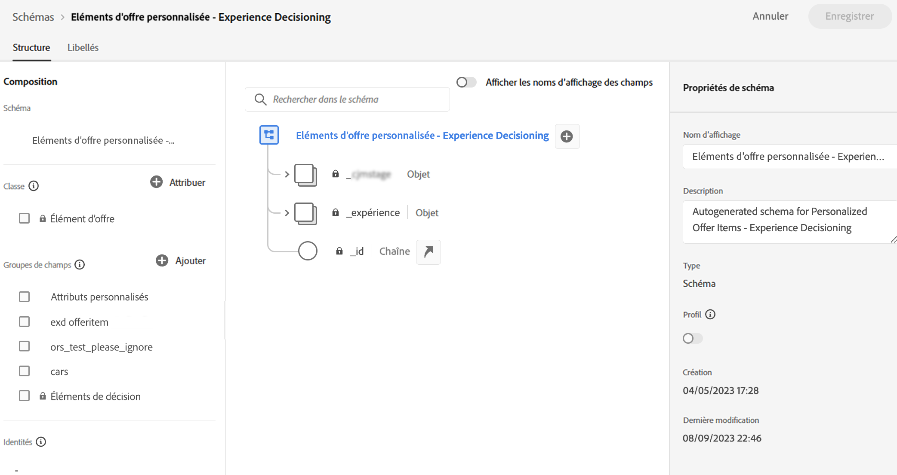
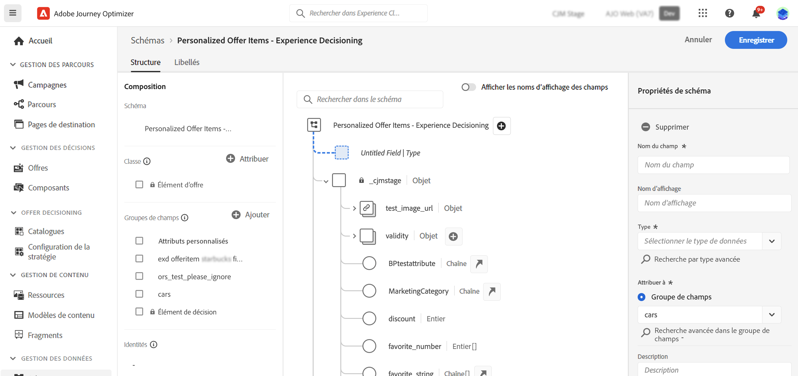

# Catalogue d’éléments {#catalog}

Dans la prise de décision, les catalogues servent de conteneurs centraux pour organiser les éléments de décision. Chaque catalogue est lié à un schéma Adobe Experience Platform, englobant tous les attributs affectés à un élément de décision.

Pour l’instant, tous les éléments de décision créés sont consolidés dans un seul catalogue « Offres », accessible via le menu **[!UICONTROL Catalogues]**.

Pour accéder au schéma du catalogue où les attributs des éléments de décision sont stockés, procédez comme suit :

1. Dans la liste des éléments, cliquez sur le bouton **[!UICONTROL Modifier le schéma]** situé en regard du bouton **[!UICONTROL Créer un élément]**.

1. Le schéma du catalogue s’ouvre dans un nouvel onglet, selon la structure ci-dessous :

   * Le nœud **`_experience`** comprend des attributs d’éléments de décision standard tels que le nom, la date de début et de fin et la description.
   * Le nœud **`_<imsOrg>`** héberge des attributs d’éléments de décision personnalisés. Par défaut, aucun attribut personnalisé n’est configuré, mais vous pouvez en ajouter autant que nécessaire pour répondre à vos besoins. Une fois cette opération terminée, les attributs personnalisés s’affichent dans l’écran de création de l’élément de décision à côté des attributs standard.

   

1. Pour ajouter un attribut personnalisé au schéma, développez le nœud **`_<imsOrg>`** et cliquez sur le bouton « + » à l’emplacement souhaité dans la structure.

   

1. Renseignez les champs nécessaires pour l’attribut ajouté et cliquez sur **[!UICONTROL Appliquer]**.

   >[!CAUTION]
   >
   >Pour l’instant, la prise de décision prend exclusivement en charge les types de données suivants : chaîne, entier, booléen, date, dateTime et ressource de prise de décision. Aucun champ ne se trouvant dans ces types de données ne pourra pas être utilisé lors de la création d’un élément de décision ou d’un catalogue.

   La valeur saisie sur un attribut avec l’attribut de ressource de prise de décision est une URL publique. La plupart du temps, cela pointe vers une image.

   Vous trouverez des informations détaillées sur l’utilisation des schémas Adobe Experience Platform dans la [Documentation du système XDM](https://experienceleague.adobe.com/docs/experience-platform/xdm/ui/overview.html?lang=fr).

1. Une fois les attributs personnalisés souhaités ajoutés, enregistrez le schéma. Le nouveau champ est désormais disponible dans l’écran de création des décisions d’élément, dans la section **[!UICONTROL Attributs personnalisés]**.
