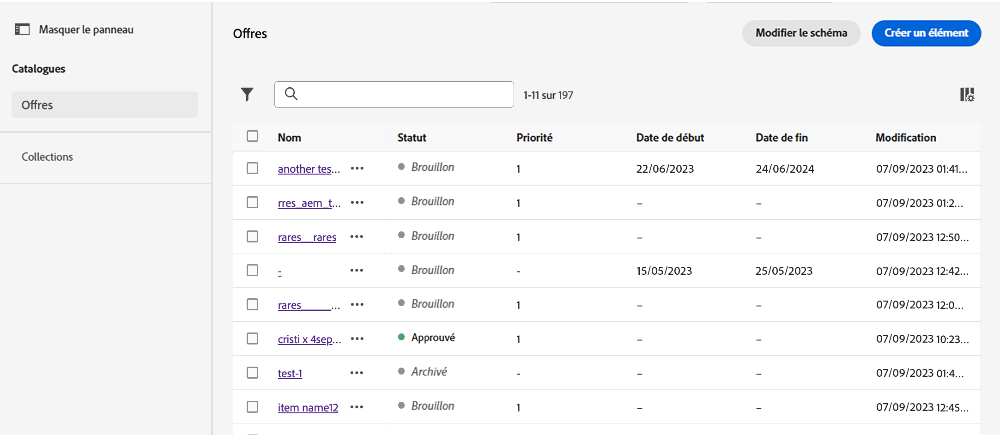

# Catalogue d’éléments {#catalog}

>[!BEGINSHADEBOX]

Ce guide vous apportera la documentation suivante :

* [Prise en main d’Experience Decisioning](gs-experience-decisioning.md)
* Gestion des éléments de décision
   * **[Configuration du catalogue d’éléments](catalogs.md)**
   * [Création d’éléments de décision](items.md)
   * [Gestion des collections d’éléments](collections.md)
* Configuration de la sélection d’éléments
   * [Créer des règles de décision](rules.md)
   * [Création de méthodes de classement](ranking.md)
* [Créer des stratégies de sélection](selection-strategies.md)
* [Création de stratégies de décision](create-decision.md)

>[!ENDSHADEBOX]

Dans Experience Decisioning, les catalogues servent de conteneurs centraux pour organiser les éléments de décision. Chaque catalogue est lié à un schéma Adobe Experience Platform, englobant tous les attributs affectés à un élément de décision.

Pour l’instant, tous les éléments de décision créés sont consolidés dans un seul catalogue &quot;Offres&quot;, accessible via le **[!UICONTROL Éléments]** .

Pour accéder au schéma du catalogue où les attributs des éléments de décision sont stockés, procédez comme suit :

1. Dans la liste des éléments, cliquez sur le bouton **[!UICONTROL Edition du schéma]** situé en regard du bouton **[!UICONTROL Créer un élément]** bouton .

1. Le schéma du catalogue s’ouvre dans un nouvel onglet, selon la structure ci-dessous :

   * La variable **`_experience`** comprend des attributs d’éléments de décision standard tels que le nom, la date de début et de fin et la description.
   * La variable **`_<imsOrg>`** héberge des attributs d’éléments de décision personnalisés. Par défaut, aucun attribut personnalisé n’est configuré, mais vous pouvez en ajouter autant que nécessaire pour répondre à vos besoins. Une fois cette opération terminée, les attributs personnalisés s’affichent dans l’écran de création de l’élément de décision à côté des attributs standard.

   

1. Pour ajouter un attribut personnalisé au schéma, développez la variable **`_<imsOrg>`** et cliquez sur le bouton &quot;+&quot; à l’emplacement souhaité dans la structure.

   

1. Renseignez les champs nécessaires pour l’attribut ajouté et cliquez sur **[!UICONTROL Appliquer]**.

   >[!CAUTION]
   >
   >Pour l’instant, Experience Decisioning prend exclusivement en charge les types de données répertoriés ci-dessous. Aucun champ ne se trouvant pas en dehors de ces types de données ne sera disponible lors de la création d’un élément de décision.
   >* Chaîne
   >* Booléen
   >* Nombre

   Vous trouverez des informations détaillées sur l’utilisation des schémas Adobe Experience Platform dans la section [Documentation du système XDM](https://experienceleague.adobe.com/docs/experience-platform/xdm/ui/overview.html?lang=fr).

1. Une fois les attributs personnalisés souhaités ajoutés, enregistrez le schéma. Le nouveau champ est désormais disponible dans l’écran de création des décisions d’élément, dans la **[!UICONTROL Attributs personnalisés]** .
