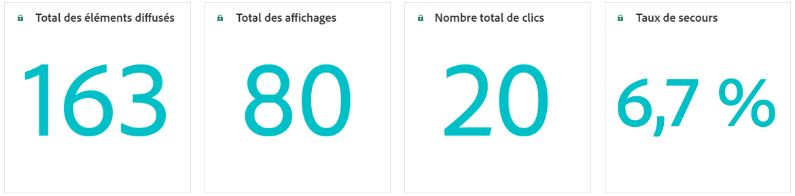

# Rapports sur la prise de décision {#decisioning-report}

## Rapports de prise de décision {#campaigns}

Une fois que les parcours ou les campagnes avec des stratégies de sélection sont en ligne, vous pouvez accéder à des rapports dédiés pour surveiller les indicateurs de performance clés (KPI) de prise de décision.

<!--Once code-based experiences are live, you can access dedicated reports to monitor Key Performance Indicators (KPIs) as an all-encompassing dashboard, delivering an analysis of essential metrics associated with your campaign.

This encompasses details related to the decision items performances and how users interacted with them. [Learn how to work with Code-based experience reports](../reports/campaign-global-report-cja-code.md)-->

Vous pouvez également accéder à des détails relatifs aux performances des éléments de décision et à la manière dont les utilisateurs et utilisatrices ont interagi avec eux, fournissant une analyse des mesures essentielles associées à votre campagne.

Découvrez comment utiliser les rapports d’expérience basés sur du code pour la prise de décisions dans [cette section](../reports/campaign-global-report-cja-code.md#decisioning-reporting).

## Rapports dans Customer Journey Analytics {#cja}

Si vous utilisez Customer Journey Analytics, vous pouvez créer des tableaux de bord de rapports personnalisés pour vos campagnes basées sur du code en tirant parti de la prise de décision.

Suivez les étapes principales ci-dessous : Vous trouverez des informations détaillées sur l’utilisation de Customer Journey Analytics dans la [documentation de Customer Journey Analytics](https://experienceleague.adobe.com/fr/docs/analytics-platform/using/cja-landing){target="_blank"}.

1. Créez et configurez une **connexion** dans Customer Journey Analytics. Vous pouvez ainsi vous connecter au jeu de données pour lequel vous souhaitez établir des rapports. [Découvrir comment créer une connexion](https://experienceleague.adobe.com/fr/docs/analytics-platform/using/cja-connections/create-connection){target="_blank"}

1. Créez une **vue des données** et associez-la à la connexion créée précédemment. Sous l’onglet **[!UICONTROL Composants]**, sélectionnez les champs de schéma appropriés que vous souhaitez afficher dans les rapports. Pour la prise de décision, veillez à inclure les champs **propositioninteract** et **propositiondisplay**. [Découvrir comment créer et configurer des vues de données](https://experienceleague.adobe.com/fr/docs/analytics-platform/using/cja-dataviews/create-dataview){target="_blank"}

1. Combinez des composants de données, des tableaux et des visualisations dans des **projets Workspace** pour créer et partager des rapports pour votre campagne basée sur du code. [Découvrir comment créer des projets Workspace](https://experienceleague.adobe.com/fr/docs/analytics-platform/using/cja-workspace/build-workspace-project/create-projects){target="_blank"}
