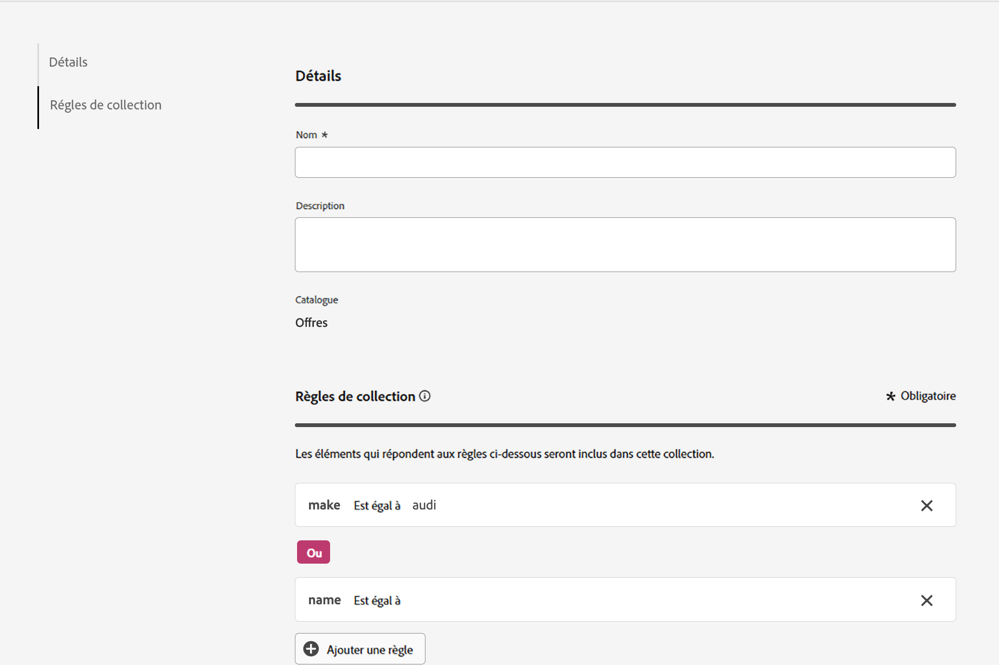

# Collections {#collections}

>[!CONTEXTUALHELP]
>id="ajo_exd_item_collections"
>title="Créer des collections"
>abstract="Les collections vous permettent de classer et de regrouper vos éléments de décision en fonction de vos préférences. Ces catégories sont créées en créant des règles qui utilisent les attributs des éléments de décision."

>[!CONTEXTUALHELP]
>id="ajo_exd_item_collection_rules"
>title="Définir des règles pour votre collection"
>abstract="Ajoutez une ou plusieurs règles pour déterminer les éléments à inclure dans la collection. Sélectionnez un attribut d’élément à utiliser comme critère. Sélectionnez l’opérateur souhaité et saisissez la valeur sur laquelle filtrer les données. Ajoutez autant de règles que nécessaire."

>[!CONTEXTUALHELP]
>id="ajo_exd_strategy_collection"
>title="Choisir une collection"
>abstract="Sélectionnez la collection qui contient les offres à prendre en compte. Cette étape est obligatoire lors de la création d’une stratégie de sélection. Les collections vous permettent de classer et de regrouper vos éléments de décision en fonction de vos préférences. Par exemple, vous pouvez créer une collection qui inclut tous les éléments de décision avec la valeur « Yoga » dans l’attribut personnalisé « Catégorie »."

Les collections vous permettent de classer et de regrouper vos éléments de décision en fonction de vos préférences. Ces catégories sont créées en créant des règles qui utilisent les attributs des éléments de décision.

Supposons, par exemple, que vous ayez ajouté un attribut personnalisé « Catégorie » au schéma de catalogue de vos éléments de décision. Vous pouvez ainsi créer une collection qui inclut tous les éléments de décision avec la valeur « Yoga » dans l’attribut « Categorie ».

La liste des collections est accessible à partir du menu **[!UICONTROL Catalogues]** .

Pour créer une collection, procédez comme suit :

1. Accédez à **[!UICONTROL Catalogues]** > **[!UICONTROL Collections]** et cliquez sur **[!UICONTROL Créer une collection]**.
1. Fournissez un nom et une description pour la collection.
1. Ajoutez une ou plusieurs règles pour déterminer les éléments à inclure dans la collection. Pour ce faire :

   1. Sélectionnez un attribut d’élément à utiliser comme critère. La liste d’attributs comprend tous les attributs standard et personnalisés définis dans le schéma de catalogue. [En savoir plus sur le catalogue d’éléments](catalogs.md)
   1. Sélectionnez l’opérateur souhaité et saisissez la valeur sur laquelle filtrer les données.
   1. Répétez ces étapes pour ajouter autant de règles que nécessaire. Lorsque plusieurs règles sont ajoutées, vous pouvez choisir parmi les opérateurs **Et** et **Ou** pour les combiner. Pour cela, cliquez sur le badge de l’opérateur pour basculer entre les deux choix.
   1. Cliquez sur le bouton **[!UICONTROL Prévisualiser la collection]** pour afficher les éléments qui respectent les règles que vous avez définies.

   

1. Une fois les règles de collection définies, cliquez sur **[!UICONTROL Créer]**. La collection s’affiche désormais dans la liste.

>[!NOTE]
>
>Chaque collection d’éléments peut contenir jusqu’à 500 éléments d’offre. [En savoir plus sur les barrières de sécurité et les limitations de prise de décision](gs-experience-decisioning.md#guardrails)
