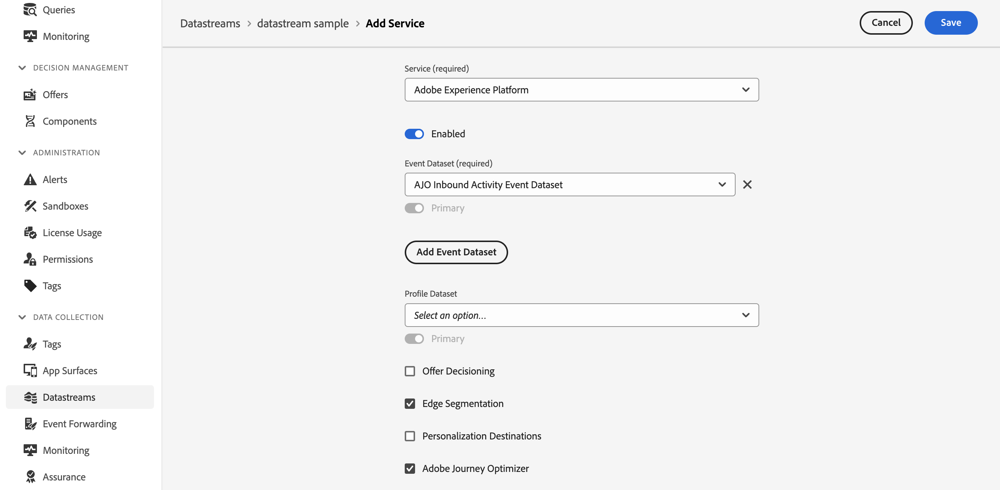

# Exploiter des données contextuelles dans la prise de décision {#context}

Avec la prise de décision, vous pouvez utiliser toutes les informations disponibles dans Adobe Experience Platform pour effectuer diverses actions, telles que la création de [règles de décision](rules.md) ou de [formules de classement](ranking/ranking.md).

Par exemple, vous pouvez créer une règle de décision qui exige que la température actuelle soit de ≥ 80 degrés Fahrenheit au moment de la demande de décision.

>[!NOTE]
>
>Les données contextuelles sont définies dans Adobe Experience Platform et envoyées au moment d’une demande de décision. Elles n’incluent pas de données historiques.

Pour utiliser des données contextuelles, vous devez d’abord définir les données que vous souhaitez rendre disponibles dans la prise de décision. Une fois cette opération effectuée, ces données s’intègrent de manière transparente à la prise de décision dans l’onglet **[!UICONTROL Données contextuelles]** et sont disponibles lors de la création d’une règle de décision. Vous pouvez également utiliser les données lors de la modification d’une formule de classement.

Les étapes pour intégrer des données Adobe Experience Platform dans la prise de décision sont les suivantes :

1. Créez un **schéma d’événement d’expérience** dans Adobe Experience Platform et son **jeu de données** associé.[Découvrez comment créer des schémas](https://experienceleague.adobe.com/fr/docs/experience-platform/xdm/ui/resources/schemas){target="_blank"}.

1. Créez un train de données Adobe Experience Platform :

   1. Accédez au menu **[!UICONTROL Trains de données]** et sélectionnez **[!UICONTROL Nouveau train de données]**.

   1. Dans la liste déroulante **[!UICONTROL Schéma d’événement]**, sélectionnez le schéma d&#39;événement d’expérience créé précédemment, puis cliquez sur **[!UICONTROL Enregistrer]**.

      

   1. Cliquez sur **[!UICONTROL Ajouter un service]** et sélectionnez le service « Adobe Experience Platform ». Dans la liste déroulante **[!UICONTROL Jeu de données d’événement]**, sélectionnez le jeu de données d’événement créé précédemment et activez l’option **[!UICONTROL Adobe Journey Optimizer]**.

      

Une fois le train de données enregistré, les informations du jeu de données sélectionné sont automatiquement récupérées et intégrées dans la prise de décision et deviennent généralement disponibles dans les 24 heures.

Pour plus d’informations sur l’utilisation d’Adobe Experience Platform, consultez les ressources suivantes :

* [Schémas de modèle de données d’expérience (XDM)](https://experienceleague.adobe.com/fr/docs/experience-platform/xdm/schema/composition){target="_blank"}
* [Jeux de données](https://experienceleague.adobe.com/fr/docs/experience-platform/catalog/datasets/overview){target="_blank"}
* [Train de données](https://experienceleague.adobe.com/fr/docs/experience-platform/datastreams/overview){target="_blank"}
