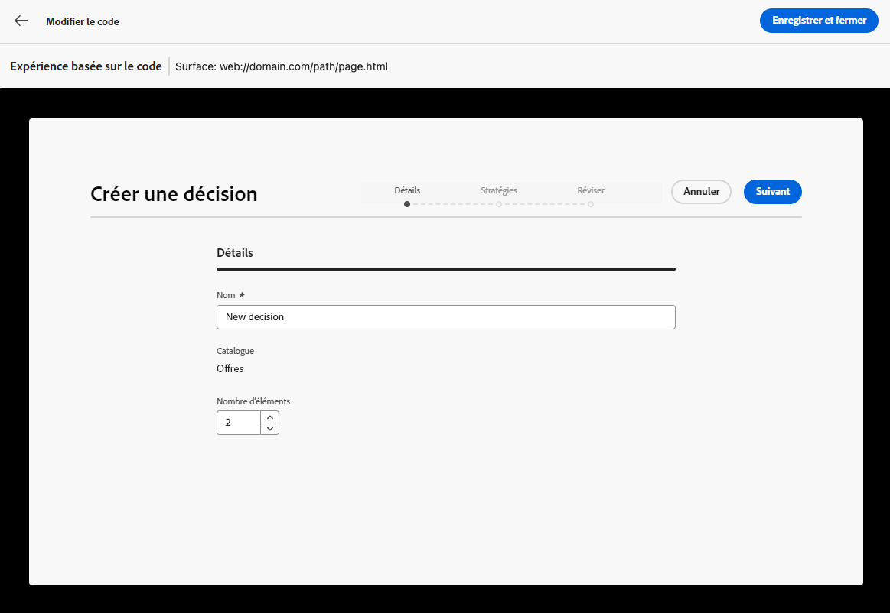
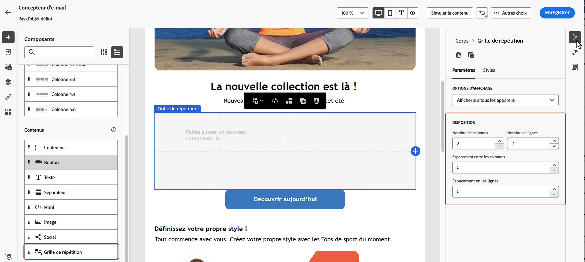
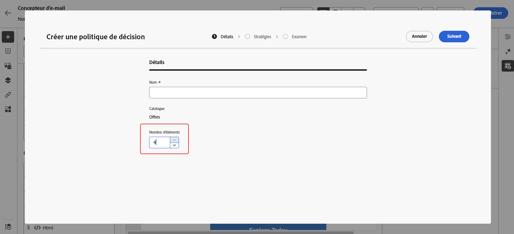
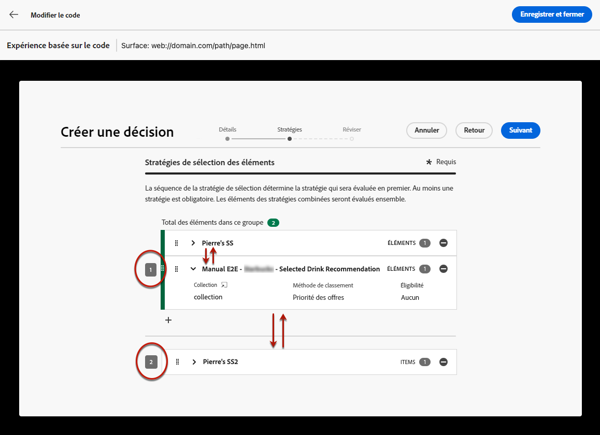
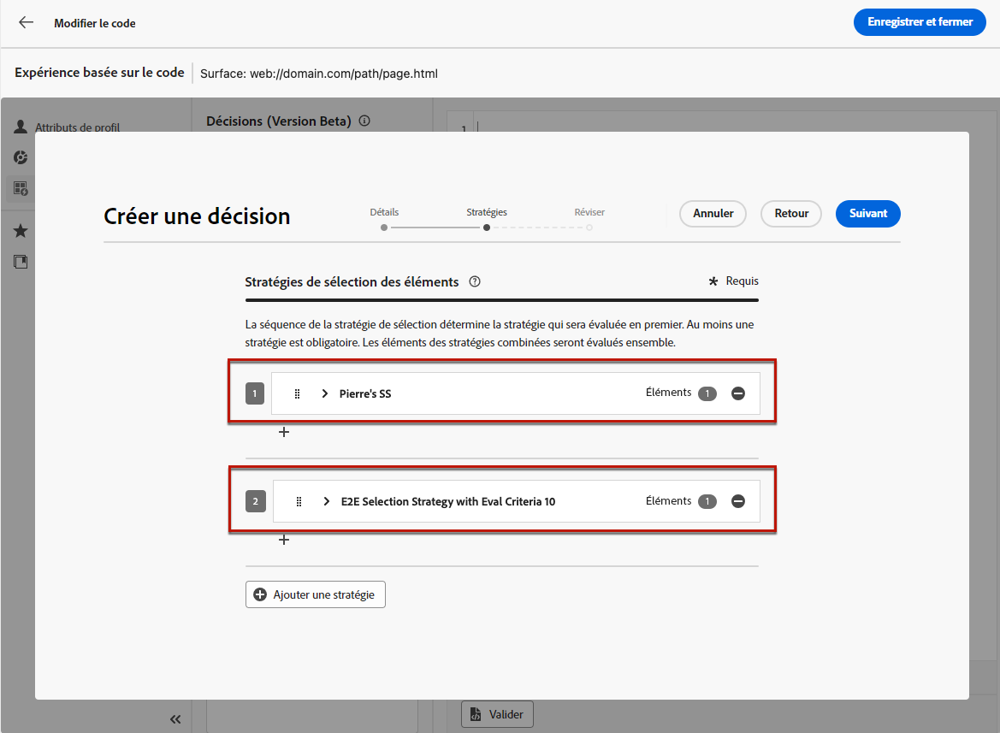
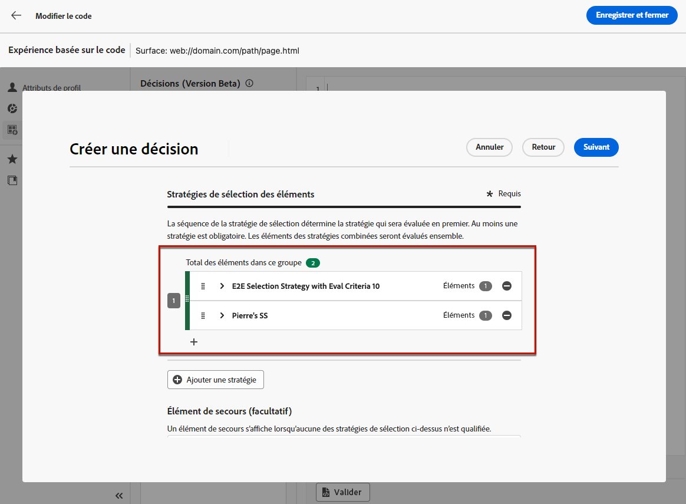
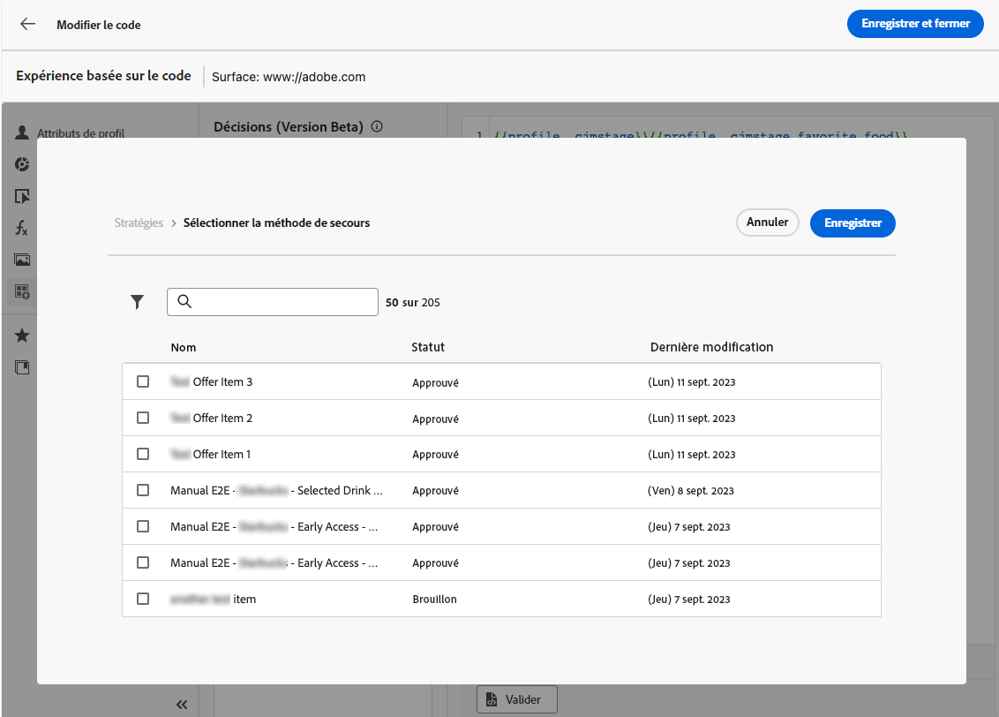
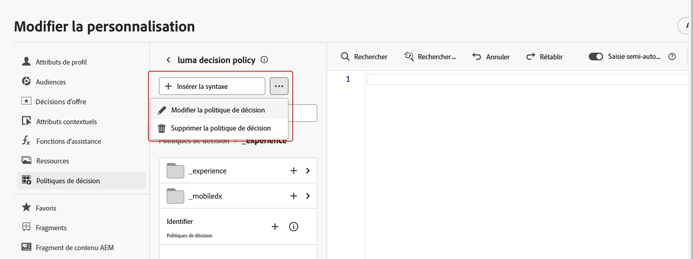
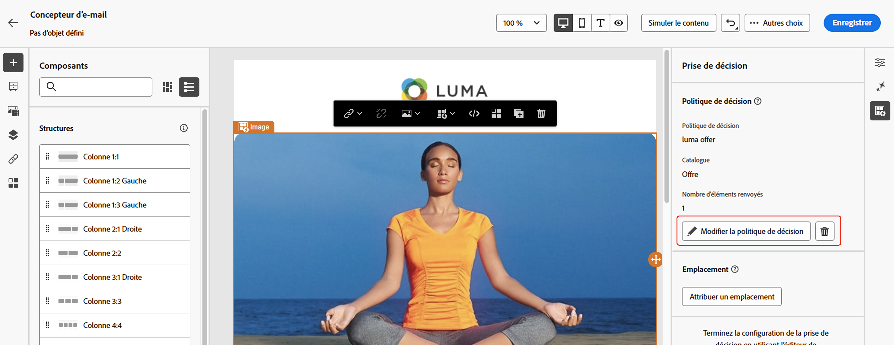
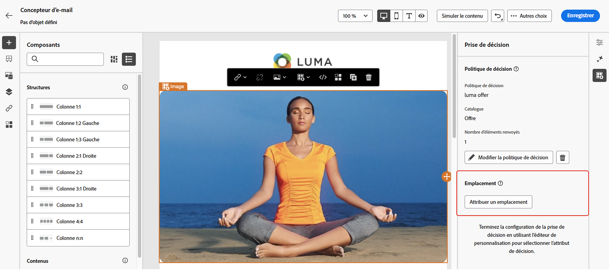

# Créer des politiques de décision {#create-decision}

>[!CONTEXTUALHELP]
>id="ajo_code_based_item_number"
>title="Définir le nombre d’éléments à renvoyer"
>abstract="Sélectionnez le nombre d’éléments de décision à renvoyer. Par exemple, si vous sélectionnez 2, les 2 meilleures offres éligibles seront présentées pour la configuration actuelle."

>[!CONTEXTUALHELP]
>id="ajo_code_based_fallback"
>title="Sélectionner une offre de secours"
>abstract="Un élément d’offre de secours s’affiche pour l’utilisateur ou l’utilisatrice lorsqu’aucune des stratégies de sélection définies pour cette politique de décision n’est qualifiée."

>[!CONTEXTUALHELP]
>id="ajo_code_based_strategy"
>title="Qu’est-ce qu’une stratégie ?"
>abstract="La séquence de stratégies de sélection détermine la stratégie qui sera évaluée en premier. Au moins une stratégie est requise. Les éléments de décision des stratégies combinées seront évalués ensemble."
>additional-url="https://experienceleague.adobe.com/fr/docs/journey-optimizer/using/decisioning/offer-decisioning/get-started-decision/starting-offer-decisioning" text="Créer des stratégies"

Pour présenter la meilleure offre et expérience dynamique à votre clientèle, ajoutez une politique de décision à votre contenu dans une campagne ou un parcours, puis configurez les éléments à renvoyer et la stratégie de sélection à utiliser. Procédez comme suit :

1. [Ajouter une politique de décision](#add)
1. [Configurer la politique de décision](#configure) - Ajoutez un nom et indiquez le nombre d’éléments à renvoyer pour le canal e-mail.
1. [Configurer une séquence de stratégie](#strategy) : sélectionnez les éléments à renvoyer avec la politique de décision.
1. [Sélectionner des offres de secours](#fallback) (facultatif) : sélectionnez les éléments à afficher si aucun élément ou stratégie de sélection n’est qualifié.
1. [Vérifier et enregistrer](#review) la stratégie de sélection
1. [Attribuer un emplacement](#placement) (canal e-mail)

>[!AVAILABILITY]
>
>Les politiques de décision sont disponibles pour tous les clients pour les canaux **Expérience basée sur le code**, **Notification push** et SMS.
>
>La prise de décision pour le canal e-mail est disponible en disponibilité limitée. Pour demander l’accès, contactez votre représentant Adobe. En savoir plus sur les [libellés de disponibilité](../rn/releases.md#availability-labels).

## Ajouter une politique de décision {#add}

Pour ajouter une politique de décision dans votre message, ouvrez un parcours ou une campagne, puis sélectionnez une [action de canal](../building-journeys/journeys-message.md).

Modifiez le contenu de votre message et parcourez les onglets ci-dessous pour plus d’informations sur la manière d’ajouter la politique de décision en fonction du canal sélectionné.

>[!BEGINTABS]

>[!TAB  Expérience basée sur le code ]

Pour les expériences basées sur du code, vous pouvez ajouter une nouvelle politique de décision à l’aide du menu **éditeur de code** ou **Prise de décision** disponible dans le volet Propriétés.

+++Ajouter une politique de décision à partir de l’éditeur de code

1. Ouvrez l’éditeur de code à l’aide du bouton **[!UICONTROL Modifier le code]**.

1. Accédez au menu **[!UICONTROL Politique de décision]** puis cliquez sur le bouton **[!UICONTROL Ajouter une politique de décision]**.

   

+++

+++Ajouter une politique de décision à partir du menu Prise de décision

1. Cliquez sur l’icône  dans le volet Propriétés pour accéder au menu **[!UICONTROL Prise de décision]**.

1. Cliquez sur le bouton **[!UICONTROL Ajouter une politique de décision]**.

   

+++

>[!TAB E-mail]

1. Activez/désactivez l’option **[!UICONTROL Activer la prise de décision]**.

   

   >[!IMPORTANT]
   >
   >L’activation de la prise de décision efface le contenu d’e-mail existant. Si vous avez déjà conçu votre e-mail, veillez à enregistrer votre contenu en tant que modèle au préalable.

1. Ajoutez une nouvelle politique de décision à l’aide du menu **éditeur de personnalisation** ou **Prise de décision** disponible dans le Concepteur d’e-mail.

   +++Ajout d’une politique de décision à partir de l’éditeur Personalization

   1. Ouvrez l’éditeur de personnalisation à l’aide de l’icône  disponible dans le champ de l’objet ou dans tout champ du corps de l’e-mail dans lequel vous pouvez ajouter de la personnalisation.

   1. Accédez au menu **[!UICONTROL Politiques de décision]** puis cliquez sur le bouton **[!UICONTROL Ajouter une politique de décision]**.

      

   +++

   +++Ajouter une politique de décision à partir du menu Prise de décision

   1. Ouvrez le Designer d’e-mail et sélectionnez n’importe quel composant dans la structure de l’e-mail.

   1. Cliquez sur l’icône  dans le volet Propriétés pour accéder au menu **[!UICONTROL Prise de décision]**.

   1. Cliquez sur le bouton **[!UICONTROL Ajouter une nouvelle politique]**.

      

   >[!NOTE]
   >
   >Sélectionnez **[!UICONTROL Réutiliser la sortie de décision]** pour réutiliser une politique de décision déjà créée dans cet e-mail.

>[!TAB SMS]

Pour les SMS, vous pouvez ajouter une nouvelle politique de décision à l’aide du menu **éditeur de personnalisation** ou **Prise de décision** disponible dans le volet des propriétés.

+++Ajouter une politique de décision à partir de l’éditeur de personnalisation

1. Ouvrez l’éditeur de personnalisation à l’aide de l’icône  .
1. Accédez au menu **[!UICONTROL Politiques de décision]** puis cliquez sur le bouton **[!UICONTROL Ajouter une politique de décision]**.

   

+++

+++Ajouter une politique de décision à partir du menu Prise de décision

1. Cliquez sur l’icône  dans le volet Propriétés pour accéder au menu **[!UICONTROL Prise de décision]**.

1. Cliquez sur le bouton **[!UICONTROL Ajouter une politique de décision]**.

   

>[!TAB Notification push]

Pour les notifications push, vous pouvez ajouter une nouvelle politique de décision à l’aide du menu **éditeur de personnalisation** ou **Prise de décision** disponible dans le volet des propriétés.

+++Ajouter une politique de décision à partir de l’éditeur de personnalisation

1. Ouvrez l’éditeur de personnalisation à l’aide de l’icône  .
1. Accédez au menu **[!UICONTROL Politiques de décision]** puis cliquez sur le bouton **[!UICONTROL Ajouter une politique de décision]**.

   

+++

+++Ajouter une politique de décision à partir du menu Prise de décision

1. Cliquez sur l’icône  dans le volet Propriétés pour accéder au menu **[!UICONTROL Prise de décision]**.

1. Cliquez sur le bouton **[!UICONTROL Ajouter une politique de décision]**.

   

>[!IMPORTANT]
>
>Experience Decisioning avec les notifications push nécessite une version spécifique de Mobile SDK. Avant d’implémenter cette fonctionnalité, consultez les [notes de mise à jour](https://developer.adobe.com/client-sdks/home/release-notes/){target="_blank"} pour identifier la version requise et vous assurer que vous avez effectué la mise à niveau en conséquence. Vous pouvez également afficher toutes les versions de SDK disponibles pour votre plateforme dans [cette section](https://developer.adobe.com/client-sdks/home/current-sdk-versions/){target="_blank"}.

>[!ENDTABS]

## Configurer la politique de décision {#configure}

Une fois que vous avez ajouté une nouvelle politique de décision dans votre contenu, l’écran de configuration de la politique de décision s’ouvre. Pour configurer la politique de décision, procédez comme suit :

1. Attribuez un nom à la politique de décision et sélectionnez un catalogue (actuellement limité au catalogue d’**[!UICONTROL offres]** par défaut).

   

1. Le champ **[!UICONTROL Nombre d’éléments]** vous permet de définir le nombre d’éléments de décision à renvoyer avec la politique de décision. Par exemple, si vous sélectionnez 2, les 2 meilleures offres éligibles seront présentées pour la configuration actuelle.

   >[!NOTE]
   >
   >Cette option est disponible uniquement pour les canaux d’expérience E-mail et Code . Pour tous les autres canaux, un seul élément de décision peut être renvoyé par action.

   Pour renvoyer plusieurs éléments pour le canal E-mail , vous devez ajouter la politique de décision dans un composant **[!UICONTROL Grille de répétition]**. Pour plus d’informations, développez la section ci-dessous :

   +++Renvoyer plusieurs éléments de décision dans les e-mails

   1. Placez un composant **[!UICONTROL Grille de répétition]** dans votre e-mail et configurez-le selon vos besoins à l’aide du volet **[!UICONTROL Paramètres]**.

      

   1. Cliquez sur l’icône **[!UICONTROL Prise de décision]** dans la barre d’outils de la zone de travail ou ouvrez le volet **[!UICONTROL Prise de décision]** et sélectionnez **[!UICONTROL Ajouter une politique de décision]**.

   1. Indiquez le nombre d’éléments à renvoyer dans le champ **[!UICONTROL Nombre d’éléments]**, puis configurez la politique de décision comme indiqué ci-dessous. Le nombre maximal d’éléments que vous pouvez sélectionner est limité par le nombre de tuiles définies dans le composant **[!UICONTROL Grille de répétition]**.

   

   +++

1. Cliquez sur **[!UICONTROL Suivant]**.

## Configurer une séquence de stratégies {#strategy}

La section **[!UICONTROL Séquence de stratégies]** vous permet de sélectionner les éléments de décision et les stratégies de sélection à inclure dans la politique de décision.

1. Cliquez sur **[!UICONTROL Ajouter]**, puis sélectionnez le type d’objet à inclure dans la politique :

   

   * **[!UICONTROL Stratégie de sélection]** : les stratégies de décision tirent parti des collections associées aux contraintes d’éligibilité et aux méthodes de classement pour déterminer les éléments à afficher. Vous pouvez sélectionner une ou plusieurs stratégies de sélection existantes ou en créer une à l’aide du bouton **[!UICONTROL Créer une stratégie de sélection]**. [Découvrir comment créer des stratégies de sélection](selection-strategies.md)

   * **[!UICONTROL Élément de décision]** : sélectionnez des éléments de décision uniques sans avoir à exécuter une stratégie de sélection. Vous pouvez sélectionner un seul élément de décision à la fois. Toutes les contraintes d’éligibilité définies pour l’élément s’appliquent.

   >[!NOTE]
   >
   >Une politique de décision prend en charge jusqu’à 10 stratégies de sélection et éléments de décision combinés. [En savoir plus sur les mécanismes de sécurisation et sur les limitations de la prise de décisions](gs-experience-decisioning.md#guardrails)

1. Lorsque vous ajoutez plusieurs éléments et/ou stratégies de décision, ils sont évalués dans un ordre spécifique. Le premier objet ajouté à la séquence sera évalué en premier, et ainsi de suite. Pour modifier la séquence par défaut, faites glisser et déposez les objets et/ou les groupes afin de les réorganiser selon vos besoins. Pour plus d’informations, développez la section ci-dessous.

   +++Gestion de l’ordre d’évaluation dans une politique de décision

   Une fois que vous avez ajouté des éléments de décision et des stratégies de sélection à votre politique, vous pouvez les organiser pour déterminer leur ordre d’évaluation et combiner des stratégies de sélection à évaluer ensemble.

   L’**ordre séquentiel** dans lequel les éléments et les stratégies seront évalués est indiqué par des chiffres à gauche de chaque objet ou groupe d’objets. Pour déplacer la position d’une stratégie de sélection (ou d’un groupe de stratégies) dans la séquence, effectuez un glisser-déposer vers une autre position.

   

   >[!NOTE]
   >
   >Seules les stratégies de sélection peuvent être glissées-déposées dans une séquence. Pour modifier la position d’un élément de décision, vous devez le supprimer et l’ajouter à nouveau à l’aide du bouton **[!UICONTROL Ajouter]** après avoir ajouté les autres éléments à évaluer auparavant.

   Vous pouvez également **combiner** plusieurs stratégies de sélection en groupes afin qu’elles soient évaluées ensemble et non séparément. Pour ce faire, cliquez sur le bouton **`+`** sous une stratégie de sélection pour la combiner à une autre. Vous pouvez également effectuer un glisser-déposer d’une stratégie de sélection sur une autre afin de regrouper les deux stratégies dans un groupe.

   >[!NOTE]
   >
   >Les éléments de décision ne peuvent pas être regroupés avec d’autres éléments ou stratégies de sélection.

   Plusieurs stratégies et leur regroupement déterminent la priorité des stratégies et le classement des offres éligibles. La première stratégie a la priorité la plus élevée et les stratégies combinées au sein d’un même groupe ont la même priorité.

   Prenons l’exemple suivant : vous disposez de deux collections, l’une dans la stratégie A et l’autre dans la stratégie B. La demande concerne le renvoi de deux éléments de décision. Supposons qu&#39;il y ait deux offres éligibles pour la stratégie A et trois offres éligibles pour la stratégie B.

   * Si les deux stratégies ne sont **pas combinées** ni dans l’ordre séquentiel (1 et 2), les deux meilleures offres éligibles de la première stratégie seront renvoyées dans la première ligne. S’il n’y a pas deux offres éligibles pour la première stratégie, le moteur de décision passera à la stratégie suivante dans la séquence pour trouver autant d’offres que nécessaire, et renverra finalement une offre de secours si nécessaire.

     

   * Si les deux collections sont **évaluées en même temps**, étant donné qu’il y a deux offres éligibles pour la stratégie A et trois offres éligibles pour la stratégie B, les cinq offres seront regroupées et classées selon la valeur déterminée par leurs méthodes de classement respectives. Comme deux offres sont demandées, les deux meilleures offres éligibles parmi ces cinq offres seront renvoyées.

     

   **Exemple avec plusieurs stratégies**

   Prenons un exemple où plusieurs stratégies sont divisées en différents groupes. Vous avez défini trois stratégies. Les stratégies 1 et 2 sont combinées dans le groupe 1 et la stratégie 3 est indépendante (groupe 2). Les offres éligibles pour chaque stratégie et leur priorité (utilisée dans l’évaluation de la fonction de classement) sont les suivantes :

   * Groupe 1 :
      * Stratégie 1 - (offre 1, offre 2 et offre 3) - Priorité 1
      * Stratégie 2 - (offre 3, offre 4 et offre 5) - Priorité 1

   * Groupe 2 :
      * Stratégie 3 - (offre 5 et offre 6) - Priorité 0

   Les offres de stratégie ayant la priorité la plus élevée sont évaluées en premier et ajoutées à la liste des offres classées.

   * **Itération 1 :**

     Les offres des stratégies 1 et 2 sont évaluées ensemble (offre 1, offre 2, offre 3, offre 4 et offre 5). Nous arrivons au résultat suivant :

     Offre 1 - 10
Offre 2 - 20
Offre 3 - 30 pour la stratégie 1, 45 pour la stratégie 2. Le critère le plus élevé des deux sera pris en compte (45).
Offre 4 - 40
Offre 5 - 50

     Les offres classées se présentent désormais comme suit : offre 5, offre 3, offre 4, offre 2 et offre 1.

   * **Itération 2 :**

     Les offres de la stratégie 3 sont évaluées (offre 5 et offre 6). Nous arrivons au résultat suivant :

      * Offre 5 : non évaluée, car elle existe déjà dans le résultat ci-dessus.
      * Offre 6 - 60

     Les offres classées sont désormais les suivantes : offre 5 , offre 3, offre 4, offre 2, offre 1 et offre 6.

   +++

1. Lorsque votre stratégie de sélection est prête, cliquez sur **[!UICONTROL Suivant]**.

## Ajouter des offres de secours {#fallback}

Une fois que vous avez sélectionné des éléments de décision et/ou des stratégies de sélection, vous pouvez ajouter des offres de secours qui s’afficheront si aucun des éléments ou aucune des stratégies de sélection ci-dessus n’est qualifié.

Vous pouvez sélectionner n’importe quel élément de la liste, qui affiche tous les éléments de décision créés dans le sandbox actuel. Si aucune stratégie de sélection n’est qualifiée, l’offre de secours est affichée pour l’utilisateur ou utilisatrice, quelles que soient les dates et les contraintes d’éligibilité appliquées à l’élément sélectionné.<!--nor frequency capping when available - TO CLARIFY-->.

>[!NOTE]
> Les secours sont facultatifs. Vous pouvez sélectionner jusqu’au nombre d’éléments demandés. Si aucun n’est éligible et qu’aucune solution de secours n’est définie, rien ne s’affiche.

## Vérifier et enregistrer la politique de décision {#review}

Après avoir configuré une stratégie de sélection et ajouté des offres de secours, cliquez sur **[!UICONTROL Suivant]** pour vérifier et enregistrer votre politique de décision, puis cliquez sur **[!UICONTROL Créer]** pour confirmer la création de la politique.

>[!IMPORTANT]
>
>Une fois une politique de décision créée, toute modification apportée peut prendre jusqu’à 15 minutes pour se propager dans toutes les régions de données, et jusqu’à 30 minutes pour le Canada. Cela inclut des modifications telles que l’ajout d’un nouvel élément de décision à une collection, la modification d’une règle dans un élément, la modification du contenu de l’élément ou la mise à jour d’une formule.

Vous pouvez modifier ou supprimer une politique de décision à tout moment à l’aide du bouton représentant des points de suspension dans l’éditeur de personnalisation, ou dans le menu **[!UICONTROL Prise de décision]** dans le volet des propriétés du composant.

>[!BEGINTABS]

>[!TAB Modifier ou supprimer une politique à partir de l’éditeur de personnalisation]

>[!TAB Modifier ou supprimer une politique du menu Prise de décision]

>[!ENDTABS]

## Attribuer un emplacement (e-mail) {#placement}

Pour les e-mails, vous devez définir un emplacement pour le composant associé à la politique de décision. Pour ce faire, cliquez sur le bouton **[!UICONTROL Prise de décision]** dans le volet des propriétés du composant et sélectionnez **[!UICONTROL Attribuer un emplacement]**. [En savoir plus sur l’utilisation des emplacements](../experience-decisioning/placements.md)

## Étapes suivantes {#next-steps}

Maintenant que vous comprenez comment créer une politique de décision, vous êtes prêt à l’utiliser dans [!DNL Journey Optimizer] canaux pour diffuser des offres.

➡️ [Découvrez comment utiliser des politiques de décision dans les messages.](../experience-decisioning/use-decision-policy.md)
