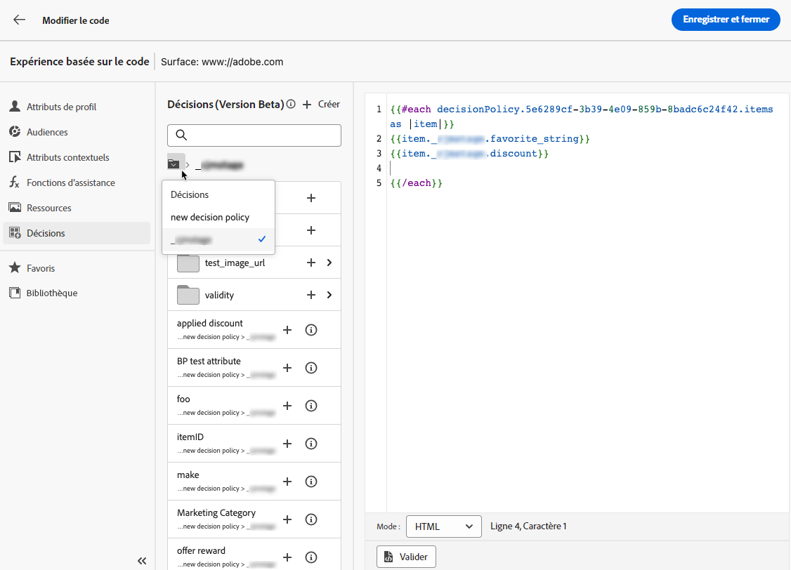

# Création de stratégies de décision {#create-decision}

>[!CONTEXTUALHELP]
>id="ajo_code_based_decision"
>title="Qu&#39;est-ce qu&#39;une décision ?"
>abstract="Les stratégies de décision tirent parti du moteur de prise de décision d’expérience afin de choisir le meilleur contenu à diffuser, en fonction de l’audience."
>additional-url="https://experienceleague.adobe.com/docs/journey-optimizer/using/offer-decisioning/get-started-decision/starting-offer-decisioning.html?lang=fr" text="À propos de la prise de décision dans Experience"

>[!BEGINSHADEBOX]

Ce guide vous apportera la documentation suivante :

* [Prise en main d’Experience Decisioning](gs-experience-decisioning.md)
* Gestion des éléments de décision
   * [Configuration du catalogue d’éléments](catalogs.md)
   * [Création d’éléments de décision](items.md)
   * [Gestion des collections d’éléments](collections.md)
* Configuration de la sélection d’éléments
   * [Créer des règles de décision](rules.md)
   * [Création de méthodes de classement](ranking.md)
* [Créer des stratégies de sélection](selection-strategies.md)
* **[Création de stratégies de décision](create-decision.md)**

>[!ENDSHADEBOX]

Les stratégies de décision sont des conteneurs pour vos offres qui tirent parti du moteur de prise de décision d’expérience afin de choisir le meilleur contenu à diffuser, en fonction de l’audience.

>[!NOTE]
>
>Dans le [!DNL Journey Optimizer] interface utilisateur, les stratégies de décision sont considérées comme des décisions.<!--but they are decision policies. TBC if this note is needed-->.

## Ajout d’une stratégie de décision à une campagne basée sur du code {#add-decision}

>[!CONTEXTUALHELP]
>id="ajo_code_based_item_number"
>title="Définition du nombre d’éléments à renvoyer"
>abstract="Sélectionnez le nombre d’éléments de décision à renvoyer. Par exemple, si vous sélectionnez 2, les 2 meilleures offres éligibles seront présentées pour la surface actuelle."

>[!CONTEXTUALHELP]
>id="ajo_code_based_fallback"
>title="Sélection d’une solution de secours"
>abstract="Un élément de secours s’affiche pour l’utilisateur lorsqu’aucune des stratégies de sélection définies pour cette stratégie de décision n’est qualifiée."

>[!CONTEXTUALHELP]
>id="ajo_code_based_strategy"
>title="Qu&#39;est-ce qu&#39;une stratégie ?"
>abstract="La séquence de stratégie de sélection détermine la stratégie qui sera évaluée en premier. Au moins une stratégie est requise. Les éléments de décision des stratégies combinées seront évalués ensemble."
>additional-url="https://experienceleague.adobe.com/docs/journey-optimizer/using/offer-decisioning/get-started-decision/starting-offer-decisioning.html?lang=fr" text="Créer des stratégies"
>additional-url="https://experienceleague.adobe.com/docs/journey-optimizer/using/offer-decisioning/get-started-decision/starting-offer-decisioning.html?lang=fr" text="Ordre de évaluation"

Pour présenter la meilleure offre et expérience dynamique aux visiteurs de votre site web ou de votre application mobile, ajoutez une stratégie de décision à une campagne basée sur du code. Pour ce faire, procédez comme suit.

1. Créez une opération et sélectionnez l’option **[!UICONTROL Expérience basée sur le code (bêta)]** action. [En savoir plus](../code-based/create-code-based.md)

   >[!NOTE]
   >
   >La fonctionnalité d’expérience basée sur le code est actuellement disponible en version bêta pour sélectionner uniquement les utilisateurs.

1. Dans la [éditeur de code](../code-based/create-code-based.md#edit-code), sélectionnez la variable **[!UICONTROL Décisions]** et cliquez sur **[!UICONTROL Créer une décision]**.

   

1. Renseignez les détails de votre stratégie de décision : ajoutez un nom et sélectionnez un catalogue.

   >[!NOTE]
   >
   >Actuellement, seule la valeur par défaut **[!UICONTROL Offres]** Le catalogue est disponible.

   

1. Sélectionnez le nombre d’éléments à renvoyer. Par exemple, si vous sélectionnez 2, les 2 meilleures offres éligibles seront présentées pour la surface actuelle. Cliquez sur **[!UICONTROL Suivant]**

1. Utilisez la variable **[!UICONTROL Ajouter une stratégie]** pour définir les stratégies de sélection de votre stratégie de décision. Chaque stratégie consiste en une collection d’offres associée à une contrainte d’éligibilité et une méthode de classement permettant de déterminer les offres à afficher. [En savoir plus](selection-strategies.md)

   

   >[!NOTE]
   >
   >Au moins une stratégie est requise. Vous ne pouvez pas ajouter plus de dix stratégies.

1. Dans la **[!UICONTROL Ajouter une stratégie]** vous pouvez également créer une stratégie. La variable **[!UICONTROL Créer une stratégie de sélection]** vous redirige vers le bouton **[!UICONTROL Prise de décision d’expérience]** > **[!UICONTROL Configurations]** . [En savoir plus](selection-strategies.md)

   

1. Lorsque vous ajoutez plusieurs stratégies, elles sont évaluées dans un ordre spécifique. La première stratégie ajoutée à la séquence sera évaluée en premier, etc. [En savoir plus](#evaluation-order)

   Pour modifier la séquence par défaut, vous pouvez faire glisser les stratégies et/ou les groupes pour les réorganiser selon vos besoins.

   

1. Ajoutez un secours. Un élément de secours s’affiche pour l’utilisateur si aucune des stratégies de sélection ci-dessus n’est qualifiée.

   

   Vous pouvez sélectionner n’importe quel élément de la liste, qui affiche tous les éléments de décision créés dans l’environnement de test actuel. Si aucune stratégie de sélection n’est qualifiée, la solution de secours est affichée pour l’utilisateur, quelles que soient les dates et les contraintes d’éligibilité appliquées à l’élément sélectionné.<!--nor frequency capping when available - TO CLARIFY-->.

   >[!NOTE]
   >
   >Une solution de secours est facultative. Si aucune solution de secours n’est sélectionnée et qu’aucune stratégie n’est qualifiée, rien ne s’affiche par [!DNL Journey Optimizer].

1. Enregistrez votre sélection et cliquez sur **[!UICONTROL Créer]**. La nouvelle stratégie de décision est ajoutée sous **[!UICONTROL Décisions]**.

   

Maintenant que la stratégie de décision est créée, vous pouvez utiliser les attributs de décision dans le contenu de votre expérience basé sur le code. [En savoir plus](#use-decision-policy)

## Ordre de évaluation {#evaluation-order}

Comme décrit ci-dessus, une stratégie se compose d’une collection, d’une méthode de classement et de contraintes d’éligibilité.

Vous pouvez :

* Définissez l’ordre séquentiel souhaité pour l’évaluation des stratégies,
* Combinez plusieurs stratégies afin qu’elles soient évaluées ensemble et non séparément.

Plusieurs stratégies et leur regroupement déterminent la priorité des stratégies et le classement des offres éligibles. La première stratégie a la priorité la plus élevée et les stratégies combinées au sein d&#39;un même groupe ont la même priorité.

Par exemple, vous disposez de deux collections, l’une dans la stratégie A et l’autre dans la stratégie B. La demande concerne le renvoi de deux éléments de décision. Supposons qu’il existe deux offres éligibles de la stratégie A et trois offres éligibles de la stratégie B.

* Si les deux stratégies sont **non combiné** ou dans l’ordre séquentiel (1 et 2), les deux premières offres éligibles de la première stratégie seront renvoyées dans la première ligne. S’il n’existe pas deux offres éligibles pour la première stratégie, le moteur de décision passe à la stratégie suivante l’une après l’autre, afin de trouver autant d’offres qu’il est encore nécessaire, et, au final, renvoie un secours si nécessaire.

  

* Si les deux collections sont **évalué simultanément**, puisqu’il existe deux offres éligibles de la stratégie A et trois offres éligibles de la stratégie B, les cinq offres seront combinées selon la valeur déterminée par les méthodes de classement respectives. Comme deux offres sont demandées, les deux meilleures offres éligibles parmi ces cinq offres seront renvoyées.

  

+++ **Exemple avec plusieurs stratégies**

Prenons un exemple où plusieurs stratégies sont divisées en différents groupes.

Vous avez défini trois stratégies. La stratégie 1 et la stratégie 2 sont regroupées dans le groupe 1 et la stratégie 3 est indépendante (groupe 2).

Les offres éligibles pour chaque stratégie et leur priorité (utilisées dans l&#39;évaluation de la fonction de classement) sont les suivantes :

* Groupe 1 :
   * Stratégie 1 - (offre 1, offre 2, offre 3) - Priorité 1
   * Stratégie 2 - (offre 3, offre 4, offre 5) - Priorité 1

* Groupe 2 :
   * Stratégie 3 - (Offre 5, Offre 6) - Priorité 0

Les offres de stratégie de priorité la plus élevée sont évaluées en premier et ajoutées à la liste des offres classées.

**Itération 1 :**

Les offres Stratégie 1 et Stratégie 2 sont évaluées ensemble (Offre 1, Offre 2, Offre 3, Offre 4, Offre 5). Nous arrivons au résultat suivant :

Offre 1 - 10 Offre 2 - 20 Offre 3 - 30 de Stratégie 1, 45 de Stratégie 2. Le critère le plus élevé des deux sera pris en compte (45).
Offre 4 - 40
Offre 5 - 50

Les offres classées sont désormais les suivantes : Offre 5, Offre 3, Offre 4, Offre 2, Offre 1.

**Itération 2 :**

Les offres de la stratégie 3 sont évaluées (offre 5, offre 6). Nous arrivons au résultat suivant :

* Offre 5 : non évaluée, car elle existe déjà dans le résultat ci-dessus.
* Offre 6 - 60

Les offres classées sont désormais les suivantes : offre 5 , offre 3, offre 4, offre 2, offre 1 et offre 6.

+++

## Utilisation de la stratégie de décision dans l’éditeur de code {#use-decision-policy}

Une fois créée, la stratégie de décision peut être utilisée dans la variable [éditeur de code](../code-based/create-code-based.md#edit-code). Pour ce faire, procédez comme suit.

>[!NOTE]
>
>L’éditeur de code tire parti de la variable [!DNL Journey Optimizer] Editeur d&#39;expression avec toutes ses fonctionnalités de personnalisation et de création. [En savoir plus](../personalization/personalization-build-expressions.md)

1. Cliquez sur l’icône + . Le code correspondant à la stratégie de décision est ajouté. Vous pouvez désormais ajouter tous les attributs de décision que vous souhaitez dans ce code.

   

   >[!NOTE]
   >
   >Cette séquence sera répétée le nombre de fois où vous souhaitez que la stratégie de décision soit renvoyée. Par exemple, si vous avez choisi de renvoyer 2 éléments lorsque [création de la décision](#add-decision), la même séquence sera répétée deux fois.

1. Cliquez sur la stratégie de décision. Les attributs de décision s’affichent.

   Ces attributs sont stockés dans la variable **[!UICONTROL Offres]** schéma du catalogue. Les attributs personnalisés sont stockés dans la variable **_cjmstage** Attributs de dossier et standard dans **_experience** dossier. [En savoir plus sur le schéma du catalogue d&#39;offres](catalogs.md)

   

1. Cliquez sur chaque dossier pour le développer. Placez le curseur de votre souris à l’emplacement souhaité, puis cliquez sur l’icône + en regard de l’attribut à ajouter. Vous pouvez ajouter autant d’attributs que vous le souhaitez au code.

   

1. Pour revenir à la racine de la stratégie de décision, cliquez sur l’icône de dossier.

   

1. Vous pouvez également ajouter tout autre attribut disponible dans l’éditeur d’expression, tel que les attributs de profil.

   
