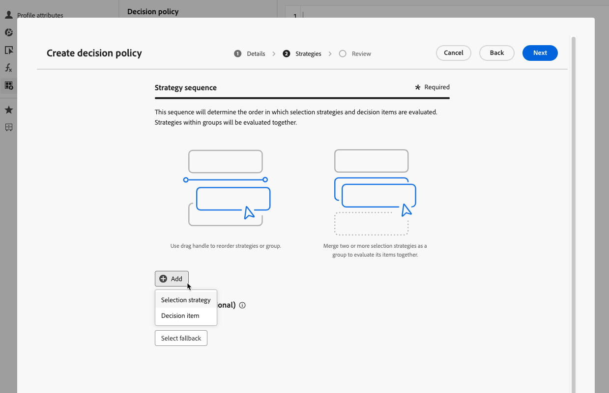

# Créer des politiques de décision {#create-decision}

>[!CONTEXTUALHELP]
>id="ajo_code_based_decision"
>title="Qu’est-ce qu’une décision ?"
>abstract="Les politiques de décision contiennent toute la logique de sélection afin que le moteur de prise de décision choisisse le meilleur contenu. Les politiques de décision sont spécifiques aux campagnes. Leur objectif est de sélectionner les meilleures offres pour chaque profil, tandis que la création de campagne vous permet d’indiquer comment les éléments de décision sélectionnés doivent être présentés, y compris les attributs d’élément à inclure dans le message."
>additional-url="https://experienceleague.adobe.com/fr/docs/journey-optimizer/using/decisioning/offer-decisioning/get-started-decision/starting-offer-decisioning" text="À propos de la prise de décision"

Les politiques de décision sont des conteneurs pour vos offres qui tirent profit du moteur de prise de décision afin de choisir le meilleur contenu à diffuser, en fonction de l’audience.

Les politiques de décision contiennent toute la logique de sélection afin que le moteur de prise de décision choisisse le meilleur contenu. Les politiques de décision sont spécifiques aux campagnes. Leur objectif est de sélectionner les meilleures offres pour chaque profil, tandis que la création de campagne vous permet d’indiquer comment les éléments de décision sélectionnés doivent être présentés, y compris les attributs d’élément à inclure dans le message.

>[!NOTE]
>
>Dans l’interface d’utilisation [!DNL Journey Optimizer], les politiques de décision sont libellées comme étant des décisions<!--but they are decision policies. TBC if this note is needed-->.

Les principales étapes pour utiliser les politiques de décision dans vos campagnes basées sur du code sont les suivantes :

1. [Créer une politique de décision pour une campagne basée sur du code](#add-decision)
1. [Utiliser la politique de décision dans la campagne basée sur du code](#use-decision-policy)
1. [Créer des tableaux de bord de rapports Customer Journey Analytics personnalisés](#cja)

## Ajouter une politique de décision à une campagne basée sur du code {#add-decision}

>[!CONTEXTUALHELP]
>id="ajo_code_based_item_number"
>title="Définir le nombre d’éléments à renvoyer"
>abstract="Sélectionnez le nombre d’éléments de décision à renvoyer. Par exemple, si vous sélectionnez 2, les 2 meilleures offres éligibles seront présentées pour la configuration actuelle."

>[!CONTEXTUALHELP]
>id="ajo_code_based_fallback"
>title="Sélectionner une offre de secours"
>abstract="Un élément d’offre de secours s’affiche pour l’utilisateur ou l’utilisatrice lorsqu’aucune des stratégies de sélection définies pour cette politique de décision n’est qualifiée."

>[!CONTEXTUALHELP]
>id="ajo_code_based_strategy"
>title="Qu’est-ce qu’une stratégie ?"
>abstract="La séquence de stratégies de sélection détermine la stratégie qui sera évaluée en premier. Au moins une stratégie est requise. Les éléments de décision des stratégies combinées seront évalués ensemble."
>additional-url="https://experienceleague.adobe.com/fr/docs/journey-optimizer/using/decisioning/offer-decisioning/get-started-decision/starting-offer-decisioning" text="Créer des stratégies"
>additional-url="https://experienceleague.adobe.com/fr/docs/journey-optimizer/using/decisioning/offer-decisioning/get-started-decision/starting-offer-decisioning" text="Ordre d’évaluation"

Pour présenter la meilleure offre et expérience dynamique aux visiteurs et visiteuses de votre site Web ou de votre application mobile, ajoutez une politique de décision à une campagne basée sur du code. Pour ce faire, procédez comme suit.

### Création de la politique de décision {#add}

1. Créez une campagne et sélectionnez l’action **[!UICONTROL Expérience basée sur le code]**. [En savoir plus](../code-based/create-code-based.md)

1. Dans l’[éditeur de code](../code-based/create-code-based.md#edit-code), sélectionnez **[!UICONTROL Politique de décision]** et cliquez sur **[!UICONTROL Ajouter une politique de décision]**.

   

1. Par défaut, créez une politique.

   >[!NOTE]
   >
   >Vous pouvez également choisir de sélectionner une politique existante.

1. Renseignez les détails de votre politique de décision : ajoutez un nom et sélectionnez un catalogue.

   >[!NOTE]
   >
   >Actuellement, seul le catalogue par défaut **[!UICONTROL Offres]** est disponible.

1. Sélectionnez le nombre d’éléments à renvoyer. Par exemple, si vous sélectionnez 2, les 2 meilleures offres éligibles seront présentées pour la configuration actuelle. Cliquez sur **[!UICONTROL Suivant]**.

   

### Sélection des éléments et des stratégies de sélection {#select}

La section **[!UICONTROL Séquence de stratégies]** vous permet de sélectionner les éléments de décision et les stratégies de sélection à inclure avec la politique de décision.

1. Cliquez sur le bouton **[!UICONTROL Ajouter]**.

1. Choisissez le type d’objet à inclure dans la politique :

   * **[!UICONTROL Stratégie de sélection]** : ajoutez une ou plusieurs stratégies de sélection. Les stratégies de décision tirent parti des collections associées aux contraintes d’éligibilité et aux méthodes de classement pour déterminer les éléments à afficher. Vous pouvez sélectionner une stratégie de sélection existante ou en créer une nouvelle à l’aide du bouton **[!UICONTROL Créer une stratégie de sélection]**. [Découvrir comment créer des stratégies de sélection](selection-strategies.md)

   * **[!UICONTROL Élément de décision]** : ajoutez des éléments de décision uniques à présenter sans avoir à exécuter une stratégie de sélection. Vous pouvez sélectionner un seul élément de décision à la fois. Toutes les contraintes d’éligibilité définies pour l’élément s’appliquent.

   

   >[!NOTE]
   >
   >Une politique de décision prend en charge jusqu’à 10 stratégies de sélection et éléments de décision combinés. [En savoir plus sur les mécanismes de sécurisation et sur les limitations de la prise de décision](gs-experience-decisioning.md#guardrails)

1. Lorsque vous ajoutez plusieurs éléments et/ou stratégies de décision, ils sont évalués dans un ordre spécifique. Le premier objet qui a été ajouté à la séquence sera évalué en premier, et ainsi de suite.

   Pour modifier la séquence par défaut, faites glisser et déposez les objets et/ou les groupes pour les réorganiser selon vos besoins. [En savoir plus](#evaluation-order)

### Gestion de l’ordre d’évaluation dans une politique de décision {#evaluation-order}

Une fois que vous avez ajouté des éléments de décision et des stratégies de sélection à votre politique, vous pouvez les organiser pour déterminer leur ordre d’évaluation et combiner des stratégies de sélection à évaluer ensemble.

L’**ordre séquentiel** dans lequel les éléments et les stratégies seront évalués est indiqué par des chiffres à gauche de chaque objet ou groupe d’objets. Pour déplacer la position d’une stratégie de sélection (ou d’un groupe de stratégies) dans la séquence, effectuez un glisser-déposer vers une autre position.

>[!NOTE]
>
>Seules les stratégies de sélection peuvent être glissées-déposées dans une séquence. Pour modifier la position d’un élément de décision, vous devez le supprimer et l’ajouter à nouveau à l’aide du bouton **[!UICONTROL Ajouter]** après avoir ajouté les autres éléments à évaluer auparavant.

Vous pouvez également **combiner** plusieurs stratégies de sélection en groupes afin qu’elles soient évaluées ensemble et non séparément. Pour ce faire, cliquez sur le bouton **`+`** sous une stratégie de sélection pour la combiner à une autre. Vous pouvez également effectuer un glisser-déposer d’une stratégie de sélection sur une autre afin de regrouper les deux stratégies dans un groupe.

>[!NOTE]
>
>Les éléments de décision ne peuvent pas être regroupés avec d’autres éléments ou stratégies de sélection.

Plusieurs stratégies et leur regroupement déterminent la priorité des stratégies et le classement des offres éligibles. La première stratégie a la priorité la plus élevée et les stratégies combinées au sein d’un même groupe ont la même priorité.

Prenons l’exemple suivant : vous disposez de deux collections, l’une dans la stratégie A et l’autre dans la stratégie B. La demande concerne le renvoi de deux éléments de décision. Supposons qu&#39;il y ait deux offres éligibles pour la stratégie A et trois offres éligibles pour la stratégie B.

* Si les deux stratégies ne sont **pas combinées** ni dans l’ordre séquentiel (1 et 2), les deux meilleures offres éligibles de la première stratégie seront renvoyées dans la première ligne. S’il n’y a pas deux offres éligibles pour la première stratégie, le moteur de décision passera à la stratégie suivante dans la séquence pour trouver autant d’offres que nécessaire, et renverra finalement une offre de secours si nécessaire.

  

* Si les deux collections sont **évaluées en même temps**, étant donné qu’il y a deux offres éligibles pour la stratégie A et trois offres éligibles pour la stratégie B, les cinq offres seront regroupées et classées selon la valeur déterminée par leurs méthodes de classement respectives. Comme deux offres sont demandées, les deux meilleures offres éligibles parmi ces cinq offres seront renvoyées.

  

+++ **Exemple avec plusieurs stratégies**

Prenons un exemple où plusieurs stratégies sont divisées en différents groupes.

Vous avez défini trois stratégies. Les stratégies 1 et 2 sont combinées dans le groupe 1 et la stratégie 3 est indépendante (groupe 2).

Les offres éligibles pour chaque stratégie et leur priorité (utilisée dans l’évaluation de la fonction de classement) sont les suivantes :

* Groupe 1 :
   * Stratégie 1 - (offre 1, offre 2 et offre 3) - Priorité 1
   * Stratégie 2 - (offre 3, offre 4 et offre 5) - Priorité 1

* Groupe 2 :
   * Stratégie 3 - (offre 5 et offre 6) - Priorité 0

Les offres de stratégie ayant la priorité la plus élevée sont évaluées en premier et ajoutées à la liste des offres classées.

**Itération 1 :**

Les offres des stratégies 1 et 2 sont évaluées ensemble (offre 1, offre 2, offre 3, offre 4 et offre 5). Nous arrivons au résultat suivant :

Offre 1 - 10
Offre 2 - 20
Offre 3 - 30 pour la stratégie 1, 45 pour la stratégie 2. Le critère le plus élevé des deux sera pris en compte (45).
Offre 4 - 40
Offre 5 - 50

Les offres classées se présentent désormais comme suit : offre 5, offre 3, offre 4, offre 2 et offre 1.

**Itération 2 :**

Les offres de la stratégie 3 sont évaluées (offre 5 et offre 6). Nous arrivons au résultat suivant :

* Offre 5 : non évaluée, car elle existe déjà dans le résultat ci-dessus.
* Offre 6 - 60

Les offres classées sont désormais les suivantes : offre 5 , offre 3, offre 4, offre 2, offre 1 et offre 6.

+++

### Ajout d’offres de secours {#fallback}

Une fois que vous avez sélectionné des éléments de décision et/ou des stratégies de sélection, vous pouvez ajouter des offres de secours qui s’afficheront si aucun des éléments ou aucune des stratégies de sélection ci-dessus n’est qualifié(e).

Vous pouvez sélectionner n’importe quel élément de la liste, qui affiche tous les éléments de décision créés dans le sandbox actuel. Si aucune stratégie de sélection n’est qualifiée, l’offre de secours est affichée pour l’utilisateur ou utilisatrice, quelles que soient les dates et les contraintes d’éligibilité appliquées à l’élément sélectionné.<!--nor frequency capping when available - TO CLARIFY-->.

>[!NOTE]
>
>Une offre de secours est facultative. Si aucune offre de secours n’est sélectionnée et qu’aucune stratégie n’est qualifiée, rien ne sera affiché par [!DNL Journey Optimizer]. Vous pouvez ajouter jusqu’au nombre d’éléments demandés par la stratégie de décision. Vous garantissez ainsi le renvoi d’un certain nombre d’éléments nécessaires au cas d’utilisation.

Lorsque votre politique de décision est prête, enregistrez-la et cliquez sur **[!UICONTROL Créer]**. Maintenant que la politique de décision est créée, vous pouvez utiliser les attributs de décision dans votre contenu d’expérience basée sur le code. [En savoir plus](#use-decision-policy)

## Utilisation de la politique de décision dans l’éditeur de code {#use-decision-policy}

Une fois créée, la politique de décision peut être utilisée dans l’[éditeur de personnalisation](../code-based/create-code-based.md#edit-code). Pour ce faire, procédez comme suit.

>[!NOTE]
>
>L’expérience basée sur le code tire parti de l’éditeur de personnalisation de [!DNL Journey Optimizer] et de toutes ses fonctionnalités de personnalisation et de création. [En savoir plus](../personalization/personalization-build-expressions.md)

1. Cliquez sur le bouton **[!UICONTROL Insérer une politique]**. Le code correspondant à la politique de décision est ajouté.

   

   >[!NOTE]
   >
   >Cette séquence sera répétée selon le nombre de renvoi de la politique de décision que vous choisissez. Par exemple, si vous avez choisi de renvoyer 2 éléments lors de la [création de la décision](#add-decision), la même séquence sera répétée deux fois.

1. Vous pouvez désormais ajouter tous les attributs de décision que vous souhaitez dans ce code. Les attributs disponibles sont stockés dans le schéma du catalogue **[!UICONTROL Offres]**. Les attributs personnalisés sont stockés dans le dossier **`_<imsOrg`>**, et les attributs standard dans le dossier **`_experience`**. [En savoir plus sur le schéma du catalogue Offres](catalogs.md)

   

   >[!NOTE]
   >
   >Pour le suivi des éléments de la politique de décision, l’attribut `trackingToken` doit être ajouté comme suit pour le contenu de la politique de décision :
   >`trackingToken: {{item._experience.decisioning.decisionitem.trackingToken}}`

1. Cliquez sur chaque dossier pour le développer. Placez le curseur de votre souris à l’emplacement souhaité, puis cliquez sur l’icône + en regard de l’attribut à ajouter. Vous pouvez ajouter au code autant d’attributs que vous le souhaitez.

   

1. Vous pouvez également ajouter tout autre attribut disponible dans l’éditeur de personnalisation, tel que des attributs de profil.

   

