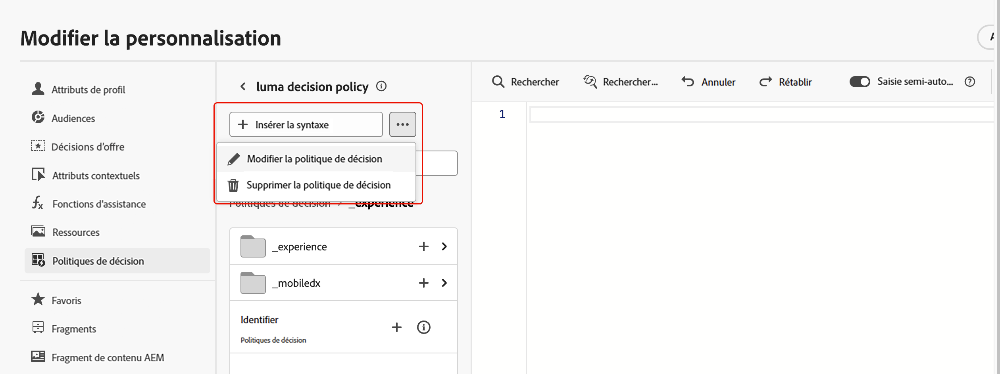

# Créer des politiques de décision {#create-decision}

>[!CONTEXTUALHELP]
>id="ajo_code_based_decision"
>title="Qu’est-ce qu’une décision ?"
>abstract="Les politiques de décision contiennent toute la logique de sélection afin que le moteur de prise de décision choisisse le meilleur contenu. Les politiques de décision sont spécifiques aux campagnes. Leur objectif est de sélectionner les meilleures offres pour chaque profil, tandis que la création de campagne vous permet d’indiquer comment les éléments de décision sélectionnés doivent être présentés, y compris les attributs d’élément à inclure dans le message."
>additional-url="https://experienceleague.adobe.com/fr/docs/journey-optimizer/using/decisioning/offer-decisioning/get-started-decision/starting-offer-decisioning" text="À propos de la prise de décision"

>[!CONTEXTUALHELP]
>id="ajo_journey_decision_policy"
>title="Définir une politique de décision"
>abstract="Une politique de décision vous permet de sélectionner les meilleurs éléments du moteur de prise de décision et de les diffuser à l’audience appropriée."
>additional-url="https://experienceleague.adobe.com/fr/docs/journey-optimizer/using/decisioning/offer-decisioning/get-started-decision/starting-offer-decisioning" text="À propos de la prise de décision"

>[!CONTEXTUALHELP]
>id="ajo_exd_decision_policy"
>title="Politique de décision"
>abstract="Une politique de décision vous permet de sélectionner les meilleurs éléments du moteur de décision et de les diffuser à chaque audience."

>[!CONTEXTUALHELP]
>id="ajo_exd_placements"
>title="Emplacement"
>abstract="Un emplacement détermine où les éléments renvoyés par le moteur de décision apparaissent dans un message. Vous pouvez suivre leurs performances sur les différents emplacements dans les rapports."

>[!CONTEXTUALHELP]
>id="ajo_exd_decision_attribute"
>title="Sélectionner des attributs de décision dans un catalogue"
>abstract="Les attributs de décision sont stockés dans le schéma du catalogue. Sélectionnez un attribut que vous souhaitez utiliser ici dans le catalogue sélectionné."

Les politiques de décision sont des conteneurs pour vos offres qui s’appuient sur le moteur de prise de décision pour renvoyer de manière dynamique le meilleur contenu à diffuser pour chaque membre de l’audience. Leur objectif est de sélectionner les meilleures offres pour chaque profil, tandis que la création de campagne et de parcours vous permet d’indiquer comment les éléments de décision sélectionnés doivent être présentés, y compris les attributs d’élément à inclure dans le message.

## Principales étapes {#key}

Les principales étapes pour tirer parti des politiques de décision dans vos messages sont les suivantes :

1. [Créer une politique de décision dans un e-mail ou une expérience basée sur du code](#add-decision)

   Configurez une politique de décision dans votre expérience par e-mail ou basée sur du code en choisissant le nombre d’éléments à renvoyer, en configurant des stratégies de sélection, des options de secours et l’ordre d’évaluation.

1. [Utilisation de la politique de décision dans votre contenu](#use-decision-policy)

   Personnalisez votre contenu avec la sortie et les attributs de la politique de décision des éléments de décision que vous souhaitez afficher dans le message.

1. [Créer des tableaux de bord de rapports](cja-reporting.md)

   Créez des tableaux de bord Customer Journey Analytics personnalisés pour mesurer les performances et obtenir des informations sur la manière dont vos politiques de décision et vos offres sont diffusées et utilisées.

## Mécanismes de sécurisation et limitations

* **Disponibilité limitée - Politique de décision dans les e-mails** - Pour l’instant, la création de politique de décision dans les e-mails est disponible en disponibilité limitée. Contactez votre représentant Adobe pour obtenir l’accès.
* **Pages miroir** - Pour l’instant, les éléments de décision ne s’affichent pas dans les pages miroir des e-mails.
* **Type de tracking et de liens** - Pour tracker les liens générés par la prise de décision, définissez-les dans le schéma comme « Assets de prise de décision ». Les liens basés sur les attributs ne sont pas traçables.
* **Imbrication de politiques de décision dans des e-mails** - Vous ne pouvez pas imbriquer plusieurs politiques de décision dans un composant d’e-mail parent auquel est déjà associée une politique de décision.
* **parcours/campagnes dupliqués avec prise de décision** - Si vous dupliquez un parcours ou une campagne qui inclut une politique de décision, la version dupliquée fait référence à l’e-mail ou à l’expérience basée sur du code d’origine, ce qui entraîne des erreurs. Reconfigurez toujours la politique de décision après la duplication.
* **Politiques de consentement** - Les mises à jour des politiques de consentement peuvent prendre jusqu’à 24 heures. Si une politique de décision fait référence à un attribut lié à une politique de consentement récemment mise à jour, les modifications ne sont pas appliquées immédiatement.

  De même, si de nouveaux attributs de profil soumis à une politique de consentement sont ajoutés à une politique de décision, ils seront utilisables, mais la politique de consentement qui leur est associée ne sera pas appliquée tant que le délai ne sera pas écoulé.

  Les politiques de consentement ne sont disponibles que pour les organisations qui disposent du module complémentaire Adobe Healthcare Shield ou Privacy and Security Shield .

* **Classement par l&#39;IA** - Pour l&#39;instant, le classement par l&#39;IA n&#39;est pas pris en charge pour le canal E-mail dans les parcours avec prise de décision.

## Créer une politique de décision dans un e-mail ou une expérience basée sur du code {#add-decision}

>[!CONTEXTUALHELP]
>id="ajo_code_based_item_number"
>title="Définir le nombre d’éléments à renvoyer"
>abstract="Sélectionnez le nombre d’éléments de décision à renvoyer. Par exemple, si vous sélectionnez 2, les 2 meilleures offres éligibles seront présentées pour la configuration actuelle."

>[!CONTEXTUALHELP]
>id="ajo_code_based_fallback"
>title="Sélectionner une offre de secours"
>abstract="Un élément d’offre de secours s’affiche pour l’utilisateur ou l’utilisatrice lorsqu’aucune des stratégies de sélection définies pour cette politique de décision n’est qualifiée."

>[!CONTEXTUALHELP]
>id="ajo_code_based_strategy"
>title="Qu’est-ce qu’une stratégie ?"
>abstract="La séquence de stratégies de sélection détermine la stratégie qui sera évaluée en premier. Au moins une stratégie est requise. Les éléments de décision des stratégies combinées seront évalués ensemble."
>additional-url="https://experienceleague.adobe.com/fr/docs/journey-optimizer/using/decisioning/offer-decisioning/get-started-decision/starting-offer-decisioning" text="Créer des stratégies"

Pour présenter la meilleure offre et la meilleure expérience dynamique aux destinataires et aux visiteurs de vos e-mails sur votre site web ou application mobile, ajoutez une politique de décision à un e-mail ou à une campagne ou un parcours basé sur du code. Pour ce faire, procédez comme suit.

### Création d’une politique de décision {#add}

1. Dans un parcours ou une campagne, ajoutez une action **[!UICONTROL E-mail]** ou **[!UICONTROL Expérience basée sur le code]**.

1. Pour les e-mails, activez **[!UICONTROL Activer la prise de décision]** dans l’écran de configuration.

   

   >[!IMPORTANT]
   >
   >L’activation de la prise de décision efface le contenu d’e-mail existant. Si vous avez déjà conçu votre e-mail, veillez à enregistrer votre contenu en tant que modèle au préalable.
   >
   >Notez qu’aucune politique de décision configurée dans l’e-mail ne sera enregistrée dans le modèle. Si vous appliquez le modèle à un autre e-mail, vous devez reconfigurer la politique.

1. Il est possible de créer des politiques dans des expériences basées sur des e-mails et du code à l’aide de l’éditeur de personnalisation. Elles peuvent également être créées dans les e-mails à partir d&#39;un menu dédié dans le Designer Email. Pour plus d’informations, développez les sections ci-dessous.

   Éditeur Personalization

   1. Ouvrez l’éditeur de personnalisation et sélectionnez **[!UICONTROL Politique de décision]**.
   1. Cliquez sur le bouton **[!UICONTROL Ajouter une politique de décision]** pour créer une politique.

      

+++

   +++Menu Email Designer **[!UICONTROL Prise de décision]**

   1. Sélectionnez un composant, cliquez sur l’icône **[!UICONTROL Prise de décision]** dans la barre d’outils ou le volet des propriétés, puis sélectionnez **[!UICONTROL Ajouter une nouvelle politique]**.

   1. Sélectionnez **[!UICONTROL Réutiliser la sortie de décision]** pour réutiliser une politique de décision déjà créée dans cet e-mail.

      

   +++

1. Attribuez un nom et sélectionnez un catalogue (actuellement limité au catalogue par défaut **[!UICONTROL Offres]**).

1. Sélectionnez le nombre d’éléments à renvoyer. Par exemple, si vous sélectionnez 2, les 2 meilleures offres éligibles seront présentées pour la configuration actuelle.

   

   Pour les e-mails, plusieurs éléments ne peuvent être renvoyés que dans un composant de contenu **[!UICONTROL Grille de répétition]**. Pour plus d’informations, développez la section ci-dessous :

+++ Renvoyer plusieurs éléments de décision dans les e-mails

   1. Faites glisser un composant **[!UICONTROL Répéter la grille]** sur la zone de travail et configurez-le selon vos besoins à l’aide du volet **[!UICONTROL Paramètres]**.

      

   1. Cliquez sur l’icône **[!UICONTROL Prise de décision]** dans la barre d’outils de la zone de travail ou ouvrez le volet **[!UICONTROL Prise de décision]** et sélectionnez **[!UICONTROL Ajouter une politique de décision]**.

   1. Indiquez le nombre d’éléments à renvoyer dans le champ **[!UICONTROL Nombre d’éléments]** puis configurez la politique de décision comme indiqué ci-dessous. Le nombre maximal d’éléments que vous pouvez sélectionner est limité par le nombre de mosaïques définies dans le composant **[!UICONTROL Répéter la grille]**.

   

+++

1. Cliquez sur **[!UICONTROL Suivant]**.

### Sélection des éléments et des stratégies de sélection {#select}

La section **[!UICONTROL Séquence de stratégies]** vous permet de sélectionner les éléments de décision et les stratégies de sélection à inclure avec la politique de décision.

1. Cliquez sur **[!UICONTROL Ajouter]** et sélectionnez le type d’objet à inclure dans la stratégie :

   * **[!UICONTROL Stratégie de sélection]** : ajoutez une ou plusieurs stratégies de sélection. Les stratégies de décision tirent parti des collections associées aux contraintes d’éligibilité et aux méthodes de classement pour déterminer les éléments à afficher. Vous pouvez sélectionner une stratégie de sélection existante ou en créer une à l’aide du bouton **[!UICONTROL Créer une stratégie de sélection]**. [Découvrir comment créer des stratégies de sélection](selection-strategies.md)

   * **[!UICONTROL Élément de décision]** : ajoutez des éléments de décision uniques à présenter sans avoir à exécuter une stratégie de sélection. Vous pouvez sélectionner un seul élément de décision à la fois. Toutes les contraintes d’éligibilité définies pour l’élément s’appliquent.

   

   >[!NOTE]
   >
   >Une politique de décision prend en charge jusqu’à 10 stratégies de sélection et éléments de décision combinés. [En savoir plus sur les mécanismes de sécurisation et sur les limitations de la prise de décisions](gs-experience-decisioning.md#guardrails)

1. Lorsque vous ajoutez plusieurs éléments et/ou stratégies de décision, ils sont évalués dans un ordre spécifique. Le premier objet ajouté à la séquence sera évalué en premier, et ainsi de suite. Pour modifier la séquence par défaut, faites glisser et déposez les objets et/ou les groupes pour les réorganiser selon vos besoins. Pour plus d’informations, développez la section ci-dessous.

   +++Gérer l’ordre d’évaluation dans une politique de décision

   Une fois que vous avez ajouté des éléments de décision et des stratégies de sélection à votre politique, vous pouvez les organiser pour déterminer leur ordre d’évaluation et combiner des stratégies de sélection à évaluer ensemble.

   L’**ordre séquentiel** dans lequel les éléments et les stratégies seront évalués est indiqué par des chiffres à gauche de chaque objet ou groupe d’objets. Pour déplacer la position d’une stratégie de sélection (ou d’un groupe de stratégies) dans la séquence, effectuez un glisser-déposer vers une autre position.

   

   >[!NOTE]
   >
   >Seules les stratégies de sélection peuvent être glissées-déposées dans une séquence. Pour modifier la position d’un élément de décision, vous devez le supprimer et l’ajouter à nouveau à l’aide du bouton **[!UICONTROL Ajouter]** après avoir ajouté les autres éléments à évaluer auparavant.

   Vous pouvez également **combiner** plusieurs stratégies de sélection en groupes afin qu’elles soient évaluées ensemble et non séparément. Pour ce faire, cliquez sur le bouton **`+`** sous une stratégie de sélection pour la combiner à une autre. Vous pouvez également effectuer un glisser-déposer d’une stratégie de sélection sur une autre afin de regrouper les deux stratégies dans un groupe.

   >[!NOTE]
   >
   >Les éléments de décision ne peuvent pas être regroupés avec d’autres éléments ou stratégies de sélection.

   Plusieurs stratégies et leur regroupement déterminent la priorité des stratégies et le classement des offres éligibles. La première stratégie a la priorité la plus élevée et les stratégies combinées au sein d’un même groupe ont la même priorité.

   Prenons l’exemple suivant : vous disposez de deux collections, l’une dans la stratégie A et l’autre dans la stratégie B. La demande concerne le renvoi de deux éléments de décision. Supposons qu&#39;il y ait deux offres éligibles pour la stratégie A et trois offres éligibles pour la stratégie B.

   * Si les deux stratégies ne sont **pas combinées** ni dans l’ordre séquentiel (1 et 2), les deux meilleures offres éligibles de la première stratégie seront renvoyées dans la première ligne. S’il n’y a pas deux offres éligibles pour la première stratégie, le moteur de décision passera à la stratégie suivante dans la séquence pour trouver autant d’offres que nécessaire, et renverra finalement une offre de secours si nécessaire.

     

   * Si les deux collections sont **évaluées en même temps**, étant donné qu’il y a deux offres éligibles pour la stratégie A et trois offres éligibles pour la stratégie B, les cinq offres seront regroupées et classées selon la valeur déterminée par leurs méthodes de classement respectives. Comme deux offres sont demandées, les deux meilleures offres éligibles parmi ces cinq offres seront renvoyées.

     

   **Exemple avec plusieurs stratégies**

   Prenons maintenant un exemple où vous avez plusieurs stratégies divisées en différents groupes. Vous avez défini trois stratégies. La stratégie 1 et la stratégie 2 sont combinées dans le groupe 1 et la stratégie 3 est indépendante (groupe 2). Les offres éligibles pour chaque stratégie et leur priorité (utilisée dans l’évaluation de la fonction de classement) sont les suivantes :

   * Groupe 1 :
      * Stratégie 1 - (offre 1, offre 2 et offre 3) - Priorité 1
      * Stratégie 2 - (offre 3, offre 4 et offre 5) - Priorité 1

   * Groupe 2 :
      * Stratégie 3 - (offre 5 et offre 6) - Priorité 0

   Les offres de stratégie ayant la priorité la plus élevée sont évaluées en premier et ajoutées à la liste des offres classées.

   * **Itération 1 :**

     Les offres des stratégies 1 et 2 sont évaluées ensemble (offre 1, offre 2, offre 3, offre 4 et offre 5). Nous arrivons au résultat suivant :

     Offre 1 - 10
Offre 2 - 20
Offre 3 - 30 pour la stratégie 1, 45 pour la stratégie 2. Le critère le plus élevé des deux sera pris en compte (45).
Offre 4 - 40
Offre 5 - 50

     Les offres classées se présentent désormais comme suit : offre 5, offre 3, offre 4, offre 2 et offre 1.

   * **Itération 2 :**

     Les offres de la stratégie 3 sont évaluées (offre 5 et offre 6). Nous arrivons au résultat suivant :

      * Offre 5 : non évaluée, car elle existe déjà dans le résultat ci-dessus.
      * Offre 6 - 60

     Les offres classées sont désormais les suivantes : offre 5 , offre 3, offre 4, offre 2, offre 1 et offre 6.

   +++

1. Cliquez sur **[!UICONTROL Suivant]**.

### Ajout d’offres de secours {#fallback}

Une fois que vous avez sélectionné des éléments de décision et/ou des stratégies de sélection, vous pouvez ajouter des offres de secours à afficher si aucun des éléments ou des stratégies de sélection ci-dessus n’est qualifié.

Vous pouvez sélectionner n’importe quel élément de la liste, qui affiche tous les éléments de décision créés dans le sandbox actuel. Si aucune stratégie de sélection n’est qualifiée, l’offre de secours est affichée pour l’utilisateur ou utilisatrice, quelles que soient les dates et les contraintes d’éligibilité appliquées à l’élément sélectionné.<!--nor frequency capping when available - TO CLARIFY-->.

>[!NOTE]
> Les secours sont facultatifs. Vous pouvez sélectionner jusqu’au nombre d’éléments demandés. Si aucun n’est éligible et qu’aucune solution de secours n’est définie, rien ne s’affiche.

### Enregistrer et gérer les politiques de décision {#save}

Lorsque votre politique de décision est prête, enregistrez-la et cliquez sur **[!UICONTROL Créer]**.

Pour les e-mails , vous devez définir un emplacement pour le composant associé à la politique de décision. Pour ce faire, cliquez sur le bouton **[!UICONTROL Prise de décision]** dans le volet des propriétés du composant et sélectionnez **[!UICONTROL Attribuer l&#39;emplacement]**. [Découvrez comment utiliser les emplacements](../experience-decisioning/placements.md)

Vous pouvez modifier ou supprimer une politique de décision à tout moment à l’aide du bouton représentant des points de suspension dans l’éditeur de personnalisation, ou dans le menu **[!UICONTROL Prise de décision]** dans le volet des propriétés du composant.

>[!BEGINTABS]

>[!TAB Modifier ou supprimer une politique à partir de l’éditeur de personnalisation]

>[!TAB Modifier ou supprimer une politique à partir des propriétés du composant]

>[!ENDTABS]

## Utilisation d’une politique de décision dans votre contenu {#use-decision-policy}

Une fois créée, la politique de décision et les attributs liés aux éléments de décision renvoyés peuvent être utilisés dans votre contenu pour personnaliser votre contenu. Pour ce faire, procédez comme suit.

### Insérer le code de la politique de décision {#insert-code}

1. Ouvrez l’éditeur de personnalisation et accédez au menu **[!UICONTROL Politique de décision]**.

1. Pour les e-mails, cliquez sur **[!UICONTROL Insérer une syntaxe]** pour ajouter le code correspondant à la politique de décision. Pour les expériences basées sur du code, cliquez sur **[!UICONTROL Insérer une politique]**.

   +++Insérer le code de la politique de décision dans les e-mails

   

   Pour les e-mails, si aucun emplacement n’a été associé au préalable au composant, sélectionnez-en un dans la liste et cliquez sur **[!UICONTROL Attribuer]**.

   

   +++

   +++Insérer le code de la politique de décision dans l’expérience basée sur le code

   

   +++

   >[!NOTE]
   >
   >Si le bouton d’insertion de code ne s’affiche pas, il se peut qu’une politique de décision ait déjà été configurée pour le composant parent.

1. Le code de la politique de décision est ajouté. Cette séquence sera répétée selon le nombre de renvoi de la politique de décision que vous choisissez. Par exemple, si vous avez choisi de renvoyer 2 éléments lors de la [création de la décision](#add-decision), la même séquence sera répétée deux fois.

### Utiliser les attributs des éléments de décision {#attributes}

Vous pouvez désormais ajouter tous les attributs de décision que vous souhaitez dans ce code. Les attributs disponibles sont stockés dans le schéma du catalogue **[!UICONTROL Offres]**. Les attributs personnalisés sont stockés dans le dossier **`_<imsOrg`>**, et les attributs standard dans le dossier **`_experience`**. [En savoir plus sur le schéma du catalogue Offres](catalogs.md)

>[!NOTE]
>
>Pour le suivi des éléments de la politique de décision, l’attribut `trackingToken` doit être ajouté comme suit pour le contenu de la politique de décision :
>&#x200B;>`trackingToken: {{item._experience.decisioning.decisionitem.trackingToken}}`

1. Cliquez sur chaque dossier pour le développer. Placez le curseur de votre souris à l’emplacement souhaité, puis cliquez sur l’icône + en regard de l’attribut à ajouter. Vous pouvez ajouter au code autant d’attributs que vous le souhaitez.

   

1. Veillez à placer la boucle `#each` à l’intérieur d’une paire de crochets `[ ]`, ajoutez une virgule juste avant l’élément `/each` de fermeture.

   

1. Vous pouvez également ajouter tout autre attribut disponible dans l’éditeur de personnalisation, tel que des attributs de profil.

   

## Dernières étapes {#final-steps}

Une fois que votre contenu est prêt, passez en revue et publiez votre campagne ou votre parcours :

* [Publier un parcours](../building-journeys/publishing-the-journey.md)
* [Vérification de l’activation d’une campagne](../campaigns/review-activate-campaign.md)
* [Publication et activation d’une expérience basée sur du code](../code-based/publish-code-based.md)

Pour les expériences basées sur du code, dès que votre développeur effectue un appel API ou SDK pour récupérer du contenu pour la surface définie dans votre configuration de canal, les modifications sont appliquées à votre page web ou à votre application.

>[!NOTE]
>
>Actuellement, vous ne pouvez pas simuler le contenu de l’interface d’utilisation dans une campagne ou un parcours d’[expérience basée sur du code](../code-based/create-code-based.md) à l’aide de décisions. Une solution de contournement est proposée dans [cette section](../code-based/code-based-decisioning-implementations.md).

Pour évaluer les performances de vos décisions, vous pouvez créer des [tableaux de bord de rapports Customer Journey Analytics personnalisés](cja-reporting.md).
