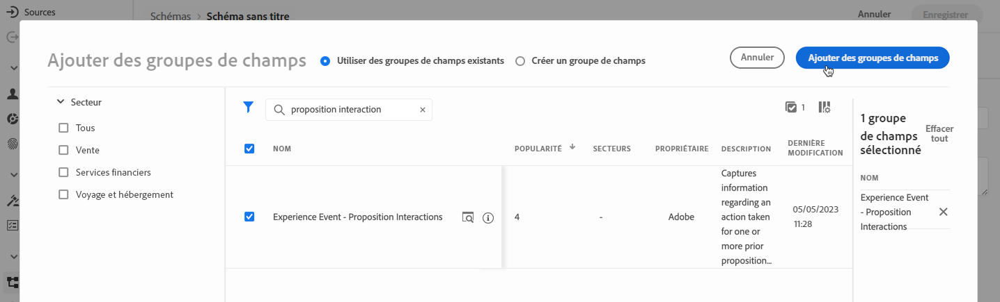

# Créer un jeu de données pour collecter des événements {#create-dataset}

Pour collecter des événements d’expérience, vous devez d’abord créer un jeu de données où ces événements seront envoyés.

Commencez par créer le schéma qui sera utilisé dans votre jeu de données :

1. Dans le menu **[!UICONTROL Gestion des données]**, sélectionnez **[!UICONTROL Schéma]**.

1. Cliquez sur **[!UICONTROL Créer un schéma]**, dans le coin supérieur droit, sélectionnez **[!UICONTROL Événement d’expérience]** et cliquez sur **Suivant**.

   

   >[!NOTE]
   >
   >Découvrez les schémas XDM et les groupes de champs dans la [documentation de présentation du système XDM](https://experienceleague.adobe.com/docs/experience-platform/xdm/home.html?lang=fr){target="_blank"}.

1. Saisissez le nom et la description de votre schéma, puis cliquez sur **Terminer**.
   

1. Dans la section **[!UICONTROL Groupes de champs]** à gauche, sélectionnez **[!UICONTROL Ajouter]**.

   

1. Dans le champ **[!UICONTROL Rechercher]**, saisissez « interaction de proposition ».

1. Sélectionnez le groupe de champs **[!UICONTROL Événement d’expérience - Interactions de proposition]** et cliquez sur **[!UICONTROL Ajouter des groupes de champs]**.

   

   >[!CAUTION]
   >
   >Le schéma qui sera utilisé dans votre jeu de données doit être associé au groupe de champs **[!UICONTROL Événement d&#39;expérience - Interactions de proposition]**. Sinon, vous ne pourrez pas l&#39;utiliser dans votre modèle d’IA.

1. Enregistrez le schéma.

>[!NOTE]
>
>Pour plus d’informations sur la création de schémas, consultez la section [Principes de base de la composition de schémas](https://experienceleague.adobe.com/docs/experience-platform/xdm/schema/composition.html?lang=fr#understanding-schemas){target="_blank"}.

Vous êtes maintenant en mesure de créer un jeu de données à l’aide de ce schéma. Pour ce faire, procédez comme suit :

1. Dans le menu **[!UICONTROL Gestion des données]**, sélectionnez **[!UICONTROL Jeux de données]** et accédez à l’onglet **[!UICONTROL Parcourir]**.

1. Cliquez sur **[!UICONTROL Créer un jeu de données]** et sélectionnez **[!UICONTROL Créer un jeu de données à partir d’un schéma]**.

   

1. Sélectionnez le schéma que vous venez de créer dans la liste et cliquez sur **[!UICONTROL Suivant]**.

1. Attribuez un nom unique au jeu de données dans le champ **[!UICONTROL Nom]** et cliquez sur **[!UICONTROL Terminer]**.

   

>[!NOTE]
>
>Ce jeu de données peut maintenant être sélectionné pour collecter des données dʼévénement lors de la création dʼun [modèle d’IA](../ranking/create-ai-models.md).
