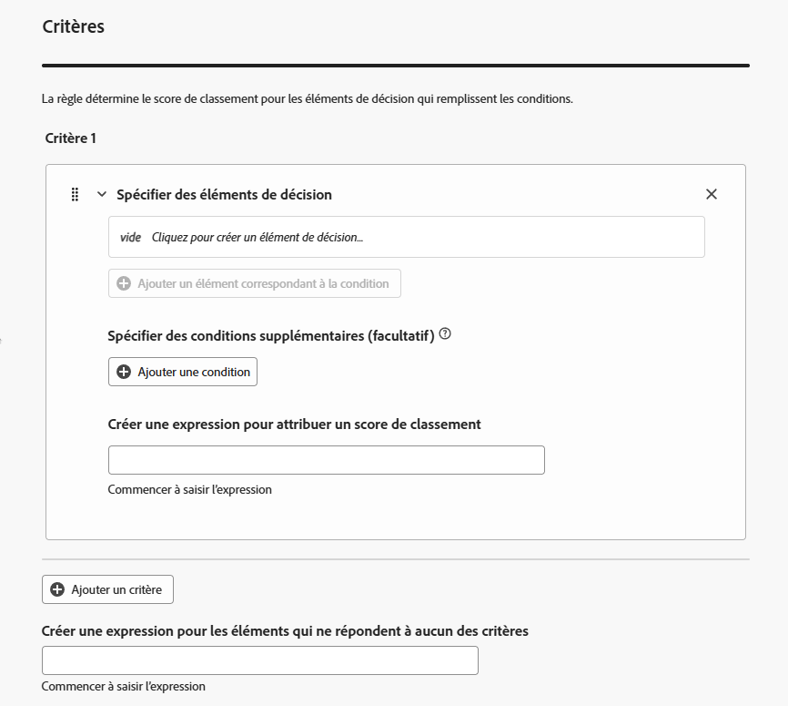
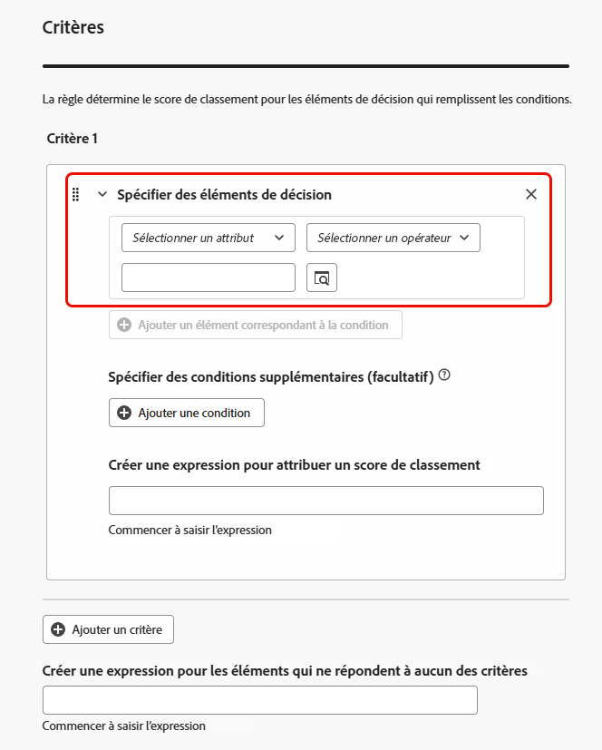
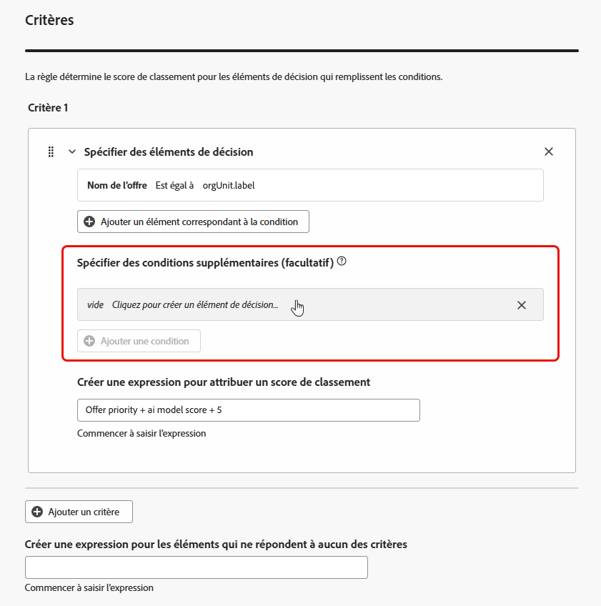
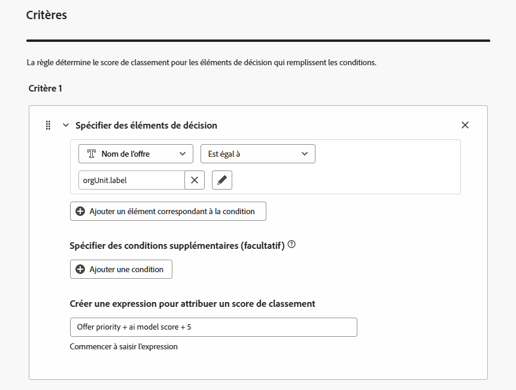

# Utiliser le créateur de formules d’IA {#create-ranking-formulas}

Les **formules de classement** vous permettent de définir des règles déterminant quelle offre doit être présentée en premier, plutôt que de prendre en compte les scores de priorité.

Pour créer ces règles, le créateur de formules d’IA de **[!UICONTROL Adobe Journey Optimizer]** offre une plus grande flexibilité et un meilleur contrôle du classement des offres. Au lieu de vous fier uniquement à une priorité d’offre statique, vous pouvez désormais définir des formules de classement personnalisées qui combinent les scores du modèle d’IA, les priorités d’offre, les attributs de profil, les attributs d’offre et les signaux contextuels par le biais d’une interface guidée.

Cette approche vous permet d’ajuster dynamiquement le classement des offres en fonction de n’importe quelle combinaison entre la propension pilotée par l’IA, la valeur commerciale et le contexte en temps réel, ce qui facilite l’alignement de la prise de décision sur les objectifs marketing et les besoins des clients. Le créateur de formules d’IA prend en charge les formules simples ou avancées en fonction du niveau de contrôle que vous souhaitez appliquer.

Après avoir créé une formule de classement, vous pouvez l&#39;affecter à une [stratégie de sélection](selection-strategies.md). Si plusieurs offres sont éligibles à la présentation lors de l&#39;utilisation de cette stratégie de sélection, le moteur de décision utilisera la formule sélectionnée pour calculer l&#39;offre à diffuser en premier.

## Créer une formule de classement {#create-ranking-formula}

>[!CONTEXTUALHELP]
>id="ajo_exd_config_formulas"
>title="Créer des formules de classement"
>abstract="Les formules vous permettent de définir des règles déterminant la décision qui doit être présentée en premier au lieu de prendre en compte les scores de priorité de l’élément. Après avoir créé une formule de classement, vous pouvez l’affecter à une stratégie de sélection."

Pour créer une formule de classement, procédez comme suit.

1. Accédez au menu **[!UICONTROL Configuration de la stratégie]**, puis sélectionnez l’onglet **[!UICONTROL Formules de classement]**. La liste des formules créées précédemment s’affiche.

   

1. Cliquez sur **[!UICONTROL Créer une formule]**.

1. Spécifiez le nom de la formule et ajoutez une description, le cas échéant.

   {width="80%"}

1. Si vous le souhaitez, cliquez sur **[!UICONTROL Sélectionner un modèle d’IA]** pour définir le modèle à utiliser comme référence pour créer votre formule de classement.

   >[!NOTE]
   >
   >[Les modèles d’optimisation personnalisés](../offers/ranking/personalized-optimization-model.md) utilisant des mesures continues ne sont pas pris en charge avec le créateur de formules d’IA.

Chaque fois que vous vous référez à un score du modèle lors de la définition de votre formule ci-dessous, le modèle d’IA que vous avez sélectionné sera utilisé.

    >[ !ATTENTION]
    >
    >Lors de l’utilisation d’un modèle d’IA incorporé dans une formule de classement, les données ne sont pas reflétées dans le rapport [Taux de conversion pour le trafic d’exclusion et piloté par le modèle](../reports/campaign-global-report-cja-code.md#conversion-rate).

1. Définissez les conditions qui détermineront le score de classement pour les éléments de décision correspondants. Vous pouvez effectuer l’une des opérations suivantes :

   * renseignez la section **[!UICONTROL Critères]** à partir de l’[interface utilisateur](#ranking-select-criteria),
   * ou passez à l’[ éditeur de code ](#ranking-code-editor).

<!--## Select an ELS dataset {#els-dataset}

To leverage data from an AEP dataset, you can select it in the **[!UICONTROL ELS settings]** section.

1. Select an ELS dataset from the list.

1. Select a decision attribute. This action is mandatory.

{width="80%"}

-->

## Définir des critères à l’aide du créateur de formules {#ranking-select-criteria}

Grâce à une interface intuitive, vous pouvez affiner la prise de décision en ajustant les scores de l’IA (propension), la valeur de l’offre (priorité), les leviers contextuels et les propensions des profils externes, individuellement ou en combinaison, afin d’optimiser chaque interaction. <!--Whether you're maximizing revenue, promoting strategic offers, or balancing business goals with real-time context, the formula builder gives you total control in defining ranking strategies.-->

Pour définir des critères directement à partir de l’interface , procédez comme suit.

<!--{width="80%"}-->

1. Dans la section **[!UICONTROL Critère 1]**, spécifiez les éléments de décision auxquels vous souhaitez appliquer un score de classement en procédant comme suit :
   * sélectionnez un [attribut d’élément de décision](items.md#attributes),
   * sélectionner un opérateur logique,
   * ajoutez une condition correspondante - vous pouvez saisir une valeur ou sélectionner un attribut de profil ou [des données contextuelles](context-data.md).

   {width="70%"}

1. Vous pouvez éventuellement spécifier des éléments supplémentaires pour affiner les conditions correspondantes afin que vos critères soient vrais.

   {width="80%"}

   Par exemple, vous avez défini le critère 1 tel que l’attribut personnalisé *Météo* *Est égal à* la condition *Chaud*. De plus, vous pouvez ajouter une autre condition, par exemple si la première condition est remplie et si la température dépasse 75 degrés au moment de la requête, alors le critère 1 est vrai.<!--Add a screenshot with the example-->

1. Créez une expression qui attribuera un score de classement aux éléments de décision qui répondent à la condition définie ci-dessus. Vous pouvez référencer l’un des éléments suivants :

   * le score provenant du modèle d’IA que vous avez éventuellement sélectionné dans la section **[!UICONTROL Détails]** [ci-dessus](#create-ranking-formula) ;
   * la priorité de l’élément de décision, qui est une valeur affectée manuellement lors de la [création d’un élément de décision](items.md#attributes) ; <!--If a profile qualifies for multiple decision items, a higher priority grants the item precedence over others.-->
   * tout attribut susceptible de résider sur le profil, tel qu’un score de propension dérivé de l’extérieur ;
   * une valeur statique que vous pouvez attribuer dans un format libre ;
   * toute combinaison de tous les éléments ci-dessus.

   {width="70%"}

   >[!NOTE]
   >
   >Cliquez sur l’icône en regard du champ pour ajouter des variables prédéfinies.

1. Cliquez sur **[!UICONTROL Ajouter un critère]** pour ajouter un ou plusieurs critères autant de fois que nécessaire. La logique est la suivante :
   * Si le premier critère est vrai pour un élément de décision donné, il est prioritaire sur les suivants.
   * Si ce n’est pas le cas, le moteur de décision passe au deuxième critère, et ainsi de suite.

1. Dans le dernier champ, vous pouvez créer une expression qui sera affectée à tous les éléments de décision qui ne répondent pas aux critères ci-dessus.

   {width="70%"}

1. Cliquez sur **[!UICONTROL Créer]** pour terminer votre formule de classement. Vous pouvez maintenant le sélectionner dans la liste pour en afficher les détails et le modifier ou le supprimer. Il est prêt à être utilisé dans une [stratégie de sélection](selection-strategies.md) pour classer les éléments de décision éligibles.

### Exemple de formule de classement

Prenons l’exemple ci-dessous :

{width="80%"}

Si la région de l’élément de décision (attribut personnalisé) est égale au libellé géographique du profil (attribut de profil), le score de classement exprimé ici (qui est une combinaison de la priorité de l’élément de décision, du score du modèle d’IA et d’une valeur statique) sera appliqué à tous les éléments de décision répondant à cette condition.

## Utilisation de l’éditeur de code {#ranking-code-editor}

Pour exprimer les formules de classement dans la syntaxe **PQL**, basculez vers l&#39;éditeur de code à l&#39;aide du bouton dédié en haut à droite de l&#39;écran. Pour plus d&#39;informations sur l&#39;utilisation de la syntaxe PQL, reportez-vous à la [documentation dédiée](https://experienceleague.adobe.com/docs/experience-platform/segmentation/pql/overview.html?lang=fr).

>[!CAUTION]
>
>Cette action vous empêchera de revenir à l’affichage du créateur par défaut pour cette formule.

Vous pouvez ensuite exploiter les attributs de profil, [données contextuelles](context-data.md) et [attributs d&#39;élément de décision](items.md#attributes).

Par exemple, vous souhaitez augmenter la priorité de toutes les offres avec l’attribut « chaud » en cas de météo avec températures chaudes. Pour ce faire, le **contextData.weather=hot** a été transmis dans l&#39;appel de décision. <!--[Learn how to work with context data](context-data.md)-->

{width="80%"}

>[!IMPORTANT]
>
>Lors de la création d’une formule de classement, il n’est pas pris en charge de revenir à une période précédente, par exemple en ajoutant un événement d’expérience qui s’est produit le mois dernier en tant que composant de la formule. Toute tentative d’inclusion d’une période de recherche arrière lors de la création d’une formule déclenche une erreur lors de son enregistrement.

### Exemples de PQL de formule de classement {#ranking-formula-examples}

Vous pouvez créer de nombreuses formules de classement différentes en fonction de vos besoins. Voici quelques exemples.

+++Booster les offres avec un attribut d’offre spécifique en fonction de l’attribut de profil

Si le profil réside dans la ville correspondant à l’offre, doublez la priorité de toutes les offres de cette ville.

**Formule de classement:**

```
if( offer.characteristics.get("city") = homeAddress.city, offer.rank.priority * 2, offer.rank.priority)
```

+++

+++Booster les offres dont la date de fin est inférieure à 24 heures

**Formule de classement:**

```
if( offer.selectionConstraint.endDate occurs <= 24 hours after now, offer.rank.priority * 3, offer.rank.priority)
```

+++

+++Booster les offres en fonction de la propension des clients à acheter le produit proposé

Vous pouvez augmenter le score d’une offre en fonction d’un score de propension du client.

Dans cet exemple, le client d’instance est *_salesvelocity* et le schéma de profil contient une plage de scores stockés dans un tableau :


Ainsi, pour un profil tel que :

```
{"_salesvelocity": {"individualScoring": [
                    {"core": {
                            "category":"insurance",
                            "propensityScore": 96.9
                        }},
                    {"core": {
                            "category":"personalLoan",
                            "propensityScore": 45.3
                        }},
                    {"core": {
                            "category":"creditCard",
                            "propensityScore": 78.1
                        }}
                    ]}
}
```

+++

+++Booster les offres en fonction des {#context-data} de données contextuelles

[!DNL Journey Optimizer] permet de booster certaines offres en fonction des données contextuelles transmises dans l’appel. Par exemple, si la valeur `contextData.weather=hot` est transmise, la priorité de toutes les offres avec la valeur `attribute=hot` doit être boostée. Des informations détaillées sur la manière de transmettre des données contextuelles à l’aide des API **Edge Decisioning** et **Decisioning** sont disponibles dans [cette section](context-data.md).

Notez que lorsque vous utilisez l’API **Decisioning**, les données contextuelles sont ajoutées à l’élément de profil dans le corps de la requête, comme dans l’exemple ci-dessous.

```
"xdm:profiles": [
{
    "xdm:identityMap": {
        "crmid": [
            {
            "xdm:id": "CRMID1"
            }
        ]
    },
    "xdm:contextData": [
        {
            "@type":"_xdm.context.additionalParameters;version=1",
            "xdm:data":{
                "xdm:weather":"hot"
            }
        }
    ]
    
}],
```

+++

