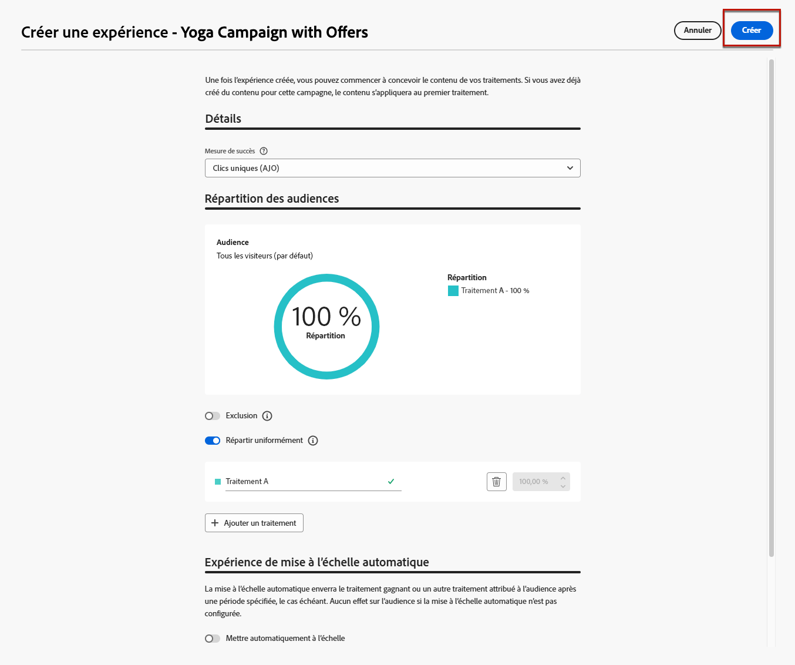

# Cas d’utilisation de la prise de décision {#experience-decisioning-uc}

Ce cas pratique présente toutes les étapes nécessaires pour utiliser Decisioning avec le canal basé sur le code [!DNL Journey Optimizer].

<!--In this use case, you create a campaign where you define two delivery treatments - each containing a different decision policy in order to measure which one performs best for your target audience.-->

Dans ce cas d&#39;utilisation, vous ne savez pas si une formule de classement spécifique sera plus performante que les priorités d&#39;offre préaffectées.

Pour mesurer celui qui fonctionne le mieux pour votre audience cible, créez une campagne à l’aide de [Expérience de contenu](../content-management/content-experiment.md) où vous définissez deux traitements de diffusion :

<!--Set up the experiment such that:-->

* Le premier traitement contient une stratégie de sélection avec une priorité pour méthode de classement.
* Le second traitement contient une stratégie de sélection différente pour laquelle une formule est la méthode de classement.

## Créer des stratégies de sélection

Tout d’abord, vous devez créer deux stratégies de sélection : une avec la priorité comme méthode de classement et une autre avec une formule comme méthode de classement.

### Création de la première stratégie de sélection

Dans la première stratégie de sélection, sélectionnez priorité comme méthode de classement. Suivez les étapes ci-dessous.

1. Créez un élément de décision. [Voici comment procéder](items.md)

1. Définissez la **[!UICONTROL priorité]** de l’élément de décision par rapport aux autres. Si un profil est éligible à plusieurs éléments, une priorité plus élevée accorde la priorité sur les autres.

   

   >[!NOTE]
   >
   >La priorité est un type de données Entier. Tous les attributs qui sont des types de données Entier doivent contenir des valeurs entières (pas de décimales).

1. Définissez l’éligibilité de l’élément de décision :

   * Définissez des audiences ou des règles pour limiter l’élément à des profils spécifiques uniquement. [En savoir plus](items.md#eligibility)

   * Définissez des règles de limitation pour définir le nombre maximal de fois où une offre peut être présentée. [En savoir plus](items.md#capping)

1. Si nécessaire, répétez les étapes ci-dessus pour créer des éléments de décision supplémentaires.

1. Créez une **collection** où vos éléments de décision seront inclus. [En savoir plus](collections.md)

1. Créez une [stratégie de sélection](selection-strategies.md#create-selection-strategy) et sélectionnez la [collection](collections.md) qui contient la ou les offres à prendre en compte.

1. [Choisissez la méthode de classement](#select-ranking-method) à utiliser pour sélectionner la meilleure offre pour chaque profil.

   Dans ce cas, sélectionnez **[!UICONTROL Priorité des offres]** : si plusieurs offres sont éligibles pour cette stratégie, le moteur Decisioning utilise la valeur définie comme **[!UICONTROL Priorité]** dans la ou les offres. [En savoir plus](selection-strategies.md#offer-priority)

   

### Créer la deuxième stratégie de sélection

Dans la deuxième stratégie de sélection, sélectionnez une formule comme méthode de classement. Suivez les étapes ci-dessous.

1. Créez un élément de décision. [Voici comment procéder](items.md)

<!--1. Set the same **[!UICONTROL Priority]** as for the first decision item. TBC?-->

1. Définissez l’éligibilité de l’élément de décision :

   * Définissez des audiences ou des règles pour limiter l’élément à des profils spécifiques uniquement. [En savoir plus](items.md#eligibility)

   * Définissez des règles de limitation pour définir le nombre maximal de fois où une offre peut être présentée. [En savoir plus](items.md#capping)

1. Si nécessaire, répétez les étapes ci-dessus pour créer des éléments de décision supplémentaires.

1. Créez une **collection** où vos éléments de décision seront inclus. [En savoir plus](collections.md)

1. Créez une [stratégie de sélection](selection-strategies.md#create-selection-strategy) et sélectionnez la [collection](collections.md) qui contient la ou les offres à prendre en compte.

1. [Choisissez la méthode de classement](#select-ranking-method) à utiliser pour sélectionner la meilleure offre pour chaque profil.

   Dans ce cas, sélectionnez **[!UICONTROL Formule]** pour utiliser un score calculé spécifique afin de choisir l’offre éligible à diffuser. [En savoir plus](selection-strategies.md#ranking-formula)

   

## Création d’une campagne d’expérience basée sur du code

<!--To present the best dynamic offer and experience to your visitors on your website or mobile app, add a decision policy to a code-based campaign.

Define two delivery treatments each containing a different decision policy.-->

Une fois que vous avez configuré les deux stratégies de sélection, créez une campagne d’expérience basée sur le code dans laquelle vous définissez un traitement différent pour chaque stratégie afin de comparer celle qui fonctionne le mieux.

1. Créez une campagne et sélectionnez l’action **[!UICONTROL Expérience basée sur du code]**. [En savoir plus](../code-based/create-code-based.md)

1. Dans la page de résumé de la campagne, cliquez sur **[!UICONTROL Créer une expérience]** pour commencer à configurer votre expérience de contenu. [En savoir plus](../content-management/content-experiment.md)

   

1. Cliquez sur **[!UICONTROL Modifier le contenu]**.

<!--1. Sart personalizing **Treatment A** by clicking **[!UICONTROL Create]**.

    -->

1. Dans la fenêtre d’édition du contenu, commencez à personnaliser **Traitement A** en cliquant sur **[!UICONTROL Modifier le code]**.

   

1. Sélectionnez **[!UICONTROL Politique de décision]**, cliquez sur **[!UICONTROL Ajouter une politique de décision]** et renseignez les détails de la décision. [En savoir plus](create-decision.md)

   

1. Sélectionnez la première stratégie que vous avez créée. Cliquez sur **[!UICONTROL Ajouter une stratégie]**.

1. Cliquez sur **[!UICONTROL Créer]**. La nouvelle décision est ajoutée sous **[!UICONTROL Décisions]**.

   

1. Cliquez sur l’icône d’actions supplémentaires (points de suspension) et sélectionnez **[!UICONTROL Ajouter]**. Vous pouvez maintenant ajouter tous les attributs de décision que vous souhaitez dans cette section.

   

1. Vous pouvez également ajouter tout autre attribut disponible dans l’éditeur de personnalisation, tel que des attributs de profil.

   

1. Dans la fenêtre de modification du contenu, sélectionnez **Traitement B**, puis répétez les étapes ci-dessus pour créer une autre politique de décision et sélectionnez la deuxième stratégie de sélection que vous avez créée.

   

1. Enregistrez votre contenu.
