# Utiliser la prise de décision dans une expérience basée sur le code avec une expérience de contenu {#experience-decisioning-uc}

Ce cas d’utilisation présente toutes les étapes nécessaires pour utiliser la prise de décisions avec le canal basé sur le code [!DNL Journey Optimizer].

➡️ [Découvrir un cas pratique en vidéo](#video)

>[!NOTE]
>
>La fonctionnalité de gestion des décisions héritée n’est pas prise en charge avec le canal d’expérience basé sur du code.

Dans cet exemple, vous ne savez pas si une formule de classement spécifique sera plus performante que les priorités d’offre préaffectées. Pour mesurer celle qui fonctionne le mieux pour votre audience cible, créez une campagne à l’aide de l’[Expérience de contenu](../content-management/content-experiment.md), dans laquelle vous définissez deux traitements de diffusion :

* Le premier traitement utilise la **priorité** comme méthode de classement.
* Le deuxième traitement utilise une **formule** comme méthode de classement.

>[!NOTE]
>
>Pour plus d’informations sur la mise en œuvre des tests et la déduplication lors de l’utilisation de la prise de décision dans des expériences basées sur du code, consultez [cette page](../code-based/code-based-decisioning-implementations.md).

## Créer des stratégies de sélection

Tout d’abord, vous devez créer deux stratégies de sélection : une avec la priorité comme méthode de classement et une autre avec une formule comme méthode de classement.

>[!NOTE]
>
>Vous pouvez également créer des éléments de décision uniques sans avoir à exécuter de stratégie de sélection. La priorité définie pour chaque élément s’applique.

### Créer une stratégie en utilisant la priorité

Pour créer la première stratégie de sélection avec la priorité comme méthode de classement, procédez comme suit.

1. Créez un élément de décision. [Voici comment procéder](items.md)

1. Définissez la **[!UICONTROL priorité]** de l’élément de décision par rapport aux autres. Si un profil est éligible à plusieurs éléments, une priorité plus élevée accorde la priorité sur les autres.

   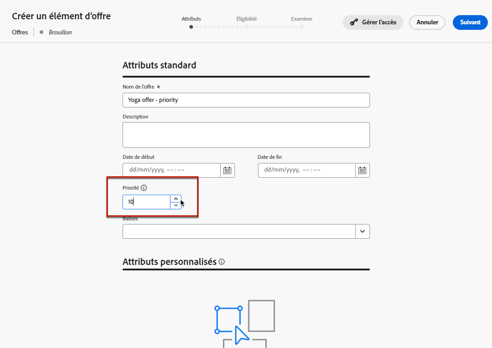{width="90%"}

   >[!NOTE]
   >
   >La priorité est un type de données Entier. Tous les attributs qui sont des types de données Entier doivent contenir des valeurs entières (pas de décimales).

1. Configurez l’éligibilité de l’élément de décision :

   * Définissez les audiences ou les règles afin de limiter l’élément à des profils spécifiques uniquement. [En savoir plus](items.md#eligibility)

   * La définition de règles de limitation est utilisée pour définir le nombre maximum de fois où une offre peut être présentée. [En savoir plus](items.md#capping)

1. Si nécessaire, répétez les étapes ci-dessus pour créer des éléments de décision supplémentaires.

1. Créez une **collection** dans laquelle vos éléments de décision seront inclus. [En savoir plus](collections.md)

1. Créez une [stratégie de sélection](selection-strategies.md#create-selection-strategy) et sélectionnez la [collection](collections.md) qui contient la ou les offres à prendre en compte.

1. [Définissez la méthode de classement](#select-ranking-method) à utiliser pour sélectionner la meilleure offre pour chaque profil. Dans ce cas, sélectionnez **[!UICONTROL Priorité des offres]** : si plusieurs offres sont éligibles pour cette stratégie, le moteur de décision utilise la valeur définie comme **[!UICONTROL Priorité]** dans la ou les offres. [En savoir plus](selection-strategies.md#offer-priority)

   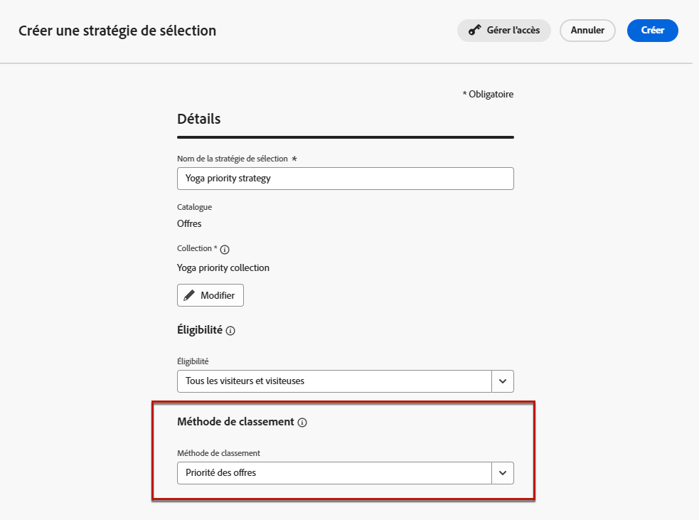{width="90%"}

### Créer une autre stratégie en utilisant une formule

Pour créer la deuxième stratégie de sélection avec la sélection d’une formule comme méthode de classement, procédez comme suit.

1. Créez un élément de décision. [Voici comment procéder](items.md)

   <!--Do you need to set the same **[!UICONTROL Priority]** as for the first decision item, or it won't be considered at all?-->

1. Configurez l’éligibilité de l’élément de décision :

   * Définissez les audiences ou les règles afin de limiter l’élément à des profils spécifiques uniquement. [En savoir plus](items.md#eligibility)

   * La définition de règles de limitation est utilisée pour définir le nombre maximum de fois où une offre peut être présentée. [En savoir plus](items.md#capping)

1. Si nécessaire, répétez les étapes ci-dessus pour créer des éléments de décision supplémentaires.

1. Créez une **collection** dans laquelle vos éléments de décision seront inclus. [En savoir plus](collections.md)

1. Créez une [stratégie de sélection](selection-strategies.md#create-selection-strategy) et sélectionnez la [collection](collections.md) qui contient la ou les offres à prendre en compte.

1. [Définissez la méthode de classement](#select-ranking-method) à utiliser pour sélectionner la meilleure offre pour chaque profil. Dans ce cas, sélectionnez **[!UICONTROL Formule]** pour utiliser un score calculé spécifique afin de déterminer l’offre éligible à diffuser. [En savoir plus](selection-strategies.md#ranking-formula)

   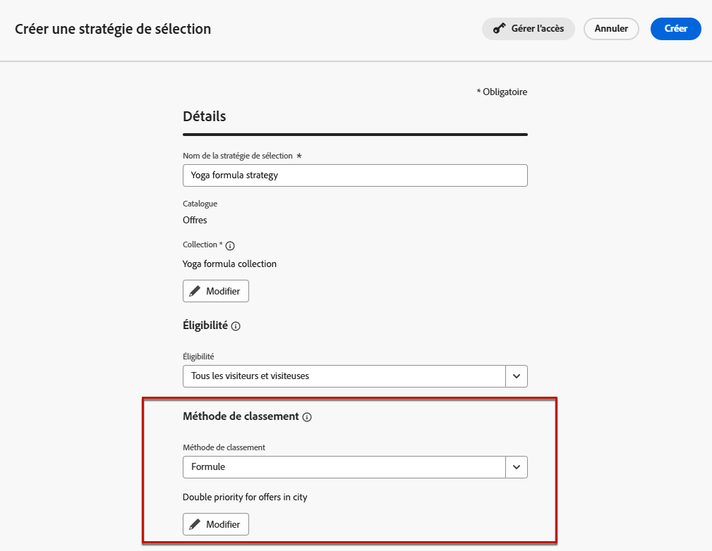{width="90%"}

## Créer une campagne d’expérience basée sur le code

Une fois que vous avez configuré les deux stratégies de sélection, créez une campagne d’expérience basée sur le code dans laquelle vous définissez un traitement différent pour chaque stratégie, afin de comparer celle qui fonctionne le mieux.

1. Créez une campagne et sélectionnez l’action **[!UICONTROL Expérience basée sur du code]**. [En savoir plus](../code-based/create-code-based.md)

1. Dans la page de résumé de la campagne, cliquez sur **[!UICONTROL Créer une expérience]** pour configurer votre expérience de contenu. [Voici comment procéder](../content-management/content-experiment.md)

   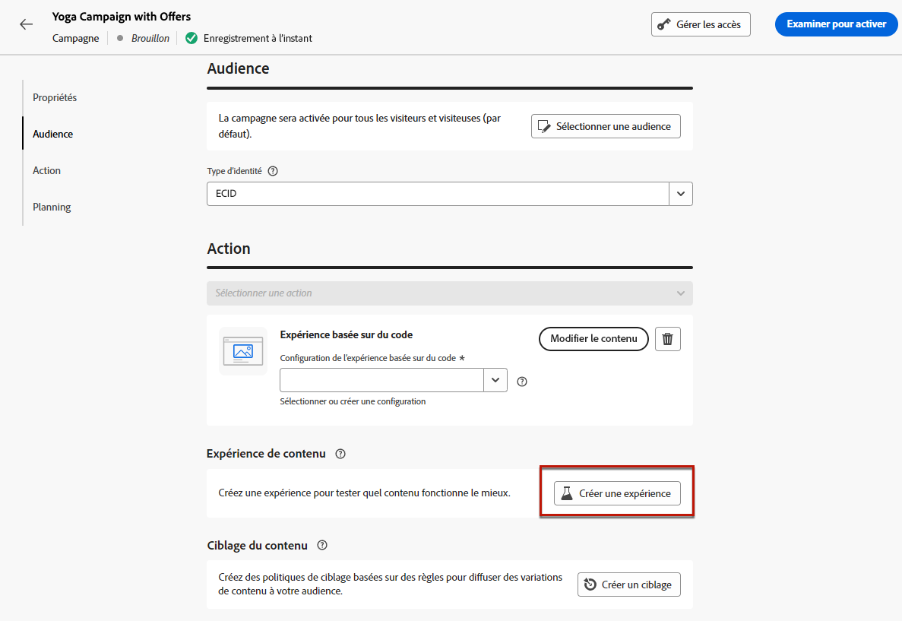{width="90%"}

1. Dans la page de résumé de la campagne, sélectionnez une configuration basée sur du code, puis cliquez sur **[!UICONTROL Modifier le contenu]**.

   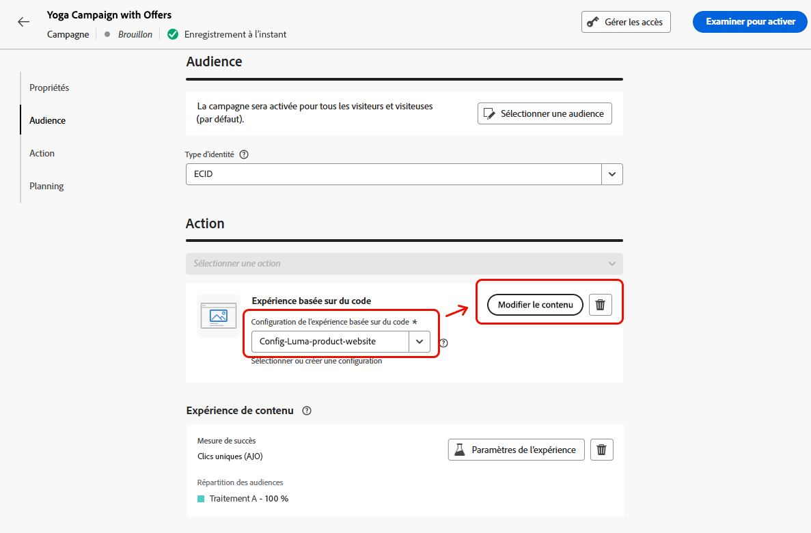{width="90%"}

1. Dans la fenêtre d’édition du contenu, commencez à personnaliser le **Traitement A** en cliquant sur **[!UICONTROL Modifier le code]**.

   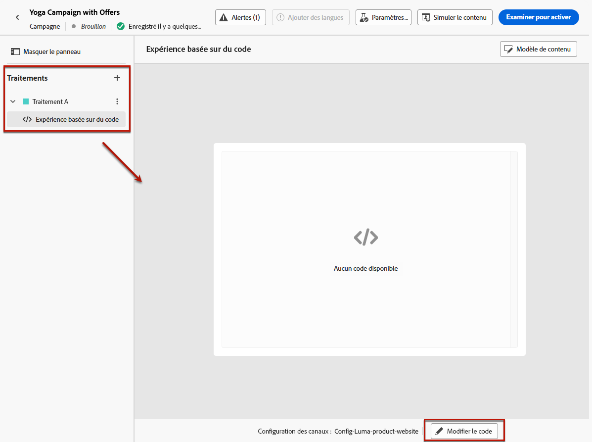{width="90%"}

1. Dans l’[éditeur de code](../code-based/create-code-based.md#edit-code), sélectionnez **[!UICONTROL Politique de décision]**, cliquez sur **[!UICONTROL Ajouter une politique de décision]** et renseignez les détails de la décision. [En savoir plus](create-decision.md#add)

   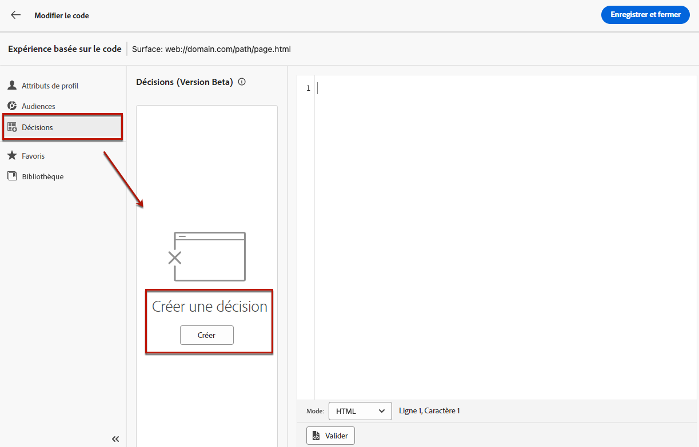{width="90%"}

1. Dans la section **[!UICONTROL Séquence de stratégie]**, cliquez sur le bouton **[!UICONTROL Ajouter]** et choisissez **[!UICONTROL Stratégie de sélection]**. [En savoir plus](create-decision.md#select)

   {width="80%"}

   >[!NOTE]
   >
   >Vous pouvez également sélectionner **[!UICONTROL Élément de décision]** pour ajouter des éléments uniques sans avoir à exécuter une stratégie de sélection. La priorité définie pour chaque élément s’applique.

1. Sélectionnez la première stratégie que vous avez créée, dont la méthode de classement est Priorité.

   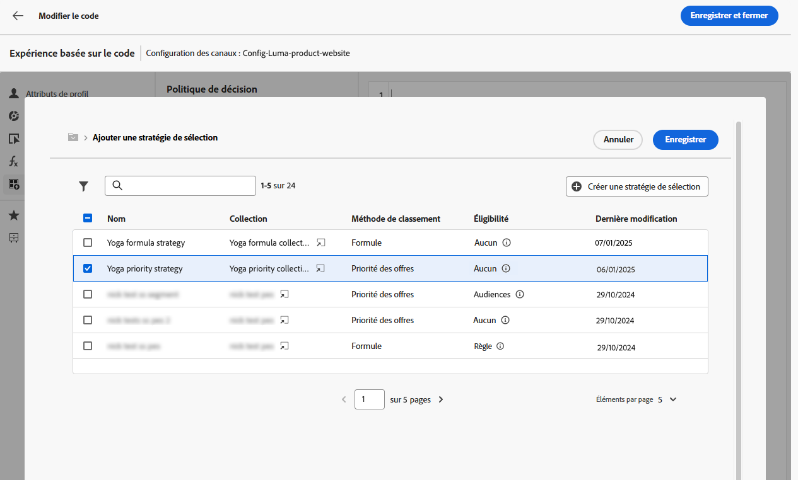{width="90%"}

1. Enregistrez votre sélection et cliquez sur **[!UICONTROL Créer]**. La nouvelle décision est ajoutée sous **[!UICONTROL Politique de décision]**.

1. Cliquez sur le bouton **[!UICONTROL Insérer une politique]**. Le code correspondant à la politique de décision est ajouté. Ajoutez ensuite tous les attributs souhaités au code, y compris les attributs de profil. [En savoir plus](create-decision.md#create-decision)

   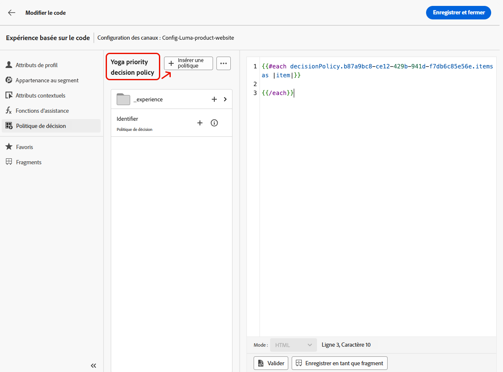{width="90%"}

1. Enregistrez vos modifications.

1. Revenez à la fenêtre d’édition du contenu, sélectionnez le bouton + pour ajouter le **Traitement B**, sélectionnez-le et cliquez sur **[!UICONTROL Modifier le code]**.

   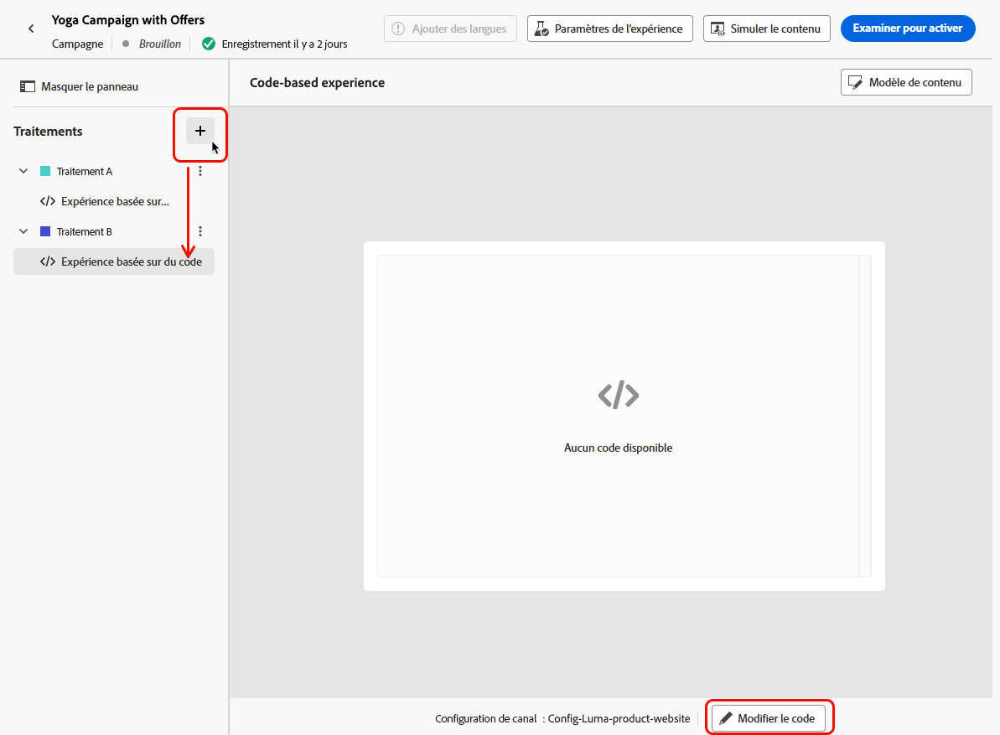{width="90%"}

1. Répétez les étapes 5 et 6 ci-dessus pour créer une autre politique de décision et sélectionnez la deuxième stratégie de sélection que vous avez créée, dont la méthode de classement est Formule. <!--Do you need to create exactly the same content to compare only the ranking method?-->

   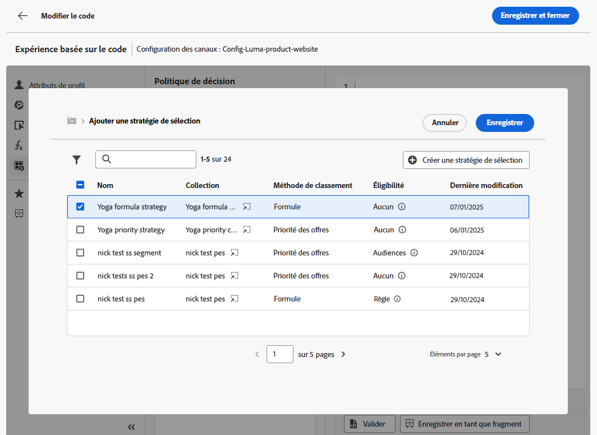{width="90%"}

1. Modifiez votre politique de décision selon vos besoins (voir les étapes 8 et 9 ci-dessus).

1. Enregistrez vos modifications et [publiez votre campagne d’expérience basée sur le code](../code-based/publish-code-based.md).

Après avoir exécuté l’expérience, suivez les performances de vos traitements de campagne avec le [rapport de campagne d’expérimentation](../reports/campaign-global-report-cja-experimentation.md).<!-- and [report on decisioning](cja-reporting.md).--> Vous pouvez ensuite interpréter les résultats de votre expérience. [Voici comment procéder](../content-management/get-started-experiment.md#interpret-results)

Si le résultat est concluant :

* Vous pouvez envoyer le traitement avec le classement le plus performant à l’ensemble de votre clientèle.
* Vous pouvez également créer une campagne à l’aide de la stratégie de sélection dans laquelle la méthode de classement la plus performante est répliquée.

## Vidéo pratique {#video}

Découvrez une présentation complète montrant comment utiliser la prise de décision dans une expérience basée sur du code.

>[!VIDEO](https://video.tv.adobe.com/v/3451100/?learn=on&enablevpops)