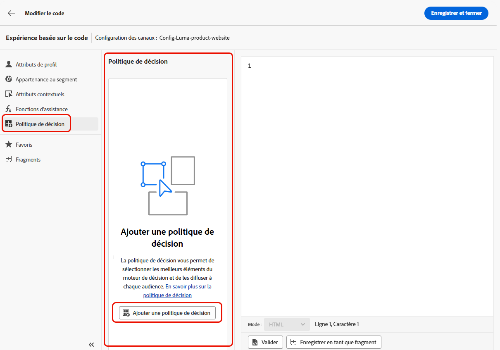

# Cas pratique de prise de décision {#experience-decisioning-uc}

Dans ce cas pratique, vous créez une campagne dans laquelle vous définissez deux traitements de diffusion : chacun contenant une stratégie de décision différente afin de mesurer celle qui fonctionne le mieux pour votre audience cible.

## Création d’éléments de décision et de stratégies de sélection

Vous devez d’abord créer des éléments, les regrouper dans des collections, configurer des règles et des méthodes de classement. Ces éléments vous permettront de créer des stratégies de sélection.

1. Accédez à **[!UICONTROL Catalogue de prise de décision]** > **** et créez plusieurs éléments de décision. Définissez des contraintes à l’aide d’audiences ou de règles afin de limiter chaque élément à des profils spécifiques uniquement. [En savoir plus](items.md)

   <!--
   1. From the items list, click the **[!UICONTROL Edit schema]** button  and edit the custom attributes if needed. [Learn how to work with catalogs](catalogs.md)-->

1. Créez des **collections** pour classer et regrouper vos éléments de décision en fonction de vos préférences. [En savoir plus](collections.md)

1. Créez des **règles de décision** pour déterminer qui a accès à un élément de décision. [En savoir plus](rules.md)

1. Créez des **méthodes de classement** et appliquez-les dans les stratégies de décision afin de déterminer l’ordre de priorité de la sélection des éléments de décision. [En savoir plus](ranking.md)

1. Créez des **stratégies de sélection** qui utilisent les collections, les règles de décision et les méthodes de classement afin d’identifier les éléments de décision pouvant être affichés sur les profils. [En savoir plus](selection-strategies.md)

## Créer des politiques de décision

Pour présenter la meilleure offre et expérience dynamique aux visiteurs et visiteuses de votre site Web ou de votre application mobile, ajoutez une politique de décision à une campagne basée sur du code.

<!--Define two delivery treatments each containing a different decision policy.-->

1. Créez une campagne et sélectionnez l’action **[!UICONTROL Expérience basée sur le code]**. [En savoir plus](../code-based/create-code-based.md).

1. Dans la fenêtre **[!UICONTROL Modifier le contenu]**, commencez à personnaliser votre traitement A.

1. Sélectionnez l’icône **[!UICONTROL Décisions]**, cliquez sur **[!UICONTROL Créer une décision]** et renseignez les détails de la décision. [En savoir plus](create-decision.md)

   

1. Définissez les stratégies de sélection de votre décision. Cliquez sur **[!UICONTROL Ajouter une stratégie]**.

1. Cliquez sur **[!UICONTROL Créer]**. La nouvelle décision est ajoutée sous **[!UICONTROL Décisions]**.

   

1. Cliquez sur l’icône d’actions supplémentaires (points de suspension) et sélectionnez **[!UICONTROL Ajouter]**. Vous pouvez maintenant ajouter tous les attributs de décision que vous souhaitez dans cette section.

   

1. Vous pouvez également ajouter tout autre attribut disponible dans l’éditeur de personnalisation, tel que des attributs de profil.

   

1. Dans la page de résumé de la campagne, cliquez sur **[!UICONTROL Créer une expérience]** pour commencer à configurer votre expérience de contenu. [En savoir plus](../content-management/content-experiment.md)

1. Dans la fenêtre **[!UICONTROL Modifier le contenu]** , sélectionnez votre traitement B pour modifier le contenu, puis répétez les étapes ci-dessus pour créer une autre décision.

1. Enregistrez votre contenu.

