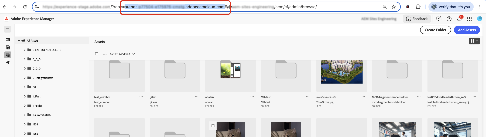

# Utiliser les fragments dans les politiques de décision {#fragments}

>[!BEGINSHADEBOX]

**Sur cette page :** utilisez les fragments de contenu Journey Optimizer et les fragments de contenu AEM dans les politiques de décision afin de personnaliser et d’optimiser la diffusion de la prise de décision de contenu sur l’ensemble des canaux.

>[!ENDSHADEBOX]

Les éléments de décision prennent en charge deux types de contenu de fragment qui peuvent être utilisés lors de la création de messages dans une politique de décision :

* **Fragments de contenu Journey Optimizer** — fragments d&#39;expression réutilisables créés dans Journey Optimizer et ajoutés à la section **[!UICONTROL Fragments]** de l&#39;élément de décision. [En savoir plus sur les fragments de contenu AJO](../content-management/fragments.md)
* **Fragments de contenu AEM** — contenu créé dans Adobe Experience Manager, mappé aux attributs de l’élément de décision et sélectionné dans l’éditeur de personnalisation par nom de clé. [Découvrez comment lier un fragment de contenu AEM à un élément de décision](items.md#aem-fragments)

## Fragments de contenu Journey Optimizer {#ajo-fragments}

Si votre politique de décision contient des éléments de décision, y compris des fragments de contenu AJO, vous pouvez exploiter ces fragments lors de la création d’un message dans la politique de décision sur tous les canaux où la prise de décision est disponible (expérience basée sur le code, e-mail, notification push, SMS et parcours).

Supposons, par exemple, que vous souhaitiez afficher différents contenus pour plusieurs modèles d’appareils mobiles. Ajoutez les fragments spécifiés, chacun appartenant à un modèle téléphonique différent, à l’élément de décision que vous utilisez dans la politique de décision. [Découvrez comment ajouter des fragments à un élément de décision](items.md#attributes).

{width=70%}

Une fois cette opération terminée, vous pouvez utiliser l’une des méthodes suivantes :

>[!BEGINTABS]

>[!TAB Insérer directement le code]

Il vous suffit de copier-coller le bloc de code ci-dessous dans le code de la politique de décision. Remplacez `variable` par l’ID de fragment et `placement` par la clé de référence du fragment :

```handlebars

{{fragment id = variable required=false}}
```

>[!TAB Suivre les étapes détaillées]

1. Accédez aux **[!UICONTROL Fonctions d’assistance]** et ajoutez la fonction **Let** ` {{variable}}` au volet de code, où vous pouvez déclarer la variable pour votre fragment.

   

1. Utilisez la fonction **Map** > **Get** ``pour créer votre expression. La carte est le fragment référencé dans l’élément de décision. La chaîne peut être le modèle d’appareil que vous avez saisi dans l’élément de décision en tant que **[!UICONTROL clé de référence du fragment]**.

   

1. Vous pouvez également utiliser un attribut contextuel qui contiendra cet identifiant de modèle d’appareil.

   

1. Ajoutez la variable que vous avez choisie pour votre fragment en tant qu’ID de fragment.

   

>[!ENDTABS]

L’ID de fragment et la clé de référence sont sélectionnés dans la section **[!UICONTROL Fragments]** de l’élément de décision.

>[!WARNING]
>
>Si la clé du fragment est incorrecte ou si le contenu du fragment n’est pas valide, le rendu peut échouer et provoquer une erreur dans l’appel Edge.
>
>Pour éviter les échecs lorsqu’un fragment est temporairement indisponible, l’indicateur `required=false` est utilisé afin que le fragment soit ignoré à la place. [En savoir plus sur les fragments temporairement indisponibles](#temporary-unavailable-fragments)

### Utilisation et mécanismes de sécurisation {#fragments-guardrails}

Les mécanismes de sécurisation suivants s’appliquent spécifiquement aux **fragments de contenu** utilisés dans les éléments de décision.

+++Simuler des fragments de contenu et d’expression dans des e-mails

Pour le canal **E-mail**, les fragments d’expression associés à un élément de décision s’affichent correctement lorsque vous **[!UICONTROL Envoyez le BAT]** ou lorsque la campagne est activée. Toutefois, la mention **[!UICONTROL Simuler du contenu]** n’affiche pas le fragment d’expression de l’élément de décision.

+++

+++Fragments visuels et éléments de décision dans les e-mails

Vous ne pouvez pas affecter un **[!UICONTROL fragment visuel]** à un élément de décision. Seuls les **fragments d&#39;expression** sont pris en charge dans ce contexte.

+++

+++Attributs d’élément de décision et de contexte

Les attributs d’élément de décision et les attributs contextuels ne sont pas pris en charge par défaut dans les fragments de [!DNL Journey Optimizer]. Cependant, vous pouvez utiliser des variables globales à la place, comme décrit ci-dessous.

Supposons que vous souhaitiez utiliser la variable *sport* dans votre fragment.

1. Référencez cette variable dans le fragment, par exemple :

   ```text
   Elevate your practice with new {{sport}} gear!
   ```

1. Définissez la variable avec la fonction **Let** dans le bloc de politique de décision. Dans l’exemple ci-dessous, *sport* est défini avec l’attribut d’élément de décision :

   ```handlebars
   {#each decisionPolicy.13e1d23d-b8a7-4f71-a32e-d833c51361e0.items as |item|}}
   
   {{fragment id = get(item._experience.decisioning.offeritem.contentReferencesMap, "placement1").id }}
   {{/each}}
   ```

+++

+++Validation du contenu du fragment d’élément de décision

* En raison de la nature dynamique de ces fragments, lorsqu’ils sont utilisés dans une campagne, la validation du message lors de la création du contenu de la campagne est ignorée pour les fragments référencés dans les éléments de décision.

* La validation du contenu du fragment se produit uniquement lors de la création et de la publication du fragment.

* Pour les fragments d’expression de type JSON, le contenu est validé par la syntaxe lors de l’enregistrement du fragment. Les erreurs de validation s’affichent sous forme d’alertes.

Au moment de l’exécution, le contenu de la campagne (y compris le contenu du fragment des éléments de décision) est validé. En cas d’échec de validation, la campagne ne sera pas rendue.

+++

+++Les fragments temporairement indisponibles sont ignorés {#temporary-unavailable-fragments}

Lorsque des parcours ou des campagnes référencent des fragments joints à des éléments de décision, il peut y avoir de courts délais de synchronisation avant que les fragments mis à jour ne soient disponibles sur Edge.

Pour éviter les échecs lorsqu’un fragment est temporairement indisponible, l’indicateur de `required` des fragments est désormais défini sur `false` par défaut afin qu’ils soient ignorés au lieu de provoquer l’échec du parcours ou de la campagne.

Cela signifie que si le fragment est temporairement indisponible sur Edge, il est simplement ignoré. Si le fragment est disponible, il s’affiche normalement.

**Exemple**

Si votre politique de décision est admissible pour deux offres et que chacune d’elles comporte un fragment, par exemple « 20 % de réduction » et « 30 % de réduction », et que le deuxième fragment est temporairement indisponible, avec `required=false` le système effectue le rendu de l’offre disponible (20 % de réduction) et ignore l’autre fragment (30 % de réduction) au lieu d’échouer le parcours ou la campagne. Cela améliore la fiabilité lorsque le contenu se synchronise toujours.

+++

>[!NOTE]
>
>Vous pouvez toujours marquer un fragment comme obligatoire en définissant l’indicateur `required` sur `true`. Cependant, si un fragment est temporairement manquant, cela peut entraîner l’échec du parcours ou du rendu de campagne.

## Fragments de contenu AEM {#aem-fragments-decisioning}

>[!AVAILABILITY]
>
>Cette fonctionnalité est disponible pour les canaux avec prise en charge de la prise de décision.

Avant d’utiliser des fragments de contenu AEM dans une politique de décision, vérifiez que vous disposez des éléments suivants :

* Vous avez créé votre fragment de contenu dans Adobe Experience Manager et l’avez balisé avec `ajo-enabled:{OrgId}/{SandboxName}` afin qu’il soit détectable par Journey Optimizer. [Découvrez comment créer et affecter une balise](../integrations/aem-fragments.md#create-tag)
* Liez le fragment à la section **[!UICONTROL Fragments]** de l’élément d’offre en lui attribuant un nom de référence unique. [Découvrez comment lier un fragment de contenu AEM à un élément de décision](items.md#attributes)

Dans l’éditeur de personnalisation, tous les fragments de contenu AEM associés aux éléments de décision sélectionnés par la politique sont disponibles. Un dossier s’affiche par nom de clé de fragment.

➡️ [Découvrez en vidéo comment utiliser les fragments de contenu d’AEM avec Journey Optimizer Decisioning](#video)

Dans cet exemple, la politique de décision comprend deux éléments de décision auxquels des fragments AEM sont liés par leur nom de référence.


1. Cliquez sur le bouton + pour ajouter le fragment souhaité à votre expression.

   Comme un seul nom de référence peut être associé à plusieurs fragments dans différents éléments d’offre, Decisioning détermine le meilleur nom à fournir à chaque client en fonction des critères de classement de la politique de décision.

1. Une fois le fragment sélectionné, vous pouvez exploiter ses attributs, tels que les URL d’image, les champs de texte ou d’autres contenus, et utiliser Decisioning pour faire apparaître le contenu approprié au bon client au bon moment.

   

1. Avant d’activer votre campagne ou votre parcours, utilisez l’une des méthodes de simulation pour prévisualiser la manière dont les valeurs du champ Fragment de contenu d’AEM seront rendues. [En savoir plus sur la simulation de contenu](../content-management/preview-test.md)

### Utiliser des fragments de contenu AEM sur plusieurs canaux {#aem-fragments-channels}

La manière dont vous insérez les attributs de fragment de contenu AEM à partir d’une politique de décision dépend du canal dans lequel vous travaillez.

>[!BEGINTABS]

>[!TAB E-mail]

Pour insérer des attributs de fragment de contenu AEM dans votre e-mail à l’aide d’une politique de décision :

1. Ouvrez votre brouillon d’e-mail dans le Designer d’e-mail et cliquez sur l’icône **[!UICONTROL Prise de décision]** dans le rail de droite pour ouvrir le panneau Politique de décision.
1. Sélectionnez la stratégie de sélection que vous avez assemblée et spécifiez un **emplacement** pour définir la zone de l’e-mail où l’offre sera renseignée.
1. Cliquez sur l’icône **+** et sélectionnez le champ spécifique du fragment de contenu AEM qui doit s’afficher dans cette zone, par exemple le champ URL de l’image principale.

   

1. Avant de procéder à la publication, cliquez sur **[!UICONTROL Simuler du contenu]** pour prévisualiser le résultat et vérifier que l’offre avec la priorité la plus élevée et son fragment de contenu s’affichent comme prévu pour un profil de test.

>[!TAB Expérience basée sur le code (JSON)]

Lors de la création d’une expérience basée sur du code JSON, utilisez la structure suivante pour effectuer le rendu des attributs de fragment de contenu AEM à partir d’une politique de décision.

```handlebars
[
{{#each decisionPolicy.YOUR_POLICY_ID.items as |item|}}

{{fragment id = frag result='YOUR_REFERENCE_KEY' required=false}}
{
  "fieldName": "{{{YOUR_REFERENCE_KEY.fieldName}}}"
},
{{/each}}
]
```

>[!NOTE]
>
>Les fragments de contenu d’AEM utilisent `aemContentReferencesMap` pour rechercher des fragments par clé de référence. Il s’agit d’une différence par rapport à `contentReferencesMap`, qui est utilisé pour les fragments de contenu Journey Optimizer.

Tenez compte des points suivants lors de la création de votre payload JSON :

* Placez les crochets du tableau JSON `[` et `]` **en dehors** de la boucle `#each`.
* Utilisez des **accolades triples** `{{{ }}}` pour les valeurs de champ dans les chaînes JSON afin d’empêcher HTML d’échapper les caractères spéciaux et de garantir une sortie JSON valide.
* Le paramètre `result='YOUR_REFERENCE_KEY'` capture le contenu du fragment résolu sous ce nom afin que vous puissiez référencer ses champs avec `YOUR_REFERENCE_KEY.fieldName`.


>[!TAB Expérience basée sur le code (HTML)]

Pour les expériences basées sur du code HTML, utilisez des accolades doubles standard pour le rendu des champs :

```handlebars
{{#each decisionPolicy.YOUR_POLICY_ID.items as |item|}}

{{fragment id = frag result='YOUR_REFERENCE_KEY' required=false}}
<div>{{YOUR_REFERENCE_KEY.fieldName}}</div>
{{/each}}
```

>[!ENDTABS]

### Utilisation des ressources des fragments de contenu d’AEM {#aem-cf-assets}

Les fragments de contenu AEM peuvent inclure des champs d’image qui font référence aux ressources stockées dans AEM. Journey Optimizer ne recevant que le **chemin relatif** de ces ressources, les images peuvent ne pas se charger à moins que l’URL de publication complète ne soit précédée.

>[!NOTE]
>
>La résolution native des références de ressources AEM dans les fragments de contenu n’est pas encore prise en charge. Les approches ci-dessous sont des solutions de contournement disponibles jusqu’à ce que cette prise en charge soit ajoutée.

>[!BEGINTABS]

>[!TAB Ajouter le domaine de publication AEM]

1. À partir de l’URL de votre instance AEM, identifiez le domaine de création, par exemple `author-p12345-e67890.adobeaemcloud.com`.

   

1. Remplacez `author` par `publish` pour obtenir le domaine de publication : `publish-p12345-e67890.adobeaemcloud.com`.

1. Dans l’éditeur de personnalisation de Journey Optimizer, ajoutez ce domaine de publication au champ de référence de la ressource à partir du fragment de contenu.

   

L’image sera désormais résolue sur son URL de publication complète au moment de la diffusion.

>[!TAB Stocker l’URL de publication dans un champ de texte]

1. Ouvrez votre fragment de contenu dans AEM.
1. Accédez à l’aperçu JSON et vérifiez la section **Références** pour localiser l’URL de ressource publiée.

   

1. Copiez l’URL de publication et collez-la dans un champ de texte dédié dans le fragment de contenu.

   

1. Dans Journey Optimizer, référencez ce champ de texte directement comme source d’image dans votre expression de personnalisation.

   

Cette approche évite la construction manuelle d’URL et conserve l’URL de publication dans le fragment de contenu lui-même.

>[!ENDTABS]

## Vidéo pratique {#video}

Découvrez comment utiliser les fragments de contenu Adobe Experience Manager avec Journey Optimizer Decisioning pour personnaliser et optimiser le contenu.

>[!VIDEO](https://video.tv.adobe.com/v/3492215/?learn=on&enablevpops)
