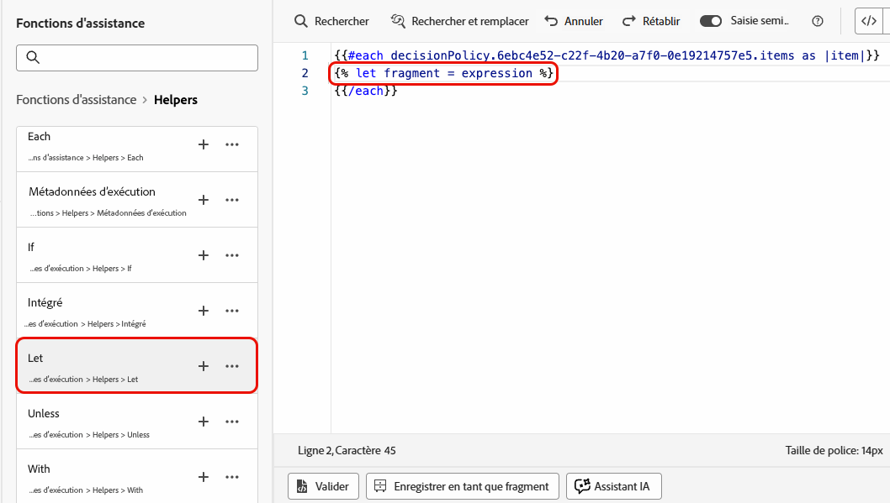
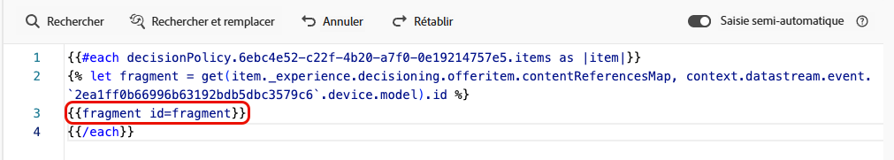

# Utilisation de fragments dans les politiques de décision {#fragments}

Si votre politique de décision contient des éléments de décision, y compris des fragments, vous pouvez utiliser ces fragments lors de la création d’un message, dans la politique de décision. [En savoir plus sur les fragments](../content-management/fragments.md)

>[!AVAILABILITY]
>
>Cette fonctionnalité est disponible en disponibilité limitée pour les canaux **Expérience basée sur le code** et **E-mail**. Pour obtenir l’accès, contactez votre représentant ou représentante Adobe.

Supposons, par exemple, que vous souhaitiez afficher différents contenus pour plusieurs modèles d’appareils mobiles. Ajoutez les fragments spécifiés, chacun appartenant à un modèle téléphonique différent, à l’élément de décision que vous utilisez dans la politique de décision. [Découvrez comment procéder](items.md#attributes).

{width=70%}

Une fois cette opération terminée, vous pouvez utiliser l’une des méthodes suivantes :

>[!BEGINTABS]

>[!TAB Insérer directement le code]

Il vous suffit de copier-coller le bloc de code ci-dessous dans le code de la politique de décision. Remplacez `variable` par l’ID de fragment et `placement` par la clé de référence du fragment :

```handlebars

{{fragment id = variable required=false}}
```

>[!TAB Suivre les étapes détaillées]

1. Accédez aux **[!UICONTROL Fonctions d’assistance]** et ajoutez la fonction **Let** ` {{variable}}` au volet de code, où vous pouvez déclarer la variable pour votre fragment.

   

1. Utilisez la fonction **Map** > **Get** ``pour créer votre expression. La carte est le fragment référencé dans l’élément de décision. La chaîne peut être le modèle d’appareil que vous avez saisi dans l’élément de décision en tant que **[!UICONTROL clé de référence du fragment]**.

   

1. Vous pouvez également utiliser un attribut contextuel qui contiendra cet identifiant de modèle d’appareil.

   

1. Ajoutez la variable que vous avez choisie pour votre fragment en tant qu’ID de fragment.

   

>[!ENDTABS]

L’ID de fragment et la clé de référence sont sélectionnés dans la section **[!UICONTROL Fragments]** de l’élément de décision.

>[!WARNING]
>
>Si la clé du fragment est incorrecte ou si le contenu du fragment n’est pas valide, le rendu peut échouer et provoquer une erreur dans l’appel Edge.
>
>Pour éviter les échecs lorsqu’un fragment est temporairement indisponible, l’indicateur `required=false` est utilisé afin que le fragment soit ignoré à la place. [En savoir plus](#temporary-unavailable-fragments)

## Utilisation et mécanismes de sécurisation {#fragments-guardrails}

### Simuler des fragments de contenu et d’expression dans des e-mails {#simulate-content-expression-fragments}

Pour le canal **E-mail**, les fragments d’expression associés à un élément de décision s’affichent correctement lorsque vous **[!UICONTROL Envoyez le BAT]** ou lorsque la campagne est activée. Toutefois, la mention **[!UICONTROL Simuler du contenu]** n’affiche pas le fragment d’expression de l’élément de décision.

### Fragments visuels et éléments de décision dans les e-mails {#visual-fragments-decision-items}

Vous ne pouvez pas affecter un **[!UICONTROL fragment visuel]** à un élément de décision. Seuls les **fragments d&#39;expression** sont pris en charge dans ce contexte.

### Attributs d’élément de décision et de contexte {#decision-item-context-attributes}

Les attributs d’élément de décision et les attributs contextuels ne sont pas pris en charge par défaut dans les fragments de [!DNL Journey Optimizer]. Cependant, vous pouvez utiliser des variables globales à la place, comme décrit ci-dessous.

Supposons que vous souhaitiez utiliser la variable *sport* dans votre fragment.

1. Référencez cette variable dans le fragment, par exemple :

   ```text
   Elevate your practice with new {{sport}} gear!
   ```

1. Définissez la variable avec la fonction **Let** dans le bloc de politique de décision. Dans l’exemple ci-dessous, *sport* est défini avec l’attribut d’élément de décision :

   ```handlebars
   {#each decisionPolicy.13e1d23d-b8a7-4f71-a32e-d833c51361e0.items as |item|}}
   
   {{fragment id = get(item._experience.decisioning.offeritem.contentReferencesMap, "placement1").id }}
   {{/each}}
   ```

### Validation du contenu du fragment d’élément de décision {#fragment-content-validation}

* En raison de la nature dynamique de ces fragments, lorsqu’ils sont utilisés dans une campagne, la validation du message lors de la création du contenu de la campagne est ignorée pour les fragments référencés dans les éléments de décision.

* La validation du contenu du fragment se produit uniquement lors de la création et de la publication du fragment.

* Pour les fragments d’expression de type JSON, le contenu est validé par la syntaxe lors de l’enregistrement du fragment. Les erreurs de validation s’affichent sous forme d’alertes.

Au moment de l’exécution, le contenu de la campagne (y compris le contenu du fragment des éléments de décision) est validé. En cas d’échec de validation, la campagne ne sera pas rendue.

### Les fragments temporairement indisponibles sont ignorés. {#temporary-unavailable-fragments}

Lorsque des parcours ou des campagnes référencent des fragments joints à des éléments de décision, il peut y avoir de courts délais de synchronisation avant que les fragments mis à jour ne soient disponibles sur Edge.

Pour éviter les échecs lorsqu’un fragment est temporairement indisponible, l’indicateur de `required` des fragments est désormais défini sur `false` par défaut afin qu’ils soient ignorés au lieu de provoquer l’échec du parcours ou de la campagne.

Cela signifie que si le fragment est temporairement indisponible sur Edge, il est simplement ignoré. Si le fragment est disponible, il s’affiche normalement.

**Exemple**

Si votre politique de décision est admissible pour deux offres et que chacune d’elles comporte un fragment, par exemple « 20 % de réduction » et « 30 % de réduction », et que le deuxième fragment est temporairement indisponible, avec `required=false` le système effectue le rendu de l’offre disponible (20 % de réduction) et ignore l’autre fragment (30 % de réduction) au lieu d’échouer le parcours ou la campagne. Cela améliore la fiabilité lorsque le contenu se synchronise toujours.

>[!NOTE]
>
>Vous pouvez toujours marquer un fragment comme obligatoire en définissant l’indicateur `required` sur `true`. Cependant, si un fragment est temporairement manquant, cela peut entraîner l’échec du parcours ou du rendu de campagne.

