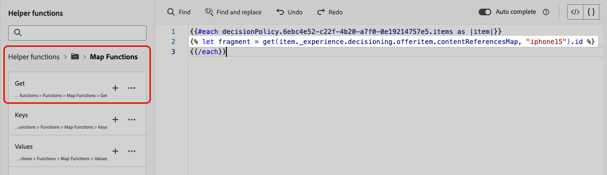

# Utilisation de fragments dans les politiques de décision {#fragments}

Si votre politique de décision contient des éléments de décision, y compris des fragments, vous pouvez utiliser ces fragments dans le code de la politique de décision. [En savoir plus sur les fragments](../content-management/fragments.md)

>[!AVAILABILITY]
>
>Actuellement, cette fonctionnalité n’est disponible que pour le canal **Expérience basée sur le code**.

Supposons, par exemple, que vous souhaitiez afficher différents contenus pour plusieurs modèles d’appareils mobiles. Assurez-vous d’avoir ajouté les fragments correspondant à ces appareils à l’élément de décision que vous utilisez dans la politique de décision. [Découvrez comment procéder](items.md#attributes).

{width=70%}

Une fois cette opération terminée, vous pouvez utiliser l’une des méthodes suivantes :

>[!BEGINTABS]

>[!TAB Insérer directement le code]

Il vous suffit de copier-coller le bloc de code ci-dessous dans le code de la politique de décision. Remplacez `variable` par l’ID de fragment et `placement` par la clé de référence du fragment :

```

{{fragment id = variable}}
```

>[!TAB Suivre les étapes détaillées]

1. Accédez aux **[!UICONTROL Fonctions d’assistance]** et ajoutez la fonction **Let** ` {{variable}}` au volet de code, où vous pouvez déclarer la variable pour votre fragment.

   

1. Utilisez la fonction **Map** > **Get** ``pour créer votre expression. La carte est le fragment référencé dans l’élément de décision et la chaîne peut être le modèle d’appareil que vous avez saisi dans l’élément de décision en tant que **[!UICONTROL clé de référence du fragment]**.

   

1. Vous pouvez également utiliser un attribut contextuel qui contiendra cet identifiant de modèle d’appareil.

   

1. Ajoutez la variable que vous avez choisie pour votre fragment en tant qu’ID de fragment.

   

>[!ENDTABS]

L’ID de fragment et la clé de référence sont sélectionnés dans la section **[!UICONTROL Fragments]** de l’élément de décision.

>[!WARNING]
>
>Si la clé de fragment est incorrecte ou si le contenu du fragment n’est pas valide, le rendu échoue, ce qui entraîne une erreur dans l’appel Edge.

## Mécanismes de sécurisation lors de l’utilisation de fragments {#fragments-guardrails}

**Attributs d’élément de décision et de contexte**

Les attributs d’élément de décision et les attributs contextuels ne sont pas pris en charge par défaut dans les fragments [!DNL Journey Optimizer]. Cependant, vous pouvez utiliser des variables globales à la place, comme décrit ci-dessous.

Supposons que vous souhaitiez utiliser la variable *sport* dans votre fragment.

1. Référencez cette variable dans le fragment, par exemple :

   ```
   Elevate your practice with new {{sport}} gear!
   ```

1. Définissez la variable avec la fonction **Let** dans le bloc de politique de décision. Dans l’exemple ci-dessous, *sport* est défini avec l’attribut d’élément de décision :

   ```
   {#each decisionPolicy.13e1d23d-b8a7-4f71-a32e-d833c51361e0.items as |item|}}
   
   {{fragment id = get(item._experience.decisioning.offeritem.contentReferencesMap, "placement1").id }}
   {{/each}}
   ```

**Validation du contenu du fragment d’élément de décision**

* En raison de la nature dynamique de ces fragments, lorsqu’ils sont utilisés dans une campagne, la validation du message pendant la création du contenu de la campagne est ignorée pour les fragments référencés dans les éléments de décision.

* La validation du contenu du fragment se produit uniquement lors de la création et de la publication du fragment.

* Pour les fragments d’expression de type JSON, le contenu est validé par la syntaxe lors de l’enregistrement du fragment. Les erreurs de validation s’affichent sous forme d’alertes.

Au moment de l’exécution, le contenu de la campagne (y compris le contenu du fragment des éléments de décision) est validé. En cas d’échec de validation, la campagne ne sera pas rendue.
