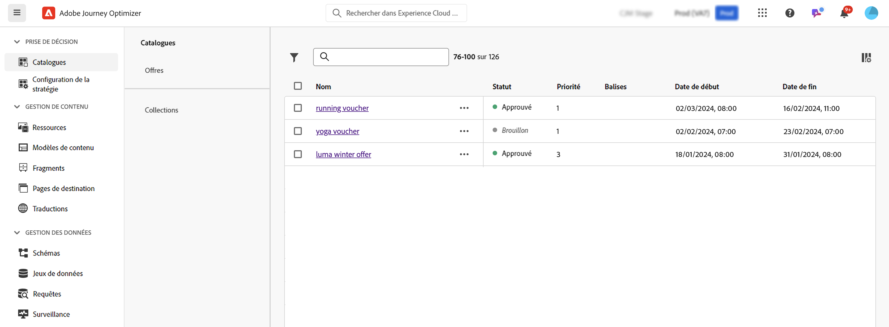
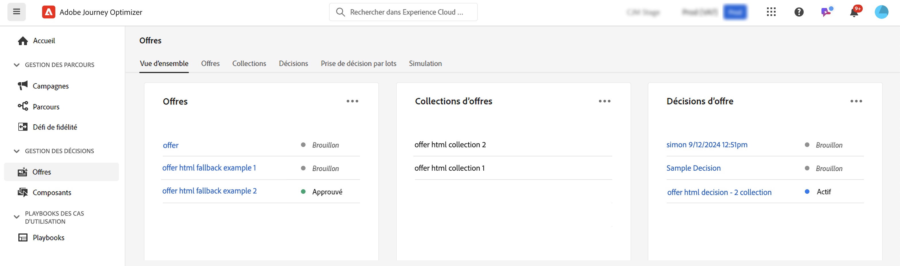

# Commencer avec les fonctionnalités de décision dans [!DNL Journey Optimizer] {#gs-decision}

Les fonctionnalités de décision dans [!DNL Journey Optimizer] vous permettent de proposer les meilleures offres et expériences personnalisées à vos clientes et vos clients sur tous les points de contact, et ce, exactement au bon moment. Ces fonctionnalités simplifient la personnalisation grâce à un catalogue centralisé d’offres marketing et à un moteur de décision avancé, qui utilise des règles et des critères de classement pour diffuser le contenu le plus pertinent pour chaque personne.

Principaux avantages :

* Amélioration des performances des campagnes grâce à la diffusion d’offres personnalisées sur plusieurs canaux.
* Workflows améliorés : plutôt que de créer plusieurs diffusions ou plusieurs campagnes, les équipes marketing peuvent améliorer les workflows en créant une seule diffusion et en variant les offres dans les différentes parties du modèle.
* Contrôle du nombre d&#39;affichages d&#39;une offre sur plusieurs campagnes et clients.

Actuellement, [!DNL Journey Optimizer] propose les deux solutions principales présentées ci-dessous.

## Prise de décision {#decisioning}

Notre framework de décision de nouvelle génération est conçu pour unifier les workflows Journey Optimizer existants et poser des bases pour la gestion de catalogues de contenu supplémentaires. Offres de prise de décision :

* Gestion des catalogues d’éléments basés sur des schémas : augmentez la flexibilité en associant des métadonnées personnalisées à chaque offre.
* Règles de collecte flexibles : regroupez facilement les offres pour une évaluation ultérieure en fonction de différents critères.
* Configuration mise à jour de la politique de décision et de la stratégie de sélection : autorisez la réutilisation des composants de décision.
* Fonctionnalités d’expérimentation : testez la logique de décision en la comparant à d’autres composants de contenu pour mesurer les performances.

La prise de décision est disponible pour tous les clients pour les canaux **Expérience basée sur le code**, **Notification push** et **SMS**. La prise de décision pour le canal **E-mail** est disponible en disponibilité limitée. Pour demander l’accès à Email Decisioning, contactez votre représentant Adobe. En savoir plus sur les [libellés de disponibilité](../rn/releases.md#availability-labels).

➡️[Commencer la prise de décisions](../experience-decisioning/gs-experience-decisioning.md)

>[!NOTE]
>
>Pour migrer de la gestion des décisions à la prise de décision, reportez-vous aux sections [documentation de migration](../experience-decisioning/migrate-to-decisioning.md) et [guide de l’API de migration](../experience-decisioning/decisioning-migration-api.md).

## Gestion des décisions {#decision-management}

Notre fonctionnalité de gestion des décisions, présente dans Journey Optimizer, utilise une bibliothèque centrale d’offres marketing et un moteur de décision qui applique des règles et des contraintes aux profils clients en temps réel, en exploitant les données Adobe Experience Platform pour diffuser l’offre appropriée au bon moment.

La gestion des décisions prend en charge les canaux suivants : e-mail, messagerie in-app, notifications push, SMS et courrier.

➡️[Commencer à utiliser la gestion des décisions](../offers/get-started/starting-offer-decisioning.md)
