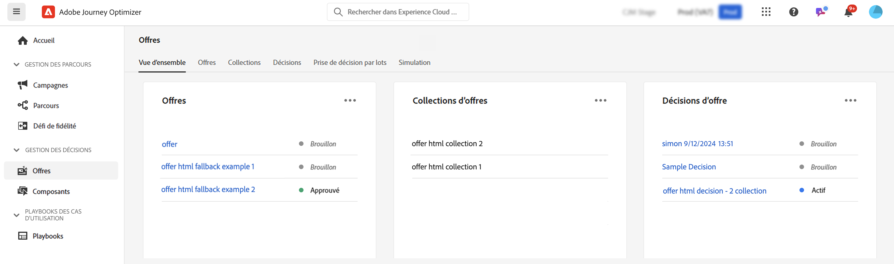

# Prise en main des fonctionnalités de décision [!DNL Journey Optimizer] {#gs-decision}

Les fonctionnalités de décision de [!DNL Journey Optimizer] vous permettent de proposer les meilleures offres et expériences personnalisées à vos clients sur tous les points de contact, précisément aux bons moments. Ces fonctionnalités simplifient la personnalisation grâce à un catalogue centralisé d’offres marketing et à un moteur de décision avancé, qui utilise des règles et des critères de classement pour diffuser le contenu le plus pertinent pour chaque individu.

Principaux avantages :

* Amélioration des performances des campagnes grâce à la diffusion d’offres personnalisées sur plusieurs canaux.
* Workflows améliorés : plutôt que de créer plusieurs diffusions ou plusieurs campagnes, les équipes marketing peuvent améliorer les workflows en créant une seule diffusion et en variant les offres dans les différentes parties du modèle.
* Contrôle du nombre d&#39;affichages d&#39;une offre sur plusieurs campagnes et clients.

Actuellement, [!DNL Journey Optimizer] fournit les deux solutions principales présentées ci-dessous.

## Prise de décision {#decisioning}

Notre structure de décision de nouvelle génération, conçue pour unifier les workflows Journey Optimizer existants et poser les bases de la gestion de catalogues de contenu supplémentaires. Offres de prise de décision :

* Gestion des catalogues d’éléments basée sur les schémas : augmentez la flexibilité en associant des métadonnées personnalisées à chaque offre.
* Règles de collecte flexibles : Regroupez facilement les offres en vue d’une évaluation ultérieure selon différents critères.
* Mise à jour de la configuration de la stratégie de décision et de la stratégie de sélection : autorisation de réutilisation des composants de décision.
* Fonctionnalités d’expérimentation : testez la logique de décision par rapport à d’autres composants de contenu pour mesurer les performances.

Pour l’instant, Experience Decisioning est pris en charge dans le canal Experience basé sur le code.

➡️ [Prise en main de la prise de décision](../experience-decisioning/gs-experience-decisioning.md)

## Gestion des décisions {#decision-management}

Notre fonctionnalité établie dans Journey Optimizer, la gestion de la décision utilise une bibliothèque centrale d’offres marketing et un moteur de décision qui applique des règles et des contraintes aux profils clients en temps réel, en exploitant les données Adobe Experience Platform pour diffuser l’offre appropriée au bon moment.

La gestion des décisions prend actuellement en charge quatre canaux : e-mail, messagerie in-app, notifications push et SMS.

➡️ [Prise en main de la gestion des décisions](../offers/get-started/starting-offer-decisioning.md)
